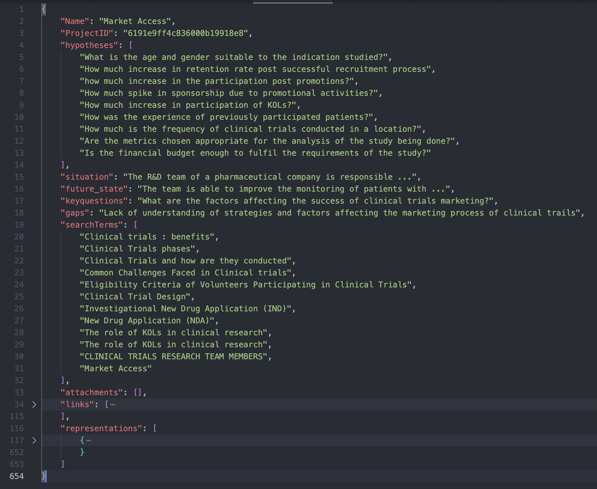

```{css, echo=FALSE}
/* CSS for floating TOC on the left side */
#TOC {
    /* float: left; */
    position: fixed;
    margin-left: -22vw;
    width: 18vw;
    height: fit-content;
    overflow-y: auto;
    padding-top: 20px;
    padding-bottom: 20px;
    background-color: #f9f9f9;
    border-right: 1px solid #ddd;
    margin-top: -13em; 
}
.main-container {
  margin-left: 222px; /* Adjust this value to match the width of the TOC + some margin */
}
body{
max-width:1200px;
width: 50%;
min-width: 700px;
}
p {
text-align: justify;
}
.plotly {
  margin: auto;
  width: 100% !important;
  height: 100% !important;
}
.caption {
  text-align: center;
}
li {
  padding-bottom: 5px;
}
ul {
  margin-bottom: 0px !important;
}
```


```{r, warning=FALSE,message=FALSE,include = FALSE}
knitr::opts_chunk$set(
  collapse = TRUE,
  comment = "#>",
  out.width = "672px",
  out.height = "480px",
  fig.width = 7.5,
  fig.height = 5,
  fig.align = "center",
  fig.retina = 1,
  dpi = 150
)

list.of.packages <- c("dplyr","magrittr", "ggplot2", "kableExtra", "reactable")

new.packages <-
  list.of.packages[!(list.of.packages %in% installed.packages()[, "Package"])]
if (length(new.packages))
  install.packages(new.packages, dependencies = TRUE, verbose = FALSE, repos='https://cloud.r-project.org/')

# Loading the required libraries
invisible(lapply(list.of.packages, library, character.only = TRUE))
options(expressions = 10000)
global_var <- nzchar(Sys.getenv("RUN_VIGNETTE"))
global_var <- TRUE
scrolLimit <- function(noOfRows){
  if(noOfRows<10){
    swe = paste(as.character(noOfRows*50),"px")
  }
  else{
    swe = "400px"
   }
  return(swe)
}
Table <- function(data,scroll = F, limit = NULL){
  if(!is.null(limit)){
    data <- head(data,limit)}
kable_table <- data %>% kable(escape = F,align = "c") %>% kable_styling(bootstrap_options = c("striped", "hover", "responsive"))
if(scroll == T){
kable_table <- kable_table %>% scroll_box(width = "100%" , height = scrolLimit(nrow(data)))
  }
return(kable_table)
}

set.seed(240)
```

# 1. Abstract

The HVT package is a collection of R functions to facilitate building [topology preserving maps](https://users.ics.aalto.fi/jhollmen/dippa/node9.html) for rich multivariate data analysis. Tending towards a big data preponderance, a large number of rows. A collection of R functions for this typical workflow is organized below:

1.  **Data Compression**: Vector quantization (VQ), HVQ (Hierarchical vector quantization) using means or medians. This step compresses the rows (long data frame) using a compression objective.

2.  **Data Projection**: Dimension projection of the compressed cells to 1D, 2D or Interactive surface plot with the Sammons Non-linear Algorithm. This step creates a topology preserving map (also called an [embedding](https://en.wikipedia.org/wiki/Embedding)) coordinates into the desired output dimension.

3.  **Tessellation**: Create cells required for object visualization using the Voronoi Tessellation method, package includes heatmap plots for hierarchical Voronoi tessellations (HVT). This step enables data insights, visualization, and interaction with the topology preserving map. Useful for semi-supervised tasks.

4.  **Scoring**: Scoring new data sets and recording their assignment using the map objects from the above steps, in a sequence of maps if required.

5. **Temporal Analysis and Visualization**: A Collection of functions that leverages the capacity of the HVT package by analyzing time series data for its underlying patterns, calculation of transitioning probabilities and the visualizations for the flow of data over time.


# 2. Experimental setup 

The primary function of the HVT package is to perform vector quantization and dimensionality reduction, transitioning data from higher to lower dimensions and presenting it in visualizations. This notebook effectively showcases the utility of the HVT package by employing it to reduce the dimensions of LLM Embeddings and visualize them in lower dimensional space.

LLMs (Large Language Models) are constructed from several key components: Tokenization, Embeddings, Attention Mechanism, Pre-Training, and Transfer Learning. Tokenization involves breaking down large input data into smaller units. The textual data will be tokenized to words, phrases, letters, or symbols. These segmented texts are then transformed into numerical vectors and projected in a high-dimensional space according to their contextual meaning. In other words, Embeddings are the tokens or vector representations of the input data with semantic context.

muPDNA is Mu Sigma’s Problem Definition framework. It consists of several components, including the problem statement, current situation, desired future state, obvious gap, hypothesis and key questions. Each component helps to break down the problem into smaller, more manageable parts, making it easier to understand and address. 

The data used in this notebook is the embeddings of 255 muPDNAs which were in JSON format and converted into embeddings using "text-embedding-ada-002" from openAI that results in creating the output of 1536 Dimension.

```{r data structure,echo=FALSE,warning=FALSE,fig.show='hold',message=FALSE,fig.cap='Figure 1: muPDNA Data Structure'}

```

# 3. Importing Code Modules

Here is the guide to install the HVT package. This helps users to install the latest version of the HVT package.
```{r}
###direct installation###
#install.packages("HVT")

#or

###git repo installation###
#library(devtools)
#devtools::install_github(repo = "Mu-Sigma/HVT")

```

If the package is already installed, attach the package to the session environment by running this below.
```{r, warning=FALSE, message=FALSE}
library(HVT)
```


# 4. Data Understanding

Here, we load the dataset. For the sake of brevity, we are displaying only the first ten rows.

```{r}
dataset_raw <- read.csv("./openai_embeddings_completed_pdna.csv") 
Table(dataset_raw, limit = 10, scroll = T)
```

We are removing the `muPDNA.Name` column since the further process requires only the numeric columns. We will merge it back with the scoring function's output later in this vignette.
```{r}
dataset <- dataset_raw[,-1]
```


Now, let's have a look at the **structure** of the dataset. Since there are 1536 columns, we are displaying only the first 5 columns.

```{r, message=FALSE, warning=FALSE}
str(dataset[,1:5])
```

**Data distribution**

This section displays four objects.

1) *Variable Histograms*: The histogram distribution of all the features in the dataset.

2) *Box Plots*: Box plots for all features across panels. These plots will display the median and Inter quartile Range of each column at a panel level.

3) *Correlation Matrix*: This calculates the Pearson correlation which is a
bivariate correlation value measuring the linear correlation between two
numeric columns. The output plot is shown as a matrix.

4) *Summary EDA*: The table provides descriptive statistics for all the features in the dataset.

It uses an inbuilt function called `edaPlots` to display the above-mentioned objects.

*NOTE: The input dataset should be a data frame object and the columns should be a numeric type.*

```{r, warning=FALSE, message=FALSE}
edaPlots(dataset[,1:5])
```


**Train - Test Split**

Let's split the dataset into train and test. We will orderly select 80% of the data as train and the remaining as test.

```{r}
noOfPoints <- dim(dataset)[1]
trainLength <- as.integer(noOfPoints * 0.8)
trainDataset <- dataset[1:trainLength,]
testDataset <- dataset[(trainLength+1):noOfPoints,]
rownames(testDataset) <- NULL
```

## 4.1 Training dataset

Let's have a look at the Training dataset containing 204 rows and 1536 columns. For the sake of brevity, we are displaying the first 10 rows.

```{r,warning=FALSE,message=FALSE}
Table(trainDataset, limit = 10, scroll = TRUE)
```

Now, let's have a look at the **structure** of the training dataset. Since there are 1536 columns, we are displaying only the first 5 columns.

```{r train structure, warning=FALSE, eval = global_var}
str(trainDataset[,1:5])
```

**Data Distribution**

```{r, train distribution, warning=FALSE,message=FALSE}
edaPlots(trainDataset[,1:5], time_series  = FALSE)
```

## 4.2 Testing dataset

Let's have a look at the Testing dataset containing 51 rows and 1536 columns. For the sake of brevity, we are displaying first the 10 rows.

```{r, warning=FALSE,message=FALSE}
Table(testDataset, limit = 10, scroll = T)
```

Now, let's have a look at the **structure** of the testing dataset. Since there are 1536 columns, we are displaying only the first 5 columns.

```{r test structure, warning=FALSE, eval = global_var}
str(testDataset[,1:5])
```


**Data Distribution**

```{r, test distribution, warning=FALSE,message=FALSE}
edaPlots(testDataset[,1:5], time_series = FALSE)
```

# 5. Model Training

The core function for compression in the workflow is `hvq` (hierarchical vector quantization), which is called within the `trainHVT` function. we have a parameter called 'quantization error'. This parameter acts as a threshold and determines the number of levels in the hierarchy. It means that, if there are 'n' number of levels in the hierarchy, then all the clusters formed till this level will have quantization error equal to or greater than the threshold quantization error. The user can define the number of clusters in the first level of the hierarchy and then each cluster in the upcoming levels is subdivided into the same number of clusters. This process continues for all the clusters until the threshold quantization error is met. The output of this technique will be hierarchically arranged vector quantized data.

However, let's try to comprehend the **trainHVT** function first before moving on. 

 
```{r trainHVT function, echo = TRUE, eval= FALSE}
trainHVT(
  dataset, min_compression_perc, n_cells,
  depth, quant.err, projection.scale,
  normalize = TRUE, seed = 279,
  distance_metric = c("L1_Norm", "L2_Norm"),
  error_metric = c("mean", "max"),
  quant_method = c("kmeans", "kmedoids"),
  scale_summary = NA,
  diagnose = FALSE,
  hvt_validation = FALSE,
  train_validation_split_ratio = 0.8
)
```

Each of the parameters of `trainHVT` function has been explained below:

* __`dataset`__ - A data frame, with numeric columns (features) that will be used for training the model.

* __`min_compression_perc`__ - An integer, indicating the minimum compression percentage to be achieved for the dataset. It indicates the desired level of reduction in dataset size compared to its original size.

* __`n_cells`__  - An integer, indicating the number of cells per hierarchy (level). This parameter determines the granularity or level of detail in the hierarchical vector quantization.

* __`depth`__   - An integer, indicating the number of levels. A depth of 1 means no hierarchy (single level), while higher values indicate multiple levels (hierarchy).

* __`quant.err`__ - A number indicating the quantization error threshold. A cell will only break down into further cells if the quantization error of the cell is above the defined quantization error threshold.

* __`projection.scale`__ - A number indicating the scale factor for the tessellations to visualize the sub-tessellations well enough. It helps in adjusting the visual representation of the hierarchy to make the sub-tessellations more visible.

* __`normalize`__	- A logical value indicating if the dataset should be normalized. When set to TRUE, scales the values of all features to have a mean of 0 and a standard deviation of 1 (Z-score)

* __`seed`__ - A Random Numeric Seed to preserve the repeatability.

* __`distance_metric`__	- The distance metric can be `L1_Norm`(Manhattan) or `L2_Norm`(Euclidean). `L1_Norm` is selected by default. The distance metric is used to calculate the distance between an `n` dimensional point and a centroid. 

* __`error_metric`__ - The error metric can be `mean` or `max`. `max` is selected by default. `max` will return the max of `m` values and `mean` will take the mean of `m` values where each value is a distance between a point and centroid of the cell.

* __`quant_method`__ - The quantization method can be `kmeans` or `kmedoids`. Kmeans uses means (centroids) as cluster centers while Kmedoids uses actual data points (medoids) as cluster centers. `kmeans` is selected by default.
    
* __`scale_summary`__ -  A list with user-defined mean and standard deviation values for all the features in the dataset. Pass the scale summary when normalize is set to FALSE.

* __`diagnose`__ - A logical value indicating whether the user wants to perform diagnostics on the model. Default value is FALSE. 

* __`hvt_validation`__ - A logical value indicating whether the user wants to hold out a validation set and find the Mean Absolute Deviation of the validation points from the centroid. Default value is FALSE.

* __`train_validation_split_ratio`__ - A numeric value indicating train validation split ratio. This argument is only used when `hvt_validation` has been set to TRUE. Default value for the argument is 0.8

The output of the trainHVT function (list of 7 elements) has been explained below with an image attached for clear understanding.

**NOTE: Here the attached image is the example snapshot of the output list generated from trainHVT()**

```{r trainhvt list,echo=FALSE,warning=FALSE,fig.show='hold',message=FALSE,fig.cap='Figure 2: The Output list generated by trainHVT function.', out.width="50%", out.height=  "20%", fig.align='center'}
knitr::include_graphics('hvt_result_diag.png')
```

* The '1st element' is a list containing information related to plotting tessellations. This information include coordinates, boundaries and other details necessary for visualizing the tessellations.

* The '2nd element' is a list containing information related to Sammon's projection coordinates of the data points in the reduced-dimensional space.

* The '3rd element'  is a list containing detailed information about the hierarchical vector quantized data along with a summary section containing no. of points, quantization error and the centroids for each cell in 2D.

* The '4th element'  is a list that contains all the diagnostics information of the model when `diagnose` is set to TRUE. Otherwise NA

* The '5th element' is a list that contains all the information required to generate a Mean Absolute Deviation (MAD) plot, if hvt_validation is set to TRUE. Otherwise NA 

* The '6th element'  is a list containing detailed information about the hierarchical vector quantized data along with a summary section containing no of points, quantization error and the centroids for each cell in 1D, which is the output of `hvq`.

* The '7th element' (model info) is a list that contains model-generated time, input parameters passed to the model and the validation results.

We will use the `trainHVT` function to compress our data while preserving essential features of the dataset. Our goal is to achieve data compression to atleast `80%`. In situations where the compression ratio does not meet the desired target, we can explore adjusting the model parameters as a potential solution. This involves making modifications to parameters such as the quantization error threshold or increasing the number of cells and then rerunning the trainHVT function.

**Model Parameters**

- Number of cells = 60
- Quantization Error = 0.1
- Distance Metric = Manhattan/L1 Norm
- Error Metric = Mean
- Quantization Method = Kmeans

```{r, warning=FALSE, message=FALSE}
hvt.results <- trainHVT(trainDataset, n_cells = 60, depth = 1, quant.err = 0.1, 
                        distance_metric = "L1_Norm", error_metric = "mean",
                        normalize = TRUE, seed = 123,
                        quant_method="kmeans", diagnose = TRUE )
```

Let's look at the summary table. 
```{r}
displayTable(data = hvt.results[[3]]$compression_summary,
             columnName = 'percentOfCellsBelowQuantizationErrorThreshold', 
             value = 0.8, tableType = "compression")
```

**NOTE:** *Based on the above table, the value of 'percentOfCellsBelowQuantizationErrorThreshold' indicates that only 18% of compression has taken place for the specified number of cells, which is 60. Typically, we would continue increasing the number of cells until at least 80% compression occurs. However, in this vignette demonstration, we're not doing so, because the plots generated from plotHVT functions would become cluttered and complex, making visibility less clear.*

Let's look at the compressed dataset of 60 cells.

```{r, warning=FALSE, message=FALSE}
generic_columns <- c("Segment.Level", "Segment.Parent", "Segment.Child","n", "Cell.ID", "Quant.Error")
compressed_dataset <- hvt.results[[3]][["summary"]] 
compressed_dataset$row_number <- 1:nrow(compressed_dataset) 
compressed_dataset <- compressed_dataset %>% select("row_number", !generic_columns)
Table(compressed_dataset, scroll = TRUE)
```

# 6. Visualization

This section focuses on projecting the plots that used Sammon's dimensionality reduction algorithm to compress the dataset from higher to lower dimensions.

Now let's try to understand **plotHVT** function. The parameters have been explained in detail below:

```{r plotHVT function,echo = TRUE, eval= FALSE}
plotHVT <-(hvt.results, line.width, color.vec, pch1, centroid.size ,
           title, maxDepth, child.level, hmap.cols, cell_id,
           quant.error.hmap, n_cells.hmap,
           label.size , sepration_width,layer_opacity,
           dim_size, plot.type = '2Dhvt') 
```

* __`hvt.results`__ - (1D/2Dproj/2Dhvt/2Dheatmap/surface_plot)  A list obtained from the trainHVT function. This list provides an overview of the hierarchical vector quantized data, including diagnostics, tessellation details, Sammon's projection coordinates, and model input information.

* __`line.width`__	- (2Dhvt/2Dheatmap) A vector indicating the line widths of the tessellation boundaries for each layer.

* __`color.vec`__	- (2Dhvt/2Dheatmap) A vector indicating the colors of the tessellations boundaries at each layer.

* __`pch1`__	- (2Dhvt/2Dheatmap) Symbol. It plots the centroids with a particular symbol such as (solid circle, bullet, filled square, filled diamond) in the tessellations. Default is 21 (a filled circle).

* __`centroid.size`__	- (2Dhvt/2Dheatmap) Size of centroids for each level of tessellations. Default is 3.

* __`title`__	-  (2Dhvt) Set a title for the plot. Default is NULL.

* __`maxDepth`__ -  (2Dhvt) An integer indicating the number of levels.

* __`cell_id`__ - (2Dhvt) Logical. To indicate whether the plot should have Cell IDs or not for level 1. Default is FALSE.

* __`child.level`__ - (2Dheatmap/surface_plot) A Number indicating the level for which the heat map is to be plotted.

* __`hmap.cols`__ - (2Dheatmap/surface_plot) A Number or a Character which is the column number of the column name from the dataset indicating the variables for which the heat map is to be plotted. Also number of cells (n) and Quant.Error can be plotted.

* __`label.size`__ - (2Dheatmap) The size by which the tessellation labels should
be scaled. Default is 0.5

* __`quant.error.hmap`__ - (2Dheatmap) A number indicating the quantization error threshold.

* __`n_cells.hmap`__ - (2Dheatmap) An integer indicating the number of cells/clusters per hierarchy 

* __`sepration_width`__ - (surface_plot) An integer indicating the width between two levels.

* __`layer_opacity`__ - (surface_plot) A vector indicating the opacity of each layer/level.

* __`dim_size`__ - (surface_plot) An integer indicating the dimension size used to create the matrix for the plot.

* __`plot.type`__ -  A Character indicating which type of plot should be generated. Accepted entries are '1D','2Dproj','2Dhvt','2Dheatmap' & 'surface_plot'. Default value is '2Dhvt'.

Now let's visualize all the plots one by one.

## 6.1 plotHVT - 1D

```{r , warning=FALSE,message=FALSE}
plotHVT(hvt.results,plot.type  = '1D')
```


## 6.2 plotHVT - 2D Projection

```{r}
plotHVT(hvt.results, plot.type = '2Dproj')
```

## 6.3 plotHVT - 2D HVT


```{r , warning=FALSE,message=FALSE}
plotHVT(hvt.results, plot.type  = '2Dhvt', cell_id = TRUE)
```


## 6.4 plotHVT - 2D HEATMAP

```{r , warning=FALSE,message=FALSE}
plotHVT(hvt.results,  hmap.cols = "n", child.level =1, plot.type  = '2Dheatmap')
```

## 6.5 plotHVT - 2D Interactive surface plot


```{r , warning=FALSE,message=FALSE}
plotHVT(hvt.results, child.level = 1, hmap.cols = "n", plot.type  = 'surface_plot')
```

# 7. Scoring

Now once we have built the model, let's do scoring which assigns each data point in the dataset to a specific cell/layer within the model using the `scoreHVT` function.

Let's understand the `scoreHVT` function and its listed arguments below.

```{r scoreHVT function1,echo = TRUE, eval= FALSE}
scoreHVT(data, hvt.results.model, child.level,
         mad.threshold, line.width, color.vec,
         normalize,seed, yVar,
         distance_metric,error_metric)
```

The parameters are explained below:

* __`data`__ - A data frame, with numeric columns (features) that will be used for scoring the model

* __`hvt.results.model`__ - A list obtained from the `trainHVT` function while performing hierarchical vector quantization on training data.

* __`child.level`__ - A number indicating the depth for which the heat map is to be plotted. Each depth represents a different level of clustering or partitioning of the data.

* __`mad.threshold`__  - A numeric value indicating the permissible Mean Absolute Deviation which is obtained from Minimum Intra centroid plot(when `diagnose` is set to TRUE in `trainHVT`). `mad.threshold` value is important since it is used in anomaly detection. Default value is 0.2
*NOTE: for a given datapoint, when the quantization error is above `mad.threshold` it is denoted as anomaly else not.*

* __`line.width`__	- A vector indicating the line widths of the tessellation boundaries for each layer. (Optional Parameter)

* __`color.vec`__	- A vector indicating the colors of the tessellations boundaries at each layer. (Optional Parameter)

* __`normalize`__ - A logical value indicating if the dataset should be normalized. When set to TRUE, the data (testing dataset) is standardized by the mean and sd of the training dataset referred from the trainHVT(). When set to FALSE, the `data` is used as such without any changes.

* __`seed`__  - A Random Numeric Seed to preserve the repeatability.

* __`yVar`__ - A character or a vector representing the name of the dependent variable(s)

* __`distance_metric`__ - The distance metric can be `L1_Norm`(Manhattan) or `L2_Norm`(Euclidean). The metric is used when calculating the distance between each data point with the centroids obtained from results of `trainHVT`. Default is `L1_Norm`.

* __`error_metric`__ - The error metric can be `mean` or `max`.  `max` will return the max of `m` values and `mean` will take mean of `m` values where each value is a distance between the datapoint and centroid of the cell. This helps in calculating the scored quantization error. Default value is `max`.

Now let's visualize the **Minimum Intra-Centroid Distance plot** from the `trainHVT` function to declare the `mad.threshold` value for scoring.

```{r, message=FALSE, warning=FALSE}
hvt.results[[4]]$cent_plot+ggtitle("Minimum Intra-Centroid Distance Plot: Train Data")
```

```{r, warning=FALSE, message=FALSE}
scoring <- scoreHVT(dataset, hvt.results, mad.threshold = 0.7)
```

Let's look at the scored dataset.
```{r}
Act_pred_Table <- scoring[["scoredPredictedData"]]
rownames(Act_pred_Table) <- NULL
Act_pred_Table  %>%as.data.frame() %>%Table(scroll = TRUE) 
```

Let's look at the scored model summary.
```{r}
scoring$model_info$scored_model_summary
```

# 8. Insights

In this section, we have created a dataframe of muPDNAs names along with its cell ids from the output of `scoreHVT` function. This helps us to comprehend that the muPDNAs having similar context are grouped into same cell.
```{r}
scoring$scoredPredictedData$muPDNA.Name <- dataset_raw$muPDNA.Name
scored_data <- scoring$scoredPredictedData %>% select(c(Cell.ID,muPDNA.Name ))
scored_data <- scored_data[order(scored_data$Cell.ID), c("Cell.ID", "muPDNA.Name")]
reactable(scored_data, searchable = TRUE, bordered = TRUE)
```


# 9. References

1. Topology Preserving Maps : https://users.ics.aalto.fi/jhollmen/dippa/node9.html

2. Vector Quantization : https://en.wikipedia.org/wiki/Vector_quantization

3. K-means : https://en.wikipedia.org/wiki/K-means_clustering

4. Sammon’s Projection : https://en.wikipedia.org/wiki/Sammon_mapping

5. Voronoi Tessellations : https://en.wikipedia.org/wiki/Centroidal_Voronoi_tessellation

6. LLM Embeddings Explained : https://aisera.com/blog/llm-embeddings


