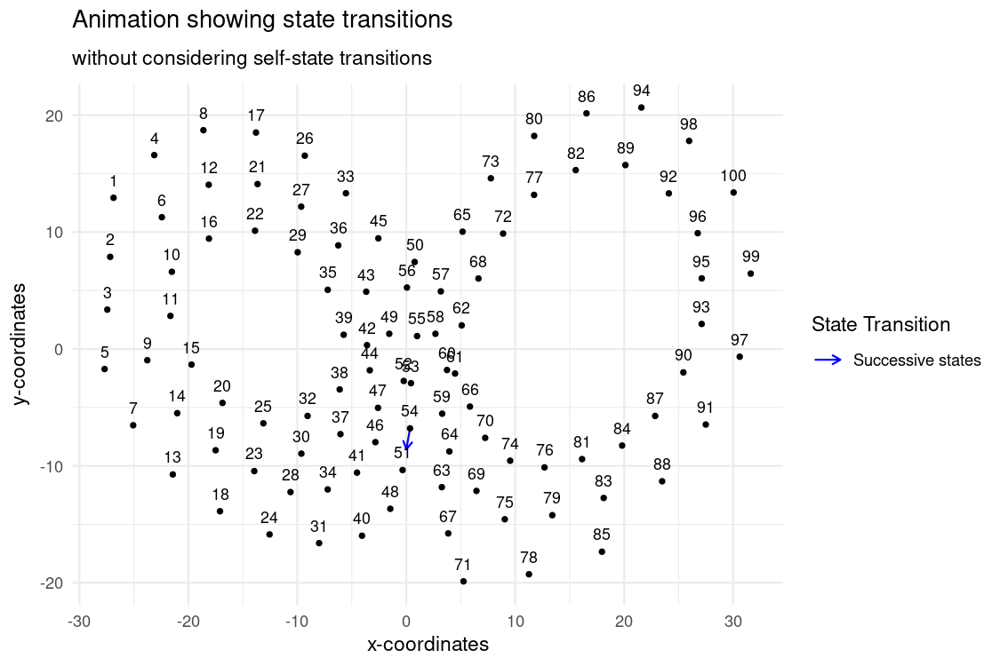

```{css, echo=FALSE}
/* CSS for floating TOC on the left side */
#TOC {
    /* float: left; */
    position: fixed;
    margin-left: -22vw;
    width: 18vw;
    height: fit-content;
    overflow-y: auto;
    padding-top: 20px;
    padding-bottom: 20px;
    background-color: #f9f9f9;
    border-right: 1px solid #ddd;
    margin-top: -13em; 
}
.main-container {
  margin-left: 222px; /* Adjust this value to match the width of the TOC + some margin */
}
body{
max-width:1200px;
width: 50%;
min-width: 700px;
}
p {
text-align: justify;
}
.plotly {
  margin: auto;
  width: 100% !important;
  height: 100% !important;
}
.caption {
  text-align: center;
}
li {
  padding-bottom: 5px;
}
ul {
  margin-bottom: 0px !important;
}
```


```{r, warning=FALSE,message=FALSE,include = FALSE}
knitr::opts_chunk$set(
  collapse = TRUE,
  comment = "#>",
  out.width = "672px",
  out.height = "480px",
  fig.width = 7.5,
  fig.height = 5,
  fig.align = "center",
  fig.retina = 1,
  dpi = 150
)

# installing all required packages
list.of.packages <- c("dplyr", "kableExtra", "geozoo", "plotly", "purrr", "sp", "data.table", "gridExtra","plyr", "grid", "ggforce", "reactable", "markovchain", "reshape", "gganimate", "gapminder", "animation", "magick", "tidyr", "jpeg", "ggpubr", "stringr", "DT", "knitr", "kableExtra")

new.packages <-
  list.of.packages[!(list.of.packages %in% installed.packages()[, "Package"])]
if (length(new.packages))
  install.packages(new.packages, dependencies = TRUE, verbose = FALSE)

# Loading the required libraries
invisible(lapply(list.of.packages, library, character.only = TRUE))
options(expressions = 10000)
global_var <- nzchar(Sys.getenv("RUN_VIGNETTE"))
global_var <- TRUE
scrolLimit <- function(noOfRows){
  if(noOfRows<10){
    swe = paste(as.character(noOfRows*50),"px")
  }
  else{
    swe = "400px"
   }
  return(swe)
}
Table <- function(data,scroll = F, limit = NULL){
  if(!is.null(limit)){
    data <- head(data,limit)}
kable_table <- data %>% kable(escape = F,align = "c") %>% kable_styling(bootstrap_options = c("striped", "hover", "responsive"))
if(scroll == T){
kable_table <- kable_table %>% scroll_box(width = "100%", height = scrolLimit(nrow(data)))
  }
return(kable_table)
}

set.seed(240)
```

# 1. Abstract

The HVT package is a collection of R functions to facilitate building [topology preserving maps](https://users.ics.aalto.fi/jhollmen/dippa/node9.html) for rich multivariate data analysis. Tending towards a big data preponderance, a large number of rows. A collection of R functions for this typical workflow is organized below:

1.  **Data Compression**: Vector quantization (VQ), HVQ (Hierarchical vector quantization) using means or medians. This step compresses the rows (long data frame) using a compression objective.

2.  **Data Projection**: Dimension projection of the compressed cells to 1D, 2D or Interactive surface plot with the Sammons Non-linear Algorithm. This step creates topology preserving map (also called as [embedding](https://en.wikipedia.org/wiki/Embedding)) coordinates into the desired output dimension.

3.  **Tessellation**: Create cells required for object visualization using the Voronoi Tessellation method, package includes heatmap plots for hierarchical Voronoi tessellations (HVT). This step enables data insights, visualization, and interaction with the topology preserving map. Useful for semi-supervised tasks.

4.  **Scoring**: Scoring new data sets and recording their assignment using the map objects from the above steps, in a sequence of maps if required.

5. **Temporal Analysis and Visualization**: A Collection of new functions that leverages the capacity of HVT package by analysing time series data for its underlying patterns, calculation of transitioning probabilities and the visualizations for the flow of data over time.

**What's new?**

The new update focuses on the integration of time series capabilities into the HVT package. This vignette emphasis the new functionalities introduced in the latest update (version 24.4.1), with a particular emphasis on temporal analysis and visualization techniques.

This update makes the package to extend its foundational operations to time series data (sequential observations recorded over time). Also, new functionalities are introduced to analyze underlying patterns and trends within the data, providing insights into its evolution over time and also offers the capability to analyse movement of the data by calculating its transitioning probability. This includes generating visualizations such as plots and GIFs to vividly illustrate the flow of data transitions along cells, facilitating deeper insights into the dynamic behavior of the system.


# 2. Experimental setup 

The Lorenz attractor is a three-dimensional figure that is generated by a set of differential equations that model a simple chaotic dynamic system of convective flow. Lorenz Attractor arises from a simplified set of equations that describe the behavior of a system involving three variables. These variables represent the state of the system at any given time and are typically denoted by (x, y, z). The equations are as follows:

  $$ dx/dt = σ*(y-x) $$
  $$ dy/dt = x*(r -z)-y $$
  $$ dz/dt = x*y-β*z $$
where dx/dt, dy/dt, and dz/dt represent the rates of change of x, y, and z respectively over time (t). σ, r, and β are constant parameters of the system, with σ(σ = 10) controlling the rate of convection, r(r=28) controlling the difference in temperature between the convective and stable regions, and β(β = 8/3) representing the ratio of the width to the height of the convective layer. When these equations are plotted in three-dimensional space, they produce a chaotic trajectory that never repeats. The Lorenz attractor exhibits sensitive dependence on initial conditions, meaning even small differences in the initial conditions can lead to drastically different trajectories over time. This sensitivity to initial conditions is a defining characteristic of chaotic systems.


In this notebook, we will use the `Lorenz Attractor Dataset`. This dataset contains 200,000 (Two hundered thousand) observations and 5 columns. The dataset can be downloaded from [here](https://www.kaggle.com/datasets/henrychibueze/lorenz-attractor-dataset)

The dataset includes the following columns:

* X: The X-coordinate of a point in the Lorenz attractor. It represents the measure of strength of the circulation of fluid in the convective flow
* Y: The Y-coordinate of a point in the Lorenz attractor. It represents the measure of the temperature of the fluid at a given point in space, but it is the horizontal temperature distribution
* Z: The Z-coordinate of a point in the Lorenz attractor. It represents the measure of the temperature of the fluid at a given point in space, but it is the vertical temperature distribution
* U: U represents the velocity or speed of the system at a particular point in the attractor 
* t: The time variable (discrete time steps which is incremented by approximately 0.0002500012500062 units of time) associated with each point in the Lorenz attractor. It indicates how much time has elapsed since the beginning of the simulation. Each value represents a specific point in time, and they are spaced apart by a fixed time interval.

# 3. Importing Code Modules

Here is the guide to install the HVT package. This helps user to install the most recent version of the HVT package.
```{r}
###direct installation###
#install.packages("HVT")

#or

###git repo installation###
#library(devtools)
#devtools::install_github(repo = "Mu-Sigma/HVT")

```


**NOTE:** At the time documenting this vignette, the updated changes were not still in CRAN, hence we are sourcing the scripts from the R folder directly to the session environment.

```{r, loading all the script files of the package, message=FALSE, warning=FALSE, include = TRUE}
# Sourcing required code scripts for HVT
script_dir <- "../R"
r_files <- list.files(script_dir, pattern = "\\.R$", full.names = TRUE)
invisible(lapply(r_files, function(file) { source(file, echo = FALSE); }))
```


# 4. Data Understanding

Here, we load the data. Let's explore the Lorenz Attractor Dataset. For the sake of brevity we are displaying only the first ten rows.


```{r,warning=FALSE,message=FALSE}
dataset <- read.csv("./sample_dataset/lorenze_attractor.csv")
dataset <- dataset %>% dplyr::select(X,Y,Z,U,t)
dataset$t <- round(dataset$t, 5)
Table(dataset, limit = 10)
```

Now let's try to visualize the Lorenz attractor (overlapping spirals) in  3D Space.

```{r, eval=TRUE,fig.cap='Figure 1: Lorenz attractor in 3D space'}
data_3d <- dataset[sample(1:nrow(dataset), 1000), ]
plotly::plot_ly(data_3d, x= ~X, y= ~Y, z = ~Z) %>% add_markers( marker = list(
                          size = 2,
                          symbol = "circle",
                          color = ~Z,
                          colorscale = "Bluered",
                          colorbar = (list(title = 'Z'))))
```

Now let's have a look at **structure** of the Lorenz Attractor dataset.

```{r, message=FALSE, warning=FALSE}
str(dataset)
```

**Data distribution**

This section displays five objects.

1) *Time Series Plots*: Plots of all features (including time) against time column.

2) *Variable Histograms*: The histogram distribution of all the variables in the dataset.

3) *Box Plots*: Box plots for each numeric column in the dataset across panels. These plots will display the median and Inter quartile Range of each column at a panel level.

4) *Correlation Matrix*: This calculates the pearson correlation which is a
bivariate correlation value measuring the linear correlation between two
numeric columns. The output plot is shown as a matrix.

5) *Summary EDA*: The table provides descriptive statistics for all the variables in the dataset.

It uses an inbuilt function called `edaPlots` to display the above mentioned five objects. This function will sort the given dataset by the time column and proceed with the plots. 

*NOTE: The input dataset should be a dataframe object and the columns should be numeric type.*

```{r, warning=FALSE,message=FALSE}
edaPlots(dataset, time_series = TRUE, time_column = "t")
```

**Train - Test Split**

Let us split the dataset into train and test. We will orderly select 80% of the data as train and remaining as test.

```{r}
noOfPoints <- dim(dataset)[1]
trainLength <- as.integer(noOfPoints * 0.8)
trainDataset <- dataset[1:trainLength,]
testDataset <- dataset[(trainLength+1):noOfPoints,]
rownames(testDataset) <- NULL
```


## 4.1 Training dataset

Let's have a look at the Training dataset containing 160,000 data points. For the sake of brevity we are displaying first 10 rows.

```{r,warning=FALSE,message=FALSE}
Table(trainDataset, limit = 10)
```

Now lets have a look at **structure** of the training dataset.

```{r train structure, warning=FALSE, eval = global_var}
str(trainDataset)
```

**Data Distribution**

```{r, train distribution, warning=FALSE,message=FALSE}
edaPlots(trainDataset, time_series = TRUE, time_column = 't')
```

## 4.2 Testing dataset

Let's have a look at the Testing dataset containing 40,000 data points. For the sake of brevity we are displaying first 10 rows.

```{r, warning=FALSE,message=FALSE}
Table(testDataset, limit = 10)
```

Now lets have a look at **structure** of the testing dataset.

```{r test structure, warning=FALSE, eval = global_var}
str(testDataset)
```


**Data Distribution**

```{r, test distribution, warning=FALSE,message=FALSE}
edaPlots(testDataset, time_series = TRUE, time_column = 't')
```

# 5. Model Training and Visualization

We will use the `trainHVT` function to compress our dataset while preserving essential features.

**Model Parameters**

* Number of Cells at each Level = 100
* Maximum Depth = 1
* Quantization Error Threshold = 0.1
* Error Metric = Max
* Distance Metric = Manhattan / L1_Norm

**NOTE:** *The compression takes place only for the X, Y, Z coordinates and not for U(velocity) and t(Timestamp). After training & Scoring, we merge back the U and t column with the dataset.*

```{r ,warning=FALSE,fig.show='hold',results='hide',message=FALSE,eval = global_var}
set.seed(240)
hvt.results <- trainHVT(
  trainDataset[,-c(4:5)],
  n_cells = 100,
  depth = 1,
  quant.err = 0.1,
  normalize = TRUE,
  distance_metric = "L1_Norm",
  error_metric = "max",
  quant_method = "kmeans"
)

```


Let's checkout the compression summary . 

```{r compression summary torus first,warning=FALSE,eval = global_var}
displayTable(data = hvt.results[[3]]$compression_summary,
             columnName = 'percentOfCellsBelowQuantizationErrorThreshold', 
             value = 0.8, tableType = "compression")
```
**NOTE:** *Based on the provided table, it's evident that the 'percentOfCellsBelowQuantizationErrorThreshold' value is zero, indicating that compression hasn't taken place for the specified number of cells, which is 100. Typically, we would continue increasing the Number of cells until at least 80% compression occurs. However, in this vignette demonstration, we're not doing so, because the plots generated from dynamic analysis functions would become cluttered and complex, making explanations less clear.*

Now, Let's plot the Voronoi tessellation for 100 cells.

```{r, warning=FALSE,message=FALSE,fig.cap='Figure 2: The Voronoi tessellation for layer 1 shown for the 100 cells in the dataset ’lorenz attractor’', fig.align = "center", fig.show ='hold', include=TRUE, out.width='90%', results='asis'}
plotHVT(
  hvt.results,
  centroid.size = c(0.6),
  plot.type = '2Dhvt',
  cell_id = FALSE
)

```

To understand how cell IDs are distributed across the map, we again plot voronoi tessellation with `cell_id = TRUE`.
```{r, warning=FALSE,message=FALSE,fig.cap='Figure 3: The Voronoi tessellation for layer 1 shown for the 100 cells in the dataset ’lorenz attractor’ with Cell ID', fig.align = "center", fig.show ='hold', include=TRUE, out.width='90%', results='asis', }
plotHVT(
  hvt.results,
  centroid.size = c(0.6),
  plot.type = '2Dhvt',
  cell_id = TRUE
)

```

# 6. Scoring

Now once we have built the model, let us try to score using our testing dataset.

NOTE: *we are using the entire dataset here in place of test dataset. Sice the test dataset will not cover all the cells. but the entire dataset can cover all the 100 cells mentioned in model training*

```{r scoreHVT function,warning=FALSE,message=FALSE,eval = global_var}
set.seed(240)
scoring <- scoreHVT(
  dataset,
  hvt.results,
  child.level = 1)
```

**The Flow Map functions mentioned in the next section requires Cell ID from scoring output and sorted Timestamp  from the dataset we used for scoring. So we merge them both to get a modified data frame that pairs cell IDs with their respective timestamps.**

Let’s see which cell and level each point belongs to with the sorted Timestamp. For the sake of brevity, we will only show the first 100 rows.


```{r scoreHVT,warning=FALSE,eval = global_var}
scored_data <- scoring[["scoredPredictedData"]] %>%round(2) %>% cbind(dataset) %>% 
               as.data.frame()

colnames(scored_data) <- c("Segment.Level", "Segment.Parent", "Segment.Child", "n","Cell.ID",
                           "Quant.Error", "pred_X", "pred_Y", "pred_Z", "centroidRadius",
                           "diff", "anomalyFlag", "X", "Y", "Z", "U", "t")

displayTable(data =scored_data, columnName= 'Quant.Error', value = 0.1, tableType = "summary", limit =100)

```

Let's look at the trained model summary from `scoreHVT()`
```{r}
scoring$model_info$trained_model_summary
```

Let's look at the scored model summary from `scoreHVT()`
```{r}
scoring$model_info$scored_model_summary
```


</br>

# 7. Timeseries plot with State Transitions

Let's comprehend the function `plotStateTransition` which is used to create a time series plotly object.

```{r plotStateTransition function, echo=TRUE, eval=FALSE}
plotStateTransition(
       df,
       sample_size,
       line_plot,
       cellid_column,
       time_column 
)
```


* __`df`__  - A dataframe contains Cell ID and Timestamps.

* __`sample_size`__ - A numeric value to specify the sampling value which ranges between 0.1 to 1. The highest value 1, outputs a plot with the entire dataset. Sampling of data takes place from the last to first.

* __`line_plot`__ - A Logical value. If TRUE, the output will be a timeseries plot with a line connecting the states according to the sample_size. If FALSE, a timeseries plot but without a line based on the sample_size will be the output.

* __`cellid_column`__ - A Character specifying the column name of Cell ID from the dataframe passed to this function.

* __`time_column`__ - A Character specifying the column name of timestamp from the dataframe passed to this function.


```{r state_plot1, results='asis', warning=FALSE,message=FALSE}
plotStateTransition(df = scored_data, cellid_column = "Cell.ID", time_column = "t", sample_size = 0.2)
```


</br>

# 8. Transition probability tables


```{r getTransitionProbability,eval=FALSE}
getTransitionProbability(
        df, 
        cellid_column, 
        time_column)

```


* __`df`__  - A dataframe contains Cell ID and Timestamps.

* __`cellid_column`__  - A Character specifing the column name of Cell ID from the dataframe passed to this function.

* __`time_column`__ - A Character specifing the column name of timestamp from the dataframe passed to this function.


```{r, message=FALSE}
trans_table <- getTransitionProbability(df = scored_data, cellid_column = "Cell.ID", time_column = "t")
```

**NOTE: The output is stored as a nested list which provides facility to handle it easily with Cell IDs for the upcoming functions. For the purpose of demo, here we are displaying it as dataframe with first 10 rows.**

```{r}
names_list <- lapply(trans_table, names)
common_names <- Reduce(intersect, names_list)
trans_table_list <- lapply(trans_table, function(df) df[common_names])
combined_df <- do.call(rbind, trans_table_list)
Table(combined_df, limit = 10)
```


- *Current_State*: The cell (out of 100 cells given in model training) in which the datapoint resides at given time (t).

- *Next_State*: The cell (out of 100 cells given in model training) to which the datapoint moves at the next time unit (t+1).

- *Relative_Frequency*: The number of times that the datapoint moves from the `Current_State` to the `Next_State`.

- *Transition_Probability*: The probability calculated from the `Relative_Frequency` of the top three states. Individual `Relative_Frequency` divided by the total of top 3 states.


# 9. Reconciling transition probability using markovchain package

Reconciling the Transition Proability of the current states to next states manually and markovchain function considering both self states and without self states.
```{r reconcileTransitionProbability, eval=FALSE}
reconcileTransitionProbability(
                df, 
                hmap_type = "All", 
                cellid_column, 
                time_column)
```

 
* __`df`__  - A dataframe contains Cell ID and Timestamps.

* __`hmap_type`__ - If set to 'without_self_state', reconciliation plots for manual and Markovchain for highest transition probability excluding the self-state is given as output, if set to 'with_self_state', reconciliation plots for manual and Markovchain for highest transition probability considering the self-state is given as output and if set to 'All', plots including and excluding self-state is given as output.

* __`cellid_column`__ -  A Character specifying the column name of Cell ID from the dataset.

* __`time_column`__ - A Charcater specifying the column name of timestamp from the dataset.

```{r, warning=FALSE, message=FALSE}
reconcile_plots <- reconcileTransitionProbability(df = scored_data, 
                                                  hmap_type = "All", 
                                                  cellid_column = "Cell.ID",
                                                  time_column = "t")
```


**Reconciliation Plots of transition probability with self-state**

The Transition probability of one state staying in the same state is calculated using manual calculations and markov function and plotted for comparison.The darker diagonal cells indicate higher probabilities of cells staying in the same state. 

```{r hmap1, fig.align = "center", fig.show ='hold', message=FALSE, out.height='100%', out.width='100%', results='asis', warning=FALSE}
reconcile_plots[[1]]
```


**Reconciliation Table of transition probability with self-state**
  
```{r hmap2, fig.align = "center", fig.show ='hold', message=FALSE, out.width='70%', results='asis', warning=FALSE}
Table(reconcile_plots[[2]], scroll = TRUE)
```
**Reconciliation Plots of transition probability without self-state**

The transition probability of one state moving to the next state is calculated using manual calculations and markov function and plotted for comparison. From all the next state transitions, the one with higher probability is selected.

```{r hmap3, fig.align = "center", fig.show ='hold', message=FALSE, out.width='70%', results='asis', warning=FALSE}
reconcile_plots[[3]]
```


**Reconciliation Table of transition probability without self-state**
```{r hmap4, fig.align = "center", fig.show ='hold', message=FALSE, out.width='70%', results='asis', warning=FALSE}
Table(reconcile_plots[[4]], scroll = TRUE)
```


</br>


# 10.  Animated Flowmaps

```{r plotAnimatedFlowmap, eval=FALSE}
plotAnimatedFlowmap(
         hvt_model_output, 
         transition_probability_df, 
         df, 
         animation = "All", 
         flow_map = "All", 
         fps_state,
         fps_time,
         time_duration,
         state_duration,
         cellid_column, 
         time_column )

```


* __`hvt_model_output`__  - The List object which is the output from `trainHVT` function.

* __`transition_probability_df`__  - A list of dataframe which is the output from the `getTransitionProbability` function.

* __`df`__  - A dataframe contains Cell ID and Timestamps.

* __`animation`__  - Character. If set to 'time_based', an animation plot in which a red dot moves along cells according to the timestamp will be displayed. If set to 'state_based', arrow animation based on highest state excluding self-state will be displayed. If set to 'All', both the animation will be resulted. If set to NULL none will be resulted.

* __`flow_map`__  - Character. If set to 'self_state', the plot which shows the self state by circles will be displayed. More the circle size, more probability of the cell stays in the same cell. If set to 'without_self_state', the plot which shows the next state by arrows will be displayed. The arrow head points the next cell to go from the cell which is pointed by the arrow tail. If set to 'All', all two flowmaps will be resulted. If set to NULL none will be resulted.

* __`fps_for_time`__  - A Numeric value indicating the frames per second for time transition animation.
(Must be numeric value and a factor of 100). Default value is 1.

* __`fps_for_state`__  - A Numeric value indicating the frames per second for state transition animation. (Must be numeric value and a factor of 100). Default value is 1.

* __`time_duration`__  - A Numeric value indicating the total duration of the gif for time transition animation. Default value is 2.

* __`state_duration`__  - A Numeric value indicating the total duration(in seconds) of the gif for state transition animation. Default value is 2.

* __`cellid_column`__  - A Character specifying the column name of Cell ID of the dataset.

* __`time_column`__  -  A Character specifying the column name of Timestamp of the dataset.


```{r flow_map_fn, warning=FALSE,message=FALSE}
flowmap_plots <- plotAnimatedFlowmap(hvt_model_output = hvt.results,transition_probability_df =trans_table,
                                     df = scored_data, animation = 'All', flow_map = 'All',
                                     fps_time = 30, fps_state =  5, time_duration = 180,
                                     state_duration = 20,cellid_column = "Cell.ID", time_column = "t")
```

  
</br>


**1.Flow map: Highest transition probability considering self-state**

The Circle size around the cell's centroid represents self-state Probability. More the size, more the probability of the data staying in the same cell.
  
```{r dot_flow_map, echo=FALSE, fig.align = "center", fig.show ='hold', message=FALSE, out.width='100%', out.height='70%', results='asis', warning=FALSE}
flowmap_plots[[1]]
```


</br>

**2. Flow Map: Highest transition probability excluding self-states - Arrow size represents transition probability**

The Arrow size represents the Probability of the data to move to the next state. And the arrow directions points out to which cell it is moving next.

```{r arrow_map, echo=FALSE, fig.align = "center", fig.show ='hold', message=FALSE, out.width='100%',out.height='70%', results='asis', warning=FALSE}
flowmap_plots[[2]]
```


</br>


**3. Flow map animation: Highest state transition probabilities (Including self-states)**


{width=100%}


</br>


**4. Flow Map animation: Highest state transition probabilities (Excluding self-states)**

{width=100%}

