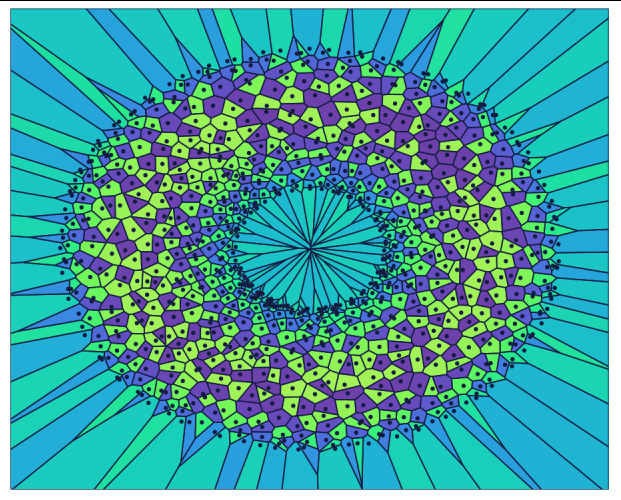
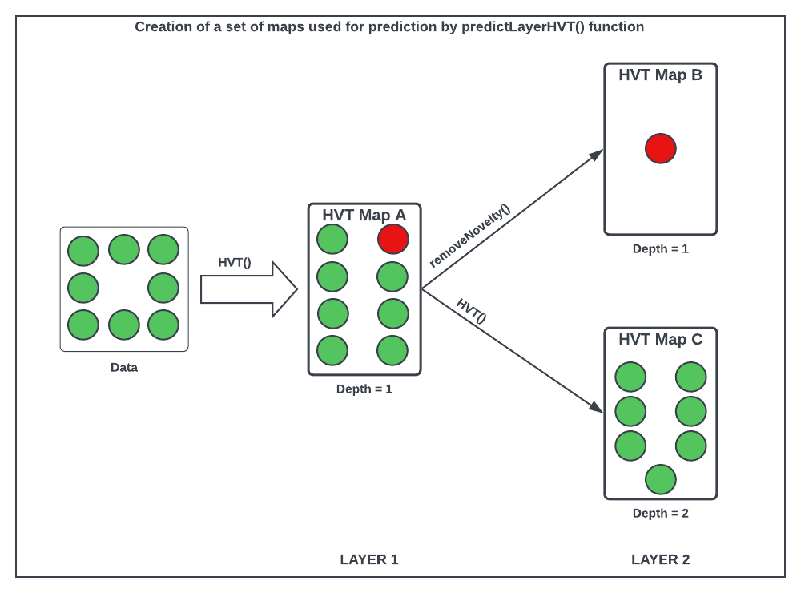

```{css, echo=FALSE}
/* CSS for floating TOC on the left side */
#TOC {
    /* float: left; */
    position: fixed;
    margin-left: -22vw;
    width: 18vw;
    height: fit-content;
    overflow-y: auto;
    padding-top: 20px;
    padding-bottom: 20px;
    background-color: #f9f9f9;
    border-right: 1px solid #ddd;
    margin-top: -14.5em;
}

.main-container {
  margin-left: 220px; /* Adjust this value to match the width of the TOC + some margin */
}
body{
max-width:1200px;
width: 50%;
}
p {
text-align: justify;
}

li {
  padding-bottom: 5px;
}

.caption {
  text-align: center;
}

<!-- /* CSS for adding dots after section numbers */ -->
<!-- h1::before, h2::before, h3::before, h4::before, h5::before, h6::before { -->
<!--  content: counter(section) ". "; -->
<!--   counter-increment: section; -->
<!-- } -->

```

```{r setup, warning = FALSE, include = FALSE}
knitr::opts_chunk$set(
  collapse = TRUE,
  comment = "#>",
  out.width = "auto",
  out.height = "480px",
  fig.width = 7,
  fig.height = 5,
  fig.align = "center",
  fig.retina = 1,
  dpi = 150
)
```

# 1. Abstract

The HVT package is a collection of R functions to facilitate building [topology preserving maps](https://users.ics.aalto.fi/jhollmen/dippa/node9.html#:~:text=The%20property%20of%20topology%20preserving,tool%20of%20high-dimensional%20data) for rich multivariate data analysis, see `Figure 1` as an example of a 3D torus map generated from the package. Tending towards a big data preponderance, a large number of rows. A collection of R functions for this typical workflow is organized below:

1.  **Data Compression**: Vector quantization (VQ), HVQ (hierarchical vector quantization) using means or medians. This step compresses the rows (long data frame) using a compression objective.

2.  **Data Projection**: Dimension projection of the compressed cells to 1D,2D or Interactive surface plot with the Sammons Non-linear Algorithm. This step creates topology preserving map (also called an [embedding](https://en.wikipedia.org/wiki/Embedding)) coordinates into the desired output dimension. 

3.  **Tessellation**: Create cells required for object visualization using the Voronoi Tessellation method, package includes heatmap plots for hierarchical Voronoi tessellations (HVT). This step enables data insights, visualization, and interaction with the topology preserving map useful for semi-supervised tasks.

4.  **Scoring**: Scoring new data sets and recording their assignment using the map objects from the above steps, in a sequence of maps if required.

5. **Temporal Analysis and Visualization**: Analysing time series data to understand its patterns and movements and visualising the flow of data over time.

The HVT package allows creation of visually stunning tessellations, showcasing the power of topology preserving maps. below is an image depicting a captivating tessellation of a torus.

```{r predictlayer_flow,echo=FALSE,warning=FALSE,fig.show='hold',message=FALSE,fig.cap='Figure 1:  Heatmap Visualization of a Torus with 900 Cells'}

```

# 2. Vignettes

Following are the links to the vignettes for the HVT package:


1. [**HVT Vignette:**](https://gitlab.ird.mu-sigma.com/applied_prescriptive_methods/HVT/-/blob/restructure/vignettes/HVT_vignette.html) Contains descriptions of the functions used for vector quantization and construction of hierarchical voronoi tessellations for data analysis.

2. [**HVT Model Diagnostics Vignette:**](https://gitlab.ird.mu-sigma.com/applied_prescriptive_methods/HVT/-/blob/restructure/vignettes/HVT_model_diagnostics_vignette.html) Contains descriptions of functions used to perform model diagnostics and validation for HVT model.

3. [**HVT Scoring Cells with Layers using scoreLayeredHVT:**](https://gitlab.ird.mu-sigma.com/applied_prescriptive_methods/HVT/-/blob/restructure/vignettes/Scoring_Cells_with_Layers_using_scoreLayeredHVT.html) Contains descriptions of the functions used for scoring cells with layers based on a sequence of maps using scoreLayeredHVT.

4. [**Temporal Analysis and Visualization: Leveraging Time Series Capabilities in HVT**](https://gitlab.ird.mu-sigma.com/applied_prescriptive_methods/HVT/-/blob/restructure/vignettes/Flowmap_Vignette.html)Contains descriptions of the functions used for analysing time series data and its flowmaps.

# 3. Version History

## HVT (v24.5.1) | What's New? {-}

24th April, 2024

In this version of HVT package, the following new features have been introduced:

1. **Updated Nomenclature:** To make the function names more consistent and understandable/intuitive, we have renamed the functions throughout the package. Given below are the few instances.

* `HVT` to `trainHVT`
* `predictHVT` to `scoreHVT`
* `predictLayerHVT` to `scoreLayeredHVT`

2. **Restructured Functions:** The functions have been rearranged and grouped into new sections which are highlighted on the index page of package’s PDF documentation. Given below are the few instances.

* `trainHVT` function now resides within the `Training_or_Compression` section.
* `plotHVT` function now resides within the `Tessellation_and_Heatmap` section.
* `scoreHVT` function now resides within the `Scoring` section.

3. **Enhancements:** The pre-existed functions, `hvtHmap` and `exploded_hmap`, have been combined and incorporated into the `plotHVT` function. Additionally, `plotHVT` now includes the ability to perform 1D plotting.

4. **Temporal Analysis** This update makes the package to extend its foundational operations to time series data (sequential observations recorded over time). Also, new functionalities are introduced to analyze underlying patterns and trends within the data, providing insights into its evolution over time and also offers the capability to analyse movement of the data by calculating its transitioning probability. This includes generating visualizations such as plots and GIFs to vividly illustrate the flow of data transitions along cells, facilitating deeper insights into the dynamic behavior of the system.

## HVT (v23.11.02) {-}

17th November, 2023


This version of HVT package offers functionality to score cells with layers based on a sequence of maps created using `scoreLayeredHVT`. Given below are the steps to created the successive set of maps.

1. **Map A** - The output of `trainHVT` function which is trained on parent data.

2. **Map B** - The output of `trainHVT` function which is trained on the 'data with novelty' created from `removeNovelty` function.

3. **Map C** - The output of `trainHVT` function which is trained on the 'data without novelty' created from `removeNovelty` function.

The `scoreLayeredHVT` function uses these three maps to score the test datapoints.

Let us try to understand the steps with the help of the diagram below

```{r mlayer_flow,echo=FALSE,warning=FALSE,fig.show='hold',message=FALSE,fig.cap='Figure 2: Data Segregation for scoring based on a sequence of maps using scoreLayeredHVT()'}

```

## HVT (v22.12.06) {-}

06th December, 2022

This version of HVT package offers features for both training an HVT model and eliminating outlier cells from the trained model.

1. **Training or Compression:** The initial step entails training the parent data using the `trainHVT` function, specifying the desired compression percentage and quantization error.

2. **Remove novelty cells:** Following the training process, outlier cells can be identified manually from the 2D hvt plot. These outlier cells can then be inputted into the `removeNovelty` function, which subsequently produces two datasets in its output: one containing 'data with novelty' and the other containing 'data without novelty'.


# 4. Installation of HVT (v24.5.1)

``` r
library(devtools)
devtools::install_github(repo = "Mu-Sigma/HVT")
```


