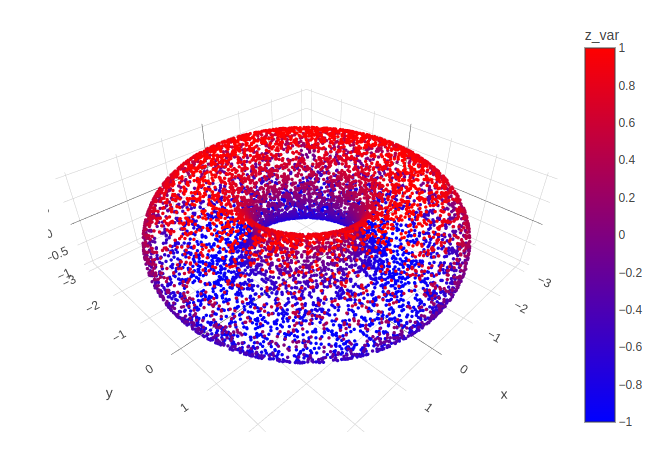

```{css, echo=FALSE}
/* CSS for floating TOC on the left side */
#TOC {
    /* float: left; */
    position: fixed;
    margin-left: -22vw;
    width: 18vw;
    height: fit-content;
    overflow-y: auto;
    padding-top: 20px;
    padding-bottom: 20px;
    background-color: #f9f9f9;
    border-right: 1px solid #ddd;
    margin-top: -12em; 
}

.main-container {
  margin-left: 222px; /* Adjust this value to match the width of the TOC + some margin */
}

li {
  padding-bottom: 5px;
}

ul {
  margin-bottom: 0px !important;
}
```


```{r setup, warning = FALSE, include = FALSE}
knitr::opts_chunk$set(
  collapse = TRUE,
  comment = "#>",
  out.width = "672px",
  out.height = "480px",
  fig.width = 7,
  fig.height = 5,
  fig.align = "center",
  fig.retina = 1,
  dpi = 150
)

# installing all required packages
list.of.packages <- c("dplyr", "kableExtra", "geozoo", "plotly", "purrr", "sp", "HVT", "data.table", "gridExtra","plyr")

new.packages <-
  list.of.packages[!(list.of.packages %in% installed.packages()[, "Package"])]
if (length(new.packages))
  install.packages(new.packages, dependencies = TRUE)

# Loading the required libraries
lapply(list.of.packages, library, character.only = T)

# Sourcing the modified files for HVT
## Do this if HVT is unavailable on CRAN

source("../R/Add_boundary_points.R")
source("../R/Corrected_Tessellations.R")
source("../R/DelaunayInfo.R")
source("../R/Delete_Outpoints.R")
source("../R/getCentroids.R")
source("../R/getOptimalCentroids.R")
source("../R/hvq.R")
source("../R/HVT.R")
source("../R/hvtHmap.R")
source("../R/plotCells.R")
source("../R/plotHVT.R")
source("../R/predictHVT.R")
source("../R/ScaleMat.R")
source("../R/Transform_Coordinates.R")
source("../R/madPlot.R")
source("../R/diagPlot.R")
source("../R/get_cell_id.R")
source("../R/getCentroids_for_opti.R")
source("../R/multiNormalDist.R")
source("../R/plotDiag.R")
source("../R/qeHistPlot.R")
source("../R/diagSuggestion.R")
source("../R/exploded_hmap.R")
source("../R/predictLayerHVT.R")
source("../R/removeNovelty.R")


options(expressions = 10000)

global_var <- nzchar(Sys.getenv("RUN_VIGNETTE"))
global_var <- TRUE
scrolLimit <- function(noOfRows){
  if(noOfRows<10){
    
    swe = paste(as.character(noOfRows*50),"px")
  }
  else{
    swe = "400px"
  }
  return(swe)
}

Table <- function(data,scroll = F, limit = NULL){
  
  if(!is.null(limit)){
    data <- head(data,limit)
  }
  
  kable_table <- data %>% kable(escape = F,align = "c") %>% kable_styling(bootstrap_options = c("striped", "hover", "responsive"))
  
  scroll <- scroll
  
  if(scroll == T){
  kable_table <- kable_table %>% scroll_box(width = "100%", height = scrolLimit(nrow(data)))
  }
  
 return(kable_table)
  
}

summaryTable <- function(data,scroll = T,columnName='Quant.Error',value=0.2,limit=NULL){
  
  scroll <- scroll
  summaryTable <- data %>%  dplyr::mutate_if(is.numeric, funs(round(.,2))) %>% dplyr::mutate(!!columnName:=  cell_spec(eval(parse(text = columnName)),color = ifelse(is.na(eval(parse(text = columnName))),"#333",ifelse(eval(parse(text = columnName)) < value,"red","#333"))))  
  
  return(Table(summaryTable,scroll = scroll,limit = limit))
  
}

compressionSummaryTable <- function(data,scroll = T,columnName='percentOfCellsBelowQuantizationErrorThreshold',value=0.8){
  
  
summaryTable <- data %>%  dplyr::mutate_if(is.numeric, funs(round(.,2))) %>% dplyr::mutate(!!columnName:=  cell_spec(eval(parse(text = columnName)),color = ifelse(is.na(eval(parse(text = columnName))),"#00bb27",ifelse(eval(parse(text = columnName)) > value,"#00bb27","#333")))) 
  
return(Table(summaryTable,scroll = scroll))
  
}
set.seed(240)
```

# Abstract

The HVT package is a collection of R functions to facilitate building [topology preserving maps](https://users.ics.aalto.fi/jhollmen/dippa/node9.html) for rich multivariate data analysis. Tending towards a big data preponderance, a large number of rows. A collection of R functions for this typical workflow is organized below:

1.  **Data Compression**: Vector quantization (VQ), HVQ (hierarchical vector quantization) using means or medians. This step compresses the rows (long data frame) using a compression objective.

2.  **Data Projection**: Dimension projection of the compressed cells to 1D,2D or 3D with the Sammons Non-linear Algorithm. This step creates topology preserving map (also called an [embedding](https://en.wikipedia.org/wiki/Embedding)) coordinates into the desired output dimension. 

3.  **Tessellation**: Create cells required for object visualization using the Voronoi Tessellation method, package includes heatmap plots for hierarchical Voronoi tessellations (HVT). This step enables data insights, visualization, and interaction with the topology preserving map useful for semi-supervised tasks.

4.  **Prediction**: Scoring new data sets and recording their assignment using the map objects from the above steps, in a sequence of maps if required.

# Data Compression

Compression is a technique used to reduce the data size while preserving its essential information, allowing for efficient storage and decompression to reconstruct the original data. While Vector quantization (VQ) is a technique used in data compression to represent a set of data points with a smaller number of representative vectors. It achieves compression by exploiting redundancies or patterns in the data and replacing similar data points with representative vectors.


This package offers several advantages for performing data compression as it is designed to handle `high-dimensional data` more efficiently. It provides a `hierarchical compression approach`, allowing  multi-resolution representation of the data. The hierarchical structure enables `efficient compression` and `storage` of the data while preserving different levels of detail. HVT aims to preserve the topological structure of the data during compression.`Spatial data` with `irregular shapes` and complex structures in high-dimensional data can contain valuable information about relationships and patterns. HVT seeks to capture and retain these topological characteristics, enabling meaningful analysis and visualization.This package employs tessellation to divide the compressed data space into distinct cells or regions while preserving the topology of the original data. This means that the relationships and connectivity between data points are maintained in the compressed representation.


This package can perform vector quantization using the following algorithms- 

*  Hierarchical Vector Quantization using $k-means$ 
*  Hierarchical Vector Quantization using $k-medoids$


## Hierarchical Vector Quantization

###  Using k-means

1. The k-means algorithm randomly selects *k* data points as initial means.
1. *k* clusters are formed by assigning each data point to its closest cluster mean using the Euclidean distance.
1. Virtual means for each cluster are calculated by using all datapoints contained in a cluster.

The second and third steps are iterated until a predefined number of iterations is reached or the clusters converge. The runtime for the algorithm is O(n).

###  Using k-medoids

1.  The k-medoids algorithm randomly selects *k* data points as initial
    means out of the n data points as the medoids.
2.  *k* clusters are formed by assigning each data point to its closest
    medoid by using any common distance metric methods.
3.  Virtual means for each cluster are calculated by using all
    datapoints contained in a cluster.

The second and third steps are iterated until a predefined number of
iterations is reached or the clusters converge. The runtime for the
algorithm is O(k \* (n-k)\^2).


These algorithm divides the dataset recursively into cells using $k-means$
or $k-medoids$ algorithm. The maximum number of subsets are decided by
setting $n_cells$ to, say five, in order to divide the dataset into
maximum of five subsets. These five subsets are further divided into
five subsets(or less), resulting in a total of twenty five (5\*5)
subsets. The recursion terminates when the cells either contain less
than three data point or a stop criterion is reached. In this case, the
stop criterion is set to when the cell error exceeds the quantization
threshold.

The steps for this method are as follows:

1. Select k(number of cells), depth and quantization error threshold.
1. Perform quantization (using $k-means$ or $k-medoids$) on the input dataset.
1. Calculate quantization error for each of the k cells.
1. Compare the quantization error for each cell to quantization error threshold.
1. Repeat steps 2 to 4 for each of the k cells whose quantization error is above threshold until stop criterion is reached.

The stop criterion is when the quantization error of a cell  satisfies one of the below conditions: 

* reaches below quantization error threshold.
* there are less than three data points in the cell.
* the user specified depth has been attained.

The quantization error for a cell is defined as follows:

$$QE  = \max_i(||A-F_i||_{p})$$ 


where 

*  $A$ is the centroid of the cell
*  $F_i$ represents a data point in the cell 
*  $m$ is the number of points in the cell
*  $p$ is the $p$-norm metric. Here $p$ = 1 represents L1 Norm and $p$ = 2 represents L2 Norm

###  Quantization Error

Let us try to understand quantization error with an example.

```{r Quantization Error,echo=FALSE,warning=FALSE,fig.show='hold',message=FALSE,out.width='90%',fig.height=8,fig.cap='Figure 1: The Voronoi tessellation for level 1 shown for the 5 cells with the points overlayed'}
knitr::include_graphics('quant_explainer.png')
```

An example of a 2 dimensional VQ is shown above.

In the above image, we can see 5 cells with each cell containing a certain number of points. The centroid for each cell is shown in blue. These centroids are also known as codewords since they represent all the points in that cell. The set of all codewords is called a codebook.

Now we want to calculate quantization error for each cell. For the sake of simplicity, let's consider only one cell having centroid `A` and `m` data points $F_i$ for calculating quantization error.

For each point, we calculate the distance between the point and the centroid.

$$ d = ||A - F_i||_{p} $$

In the above equation, p = 1 means `L1_Norm` distance whereas p = 2 means `L2_Norm` distance. In the package, the `L1_Norm` distance is chosen by default. The user can pass either `L1_Norm`, `L2_Norm` or a custom function to calculate the distance between two points in n dimensions.

$$QE  = \max_i(||A-F_i||_{p})$$ 


Now, we take the maximum calculated distance of all m points. This gives us the furthest distance of a point in the cell from the centroid, which we refer to as `Quantization Error`. If the Quantization Error is higher than the given threshold, the centroid/ codevector is not a good representation for the points in the cell. Now we can perform further Vector Quantization on these points and repeat the above steps.

Please note that the user can select mean, max or any custom function to calculate the Quantization Error. The custom function takes a vector of m value (where each value is a distance between point in `n` dimensions and centroids) and returns a single value which is the Quantization Error for the cell.

If we select `mean` as the error metric, the above Quantization Error equation will look like this:  

$$QE  = \frac{1}{m}\sum_{i=1}^m||A-F_i||_{p}$$ 

# Data Projection

Projection mainly involves converting data from its original form to a different space or coordinate system while preserving certain properties of it. By projecting data into a common coordinate system, spatial relationships, distances, areas, and other spatial attributes can be accurately measured and compared.

HVT performs projection as part of its workflow to visualize and explore high-dimensional data. The projection step in HVT involves mapping the compressed data, represented by the hierarchical structure of cells, onto a lower-dimensional space for visualization purposes, as human perception is more suited to interpreting information in lower-dimensional spaces.Users can zoom in/out, rotate, and explore different regions of the projected space to gain insights and understand the data from different perspectives.


Sammon's projection is an algorithm used in this package to map a high-dimensional space to a space of lower dimensionality while attempting to preserve the structure of inter-point distances in the projection. It is particularly suited for use in exploratory data analysis and is usually considered a non-linear approach since the mapping cannot be represented as a linear combination of the original variables. The centroids are plotted in 2D after performing Sammon’s projection at every level of the tessellation.


Denoting the distance between $i^{th}$ and $j^{th}$ objects in the original space by $d_{ij}^*$, and the distance between their projections by $d_{ij}$. Sammon’s mapping aims to minimize the below error function, which is often referred to as Sammon’s stress or Sammon’s error.

$$E=\frac{1}{\sum_{i<j} d_{ij}^*}\sum_{i<j}\frac{(d_{ij}^*-d_{ij})^2}{d_{ij}^*}$$

The minimization  of this can be performed either by gradient descent, as proposed initially, or by other means, usually involving iterative methods. The number of iterations need to be experimentally determined and convergent solutions are not always guaranteed. Many implementations prefer to use the first Principal Components as a starting configuration.

# Tessellation

A Voronoi diagram is a way of dividing space into a number of regions. A set of points (called seeds, sites, or generators) is specified beforehand and for each seed, there will be a corresponding region consisting of all points within proximity of that seed. These regions are called `Voronoi cells`. It is complementary to `Delaunay triangulation` is a geometrical algorithm used to create a triangulated mesh from a set of points in a plane which has the property that no data point lies within the circumcircle of any triangle in the triangulation. This property guarantees that the resulting cells in the tessellation do not overlap with each other. 

By using `Delaunay triangulation`, HVT can achieve a partitioning of the data space into distinct and non-overlapping regions, which is crucial for accurately representing and analyzing the compressed data.Additionally, the use of Delaunay triangulation for tessellation ensures that the resulting cells have well-defined shapes, typically triangles in two dimensions or tetrahedra in three dimensions. 

The hierarchical structure resulting from tessellation preserves the inherent structure and relationships within the data. It captures clusters, subclusters, and other patterns in the data, allowing for a more organized and interpretable representation.
The hierarchical structure reduces redundancy and enables more compact representations.

**Tessellate: Constructing Voronoi Tesselation**

In this package, we use `sammons` from the package `MASS` to project higher dimensional data to a 2D space. The function `hvq` called from the `HVT` function returns hierarchical quantized data which will be the input for construction of the tessellations. The data is then represented in 2D coordinates and the tessellations are plotted using these coordinates as centroids. We use the package `deldir` for this purpose. The `deldir` package computes the Delaunay triangulation (and hence the Dirichlet or Voronoi tessellation) of a planar point set according to the second (iterative) algorithm of Lee and Schacter. For subsequent levels, transformation is performed on the 2D coordinates to get all the points within its parent tile. Tessellations are plotted using these transformed points as centroids. The lines in the tessellations are chopped in places so that they do not protrude outside the parent polygon. This is done for all the subsequent levels.

# Prediction


Prediction basically refers to the process of making predictions or estimating future values or outcomes based on existing data patterns.In data prediction, a model is developed based on historical data or a training dataset, and this model is then used to make predictions on new, unseen data. The model captures the underlying patterns, trends, and relationships present in the training data, allowing it to make informed predictions on similar or related data points.

In this package, we use `predictHVT` function to predict each point in the test dataset.

**Prediction Algorithm**

The prediction algorithm recursively calculates the distance between each point in the test dataset and the cell centroids for each level. The following steps explain the prediction method for a single point in the test dataset:

1. Calculate the distance between the point and the centroid of all the cells in the first level.
2. Find the cell whose centroid has minimum distance to the point.
3. Check if the cell drills down further to form more cells.
4. If it doesn’t, return the path. Or else repeat steps 1 to 4 till we reach a level at which the cell doesn’t drill down further.

# Example I: HVT with the Torus dataset

**In this section, we will see how we can use the package to visualize multidimensional data by projecting them to two dimensions using Sammon's projection and further used for scoring**

**Data Understanding**

First of all, let us see how to generate data for torus. We are using a library `geozoo` for this purpose. Geo Zoo (stands for Geometric Zoo) is a compilation of geometric objects ranging from three to 10 dimensions. Geo Zoo contains regular or well-known objects, eg cube and sphere, and some abstract objects, e.g. Boy's surface, Torus and Hyper-Torus. 

Here, we will generate a 3D torus (a torus is a surface of revolution generated by revolving a circle in three-dimensional space one full revolution about an axis that is coplanar with the circle) with 9000 points.

**Raw Torus Dataset**

The torus dataset includes the following columns:

* x: This column represents the X-coordinate of each point in the torus.
* y: This column represents the Y-coordinate of each point in the torus.
* z: This column represents the Z-coordinate of each point in the torus.

Lets, explore the **raw torus dataset containing 12000 points**. For the sake of brevity we are displaying first 6 rows.

```{r torus generate,warning=FALSE,message=FALSE,eval = global_var}
set.seed(240)
# Here p represents dimension of object
# n represents number of points
torus <- geozoo::torus(p = 3,n = 12000)
torus_df <- data.frame(torus$points)
colnames(torus_df) <- c("x","y","z")

torus_df1 <- torus_df %>% round(4)
colnames(torus_df1) <- c("x","y","z")
torus_df1$Row.No <- as.numeric(row.names(torus_df))
torus_df1 <- torus_df1 %>% dplyr::select(Row.No,x,y,z)
Table(head(torus_df1))
```

We will first split the torus data into train and test. We will randomly select 9000 data points as training and remaining 3000 data points as testing data.

```{r warning=FALSE,message=FALSE}
set.seed(42)
train_indices <- sample(1:nrow(torus_df), 9000)
trainTorus <- torus_df[train_indices, ]
trainTorus_data <- trainTorus %>% round(4)
test_indices <- setdiff(1:nrow(torus_df), train_indices)
testTorus <- torus_df[test_indices, ]
```

```{r echo=FALSE,eval=TRUE}
torus_df<-trainTorus
```

**Raw Training Dataset**

First of all, we will see the randomly selected **training data containing (9000 data points)**. For the sake of brevity we are displaying first six rows.

```{r torus head, warning=FALSE, eval = global_var}

trainTorus_data$Row.No <- as.numeric(row.names(trainTorus_data))
trainTorus_data <- trainTorus_data %>% dplyr::select(Row.No,x,y,z)
row.names(trainTorus_data) <- NULL
Table(head(trainTorus_data))

```

Now let's have a look at **structure** and **summary** of the training data.

```{r train torus structure, warning=FALSE, eval = global_var}
str(trainTorus_data)
```

```{r train torus summary, warning=FALSE,eval = global_var}
summary(trainTorus_data)
```

**Raw Testing Dataset**

Now, lets have a look at randomly selected **testing dataset containing(3000 data points)**.For the sake of brevity we are displaying first six rows.


```{r}
test_dataset <- testTorus
test_dataset1 <- round(test_dataset,4)
test_dataset1$Row.No <- row.names(test_dataset)
test_dataset1 <- test_dataset1 %>% dplyr::select(Row.No,x,y,z) 
rownames(test_dataset1) <- NULL
Table(head(test_dataset1))
```

Now let's have a look at **structure** and **summary** of the test data.

```{r torus structure, warning=FALSE, eval = global_var}
str(test_dataset)
```

```{r torus summary, warning=FALSE,eval = global_var}
summary(test_dataset)
```

Now let's try to visualize the torus (donut) in  3D Space.

```{r torus plot,warning=FALSE,message=FALSE,fig.show="hold",fig.cap='Figure 2: 3D Torus',eval =TRUE,echo=TRUE}



```

**Note: The steps of compression, projection, and tessellation are iteratively performed until a minimum compression rate of 80% is achieved. Once the desired compression is attained, the resulting model object is used for scoring using the predictHVT() function**

In this section all the outlined workflow steps provided in the abstract section (Compression, Projection, Tessellation and Prediction) are executed at level 1.

## Step 1: Data Compression

The core function for compression in the workflow is `HVQ`, which is called within the `HVT` function. we have a parameter called quantization error. This parameter acts as a threshold and determines the number of levels in the hierarchy. It means that, if there are 'n' number of levels in the hierarchy, then all the clusters formed till this level will have quantization error equal or greater than the threshold quantization error. The user can define the number of clusters in the first level of hierarchy and then each cluster in first level is sub-divided into the same number of clusters as there are in the first level. This process continues and each group is divided into smaller clusters as long as thethreshold quantization error is met. The output of this technique will be hierarchically arranged vector quantized data.

However, let's try to comprehend the **HVT function** first before moving on. 

 
```{r HVT function, echo = TRUE, eval= FALSE}
HVT(
  dataset,
  min_compression_perc,
  n_cells,
  depth,
  quant.err,
  projection.scale,
  normalize = T,
  distance_metric = c("L1_Norm", "L2_Norm"),
  error_metric = c("mean", "max"),
  quant_method = c("kmeans", "kmedoids"),
  diagnose = TRUE,
  hvt_validation = FALSE,
  train_validation_split_ratio = 0.8
)
```

Each of the parameters of HVT function have been explained below:

* __`dataset`__ - A dataframe, with numeric columns (features) that will be used for training the model.

* __`min_compression_perc`__ - An integer, indicating the minimum compression percentage to be achieved for the dataset. It indicates the desired level of reduction in dataset size compared to its original size.

* __`n_cells`__  - An integer, indicating the number of cells per hierarchy (level). This parameter determines the granularity or level of detail in the hierarchical vector quantization.

* __`depth`__   - An integer, indicating the number of levels. A depth of 1 means no hierarchy (single level), while higher values indicate multiple levels (hierarchy).

* __`quant.error`__ - A number indicating the quantization error threshold. A cell will only breakdown into further cells if the quantization error of the cell is above the defined quantization error threshold.

* __`projection.scale`__ - A number indicating the scale factor for the tesselations so as to visualize the sub-tesselations well enough. It helps in adjusting the visual representation of the hierarchy to make the sub-tesselations more visible.

* __`scale_summary`__ -  A list with mean and standard deviation values for all the features in the dataset. Pass the scale summary when the input dataset is already scaled or normalize is set to False.

* __`distance_metric`__	- The distance metric can be `L1_Norm`(Manhattan) or `L2_Norm`(Eucledian). `L1_Norm` is selected by default. The distance metric is used to calculate the distance between an `n` dimensional point and centroid. 

* __`error_metric`__ - The error metric can be `mean` or `max`. `max` is selected by default. `max` will return the max of `m` values and `mean` will take mean of `m` values where each value is a distance between a point and centroid of the cell.

* __`quant_method`__ - The quantization method can be `kmeans` or `kmedoids`. Kmeans uses means (centroids) as cluster centers while Kmedoids uses actual data points (medoids) as cluster centers. `kmeans` is selected by default.
    
* __`normalize`__	- A logical value indicating if the dataset should be normalized. When set to TRUE, scales the values of all features to have a mean of 0 and a standard deviation of 1 (Z-score)

* __`diagnose`__ - A logical value indicating whether user wants to perform diagnostics on the model. The 4th element of the hvt.result (list) contains detailed informations for debugging. Default value is TRUE. 

* __`hvt_validation`__ - A logical value indicating whether user wants to holdout a validation set and find mean absolute deviation of the validation points from the centroid. These values can be found in the 6th element of the hvt.result (list) under the model.info under the title validation_result. Default value is FALSE.


* __`train_validation_split_ratio`__ - A numeric value indicating train validation split ratio. This argument is only used when hvt_validation has been set to TRUE. Default value for the argument is 0.8.

The output of HVT function (list of 6 elements) have been explained below:

* The '1st element' is a list containing information related to plotting tessellations. This information might include coordinates, boundaries, or other details necessary for visualizing the tessellations

* The '2nd element' is a list containing information related to Sammon's projection coordinates of the data points in the reduced-dimensional space.

* The '3rd element'  is a list containing detailed information about the hierarchical vector quantized data along with a summary section containing no of points, Quantization Error and the centroids for each cell.

* The '4th element'  is a list that contains all the diagnostics information of the model when diagnose is set to TRUE.Otherwise NA

* The '5th element' is a list that contains all the information required to generates a Mean Absolute Deviation (MAD) plot, if hvt_validation is set to TRUE. Otherwise NA 

* The '6th element' (model info) is a list that contains model generated timestamp, input parameters passed to the model and the validation results.

We will use the `HVT` function to compress our data while preserving essential features of the dataset. Our goal is to achieve data compression upto atleast `80%`. In situations where the compression ratio does not meet the desired target, we can explore adjusting the model parameters as a potential solution. This involves making modifications to parameters such as the `quantization error threshold` or `increasing the number of cells` and then rerunning the HVT function again.

**In our example we will iteratively increase the number of cells until the desired compression percentage is reached instead of increasing the quantization threshold because it may reduce the level of detail captured in the data representation**


### <span style="color:blue">Iteration 1: </span>

We will pass the below mentioned model parameters along with torus training dataset (containing 9000 datapoints) to `HVT` function.


**Model Parameters**

* Number of Cells at each Level = 100
* Maximum Depth = 1
* Quantization Error Threshold = 0.1
* Error Metric = Max
* Distance Metric = Manhattan

```{r torus hvt first,warning=FALSE,fig.show='hold',results='hide',message=FALSE,fig.cap='Figure 3: The Voronoi tessellation for layer 1 shown for the 100 cells in the dataset ’torus’',eval = global_var}
set.seed(240)
hvt.torus <- HVT::HVT(
  torus_df,
  n_cells = 100,
  depth = 1,
  quant.err = 0.1,
  projection.scale = 10,
  normalize = F,
  distance_metric = "L1_Norm",
  error_metric = "max",
  quant_method = "kmeans"
)

```

Let's checkout the compression summary. 

```{r compression summary torus first,warning=FALSE,eval = global_var}
compressionSummaryTable(hvt.torus[[3]]$compression_summary)
```


**As it can be seen from the table above, none of the 100 cells have reached the quantization threshold error. Therefore we can further subdivide the cells by increasing the n_cells parameters and then see if desired compression (80%) is reached**

### <span style="color:blue">Iteration 2: </span>

Let's retry by increasing the n_cells parameter to 300 along with torus training dataset (containing 9000 datapoints).

**Model Parameters**

* Number of Cells at each Level = 300
* Maximum Depth = 1
* Quantization Error Threshold = 0.1
* Error Metric = Max
* Distance Metric = Manhattan


```{r torus hvt second,warning=FALSE,fig.show='hold',results='hide',message=FALSE,fig.cap='Figure 4: The Voronoi tessellation for layer 1 shown for the 300 cells in the dataset ’torus’',eval = global_var}
set.seed(240)
hvt.torus2 <- HVT::HVT(
  torus_df,
  n_cells = 300,
  depth = 1,
  quant.err = 0.1,
  projection.scale = 10,
  normalize = F,
  distance_metric = "L1_Norm",
  error_metric = "max",
  quant_method = "kmeans"
)

```


Let's checkout the compression summary again.

```{r compression summary torus second,warning=FALSE,eval = global_var}
compressionSummaryTable(hvt.torus2[[3]]$compression_summary)
```

**It can be observed from the table above that only 5 cells out of 300 i.e. `2%` of the cells reached the Quantization Error threshold. Therefore we can further subdivide the cells by increasing the n_cells parameters and then see if 80% compression is reached **

### <span style="color:blue">Iteration 3: </span>

Since we are yet to achieve the compression of atleast 80%, lets try again by increasing the n_cells parameter to 900 along with torus training dataset (containing 9000 datapoints) .

**Model Parameters**

* Number of Cells at each Level = 900
* Maximum Depth = 1
* Quantization Error Threshold = 0.1
* Error Metric = Max
* Distance Metric = Manhattan

```{r torus hvt third ,warning=FALSE,fig.show='hold',results='hide',message=FALSE,fig.cap='Figure 5: The Voronoi tessellation for layer 1 shown for the 900 cells in the dataset ’torus’',eval = global_var}
set.seed(240)
hvt.torus3 <- HVT::HVT(
  torus_df,
  n_cells = 900,
  depth = 1,
  quant.err = 0.1,
  projection.scale = 10,
  normalize = F,
  distance_metric = "L1_Norm",
  error_metric = "max",
  quant_method = "kmeans"
)

```


Let's check the compression summary for torus.

```{r compression summary torus third,warning=FALSE,eval = global_var}
compressionSummaryTable(hvt.torus3[[3]]$compression_summary)
```

**By increasing the number of cells to 900, we were successfully able to compress `85%` of the data, so we will not further subdivide the cells**

We successfully compressed 85% of the data using n_cells parameter as 900, the next step involves performing data projection on the compressed data. In this step, the compressed data will be transformed and projected onto a lower-dimensional space to visualize and analyze the data in a more manageable form.


## Step 2: Data Projection

The function `sammonsProjection()` utilizes the `sammons` function from the MASS package being called in `HVT`. Sammon's projection is an algorithm that maps a high-dimensional space to a space of lower dimensionality while attempting to preserve the structure of inter-point distances in the projection.The centroids are plotted in 2D after performing Sammon’s projection at every level of the tessellation.

### <span style="color:blue">Iteration 1: </span>

lets view the projected **2D coordinates** after performing sammon's projection on the compressed data for the **first iteration** where we set **n_cells parameter as 100**. For the sake of brevity we are displaying first six rows.


```{r, warning=FALSE,message=FALSE}

hvt_torus_coordinates <-hvt.torus[[2]][[1]][["1"]]
centroids <<- list()
  coordinates_value <- lapply(1:length(hvt_torus_coordinates), function(x){
    centroids <-hvt_torus_coordinates[[x]]
    coordinates <- centroids$pt
  })
centroid_coordinates<<- do.call(rbind.data.frame, coordinates_value)  
colnames(centroid_coordinates) <- c("x_coord","y_coord")
centroid_coordinates$Row.No <- as.numeric(row.names(centroid_coordinates)) 
centroid_coordinates <- centroid_coordinates %>% dplyr::select(Row.No,x_coord,y_coord)
centroid_coordinates1 <- centroid_coordinates %>% data.frame() %>% round(4)
Table(head(centroid_coordinates1), scroll = T, limit = 20)

```


Lets see the projected Sammons 2D onto a plane with n_cell set to 100 in first iteration.

```{r, warning=FALSE,message=FALSE, fig.cap='Figure 3: Sammons 2D Plot for 100 cells'}
ggplot(centroid_coordinates1, aes(x_coord, y_coord)) +
  geom_point(color = "blue") +
  labs(x = "X", y = "Y")
```


### <span style="color:blue">Iteration 2: </span>

lets view the projected **2D coordinates** after performing sammon's projection on the compressed data for the **Second iteration** where we set **n_cells parameter as 300**. For the sake of brevity we are displaying first six rows.


```{r, warning=FALSE,message=FALSE}

hvt_torus_coordinates <-hvt.torus2[[2]][[1]][["1"]]
centroids <<- list()
  coordinates_value <- lapply(1:length(hvt_torus_coordinates), function(x){
    centroids <-hvt_torus_coordinates[[x]]
    coordinates <- centroids$pt
  })
centroid_coordinates<<- do.call(rbind.data.frame, coordinates_value)  
colnames(centroid_coordinates) <- c("x_coord","y_coord")
centroid_coordinates$Row.No <- as.numeric(row.names(centroid_coordinates)) 
centroid_coordinates <- centroid_coordinates %>% dplyr::select(Row.No,x_coord,y_coord)
centroid_coordinates2 <- centroid_coordinates %>% data.frame() %>% round(4)
Table(head(centroid_coordinates2), scroll = T, limit = 20)

```


Lets see the projected Sammons 2D onto a plane with n_cell set to 300 in second iteration.

```{r, message=FALSE,warning=FALSE,fig.cap='Figure 4: Sammons 2D Plot for 300 cells'}
ggplot(centroid_coordinates2, aes(x_coord, y_coord)) +
  geom_point(color = "blue") +
  labs(x = "X", y = "Y")
```

### <span style="color:blue">Iteration 3: </span>

lets view the projected **2D coordinates** after performing sammon's projection on the compressed data for the **third iteration** where we set **n_cells parameter as 900**. For the sake of brevity we are displaying first six rows.

```{r, warning=FALSE,message=FALSE}

hvt_torus_coordinates <-hvt.torus3[[2]][[1]][["1"]]
centroids <<- list()
  coordinates_value <- lapply(1:length(hvt_torus_coordinates), function(x){
    centroids <-hvt_torus_coordinates[[x]]
    coordinates <- centroids$pt
  })
centroid_coordinates<<- do.call(rbind.data.frame, coordinates_value)  
colnames(centroid_coordinates) <- c("x_coord","y_coord")
centroid_coordinates$Row.No <- as.numeric(row.names(centroid_coordinates)) 
centroid_coordinates <- centroid_coordinates %>% dplyr::select(Row.No,x_coord,y_coord)
centroid_coordinates3 <- centroid_coordinates %>% data.frame() %>% round(4)
Table(head(centroid_coordinates3), scroll = T, limit = 20)

```

Lets see the projected Sammons 2D onto a plane with n_cell set to 900 in third iteration.


```{r, warning=FALSE,message=FALSE,fig.cap='Figure 5: Sammons 2D Plot for 900 cells'}

ggplot(centroid_coordinates3, aes(x_coord, y_coord)) +
  geom_point(color = "blue") +
  labs(x = "X", y = "Y")

```

## Step 3: Tessellation

The `deldir` package computes the Delaunay triangulation (and hence the Dirichlet or Voronoi tessellation) of a planar point set according to the second (iterative) algorithm of Lee and Schacter. For subsequent levels, transformation is performed on the 2D coordinates to get all the points within its parent tile. Tessellations are plotted using these transformed points as centroids.`plotHVT` is the main function to plot hierarchical voronoi tessellation.


Now let's try to understand **plotHVT** function. The parameters have been explained in detail below:

```{r plotHVT function,echo = TRUE, eval= FALSE}
plotHVT(hvt.results, line.width, color.vec, pch1 = 21, centroid.size = 3, title = NULL, maxDepth = 1)
```

* __`hvt.results`__ -   A list (hvt.result) obtained from the HVT function while performing hierarchical vector quantization on training data. This list provides an overview of the hierarchical vector quantized data, including diagnostics, tessellation details, Sammon's projection coordinates, and model input information.

* __`line.width`__	- A vector indicating the line widths of the tessellation boundaries for each layer.

* __`color.vec`__	- A vector indicating the colors of the tessellations boundaries at each layer.

* __`pch1`__	- Symbol, It plots the centroids with a particular symbol such as (solid circle, bullet, filled square, filled diamond) in the tessellations.(default = 21 i.e filled circle).

* __`centroid.size`__	- Size of centroids for each level of tessellations (default = 3).

* __`title`__	- Set a title for the plot (default = NULL).

* __`maxDepth`__ - An integer indicating the number of levels. (default = NULL)

### <span style="color:blue">Iteration 1: </span>

To enhance visualization, let's generate a plot of the Voronoi tessellation for the **first iteration** where we set **n_cells parameter as 100**. This plot will provide a visual representation of the Voronoi regions corresponding to the data points, aiding in the analysis and understanding of the data distribution.

```{r, warning=FALSE,message=FALSE,fig.cap='Figure 6: The Voronoi tessellation for layer 1 shown for the 100 cells in the dataset ’torus’'}
HVT::plotHVT(
  hvt.torus,
  line.width = c(0.4),
  color.vec = c("#141B41"),
  centroid.size = 0.6,
  maxDepth = 1
)
```

### <span style="color:blue">Iteration 2: </span>

Now, let's plot the Voronoi tessellation for the **second iteration** where we set **n_cells parameter to 300**.

```{r, warning=FALSE,message=FALSE,fig.cap='Figure 7: The Voronoi tessellation for layer 1 shown for the 300 cells in the dataset ’torus’'}
HVT::plotHVT(
  hvt.torus2,
  line.width = c(0.4),
  color.vec = c("#141B41"),
  centroid.size = 0.6,
  maxDepth = 1
)
```

### <span style="color:blue">Iteration 3: </span>

Now, let's plot the Voronoi tessellation again, for the **third iteration** where we set **n_cells parameter to 900**.

```{r, warning=FALSE,message=FALSE,fig.cap='Figure 8: The Voronoi tessellation for layer 1 shown for the 900 cells in the dataset ’torus’'}
HVT::plotHVT(
  hvt.torus3,
  line.width = c(0.4),
  color.vec = c("#141B41"),
  centroid.size = 0.6,
  maxDepth = 1
)
```

**From the presented plot, the inherent structure of the donut can be easily observed in the two-dimensional space**

We will now overlay all the features as heatmap over the Voronoi Tessellation plot for better visualization and identification of patterns, trends, and variations in the data.

**Heat Maps**


Let's have look at the `hvtHmap` function which we will use to overlay a variable as heatmap.

```{r hvtHmap function demo,echo = TRUE, eval= FALSE}
hvtHmap(hvt.results, dataset, child.level, hmap.cols, color.vec ,line.width, palette.color = 6)
```

* __`hvt.results`__ - A list (hvt.result) obtained from the HVT function while performing hierarchical vector quantization on training data. This list provides an overview of the hierarchical vector quantized data, including diagnostics, tessellation details, Sammon's projection coordinates, and model input information.

* __`dataset`__	- A dataframe, with numeric columns (features) that was used for training the model. 

* __`child.level`__	- A number indicating the depth for which the heat map is to be plotted (Only used if hmap.cols is not NULL), Each depth represents a different level of clustering or partitioning of the data.

* __`hmap.cols`__	- A feature (string) or a set of features(vector) from the dataset for which the heat map is to be plotted. A heatmap won’t be plotted if NULL is passed (Default = NULL)

* __`color.vec`__	- A color vector such that length(color.vec) = child.level, let say if the child.level is 2 then 2 color vector should be provided for each level. (default = NULL).

* __`line.width`__ - A line width vector such that length(line.width) = child.level, let say if the child.level is 2 then 2 line width vector should be provided for each level (default = NULL).

* __`palette.color`__ - A number indicating the heat map color palette. 1 - rainbow, 2 - heat.colors, 3 - terrain.colors, 4 - topo.colors, 5 - cm.colors, 6 - BlCyGrYlRd (Blue,Cyan,Green,Yellow,Red) color (default = 6).

* __`show.points`__ - A boolean indicating whether the centroids should be plotted on the tessellations (default = FALSE).


Now let’s plot the Voronoi Tessellation with the heatmap overlaid for all the features in the torus data for better visualization and interpretation of data patterns and distributions.


The heatmaps displayed below provides a visual representation of the spatial characteristics of the torus, allowing us to observe patterns and trends in the distribution of each of the features (n,X,Y and Z). The sheer green shades highlight regions with higher coordinate values in each of the heatmaps, while the indigo  shades indicate areas with the lowest coordinate values in each of the heatmaps. By analyzing these heatmaps, we can gain insights into the variations and relationships between each of these features within the torus structure.


```{r hmp level two quantization torus n demo,warning=FALSE,fig.show='hold',results='hide',message=FALSE,fig.cap='Figure 9: The Voronoi tessellation for layer 1 and number of cells 900 with the heat map overlaid for No. of entities in each cell in the ’torus’ dataset',eval = global_var}
HVT::hvtHmap(
  hvt.torus3,
  torus_df,
  child.level = 1,
  hmap.cols = "n",
  line.width = c(0.4),
  color.vec = c("#141B41"),
  palette.color = 6,
  centroid.size = 0.8,
  show.points = T,
  quant.error.hmap = 0.1,
  n_cells.hmap = 15
)
```

```{r hmp level two quantization torus x demo,warning=FALSE,fig.show='hold',results='hide',message=FALSE,fig.cap='Figure 10: The Voronoi tessellation for layer 1 and number of cells 900 with the heat map overlaid for variable x in the ’torus’ dataset',eval = global_var}
HVT::hvtHmap(
  hvt.torus3,
  torus_df,
  child.level = 1,
  hmap.cols = "x",
  line.width = c(0.4),
  color.vec = c("#141B41"),
  palette.color = 6,
  centroid.size = 0.8,
  show.points = T,
  quant.error.hmap = 0.1,
  n_cells.hmap = 15
)
```

```{r hmp level two quantization torus y demo,warning=FALSE,fig.show='hold',results='hide',message=FALSE,fig.cap='Figure 11: The Voronoi tessellation for layer 1 and number of cells 900 with the heat map overlaid for variable y in the ’torus’ dataset',eval = global_var}
HVT::hvtHmap(
  hvt.torus3,
  torus_df,
  child.level = 1,
  hmap.cols = "y",
  line.width = c(0.4),
  color.vec = c("#141B41"),
  palette.color = 6,
  centroid.size = 0.8,
  show.points = T,
  quant.error.hmap = 0.1,
  n_cells.hmap = 15
)
```

```{r hmp level two quantization torus z demo,warning=FALSE,fig.show='hold',results='hide',message=FALSE,fig.cap='Figure 12: The Voronoi tessellation for layer 1 and number of cells 900 with the heat map overlaid for variable z in the ’torus’ dataset',eval = global_var}
HVT::hvtHmap(
  hvt.torus3,
  torus_df,
  child.level = 1,
  hmap.cols = "z",
  line.width = c(0.4),
  color.vec = c("#141B41"),
  palette.color = 6,
  centroid.size = 0.8,
  show.points = T,
  quant.error.hmap = 0.1,
  n_cells.hmap = 15
)
```

## Step 4: Prediction(predictHVT)

**Raw Testing Dataset**

Lets have a look at our randomly selected test dataset containing (3000 points) before we pass it to predictHVT function for scoring.

```{r}
Table(head(test_dataset1))
```

However, let's try to comprehend the **predictHVT function** first before moving on

```{r predictHVT function1,echo = TRUE, eval= FALSE}
predictHVT(data,
                  hvt.results,
                  hmap.cols = NULL,
                  child.level = 1,
                  ...)
```

The important parameters for the function `predictHVT` are as below:

* __`data`__ - A dataframe containing the test dataset. The dataframe should have all the variable(features) used for training. 

* __`hvt.results`__ - A list (hvt.result) obtained from the HVT function while performing hierarchical vector quantization on training data. This list provides an overview of the hierarchical vector quantized data, including diagnostics, tessellation details, Sammon's projection coordinates, and model input information.

* __`hmap.cols`__ - A feature (string) or a set of features(vector) from the dataset for which the heat map is to be plotted. A heatmap won’t be plotted if NULL is passed (Default = NULL)

* __`child.level`__ - A number indicating the depth for which the heat map is to be plotted (Only used if hmap.cols is not NULL), Each depth represents a different level of clustering or partitioning of the data. 

* __`normalize`__ - A logical value indicating if the dataset should be normalized. When set to TRUE, scales the values of all features to have a mean of 0 and a standard deviation of 1 (Z-score).

* __`distance_metric`__ - The distance metric can be `L1_Norm`(Manhattan) or `L2_Norm`(Eucledian). `L1_Norm` is selected by default. The distance metric is used to calculate the distance between an `n` dimensional point and centroid. The distance metric can be different from the one used during training.

* __`error_metric`__ - The error metric can be `mean` or `max`. `max` is selected by default. `max` will return the max of `m` values and `mean` will take mean of `m` values where each value is a distance between a point and centroid of the cell. The error metric can be different from the one used during training.


* __`yVar`__ - A character or a vector representing the name of the dependent variable(s)

* __`line.width`__	- A vector indicating the line widths of the tessellation boundaries for each layer. (Optional Parameters)

* __`color.vec`__	- A vector indicating the colors of the tessellations boundaries at each layer. (Optional Parameters)


Now once we have built the model, let us try to predict using our test dataset (containing 3000 data points) which cell and which level each point belongs to.

```{r predictHVT torus,warning=FALSE,message=FALSE,eval = global_var}
set.seed(240)
predictions_torus <- predictHVT(
  testTorus,
  hvt.torus3,
  child.level = 1,
  line.width = c(1.2),
  color.vec = c("#141B41"),
  quant.error.hmap = 0.1,
  n_cells.hmap = 900,
  normalize = F
)
```


Let's see which cell and level each point belongs to and check the mean absolute difference for each of the **3000 records**. For the sake of brevity, we will only show the first 10 rows


```{r}
Act_pred_Table <- predictions_torus[["actual_predictedTable"]]
rownames(Act_pred_Table) <- NULL
Act_pred_Table %>% head(100) %>%as.data.frame() %>%Table(scroll = T, limit = 10)
```


```{r, warning=FALSE,message=FALSE,fig.cap='Figure 13: Mean Absolute Difference'}
hist(Act_pred_Table$diff, breaks = 20, col = "blue", main = "Mean Absolute Difference", xlab = "Difference",xlim = c(0,0.20), ylim = c(0,500))


```

# Example II: HVT with the Personal Computer dataset

**Data Understanding**

In this section, we will use the `Prices of Personal Computers` dataset. This dataset contains 6259 observations and 10 features. The dataset observes the price from 1993 to 1995 of 486 personal computers in the US. The variables are price, speed, ram, screen, cd, etc. The dataset can be downloaded from [here](https://github.com/Mu-Sigma/HVT/blob/master/vignettes/sample_dataset/Computers.csv).

In this example, we will compress this dataset by using hierarchical VQ via k-means and visualize the Voronoi Tessellation plots using Sammons projection. Later on, we will overlay all the variables as a heatmap to generate further insights.

Here, we load the data and store into a variable `computers`.

```{r load data computer,warning=FALSE,message=FALSE,eval = T}
set.seed(240)
# Load data from csv files
computers <- read.csv("https://raw.githubusercontent.com/Mu-Sigma/HVT/master/vignettes/sample_dataset/Computers.csv")
```

**Raw Personal Computers Dataset**

The Computers dataset includes the following columns:

* Price: The price of 486 PCs in US dollars.
* Speed: The clock speed of the PCs in MHz.
* HD: The size of the hard drive in MB.
* RAM: The size of RAM in MB.
* Screen: The size of the screen in inches.
* Ads: The number of listings for 486 PCs' prices for each month.

Let's explore the **Personal Computers Dataset containing (6259 points)**. For the sake of brevity we are displaying first six rows.


```{r sample data computer,warning=FALSE,message=FALSE,eval = T}
# Quick peek
Table(head(computers), scroll = T, limit = 20)
```

Now, let us check the **structure** of the data and analyse its **summary**.

```{r data structure computer,warning=FALSE,message=FALSE,eval = global_var}
str(computers)
```


```{r data summary computer,warning=FALSE,message=FALSE,eval = global_var}
summary(computers)
```

Let us first split the data into train and test. We will randomly select 80% of the data as train and remaining as test.

```{r train-test computer,warning=FALSE,message=FALSE,eval = global_var}

num_rows <- nrow(computers)
set.seed(123)
train_indices <- sample(1:num_rows, 0.8 * num_rows)
trainComputers <- computers[train_indices, ]
testComputers <- computers[-train_indices, ]
```

K-means is not suitable for factor variables as the sample space for factor variables is discrete. A Euclidean distance function on such a space isn't really meaningful. Hence, we will delete the factor variables(X, cd, multi, premium, trend) in our dataset. 

```{r pre-processing data computer,warning=FALSE,message=FALSE,eval = global_var}
trainComputers <-
  trainComputers %>% dplyr::select(-c(X, cd, multi, premium, trend))
testComputers <-
  testComputers %>% dplyr::select(-c(X, cd, multi, premium, trend))
```

**Raw Training Dataset**

Now, lets have a look at the randomly selected **raw training dataset** containing (5007 data points). For the sake of brevity we are displaying first six rows.

```{r, warning=FALSE,message=FALSE}
trainComputers_data <- trainComputers %>% as.data.frame() %>% round(4)
trainComputers_data$Row.No <- as.numeric(row.names(trainComputers_data))
trainComputers_data <- trainComputers_data %>% dplyr::select(Row.No,price,speed,hd,ram,screen,ads)
row.names(trainComputers_data) <- NULL
Table(head(trainComputers_data))
```

**Raw Testing Dataset**

Now, lets have a look at the randomly selected **raw testing dataset** containing (1252 data points). For the sake of brevity we are displaying first six rows.


```{r,warning=FALSE,message=FALSE}
#testComputers <- scale(testComputers, center = scale_attr$`scaled:center`, scale = scale_attr$`scaled:scale`) 
testComputers_data <- testComputers %>% as.data.frame() %>% round(4)
testComputers_data$Row.No <- as.numeric(row.names(testComputers_data))
testComputers_data <- testComputers_data %>% dplyr::select(Row.No,price,speed,hd,ram,screen,ads)
rownames(testComputers_data) <- NULL
Table(head(testComputers_data))
```

As we are familiar with the structure of the computers data, we will now follow the following steps to get the predictions using the Computers dataset.

## Step 1: Data Compression

For more detailed information on Data Compression please refer to [section 2](https://htmlpreview.github.io/?https://github.com/Mu-Sigma/HVT/blob/master/vignettes/HVT_vignette.html#data-compression) of this vignette.

We will use the `HVT` function to compress our data while preserving essential features of the dataset. Our goal is to achieve data compression upto atleast `80%`. In situations where the compression ratio does not meet the desired target, we can explore adjusting the model parameters as a potential solution. This involves making modifications to parameters such as the `quantization error threshold` or `increasing the number of cells` and then rerunning the HVT function again.

**In our example we will iteratively increase the number of cells until the desired compression percentage is reached instead of increasing the quantization threshold because it may reduce the level of detail captured in the data representation**


We will pass the below mentioned model parameters along with computers training dataset (5007) to `HVT` function.

**Model Parameters**

* Number of Cells at each Level = 440
* Maximum Depth = 1
* Quantization Error Threshold = 0.2
* Error Metric = Max
* Distance Metric = Manhattan


```{r level one computers,warning=FALSE,message=FALSE,results='asis',eval = global_var}
set.seed(240)
hvt.results <- list()
hvt.results <- HVT::HVT(trainComputers,   
                          n_cells = 440,
                          depth = 1,
                          quant.err = 0.2,
                          projection.scale = 10,
                          normalize = T,
                          distance_metric = "L1_Norm",
                          error_metric = "max",
                          quant_method = "kmeans",
                          diagnose = F)

```

Now let's check the compression summary. The table below shows no of cells, no of cells having quantization error below threshold and percentage of cells having quantization error below threshold for each level.

```{r compression summary level one computers,warning=FALSE,eval = global_var}
compressionSummaryTable(hvt.results[[3]]$compression_summary)
```


**As it can be seen from the table above, __`81%`__ of the cells have reached the quantization threshold error. Since we are successfully able to attain the desired compression percentage, so we will not further subdivide the cells **

__`hvt.results[[3]]`__ gives us detailed information about the hierarchical vector quantized data.

__`hvt.results[[3]][['summary']]`__ gives a nice tabular data containing no of points, Quantization Error and the codebook.

The datatable displayed below is the summary from hvt.results showing Cell.IDs, Centroids and Quantization Error for the 440 cells.


```{r summary level one computers,warning=FALSE,eval = global_var}
summaryTable(hvt.results[[3]]$summary)
```

Now let us understand what each column in the above summary table means:

* __`Segment.Level`__ - Layers of the cell. In this case, we have performed Vector Quantization for depth 1. Hence Segment Level is 1

* __`Segment.Parent`__ - Parent segment of the cell

* __`Segment.Child (Cell.Number)`__ - The children of a particular cell. In this case, it is the total number of cells at which we achieved the defined compression percentage

* __`n`__ - No of points in each cell

* __`Cell.ID`__ - Cell_ID’s are generated for the multivariate data using 1-D Sammon’s Projection algorithm

* __`Quant.Error`__ - Quantization Error for each cell

All the columns after this will contain centroids for each cell. They can also be called a codebook, which represents a collection of all centroids or codewords.

## Step 2: Data Projection

For more detailed information on Data Projection please refer to [section 3](https://htmlpreview.github.io/?https://github.com/Mu-Sigma/HVT/blob/master/vignettes/HVT_vignette.html#data-projection) of this vignette.

lets view the projected 2D centroids after performing sammon's projection on the compressed data (440 cells) recieved after performing vector quantization. For the sake of brevity we are displaying first six rows.


```{r, warning=FALSE,message=FALSE}

hvt_torus_coordinates <-hvt.results[[2]][[1]][["1"]]
centroids <<- list()
  coordinates_value <- lapply(1:length(hvt_torus_coordinates), function(x){
    centroids <-hvt_torus_coordinates[[x]]
    coordinates <- centroids$pt
  })
centroid_coordinates<<- do.call(rbind.data.frame, coordinates_value)  
colnames(centroid_coordinates) <- c("x_coord","y_coord")
centroid_coordinates$Row.No <- as.numeric(row.names(centroid_coordinates)) 
centroid_coordinates <- centroid_coordinates %>% dplyr::select(Row.No,x_coord,y_coord)
centroid_coordinates <- centroid_coordinates %>% data.frame() %>% round(4)
Table(head(centroid_coordinates))

```

Lets visualize the projected Sammons 2D for n_cell set to 440 onto a plane.

```{r, warning=FALSE,message=FALSE,fig.cap='Figure 14: Sammons 2D Plot for 440 cells'}
# Assuming your sammons_data is a dataframe with columns "x" and "y"
ggplot(centroid_coordinates, aes(x_coord, y_coord)) +
  geom_point(color = "blue") +
  labs(x = "X", y = "Y")

```

## Step 3: Tessellation

For more detailed information on voronoi tessellation please refer to [section 4](https://htmlpreview.github.io/?https://github.com/Mu-Sigma/HVT/blob/master/vignettes/HVT_vignette.html#tessellation) of this vignette.

Now, we have obtained the centroid coordinates resulting from the application of Sammon's projection. 

For better visualisation, let's plot the Voronoi tessellation using the `plotHVT` function.

```{r plot level one computers,warning=FALSE,fig.show='hold',results='hide',message=FALSE,fig.cap='Figure 15: The Voronoi Tessellation for layer 1 shown for the 440 cells in the dataset ’computers’',eval = global_var}
# Voronoi tessellation plot for level one

 HVT::plotHVT(hvt.results,
        line.width = c(0.2), 
        color.vec = c("#141B41"),
        centroid.size = 0.01,  #1.5
        maxDepth = 1)


```    


**Heat Maps**

Now let's plot the Voronoi Tessellation with the heatmap overlaid for all the features in the computers dataset for better visualization.

The heatmaps displayed below provides a visual representation of the spatial characteristics of the computers data, allowing us to observe patterns and trends in the distribution of each of the features (n,price,speed,hd,ram,screen,ads). The sheer green  shades highlight regions with higher values in each of the heatmaps, while the indigo shades indicate areas with the lowest  values in each of the heatmaps. By analyzing these heatmaps, we can gain insights into the variations and relationships between each of these features within the computers data


```{r hmp level one n computers,warning=FALSE,fig.show='hold',results='hide',message=FALSE,fig.cap='Figure 16: The Voronoi Tessellation with the heat map overlaid over the No. of entities in each cell in the ’computers’ dataset',eval = global_var}

HVT::hvtHmap(
  hvt.results,
  trainComputers,
  child.level = 1,
  hmap.cols = "n",
  line.width = c(0.2),
  color.vec = c("#141B41"),
  palette.color = 6,
  centroid.size = 0.01,
  show.points = T,
  quant.error.hmap = 0.2,
  n_cells.hmap = 15
)
```

```{r hmp level one price computers,warning=FALSE,fig.show='hold',results='hide',message=FALSE,fig.cap='Figure 17: The Voronoi Tessellation with the heat map overlaid over the variable price in the ’computers’ dataset',eval = global_var}

HVT::hvtHmap(
  hvt.results,
  trainComputers,
  child.level = 1,
  hmap.cols = "price",
  line.width = c(0.2),
  color.vec = c("#141B41"),
  palette.color = 6,
  centroid.size = 0.01,
  show.points = T,
  quant.error.hmap = 0.2,
  n_cells.hmap = 15
)
```

```{r hmp level one hd computers,warning=FALSE,fig.show='hold',results='hide',message=FALSE,fig.cap='Figure 18: The Voronoi Tessellation with the heat map overlaid over the variable hd in the ’computers’ dataset',eval = global_var}

HVT::hvtHmap(
  hvt.results,
  trainComputers,
  child.level = 1,
  hmap.cols = "hd",
  line.width = c(0.2),
  color.vec = c("#141B41"),
  palette.color = 6,
  centroid.size = 0.01,
  show.points = T,
  quant.error.hmap = 0.2,
  n_cells.hmap = 15
)

```

```{r hmp level one ram computers,warning=FALSE,fig.show='hold',results='hide',message=FALSE,fig.cap='Figure 19: The Voronoi Tessellation with the heat map overlaid over the variable ram in the ’computers’ dataset',eval = global_var}
HVT::hvtHmap(
  hvt.results,
  trainComputers,
  child.level = 1,
  hmap.cols = "ram",
  line.width = c(0.2),
  color.vec = c("#141B41"),
  palette.color = 6,
  centroid.size = 0.01,
  show.points = T,
  quant.error.hmap = 0.2,
  n_cells.hmap = 15
)
```

```{r hmp level one screen computers,warning=FALSE,fig.show='hold',results='hide',message=FALSE,fig.cap='Figure 20: The Voronoi Tessellation with the heat map overlaid over the variable screen in the ’computers’ dataset',eval = global_var}
HVT::hvtHmap(
  hvt.results,
  trainComputers,
  child.level = 1,
  hmap.cols = "screen",
  line.width = c(0.2),
  color.vec = c("#141B41"),
  palette.color = 6,
  centroid.size = 0.01,
  show.points = T,
  quant.error.hmap = 0.2,
  n_cells.hmap = 15
)

```

```{r hmp level one ads computers,warning=FALSE,fig.show='hold',results='hide',message=FALSE,fig.cap='Figure 21: The Voronoi Tessellation with the heat map overlaid over the variable ads in the ’computers’ dataset',eval = global_var}

HVT::hvtHmap(
  hvt.results,
  trainComputers,
  child.level = 1,
  hmap.cols = "ads",
  line.width = c(0.2),
  color.vec = c("#141B41"),
  palette.color = 6,
  centroid.size = 0.01,
  show.points = T,
  quant.error.hmap = 0.2,
  n_cells.hmap = 15
)

```

## Step 4: Prediction(predictHVT)

For more detailed information on prediction please refer to [section 5](https://htmlpreview.github.io/?https://github.com/Mu-Sigma/HVT/blob/master/vignettes/HVT_vignette.html#prediction) of this vignette.


**Raw Testing Dataset**


Now, lets have a look at the randomly selected **raw testing dataset** containing (1252 data points) before we pass it to predictHVT function for scoring. For the sake of brevity we are displaying first six rows.


```{r,warning=FALSE,message=FALSE}
Table(head(testComputers_data))
```

Now once we have built the model, let us try to predict using our test dataset containing(1252 data points) which cell and which level each point belongs to.


```{r predictHVT function,echo = TRUE, eval= FALSE}
predictHVT(data,
                  hvt.results,
                  hmap.cols = NULL,
                  child.level = 1,
                  ...)
```

The important parameters for the function `predictHVT` are as below:

* __`data`__ - A dataframe containing the test dataset. The dataframe should have all the variable(features) used for training. 

* __`hvt.results`__ - A list (hvt.result) obtained from the HVT function while performing hierarchical vector quantization on training data. The list containes detailed information about the hierarchical vector quantized data along with a summary section containing no of points, Quantization Error and the centroids for each cell, as per the n_cells given to the HVT() function.

* __`hmap.cols`__ - A feature (string) or a set of features(vector) from the dataset for which the heat map is to be plotted. A heatmap won’t be plotted if NULL is passed (Default = NULL)

* __`child.level`__ - A number indicating the depth for which the heat map is to be plotted (Only used if hmap.cols is not NULL), Each depth represents a different level of clustering or partitioning of the data. 

* __`normalize`__ - A logical value indicating if the dataset should be normalized. When set to TRUE, scales the values of all features to have a mean of 0 and a standard deviation of 1 (Z-score).

* __`distance_metric`__ - The distance metric can be `L1_Norm`(Manhattan) or `L2_Norm`(Eucledian). `L1_Norm` is selected by default. The distance metric is used to calculate the distance between an `n` dimensional point and centroid. The distance metric can be different from the one used during training.

* __`error_metric`__ - The error metric can be `mean` or `max`. `max` is selected by default. `max` will return the max of `m` values and `mean` will take mean of `m` values where each value is a distance between a point and centroid of the cell. The error metric can be different from the one used during training.


* __`yVar`__ - A character or a vector representing the name of the dependent variable(s)

* __`line.width`__	- A vector indicating the line widths of the tessellation boundaries for each layer. (Optional Parameters)

* __`color.vec`__	- A vector indicating the colors of the tessellations boundaries at each layer. (Optional Parameters)


```{r predictHVT hmap computers,warning=FALSE,message=FALSE,eval = global_var}
set.seed(240)
predictions <-predictHVT(
  testComputers,
  hvt.results,
  child.level = 1,
  line.width = c(1.2),
  color.vec = c("#141B41"),
  quant.error.hmap = 0.2,
  n_cells.hmap = 440,
  normalize = TRUE
)
```


Let's see which cell and level each point belongs to and check the mean absolute difference of each of the **1252 records**. For the sake of brevity, we will only show the first 10 rows

```{r predictHVT pred computers,warning=FALSE,eval = FALSE,echo=FALSE}

predictions[["scoredPredictedData"]] %>% head(100) %>% 
  round(2) %>%
  as.data.frame() %>%
  Table(scroll = T, limit = 10)
```


```{r}
Act_pred_Table <- predictions[["actual_predictedTable"]]
rownames(Act_pred_Table) <- NULL
Act_pred_Table %>% head(100) %>%as.data.frame() %>%Table(scroll = T, limit = 10)

```


```{r,message=FALSE,warning=FALSE,fig.cap='Figure 22: Mean Absolute Difference'}
hist(Act_pred_Table$diff, breaks = 20, col = "blue", main = "Mean Absolute Difference", xlab = "Difference",xlim = c(0,0.6), ylim = c(0,250))
```

# Executive Summary

* **Example I: HVT with the Torus dataset**

*  We have considered torus dataset for multidimensional data visualization using sammons projection.

*  We have randomly selected 9000 datapoints for testing and remaining datapoints for validation.

*  Our goal is to achieve data compression upto atleast `80%`

* We constructed a compressed HVT map (hvt.torus) by applying the HVT() on the torus dataset. We set the parameters as   follows: `n_cells = 100`, `quant.error = 0.1`, and `depth = 1`. Upon analyzing the compression summary, we found that none    of the  100 cells exceeded the quantization threshold error.

* We created another compressed HVT map (hvt.torus2) using the HVT() algorithm on the torus dataset. This time, we adjusted     the parameters to `n_cells = 300`, `quant.error = 0.1`, and `depth = 1`. After examining the compression summary, we          discovered that 2% of the cells have reached the quantization threshold error.

* Once again, we generated a compressed HVT map (hvt.torus3) using the HVT() algorithm on the torus dataset. The parameters     for this map were set to `n_cells = 900`, `quant.error = 0.1`, and `depth = 1`. Upon analyzing the compression summary, we    found that 85% of the 100 cells have reached the quantization threshold error and we can clearly visualize the 3D torus(donut) in 2D   space.

* **Example II: HVT with the Personal Computer dataset**

*  We have considered computers dataset for generating predictions to see which cell and level each point belongs to.

*  We have randomly selected 80% of datapoints for training and rest 20% for validation.

*  Our goal is to achieve data compression upto atleast `80%`

*  We construct a compressed HVT map using the HVT() on the training dataset by setting __`n_cells`__ to 440 and  __`quant.error`__ to 0.2, and we were able to attain a compression of 81%

* We then plot the Voronoi Tessellation with the heatmap overlaid for all the features in the computers dataset for better visualization

* Next, we pass the validation dataset along with the HVT map obtained from `HVT()` to `predictHVT()`  to see which cell and level each   point belongs to

# Applications 

1. Pricing Segmentation - The package can be used to discover groups of similar customers based on the customer spend pattern and understand price sensitivity of customers

2. Market Segmentation - The package can be helpful in market segmentation where we have to identify micro and macro segments. The method used in this package can do both kinds of segmentation in one go

3. Anomaly Detection - This method can help us categorize system behavior over time and help us find anomaly when there are changes in the system. For e.g. Finding fraudulent claims in healthcare insurance

4. The package can help us understand the underlying structure of the data. Suppose we want to analyze a curved surface such as sphere or vase, we can approximate it by a lot of small low-order polygons in the form of tessellations using this package

5. In biology, Voronoi diagrams are used to model a number of different biological structures, including cells and bone microarchitecture

6. Using the base idea of Systems Dynamics, these diagrams can also be used to depict customer state changes over a period of time


# References

1. Topology Preserving Maps : https://users.ics.aalto.fi/jhollmen/dippa/node9.html

2. Vector Quantization : https://en.wikipedia.org/wiki/Vector_quantization

3. K-means : https://en.wikipedia.org/wiki/K-means_clustering

4. Sammon’s Projection : https://en.wikipedia.org/wiki/Sammon_mapping

5. Voronoi Tessellations : https://en.wikipedia.org/wiki/Centroidal_Voronoi_tessellation

6. Embedding : https://en.wikipedia.org/wiki/Embedding


