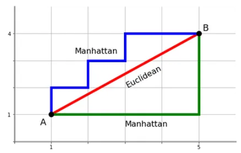

```{css, echo=FALSE}
/* CSS for floating TOC on the left side */
#TOC {
    position: fixed;
    left: 40px;
    width: 360px;
    height: fit-content;
    overflow-y: auto;
    padding-top: 20px;
    padding-bottom: 20px;
    background-color: #f9f9f9;
    border-right: 1px solid #ddd;
    margin-top: -10.5em;
}
.main-container {
  margin-left: 222px; /* Adjust this value to match the width of the TOC + some margin */
}
body{
    margin-top: 3em;
    margin-right: 50px;
    max-width: calc(100% - 600px);
}
p {
text-align: justify;
}
.plotly {
  margin: auto;
}
.caption {
  text-align: center;
}

g.legendlines {
display:none;
}

#summary-table{
  background-color: #FFFFFF;
  font-size: 17px;
}

#histograms{
  background-color: #FFFFFF;
  font-size: 17px;
}
#box-plots{
  background-color: #FFFFFF;
  font-size: 17px;
}
#correlation-plot{
  background-color: #FFFFFF;
  font-size: 17px;
}
#heatmaps-for-columns-1-to-17{
  background-color: #FFFFFF;
  font-size: 15px;
}
#heatmaps-for-columns-18-to-34{
  background-color: #FFFFFF;
  font-size: 15px;
}
#heatmaps-for-columns-35-to-50{
  background-color: #FFFFFF;
  font-size: 15px;
}
#hclust-plot{
  background-color: #FFFFFF;
  font-size: 15px;
}
#manual-plot{
  background-color: #FFFFFF;
  font-size: 15px;
}


li {
  padding-bottom: 5px;
}
ul {
  margin-bottom: 0px !important;
}
```


```{r, warning=FALSE,message=FALSE,include = FALSE}
list.of.packages <- c("dplyr","magrittr", "ggplot2", "kableExtra", "gridExtra","grid", "httr", "stats", "factoextra", "cluster", "rmarkdown","xfun", "NbClust","plotly", "tidyr","dendextend","jsonlite","progress","reticulate","knitr", "tools", "reactable")

new.packages <-
  list.of.packages[!(list.of.packages %in% installed.packages()[, "Package"])]
if (length(new.packages))
  install.packages(new.packages, dependencies = TRUE, verbose = FALSE, repos='https://cloud.r-project.org/')
invisible(lapply(list.of.packages, library, character.only = TRUE))

options(expressions = 10000)
global_var <- nzchar(Sys.getenv("RUN_VIGNETTE"))
global_var <- TRUE
scrolLimit <- function(noOfRows){
  if(noOfRows<10){
    swe = paste(as.character(noOfRows*50),"px")
  }
  else{
    swe = "400px"
   }
  return(swe)
}

set.seed(240)
```

# 1. Background

The HVT package is a collection of R functions to facilitate building <a href="https://link.springer.com/chapter/10.1007/1-84628-118-0_7" target="_blank">topology preserving maps</a> for rich multivariate data analysis. Tending towards a big data preponderance, a large number of rows. A collection of R functions for this typical workflow is organized below:

1.  **Data Compression**: Vector Quantization (VQ), HVQ (Hierarchical Vector Quantization) using means or medians. This step compresses the rows (long data frame) using a compression objective.

2.  **Data Projection**: Dimension projection of the compressed cells to 1D, 2D and Interactive surface plot with the Sammons Non-linear Algorithm. This step creates a topology preserving map (also called as <a href="https://en.wikipedia.org/wiki/Embedding" target="_blank"> mathematical embeddings</a>) coordinates into the desired output dimension.

3.  **Tessellation**: Create cells required for object visualization using the Voronoi Tessellation method, package includes heatmap plots for Hierarchical Voronoi Tessellations (HVT). This step enables data insights, visualization, and interaction with the topology preserving map. Useful for semi-supervised tasks.

4.  **Scoring**: Scoring data sets and recording their assignment using the map objects from the above steps, in a sequence of maps if required.

5. **Temporal Analysis and Visualization**: A Collection of functions that leverages the capacity of the HVT package by analyzing time series data for its underlying patterns, calculation of transitioning probabilities and the visualizations for the flow of data over time.

<span style="font-size: 22px;">**What's New?**</span>

- We are introducing a function named `clustHVT`, designed for hierarchical clustering analysis. This function integrates with the `NbClust` and `stats` packages to determine the optimal number of clusters (k). It performs AGNES clustering and generates an interactive 2D cluster plot by clustering cells at level/depth 1.

**Flow of `clustHVT`** 

- The function is applied to determine the optimal number of clusters for a dataset by evaluating 20 different default indices. It identifies the most appropriate k (optimal number of clusters) by exploring various combinations of cluster counts, distance measures, and clustering methods. 

- Based on user input, the function then performs hierarchical clustering using the AGNES (Agglomerative Nesting) technique, specifically employing the default ward.D2 method. The output includes a dendrogram for the specified number of clusters and a 2D cluster HVT plot which is interactive, allowing users to see the context of each cell when hovered over.

- This function is used in [section 8](#hierarchical-clustering) of this notebook.

**Limitation of `clustHVT`** 

- This function is only compatible with models trained at a depth of 1; it does not support cases where the hierarchy exceeds depth 1.


<span style="font-size: 22px;">**Abstract**</span>

- This notebook showcases the analysis and evaluation of <a href="https://thenewstack.io/the-building-blocks-of-llms-vectors-tokens-and-embeddings/?utm_referrer=https%3A%2F%2Fwww.google.com%2F" target="_blank">token embeddings</a> generated by **OpenAI** using the HVT package. It imports **1536-dimensional embedding data** produced by OpenAI's **text-embedding-ada-002** model from textual content.

- The HVT package is used to compress this data by constructing a model with `trainHVT`, enabling the projection of the compressed data in 2D using `plotHVT` and scoring each data point in the dataset with `scoreHVT` based on the trained model.

- A key visualization is the compressed 2D Heatmap generated from `scoreHVT`. This visualization helps to analyze the distribution and placement of cells, visually representing the clustering of textual data based on similarity, with contextually alike data grouped in the same cell.

- This notebook also includes two sections on Hierarchical Clustering. The former section analyze the Sammon's coordinates data (2D - x and y coordinates) of the centroids and the later section analyze Sammon's coordinates data (2D - x and y coordinates) with the embeddings (1536D) of the centroids.

- The optimal number of clusters (k) is determined using dendrogram plots from the `clustHVT` function. The clustered data are then sent to **OpenAI's gpt-3.5-turbo** via API call to generate domain names for each cluster. This domain name allocation process is also done manually.

- The 2D HVT plot is visualized with overlaid domain names of both OpenAI-generated and manually assigned for comparison. Conclusions are drawn regarding the HVT package's efficiency, the performance of Hierarchical Clustering method on two different datasets and insights are provided for domain names of both OpenAI generated and manually allotted.     


# 2. Experimental Setup 

**Objective**: To evaluate the effectiveness of the HVT package in compressing and visualizing high-dimensional LLM token embeddings while preserving the underlying structure and relationships between the embeddings.

**Hypothesis**: 

*Null Hypothesis (H0)*: 

- The HVT package cannot effectively compress high-dimensional LLM token embedding data and the projected token embeddings do not meaningfully represent contextual similarities and differences between tweets.

*Alternate Hypothesis (H1)*: 

- The HVT package can effectively compress high-dimensional LLM token embeddings data and the projected token embeddings meaningfully represent contextual similarities and differences between muPDNAs, with similar tweets converging into the same cells, and cells that are closer together representing similar tweet domains.

**Test Metrics**:

*Compression Ratio*:

- A higher compression ratio indicates that the method can significantly reduce the dimensionality of the data while potentially retaining important information. A compression percent of at least 80.

*Visual Similarity Evaluation*: 

- This metric evaluates the HVT package's ability to visually represent contextual similarities and differences between tweets through the generated heatmap visualization, where compressed and projected  token embeddings are displayed as cells with overlaid tweet content.


</br>

# 3. Notebook Requirements

## 3.1 Importing Code Modules

Here is the guide to install the HVT package. This helps the user to install the most recent version of the HVT package.
```{r}
###direct installation###
#install.packages("HVT")

#or

###git repo installation###
#library(devtools)
#devtools::install_github(repo = "Mu-Sigma/HVT")

```


**NOTE:** At the time documenting this vignette, the updated changes were not still in CRAN, hence we are sourcing the scripts from the R folder directly to the session environment.

```{r, loading all the script files of the package, message=FALSE, warning=FALSE, include = TRUE}
# Sourcing required code scripts for HVT
script_dir <- "../R"
r_files <- list.files(script_dir, pattern = "\\.R$", full.names = TRUE)
invisible(lapply(r_files, function(file) { source(file, echo = FALSE); }))
```

## 3.2 User-defined Functions

In this section, we are establishing all the functions that will be utilized in this notebook. The detailed explanation follows below:

### 1. Function for generating display table in this notebook

This is a function used to create tables to display dataframes in this notebook.
```{r}
Table <- function(data,scroll = F, limit = NULL){
  if(!is.null(limit)){
    data <- head(data,limit)}
kable_table <- data %>% kable(escape = F,align = "c") %>% kable_styling(bootstrap_options = c("striped", "hover", "responsive"))
if(scroll == T){
kable_table <- kable_table %>% scroll_box(width = "100%" , height = scrolLimit(nrow(data)))}
return(kable_table)}
```


### 2. Function to Merge and Slice the data

This function combines multiple CSV files (tweet csvs of each celebrities or influencers) in a directory to a single data frame, and slice the first 3 tweets per celebrity or influencer. It's used in [section 4](#dataset-understanding) as a first part of data processing.

```{r}
merge_and_slice_data <- function(directory,output_path, num_users = 915) {
  csv_files <- list.files(directory, pattern = "*.csv", full.names = TRUE)
    read_csv_with_filename <- function(file_path) {
    df <- read.csv(file_path)
    filename <- file_path_sans_ext(basename(file_path))
    df$source_file <- filename
    return(df)
  }
    combined_data <- csv_files %>% lapply(read_csv_with_filename) %>% bind_rows()
  
    user_names <- unique(combined_data$source_file)
    select_users <- sample(user_names, num_users)
    sliced_data <- combined_data %>% filter(source_file %in% select_users) %>% group_by(source_file) %>%
                   slice_head(n = 3) %>% ungroup()
  
    write.csv(sliced_data, output_path, row.names = FALSE)
}
```

### 3. Function to clean the twitter data

This is a python function used in **Twitter data processing notebook from  <a href="https://www.kaggle.com/code/ahmedshahriarsakib/twitter-celebrity-matcher-sbert-tweepy#4-Data-Preparation" target="_blank">kaggle</a>** to clean the data by removing the urls, retweet tags, convert the emoji to text and all the basic text cleaning process. It's used in [section 4](#dataset-understanding) as a second part of data processing.


```{python}
import demoji
import re
import ast
from typing import Union
import pandas as pd
from bs4 import BeautifulSoup

emoticon_data_path="./emoticon_dict.json"

class TwitterDataPrep:
    def __init__(self, emoticon_data_path=None):
        self.emoticons_dict = {}
        if emoticon_data_path:
            self.load_emoticons(emoticon_data_path)

    def load_emoticons(self, emoticon_data_path):
        """
        Load the emoticons dictionary from a JSON file.
        :param emoticon_data_path: Path to the emoticons JSON file.
        """
        import json
        with open(emoticon_data_path, 'r') as file:
            self.emoticons_dict = json.load(file)

    def clean_text(self, text: str) -> str:
       
        pat1 = r'@[^ ]+'  # remove username @
        pat2 = r'https?://[A-Za-z0-9./]+'  # remove urls
        pat3 = r'\'s'  # remove apostrophe
        pat4 = r'\#\w+'  # remove hashtag
        pat5 = r'&amp '  # remove unicode `&`
        pat7 = r'RT'  # remove RT / retweet
        pat8 = r'www\S+'  # remove link www
        combined_pat = r'|'.join((pat1, pat2, pat3, pat4, pat5, pat7, pat8))  # combine all patterns
        text = re.sub(combined_pat, "", text)
        text = re.sub(r'\s+', ' ', text)  # remove extra spaces
        return text.strip()

    def _parse_bytes(self, field: Union[str, ast.AST]) -> Union[str, ast.AST]:
      
        result = field
        try:
            result = ast.literal_eval(field)
        finally:
            return result.decode() if isinstance(result, bytes) else field

    def replace_emoticons(self, text: str) -> str:
      
        for emoticon, context in self.emoticons_dict.items():
            text = text.replace(emoticon, ' ' + context + ' ')
            text = re.sub(' +', ' ', text)
        return text

    def replace_emojis(self, text: str) -> str:
       
        for emoji, context in demoji.findall(text).items():
            text = text.replace(emoji, ' ' + context + ' ')
            text = re.sub(' +', ' ', text)
        return text

    def preprocess_data(self, df: pd.DataFrame) -> pd.DataFrame:
        
        df['tweet'] = df['tweet'].apply(self._parse_bytes)
        df['tweet'] = df['tweet'].str.normalize('NFKD')
        df['tweet'] = df['tweet'].map(self.clean_text)
        df['tweet'] = df['tweet'].apply(lambda x: self.replace_emoticons(x))
        df['tweet'] = df['tweet'].apply(lambda x: self.replace_emojis(x))
        return df

def preprocess_twitter_data(input_path: str = None, output_path: str = None, df: pd.DataFrame = None, emoticon_data_path: str = None):
  
    twitter_data_prep = TwitterDataPrep(emoticon_data_path=emoticon_data_path)
    
    if input_path:
        df = pd.read_csv(input_path)
    
    if df is not None:
        preprocessed_data = twitter_data_prep.preprocess_data(df)
        if output_path:
            preprocessed_data.to_csv(output_path, index=False)
        return preprocessed_data
    else:
        raise ValueError("'input_path' is not provided.")

```


### 4. Function for generating embeddings from textual data using OpenAI

This is the function used in [section 4](#dataset-understanding) to create embeddings from a textual tweets. This function uses **Open-AI's text-embedding-ada-002** model to create **1536 dimensional embedding space**. The output numerical embeddings data will be stored as a csv file in the given 'output_path' argument. 

```{r}
create_embeddings <- function(input_path, output_path, api_key = Sys.getenv("OPENAI_API_KEY"), batch_size = 100) {
  df <- read.csv(input_path)
  get_embeddings <- function(texts) {
    tryCatch({
      response <- POST(
        url = "https://api.openai.com/v1/embeddings",
        add_headers(
          "Authorization" = paste("Bearer", api_key),
          "Content-Type" = "application/json"
        ),
        body = toJSON(list(
          model = "text-embedding-ada-002",
          input = texts
        ), auto_unbox = TRUE),
        encode = "json"
      )
      stop_for_status(response)
      content <- content(response, "parsed")
      return(lapply(content$data, function(item) item$embedding))
    }, error = function(e) {
      message("Error getting embeddings: ", e$message)
      return(NULL)
    })
  }
  
  # Create a progress bar
  num_batches <- ceiling(nrow(df) / batch_size)
  pb <- progress_bar$new(total = num_batches, format = "[:bar] :percent :eta")
  
  # Process tweets in batches using lapply
  batch_indices <- split(seq_len(nrow(df)), ceiling(seq_len(nrow(df))/batch_size))
  embeddings <- lapply(batch_indices, function(indices) {
    batch_embeddings <- get_embeddings(df$tweets[indices])
    pb$tick()
    return(batch_embeddings)
  })
  
  # Flatten the list of embeddings
  embeddings <- unlist(embeddings, recursive = FALSE)
  
  # Remove NULL values and convert embeddings list to dataframe
  embeddings <- Filter(Negate(is.null), embeddings)
  embeddings_df <- do.call(rbind, embeddings) %>% as.data.frame()
  colnames(embeddings_df) <- paste0("E", 1:ncol(embeddings_df))
  result_df <- cbind(df, embeddings_df)
  result_df <- result_df %>% mutate(across(everything(), as.character))
  write.csv(result_df, output_path, row.names = FALSE)
  message("Embeddings created and saved successfully.")
}
```


### 5. Function for generating Heatmaps for each column of a dataset

This is the function used in [section 6.2](#visualizing-using-plothvt) to plot the Heatmaps from the columns 1 to 50 of the dataset.

```{r}
plot_columns <- function(dataset, no_of_cols, hvt.results) {
  cols_to_plot <- colnames(dataset)[no_of_cols]
  plots <- lapply(cols_to_plot, function(col_name) {
    print(plotHVT(hvt.results, hmap.cols = col_name, child.level = 1, 
                  plot.type = '2Dheatmap', centroid.size = 0.2))
  })
  invisible(plots)}
```

### 6. Function for writing clusters as .txt files

This is the function used in [section 8](#hierarchical-clustering) before making an API call for the cluster's data. This function takes the tweets from each cluster and write it as .txt file externally which is later read while making the API call. 

```{r}
create_and_write_clusters <- function(cluster_numbers, cluster_method) {
  cluster_list <- lapply(cluster_numbers, function(i) {
    subset(cluster_method$names.column, cluster_method$clusters == i)
  })
  invisible(list2env(setNames(cluster_list, paste0("clust_", cluster_numbers)), envir = .GlobalEnv))
  write_cluster_to_file <- function(cluster, cluster_name) {
    processed_text <- paste0("'", 
                             gsub("[[:punct:]]", "", paste(cluster, collapse = " ")),
                             "'")
    filename <- file.path("./twitter_data/",paste0(cluster_name, ".txt"))
    writeLines(processed_text, filename)
  }
  cluster_names <- paste0("clust_", cluster_numbers)
  invisible(lapply(cluster_names, function(name) {
    cluster_data <- get(name)
    write_cluster_to_file(cluster_data, name)
  }))}
```

### 7. Function for making OpenAI-API Call to generate domain names

This is the function used in [section 8](#hierarchical-clustering) that runs the chat completions API to **OpenAI's gpt-3.5-turbo model** where the content of each cluster is provided in the prompt, and the model is requested to generate a domain name for each cluster. This API call runs 10 iterations per cluster, to generate the domain names and provide the highly repeated value/domain name for that cluster.

```{r, collapse=TRUE}
get_mode <- function(v) {
  uniqv <- unique(v)
  uniqv[which.max(tabulate(match(v, uniqv)))]
}

get_cluster_domains <- function(k, iterations = 10) {
  url <- "http://172.25.1.85:31969/v1/chat/completions"
  read_file_content <- function(filename) {
 filepath <- file.path("./twitter_data/", filename)
     readLines(filepath, warn = FALSE)
 }
  
  cluster_names <- paste0("clust_", 1:k)
  content_list <- lapply(paste0(cluster_names, ".txt"), read_file_content)
  
  prompt <- "Suggest a single word/domain that best describes the topics in the following text. Your response should be just one word. This is for cluster {cluster_number}. Ensure that your suggestion is unique and not used for any other cluster. Previously used domains are: {used_domains}. Do not repeat any of these."
  
  send_request <- function(content, cluster_number, used_domains) {
    full_prompt <- gsub("\\{cluster_number\\}", cluster_number, prompt)
    full_prompt <- gsub("\\{used_domains\\}", paste(used_domains, collapse = ", "), full_prompt)
    full_content <- paste(full_prompt, content)
    
    request_body <- paste0('{
      "model": "gpt-3.5-turbo",
      "temperature":0,
      "messages": [
        {
          "role": "user",
          "content": "', full_content, '"
        }
      ]
    }')
    response <- POST(url,
                     body = request_body,
                     add_headers(.headers = c(
                       `Content-Type` = "application/json",
                       `Authorization` = "Bearer sk-musigma"
                     )),
                     content_type("application/json"))
    if (response$status_code == 200) {
      response_content <- content(response, as = "parsed")
      domain <- response_content$choices[[1]]$message$content
      domain
    } else {
      stop(paste("Error:", response$status_code, response$content))
    }
  }
  
  results <- matrix(nrow = iterations, ncol = k)
  colnames(results) <- paste0("Domain_name_for_cluster_", 1:k)
  
  results <- t(replicate(iterations, {
    used_domains <- character(0)
    unlist(lapply(seq_len(k), function(j) {
      domain <- send_request(content_list[[j]], j, used_domains)
      used_domains <<- c(used_domains, domain)
      domain
    }))
  }))
  
  results <- as.data.frame(results)
  colnames(results) <- paste0("Domain_name_for_cluster_", 1:k)  # Explicitly set column names

  mode_results <- sapply(results, get_mode)
  results <- rbind(results, Mode = mode_results)
  formatted_table <- Table(results, scroll = TRUE)
  return(list(raw_data = results, formatted_table = formatted_table, mode = mode_results))
}
```


# 4. Dataset Understanding

## 4.1 Dataset Sourcing

1) The textual corpus employed for generating the token embeddings in this notebook consists of tweets from top celebrities or Influencers on Twitter. This dataset is sourced from <a href="https://www.kaggle.com/datasets/ahmedshahriarsakib/top-1000-twitter-celebrity-tweets-embeddings" target="_blank">Kaggle</a>

2) The aforementioned link directs to Kaggle, where one can download a zip file containing individual CSV files of tweets from the top 915 celebrities. 

<span style="font-size: 15px;">**Why Twitter Dataset?**</span>

The Twitter dataset used in this notebook is accessible to public (open source) that ensures transparency and reproducibility. Each tweet represents a discrete data point with complete contextual meaning and the dataset comprises unadulterated content generated by a diverse global user base, minimizing bias and enhancing the generalizability of our findings. Twitter's platform, where users often share opinions on similar topics, presents an ideal scenario for evaluating the HVT package's claim of grouping similar data points within the same cell.


## 4.2 Dataset Cleaning

3) Using the [Function to Merge and Slice the data](#function-to-merge-and-slice-the-data) from section 3.2, all the csvs are collated to a single csv and first 3 tweets of all the celebrities or influencers are extracted. This approach aims to diversify the dataset by including more celebrities or influencers, thus ensuring a broader range of content instead of repetitive contextual tweets.

```{r, eval=FALSE}
merge_and_slice_data(directory = "./twitter_data/all_celebs_tweets_folder/" , output_path = "./twitter_data/sliced_data.csv")
```


4) All the selected data from above step is given as an input to the [Function to clean the twitter data](#function-to-clean-the-twitter-data) from section 3.2 where the removal of encoded texts, tags and emoji to text conversion takes place. Returned will be the cleaned texts. The source of this function which is written in python traces back to the <a href="https://www.kaggle.com/code/ahmedshahriarsakib/twitter-celebrity-matcher-sbert-tweepy#4-Data-Preparation" target="_blank">kaggle</a> twitter data processing notebook.


```{python}
preprocessed_data = preprocess_twitter_data( input_path='./twitter_data/sliced_data.csv',output_path='./twitter_data/cleaned_data.csv')
```


5) In the subsequent step, we **manually** removed rows/tweets that are not in English, contain only emojis, and are incomplete. Below is a table displaying the first 10 rows of the manually selected data which will be used to get the embeddings data.

```{r}
selected_csv <- read.csv("./twitter_data/selected_data.csv")
selected_csv <- selected_csv[,-1] #removing the s.no column
Table(selected_csv[1:10,])
```


</br>

## 4.3 Create Embeddings of the Dataset using OpenAI

6) The cleaned data is then transformed into token embeddings using **OpenAI's text-embedding-ada-002** model, which generates **1536-dimensional data**. 

7) The [Function for generating embeddings from textual data](#function-for-generating-embeddings-from-textual-data-using-openai) mentioned in section 3.2 follows all the below given steps for the process of converting textual data to numerical embeddings.

<span style="font-size: 15px;">**Steps of Embeddings Generation**</span>

**Step 1** Initialization and Data Loading:

The function starts by loading the input tweets dataset (.csv format) with the API key. (Users can store their API key in system environment and the same will be imported for the API call)

**Step 2** Embedding Generation via API:

A helper function `get_embeddings` is used to interact with OpenAI via embeddings API url to processes the input dataset in batches, handles API errors (if any) and stores the returned numerical embeddings.

**Step 3** Data Processing and Transformation:

Filters out any NULL responses from the API calls and converts the list of numerical embeddings into a dataframe corresponding to each tweet.

**Step 4** Result Compilation and Storage:

Writes the combined dataframe row-wise (tweets + embeddings) to a new CSV file at the specified output path.


```{r, eval=FALSE}
create_embeddings(input_path = "./twitter_data/selected_data.csv" output_path = "./twitter_data/final_embeddings.csv")
```

Here we load the generated embeddings dataset. Below is a table displaying the first 10 rows of the embeddings dataset generated from cleaned tweets.

```{r}
data <- read.csv("./twitter_data/final_embeddings.csv")
Table(data[1:10,], scroll = T)
```


</br>


## 4.4 Datasets for HVT Analysis

This section showcases two datasets that are subsequently utilized in this notebook within the functions of the HVT package.

```{r}
dataset_raw <- data[,-1] #removing the s.no column
dataset <- data[,-c(1:3)] #removing the categorical column
```

1) `dataset_raw` - The embeddings dataset with all the columns that includes both categorical and numerical.

```{r}
dim(dataset_raw)
```

The dimension of `dataset_raw` is 297 rows and 1538 columns (1536 numerical + 2 categorical columns).

Here we are displaying the `dataset_raw` with the first 10 rows and 1538 columns.
```{r}
Table(dataset_raw[1:10,], scroll = T)
```


2) `dataset` - The embeddings dataset with only numerical columns.

```{r}
dim(dataset)
```

The dimension of `dataset` is 297 rows and 1536 columns (only numerical).

Here we are displaying `dataset` with the first 10 rows and 1536 columns.
```{r}
Table(dataset[1:10,],scroll = T)
```


## 4.5 EDA Plots {.tabset}

This section displays four objects.

**Variable Histograms**: The histogram distribution of all the features in the dataset.

**Box Plots**: Box plots for all the features in the dataset. These plots will display the median and Interquartile range of each column at a panel level.

**Correlation Matrix**: This calculates the Pearson correlation which is a bivariate correlation value measuring the linear correlation between two numeric columns. The output plot is shown as a matrix.

**Summary EDA**: The table provides descriptive statistics for all the features in the dataset.

- *variable*: The features/columns of the dataset
- *min*: Minimum value of that feature/column
- *1st Quartile*: The value that splits the lower 25% of the data when arranged in ascending order
- *median*: Middle value in the ascendingly ordered dataset
- *mean*: Sum of all values in the dataset divided by the total number of values
- *sd*: Measure of the dispersion of dataset relative to its mean.
- *3rd Quartile*: The value that splits the lower 75% of the data when arranged in ascending order
- *max*:  Maximum value of that feature/column
- *hist*: The basic barchart of the data distribution of a feature/column
- *n_row*: Number of rows for that feature/column
- *n_missing*: Number of missing values/NAs for that feature/column

It uses an inbuilt function called `edaPlots` to display the above-mentioned four objects.

*NOTE: Here we have used the `dataset` object which has 297 rows and 1536 numerical columns. The input dataset should be a data frame object and the columns should be only numeric type. For demo purposes, we are plotting the EDA plots only for the first 10 columns except for the summary table which will be displayed for all columns.*


</br>

### Histograms 

```{r hist, figures-side, fig.show="hold", fig.height=2.2, fig.width =2.95, warning=FALSE, message=FALSE}
edaPlots(dataset, output_type = "histogram", n_cols = 10)
```


</br>


</br>

### Box Plots 

```{r boxx, figures-side, fig.show="hold",fig.height=2.2, fig.width = 2.95,warning=FALSE, message=FALSE}
edaPlots(dataset, output_type = "boxplot", n_cols = 10)
```


</br>


</br>

### Correlation Plot 

```{r corr, warning=FALSE, message=FALSE, fig.align='center', fig.height = 8, fig.width = 7}
edaPlots(dataset, output_type = "correlation",n_cols = 10)
```


</br>


</br>

### Summary Table 

```{r summary, figures-side, fig.show="hold", warning=FALSE, message=FALSE}
edaPlots(dataset, output_type = "summary", n_cols = 1536)
```

</br>


</br>

# 5. Model Training

The core function for compression in the workflow is `hvq` (hierarchical vector quantization), which is called within the `trainHVT` function. We have a parameter called 'quantization error'. This parameter acts as a threshold and determines the number of levels in the hierarchy. It means that, if there are 'n' number of levels in the hierarchy, then all the clusters formed till this level will have quantization error equal to or less than the threshold quantization error. The user can define the number of clusters in the first level of the hierarchy, and then each cluster in the upcoming levels is subdivided into the same number of clusters. This process continues for all the clusters until the threshold quantization error is met. The output of this technique will be hierarchically arranged vector quantized data.

## 5.1 Comprehending `trainHVT()` and its parameters

 
```{r trainHVT function, echo = TRUE, eval= FALSE}
trainHVT(
  dataset,min_compression_perc,n_cells,
  depth,quant.err,normalize,distance_metric,
  dim_reduction_method,error_metric,quant_method,
  scale_summary, diagnose, hvt_validation,
  train_validation_split_ratio
)
```

Each of the parameters of `trainHVT` function has been explained below:

* __`dataset`__ - A data frame, with numeric columns (features) that will be used for training the model.

* __`min_compression_perc`__ - An integer, indicating the minimum compression percentage to be achieved for the dataset. It indicates the desired level of reduction in dataset size compared to its original size. This parameter need not be called if n_cells are specified.

* __`n_cells`__  - An integer, indicating the number of cells per hierarchy (level). This parameter determines the granularity or level of detail in the hierarchical vector quantization.

* __`depth`__   - An integer, indicating the number of levels. A depth of 1 means no hierarchy (single level), while higher values indicate multiple levels (hierarchy).

* __`quant.err`__ - A number indicating the quantization error threshold. A cell will only break down into further cells if the quantization error of the cell is above the defined quantization error threshold.

* __`normalize`__	- A logical value indicating if the dataset should be normalized. When set to TRUE, scales the values of all features to have a mean of 0 and a standard deviation of 1 (Z-score). If FALSE, the dataset is used without scaling.

* __`distance_metric`__	- The distance metric can be `L1_Norm`(Manhattan) or `L2_Norm`(Euclidean). `L1_Norm` is selected by default. The distance metric is used to calculate the distance between a clustered datapoint point and a centroid. 

* __`error_metric`__ - The error metric can be `mean` or `max`. `max` is selected by default. `max` will return the max of `m` values and `mean` will take the mean of `m` values where each value is a distance between a point and centroid.

* __`dim_reduction_method`__ - The dimensionality reduction method to be chosen. options are 't-sne' , 'umap' & 'sammon'. Default is 'sammon'. 

* __`quant_method`__ - The quantization method can be `kmeans` or `kmedoids`. Kmeans uses means (centroids) as cluster centers, while Kmedoids uses actual data points (medoids) as cluster centers. `kmeans` is selected by default.
    
* __`scale_summary`__ -  A list with user-defined mean and standard deviation values for all the features in the dataset. Pass the scale summary when normalize is set to FALSE.

* __`diagnose`__ - A logical value indicating whether the user wants to perform diagnostics on the model. Default value is FALSE. 

* __`hvt_validation`__ - A logical value indicating whether the user wants to hold out a validation set and find the Mean Absolute Deviation of the validation points from the centroid. Default value is FALSE.

* __`train_validation_split_ratio`__ - A numeric value indicating train validation split ratio. This argument is only used when `hvt_validation` has been set to TRUE. Default value for the argument is 0.8

The output of the trainHVT function (list of 7 elements) has been explained below, with an image attached for clear understanding.


</br>
**NOTE: Here the attached 'Figure:2' is the example snapshot of the output list generated from trainHVT()**

```{r trainhvt list,echo=FALSE,warning=FALSE,fig.show='hold',message=FALSE,fig.cap='Figure 2: The Output list generated by trainHVT function.',out.width="50%",out.height = "40%",fig.align='center'}
knitr::include_graphics('./pngs/hvt_result_diag.png')
```

* The '1st element' is a list containing information related to plotting tessellations. This information includes coordinates, boundaries, and other details necessary for visualizing the tessellations.

* The '2nd element' is a list containing information related to Sammon's projection coordinates of the data points in the reduced-dimensional space.

* The '3rd element'  is a list containing detailed information about the hierarchical vector quantized data along with a summary section containing no. of points, quantization error and the centroids for each cell in 2D.

* The '4th element'  is a list that contains all the diagnostic plots of the model when `diagnose` is set to TRUE. Otherwise NA.

* The '5th element' is a list that contains all the information required to generate a Mean Absolute Deviation (MAD) plot, if hvt_validation is set to TRUE. Otherwise NA. 

* The '6th element'  is a list containing detailed information about the hierarchical vector quantized data along with a summary section containing no. of points, quantization error and the centroids for each cell in 1D, which is the output of `hvq`.

* The '7th element' (model info) is a list that contains model generated time, input parameters passed to the model, validation results and the dimensionality reduction metrics table.

We will use the `trainHVT` function to compress our data while preserving essential features of the dataset. Our goal is to achieve data compression to at least `80%`. In situations where the compression ratio does not meet the desired target, we can explore adjusting the model parameters as a potential solution. This involves making modifications to parameters such as the quantization error threshold or increasing the number of cells, and then rerunning the trainHVT function.


### 5.1.1 Selection Criteria of `distance_metric`

```{r distance list,echo=FALSE,warning=FALSE,fig.show='hold',message=FALSE,fig.cap='Figure 3: Pictorial representation of Euclidean and Manhattan distance. [img source](https://www.omnicalculator.com/math/manhattan-distance)', out.width="50%",out.height = "40%", fig.align='center'}

```

**Euclidean Distance:**
The Euclidean distance is the root of the squared sum of the differences between the coordinates of two points. It is the geometric straight-line distance between points in a continuous vector space, as denoted by the red line in the above 'Figure:3'. Euclidean distance is well-suited for applications where the data distribution exhibits spherical or ellipsoidal patterns, as it accurately models the physical distance in these domains.

**Manhattan Distance:**
The Manhattan distance, is the sum of the absolute differences between the coordinates of two points. It measures the distance between points along each dimension or axis, as denoted by the blue and green lines in the above 'Figure:3'. The Manhattan distance is particularly useful when the underlying space is constrained to a grid-like structure, as it models the distance traveled along the axes rather than the straight-line path.

*Distance Metric Selection:*

- The choice of distance metric depends on the underlying structure of the dataset and the specific application requirements. 


- In high-dimensional spaces, such as those encountered in natural language processing tasks involving LLM token embeddings, the Manhattan distance is often preferred over the Euclidean distance. This preference arises due to the "curse of dimensionality," where the Euclidean distance becomes increasingly concentrated/lower, leading to a loss of meaning as the dimensionality increases. The Manhattan distance, by summing the absolute differences along each dimension, retains its ability to capture dissimilarities between points in high-dimensional spaces.

- Additionally, the grid-like structure inherent in high-dimensional data aligns well with the Manhattan distance's component-wise calculation approach. This structural alignment allows the Manhattan distance to effectively capture the differences between data points based on their individual feature values or dimensions, which is particularly beneficial in applications like text analysis or document similarity.


- In low-dimensional spaces and applications where the data distribution is continuous, the Euclidean distance is often preferred. Its geometric interpretation as the straight-line distance between points aligns well with physical spaces and continuous data distributions, making it a natural choice in domains such as spatial data analysis and clustering algorithms where the underlying relationships between data points are better represented by the Euclidean metric.

- In summary, the selection of the appropriate distance metric is contingent upon the dimensionality of the data, the underlying data distribution and the geometric constraints of the problem domain.

### 5.1.2 Selection Criteria of `error_metric`

The error metric can be `mean` or `max`. For a specified number of cells, each cell will contain `n` data points. The centroid of each cell is computed as the mean of these `n` points. For each data point, the distance to the centroid is calculated using a chosen distance metric, resulting in `n` distances. The error metric for the cell is then determined based on these distances. 

- *mean*:  If the `mean` is used as the input, the error metric or quantization error for the cell is the mean of the `n` distances.

- *max*: If the `max` is used as the input, the error metric or quantization error for the cell is the maximum value of the `n` distances.

## 5.2 Model Training using `trainHVT()`

<span style="font-size: 18px;">**Input Parameters**</span>

- Dataset = `dataset` (The processed dataset with 297 rows and 1536 columns)
- Number of cells = 110
- Quantization Error = 0.6
- Distance Metric = Manhattan/L1 Norm
- Error Metric = Mean
- Normalize = TRUE (Z-score)
- Quantization Method = Kmeans
- Dimensionality Reduction method = Sammons


```{r sammons, warning=FALSE, message=FALSE, results='hide'}
hvt.results <- trainHVT(dataset, n_cells = 110, depth = 1, quant.err = 0.6, 
                        distance_metric = "L1_Norm", error_metric = "mean",
                        normalize = TRUE, quant_method="kmeans", dim_reduction_method = "sammon")
```

Let's look at the **summary** table. 
```{r}
displayTable(data = hvt.results[[3]]$compression_summary,
             columnName = 'percentOfCellsBelowQuantizationErrorThreshold', 
             value = 0.8, tableType = "compression", scroll = T)
```

*NOTE: Based on the above table, the value of 'percentOfCellsBelowQuantizationErrorThreshold' indicates that 85% of compression has taken place for the specified number of cells (110) and the quantization error (0.6)*

Lets look at the dimensionality reduction evaluation metrics.


```{r}
displayTable(data= hvt.results$model_info$distance_measures, tableType = 'metrics')
```

According to the values above we can conclude that the model has achieved a good balance between preserving the local neighborhood relationships, global structure, and pairwise distances in the low-dimensional embedding, with moderate reconstruction accuracy and cluster separation. 

</br>

# 6. Visualization

This section focuses on projecting the plots that used Sammon's dimensionality reduction algorithm to compress the dataset from higher to lower dimensions.

## 6.1 Comprehending `plotHVT()` and its parameters

```{r plotHVT function,echo = TRUE, eval= FALSE}
plotHVT <-(hvt.results, line.width, color.vec, pch1, centroid.size ,
           title, maxDepth, child.level, hmap.cols, cell_id,
           quant.error.hmap, n_cells.hmap,
           label.size , sepration_width, layer_opacity,
           dim_size, plot.type) 
```

* __`hvt.results`__ - (1D/2Dproj/2Dhvt/2Dheatmap/surface_plot)  A list obtained from the trainHVT function. This list provides an overview of the hierarchical vector quantized data, including diagnostics, tessellation details, Sammon's projection coordinates, and model input information.

* __`line.width`__	- (2Dhvt/2Dheatmap) A vector indicating the line widths of the tessellation boundaries for each layer.

* __`color.vec`__	- (2Dhvt/2Dheatmap) A vector indicating the colors of the tessellation boundaries at each layer.

* __`pch1`__	- (2Dhvt/2Dheatmap) Symbol. It plots the centroids with a particular symbol such as (solid circle, bullet, filled square, filled diamond) in the tessellations. Default is 21 (a filled circle).

* __`centroid.size`__	- (2Dhvt/2Dheatmap) Size of centroids for each level of tessellations. Default is 1.5

* __`title`__	-  (2Dhvt) Set a title for the plot. Default is NULL.

* __`maxDepth`__ -  (2Dhvt) An integer indicating the number of levels.

* __`cell_id`__ - (2Dhvt/2Dheatmap) Logical. To indicate whether the plot should have Cell IDs or not, for level 1. Default is FALSE.

* __`child.level`__ - (2Dheatmap/surface_plot) A Number indicating the level for which the heat map is to be plotted. Default is 1

* __`hmap.cols`__ - (2Dheatmap/surface_plot) A Character for which the heat map is to be plotted. Accepted entries ('Segment.Level', 'Segment.Parent', 'Segment.Child', 'n', 'Quant.Error', 'Cell.ID' and the column names of dataset)

* __`label.size`__ - (2Dheatmap) The size by which the tessellation labels should
be scaled. Default is 0.5

* __`quant.error.hmap`__ - (2Dheatmap) A number indicating the quantization error threshold.

* __`n_cells.hmap`__ - (2Dheatmap) An integer indicating the number of cells/clusters per hierarchy 

* __`sepration_width`__ - (surface_plot) An integer indicating the width between two levels.

* __`layer_opacity`__ - (surface_plot) A vector indicating the opacity of each layer/level.

* __`dim_size`__ - (surface_plot) An integer indicating the dimension size used to create the matrix for the plot.

* __`plot.type`__ -  A Character indicating which type of plot should be generated. Accepted entries are '1D', '2Dproj', '2Dhvt', '2Dheatmap' & 'surface_plot'. Default value is '2Dhvt'.


## 6.2 Visualizing using `plotHVT()`

### 6.2.1 plotHVT - 1D

<span style="font-size: 18px;">**Input parameters**</span>

- hvt.results = `trainHVT()` results 
- plot.type = 1D plot

```{r , warning=FALSE,message=FALSE,out.width="720px",out.height = "480px",fig.align = "center"}
plotHVT(hvt.results,plot.type  = '1D')
```

### 6.2.2 plotHVT - 2D Projection

<span style="font-size: 18px;">**Input parameters**</span>

- hvt.results = `trainHVT()` results 
- plot.type =  2D projection plot

```{r,fig.align = "center", fig.width=7.5, fig.height = 5}
plotHVT(hvt.results, plot.type = '2Dproj')
```

### 6.2.3 plotHVT - 2D HVT

<span style="font-size: 18px;">**Input parameters**</span>

- hvt.results = `trainHVT()` results 
- plot.type = 2D Hierarchical voronoi tessellation plot
- cell_id = TRUE (to display the cell id's in plot)

```{r , warning=FALSE,message=FALSE, fig.width=7.5, fig.height = 5,fig.align = "center"}
plotHVT(hvt.results, plot.type  = '2Dhvt', cell_id = TRUE)
```


### 6.2.4 plotHVT - 2D HEATMAP 

<span style="font-size: 18px;">**Input parameters**</span>

- hvt.results = `trainHVT()` results 
- plot.type = 2D Heatmap
- hmap.cols = 'n' (The no.of.entities/datapoints in each cell based on which the color gradient will be filled)


```{r , warning=FALSE,message=FALSE, fig.width=7.5, fig.height = 5,fig.align = "center"}
plotHVT(hvt.results,  hmap.cols = "n", plot.type  = '2Dheatmap', cell_id = TRUE)
```


</br>


#### Heatmaps for the columns {.tabset}

*NOTE: We have 1536 columns displaying all of them will blow up the notebook hence we are displaying the Heatmaps for only the first 50 columns*

The [Function for generating Heatmaps for each column of a dataset](#function-for-generating-heatmaps-for-each-column-of-a-dataset) from section 3.2 is used to generate the below Heatmaps.

##### Heatmaps for columns 1 to 17

<span style="font-size: 18px;">**Input parameters**</span>

- dataset = The `dataset` with 297 rows and 1536 numerical columns
- no_of_cols = the columns to be plotted[from 1 to 17]
- hvt.results = `trainHVT()` results 

```{r tabset1, figures-side, fig.show="hold", fig.height=2, fig.width =3.1, warning=FALSE}
no_of_cols <- 1:17
plot_columns(dataset, no_of_cols, hvt.results)
```


##### Heatmaps for columns 18 to 34

<span style="font-size: 18px;">**Input parameters**</span>

- dataset = The `dataset` with 297 rows and 1536 numerical columns
- no_of_cols = the columns to be plotted[from 18 to 34]
- hvt.results = `trainHVT()` results 

```{r tabset2, figures-side, fig.show="hold",  fig.height=2, fig.width =3.1, warning=FALSE}
no_of_cols <- 18:34
plot_columns(dataset, no_of_cols, hvt.results)
```


##### Heatmaps for columns 35 to 50

<span style="font-size: 18px;">**Input parameters**</span>

- dataset = The `dataset` with 297 rows and 1536 numerical columns
- no_of_cols = the columns to be plotted[from 35 to 50]
- hvt.results = `trainHVT()` results 

```{r tabset3, figures-side, fig.show="hold",  fig.height=2, fig.width =3.1, warning=FALSE}
no_of_cols <- 35:50
plot_columns(dataset, no_of_cols, hvt.results)
```

### 6.2.5 plotHVT - 2D Interactive surface plot

<span style="font-size: 18px;">**Input parameters**</span>

- hvt.results = `trainHVT()` results 
- plot.type = Interactive surface plot 
- hmap.cols = 'n' (The no.of.entities/datapoints in each cell based on which the color gradient will be filled)

```{r , warning=FALSE,message=FALSE,out.width="60%",out.height = "40%",fig.align = "center"}
plotHVT(hvt.results, hmap.cols = "n", plot.type  = 'surface_plot')
```


# 7. Scoring

Once the model is built, the next step is to score each data point in the dataset, assigning it to a specific cell within the model using the `scoreHVT` function. This section of the vignette will elucidate how the dataset and the results from model training are utilized to determine the cell assignment of each data point of scoring dataset, identify anomalies, and calculate quantization errors.

Moreover, we will delve into the visualization plots that offer a comprehensive view of the contents within each cell, including the number of data points and their distribution. These insights are crucial for understanding the model's structure and evaluating its performance in capturing the underlying patterns of the high-dimensional LLM token embeddings.

## 7.1 Comprehending `scoreHVT()` and its parameters

```{r scoreHVT function1,echo = TRUE, eval= FALSE}
scoreHVT(dataset, hvt.results.model, child.level, mad.threshold, line.width, 
         color.vec, normalize, yVar, distance_metric, error_metric, 
         analysis.plots, names.column)
```

The parameters are explained below:

* __`dataset`__ - A data frame, with numeric columns (features) that will be used for scoring the model. The columns of dataset should remain the same as used in trainHVT.

* __`hvt.results.model`__ - A list obtained from the `trainHVT` function while performing hierarchical vector quantization on data.

* __`child.level`__ - A number indicating the depth for which the heat map is to be plotted. Each depth represents a different level of clustering or partitioning of the data.

* __`mad.threshold`__  - A numeric value indicating the permissible Mean Absolute Deviation which is obtained from Minimum Intra centroid plot(when `diagnose` is set to TRUE in `trainHVT`). Default value is 0.2

* __`line.width`__	- A vector indicating the line widths of the tessellation boundaries for each layer. (Optional Parameter)

* __`color.vec`__	- A vector indicating the colors of the tessellations boundaries at each layer. (Optional Parameter)

* __`normalize`__ - A logical value indicating if the dataset should be normalized. Default is TRUE.

* __`yVar`__ - A character or a vector representing the name of the dependent variable(s)

* __`distance_metric`__ - The distance metric can be `L1_Norm`(Manhattan) or `L2_Norm`(Euclidean). The metric is used when calculating the distance between each data point with the centroids obtained from results of `trainHVT`. Default is `L1_Norm`.

* __`error_metric`__ - The error metric can be `mean` or `max`.  `max` will return the max of `m` values and `mean` will take mean of `m` values where each value is a distance between the datapoint and centroid of the cell. This helps in calculating the scored quantization error. Default value is `max`.

* __`analysis.plots`__ - A logical value to indicate whether to include the domain plots which are useful in viewing the contents and clusters of cells. Default is FALSE.

* __`names.column`__ - The column of names of the datapoints which will be displayed as the contents of the cell in 'scoredPlotly'. Default is NULL.


## 7.2 Model Scoring using `scoreHVT()`

<span style="font-size: 18px;">**Input Parameters**</span>


- `dataset_raw` = The uploaded raw dataset with 297 rows and 1538 columns (1536 numerical + 2 categorical) (Only the numerical columns get scored the categorical columns works as Identifier variables in scored plot)

- hvt.results = `trainHVT()` results 

- mad.threshold = 0.7 (`mad.threshold` value can be obtained from Minimum Intra centroid plot from the results of `trainHVT()` and  it is important since it is used in anomaly detection. For a given datapoint, when the quantization error is above `mad.threshold` value it is denoted as an anomaly else not. Such Anomaly can be seen if the `mad.threshold` is set below 0.7 in this section.) 

- normalize = T (`normalize` When set to TRUE, the dataset is Z-score standardized. When set to FALSE, the `data` is used as such without any changes.)
 
 
- analysis.plots  = TRUE (To include the scoredPlotly which will be seen later in this vignette)

- names.column = dataset_raw[,1] (The column of names/representations of the corresponding row's embedding i.e., tweets)


```{r, warning=FALSE, message=FALSE,}
scoring <- scoreHVT(dataset_raw, hvt.results, mad.threshold = 0.7,normalize = T,
                    analysis.plots  = TRUE,names.column = dataset_raw[,1])
```

Let's look at the **scored model summary**.

The model info displays five attributes which are explained below:

- **input_dataset**: Dimension of the dataset that is used in scoring.

- **scored_qe_range**: The range of 'Quantization Error' after scoring all the data points of the given dataset. (from minimum to maximum) 

- **mad.threshold**: The value of Mean Absolute Deviation(MAD) Threshold.

- **no_of_anomaly_datapoints**: The value of how many data points are anomalous. If the quantization error of a data point is greater than the 'mad.threshold', then it is considered as anomaly.

- **no_of_anomaly_cells**: The value of how much cells have anomaly. If a cell has even 1 anomalous data point, the cell will be considered as anomaly_cell.
```{r}
scoring$model_info$scored_model_summary
```

Let's look at the dimensions of scored table.. 

```{r}
dim(scoring$scoredPredictedData)
```

It has 297 rows and 1545 columns (standard output 9 columns + 1536 input dataset columns)

Below are the newly added 9 columns after scoring using `scoreHVT`

- **Segment Level**: The tier or depth of a segment in the hierarchical structure.

- **Segment Parent**: The ID of the larger segment that this segment is part of in the level above.

- **Segment Child**: The IDs of smaller segments that are contained within this segment in the level below.

- **n**: The number of entities/data points from the uploaded dataset that are present inside that Segment child.

- **Cell.ID**: The ID of the child which is the result of 1D Sammons.

- **Quant.Error**: The quantization error of that cell that results from the distance calculation.

- **centroidRadius**: The maximum quantization error values as radius for anomalies.

- **diff**: The difference between centroidRadius and Quant.Error.

- **anomalyFlag**: The binary value that says the cell is an anomaly or not. (if the Quant.Error is greater than mad.threshold then it is = 1 (anomaly) else = 0(not an anomaly))
 

Let's look at the scored data table. For the sake of brevity we are displaying the first 10 rows and all the 1545 columns.
```{r}
Act_pred_Table <- scoring[["scoredPredictedData"]]
rownames(Act_pred_Table) <- NULL
Act_pred_Table[1:10,]  %>%as.data.frame() %>%Table(scroll = TRUE) 
```


</br>

### 7.2.1 Scored Plot

Let's look at the **'scoredPlotly' which visualizes the 2D Heatmap, hover on it will display the no. of observations and the tweets in a cell with its cell ID**.


```{r, warning=FALSE,message=FALSE,out.width="720px",out.height = "480px",fig.align = "center"}
scoring$scoredPlotly
```

This plot visualizes a 2D Heatmap using a Voronoi diagram where each region represents a cell and the color intensity indicates the number of tweets within that cell. The color scale on the right shows the range of observations, with darker colors representing fewer observations and lighter colors indicating higher observations.

**Key observations:**

*Central Density*: The central region exhibits a higher density of observations, marked by lighter colors, implying more tweets.

*Peripheral Sparsity*: The outer regions are predominantly darker, signifying fewer observations.

*Cell Specifics*: Hovering over a cell, as demonstrated, reveals detailed information such as Cell ID, number of observations, and tweets. 


</br>


# 8. Hierarchical Clustering 

- Hierarchical Clustering helps us understand the relationships between different concepts or themes in data by showing how they group together at various levels. It also helps in the validation of effectiveness of the Hierarchical Voronoi Tessellation (HVT) approach in preserving topology structures of the data.

- Hierarchical clustering enables the exploration of various clusters (k) by slicing the dendrogram at different levels. It is performed in two different datasets in this section.
    1. **Sammon's coordinates data (2D - x and y coordinates) of the centroids of 110 cells** 
    2. **Sammon's coordinates data (2D - x and y coordinates) with the embeddings (1536D) of the centroids of 110 cells**

- This approach of two different dataset allows for comparison between clustering results based on the reduced 2D representation and the high-dimensional data (1536D) which retains all the nuanced information from the original embeddings, along with 2D representation, helping to understand how much information is preserved or lost in the dimensionality reduction process.

- Using both dataset helps in assessing the robustness of the clustering results. Comparison of clustering quality can be done by calculating the Average Silhouette Width (ASW). This assessment of performing two different datasets helps in finding whether the 2D projection is sufficient for forming meaningful clustering, or if the additional dimensionality provides significant improvements.

## 8.1 Comprehending `clustHVT` and its parameters

In this section, we will explore the newly added `clustHVT` function in the HVT package.

Let's look at the function parameters.

```{r, eval=FALSE}
clustHVT(data,
         trainHVT_results,
         scoreHVT_results,
         indices,
         clustering_method,
         clusters_k)
```

Each of the parameters of `clustHVT` function has been explained below:

* __`data`__ - A data frame intended for performing hierarchical clustering analysis.

* __`trainHVT_results`__ - A list object which is obtained as a result of `trainHVT` function.

* __`scoreHVT_results`__  - A list object which is obtained as a result of `scoreHVT` function.

* __`clusters_k`__   - A parameter that specifies the number of clusters for the provided data. The options include "champion," "challenger," or any integer between 1 and 20. Selecting "champion" will use the highest number of clusters recommended by the 'NbClust' function, while "challenger" will use the second-highest recommendation. If a numerical value from 1 to 20 is provided, that exact number will be used as the number of clusters.

The Hyperparameters of `NbClust`& `hclust` functions which are used in `clustHVT` function has been explained below:

* __`indices`__  - The indices used for determining the optimal number of clusters in `NbClust` function. By default it uses 20 different indices ("kl", "ch", "hartigan", "cindex", "db", "silhouette", "ratkowsky", "ball","hubert","dindex","ptbiserial", "gap", "frey", "mcclain", "gamma", "gplus", "tau", "dunn", "sdindex", "sdbw") It is suggested to tailor the indices based on the dataset provided.

* __`clustering_method`__  - The method used for clustering in both `NbClust` and `hclust` function. Defaults to 'ward.D2'.

For more information, visit <a href="https://www.rdocumentation.org/packages/NbClust/versions/3.0.1/topics/NbClust" target="_blank">here</a>. 

Let's look at the output list from `clustHVT` function.

1) **Optimal number of clusters summary:** The output of the NbClust function comprises four plots, two corresponding to the D index and Hubert index, respectively. It also includes an interpretation of these indices, a summary table displaying the number of clusters recommended by all indices, and a conclusion table providing a comprehensive breakdown of the cluster suggestions across each index.

2) **Dendogram plot:** A dendrogram plot is a tree-like diagram that visually depicts the hierarchical relationships among clusters, with branch heights reflecting similarity or dissimilarity, and is used to determine the number of clusters through size-based visual comparison.

3) **Cluster HVT plot:** A 2D HVT Plotly visualization that colors cells according to clusters derived from AGNES clustering results. It is interactive, allowing users to view cell contents by hovering over them.

## 8.2 `hclust` on 2D data

In this section, we are performing Hierarchical Clustering (`hclust`) on 2D dataset.

### 8.2.1 About dataset

In this section, we are using Sammon's coordinates data which is 2 Dimensional (x and y coordinates) of the centroids of 110 cells is taken for the analysis.

```{r ,message=FALSE, warning=FALSE}
centroid_data <- scoring$centroidData
hclust_data_1 <- centroid_data[,2:3]
```

```{r}
dim(hclust_data_1)
```

The data has 110 rows and 2 columns (x and y coordinates). Let's have a look at the data.

```{r}
Table(hclust_data_1, scroll = T)
```

### 8.2.2 Clustering Analysis

In this section, we will use `clustHVT` function to conduct clustering analysis. Let's look at the `NbClust` function's output for determining the number of optimal clusters for the dataset. 

```{r, warning=FALSE,message=FALSE,fig.align = "center",fig.width= 9, fig.height=5}
clust.results <- clustHVT(data = hclust_data_1, 
                          trainHVT_results = hvt.results,
                          scoreHVT_results = scoring, 
                          clusters_k = 'champion')
```

From the above results, we can clearly see that highest recommendation is *3* as the optimal number of clusters. Let's look at the dendogram plot for the same.

```{r, fig.width=13.5, fig.height = 6,fig.align = "center"}
clust.results$dendogram()
```

Though the highest recommendation is 3, the corresponding dendogram results in large clusters. However, for our specific use case, we prefer to have smaller clusters. So we will select the next highest recommendation from the NbClust summary. With 5 indices supporting this choice, we will proceed with 'challenger' to achieve a more granular clustering solution.

```{r, results='hide', message=FALSE, warning=FALSE, fig.show='hide'}
clust.results <- clustHVT(data = hclust_data_1, 
              trainHVT_results = hvt.results,
              scoreHVT_results = scoring, 
              clusters_k = 'challenger')
```
Let's look at the dendogram for challenger number of clusters.

```{r, fig.width=13.5, fig.height = 6,fig.align = "center"}
clust.results$dendogram()
```

Let's look at the Cluster HVT plot for the 15 clusters.

```{r, message=FALSE, warning=FALSE, fig.width=8, fig.height = 5,fig.align = "center"}
clust.results$clusterplot
```


### 8.2.3 OpenAI API call for generating domain names

- Now, we will pass all the data from each cluster to **OpenAI's gpt-3.5-turbo** model to generate a keyword/domain name of that particular cluster.

- Subsetting the data in each cluster by the below code and processing it without punctuation marks to be given as input to API call. Data from each cluster will be saved as a .txt file and the files will be read during the API call.

- Let's call the [Function for writing clusters as .txt files](#function-for-writing-clusters-as-.txt-files) which is explained in section 3.2 for this process.

```{r}
create_and_write_clusters(cluster_numbers = 1:15, cluster_method = cluster_data)
```

- The below chunk makes a call to **OpenAI's gpt-3.5-Turbo** via chat completions API and print the responses for clusters below. 

- Let's call the [Function for making OpenAI-API Call to generate domain names](#function-for-making-openai-api-call-to-generate-domain-names) which is explained in section 3.2. This function makes 10 API calls for each cluster and prints all 10 responses. The domain name that appears most frequently is selected as the domain name for that cluster.

```{r}
result <- get_cluster_domains(15)
result$formatted_table
print(result$mode)
```


Let's replace the cluster numbers to above generated `domain names` in the dataset.

```{r}
invisible(lapply(1:15, function(i) {
  cluster_data$cluster_name[cluster_data$clusters == i] <<- result$mode[[i]]}))
```


### 8.2.4 Cluster Domain Naming: OpenAI vs Manual Approach

In this section, we will generate the Heatmaps of OpenAI and Manual Approach for the Sammon’s coordinates (2D - x and y coordinates) of the centroids of 110 cells.

**OpenAI Approach**

- The `OpenAI Approach` is a 2D Heatmap where colors represent different domains assigned to the clusters. These domain names are generated using **OpenAI’s GPT-3.5-turbo via the chat completions API**. Tweets from each cluster are provided as input, along with a system prompt requesting domain names that accurately reflect the context of the data. To ensure consistent results, this process is repeated 10 times for each cluster, and the most frequently occurring name is selected as the domain name for that cluster.

```{r,message=FALSE, warning=FALSE, fig.width=8.8, fig.height = 5,fig.align = "center"}
centroid_cluster_data <- cluster_data %>% dplyr::select('Cell.ID', 'cluster_name','names.column')
hclust_plot_1 <- clusterPlot(dataset = centroid_cluster_data, hvt.results = hvt.results, domains.column = "cluster_name")
```

**Manual Approach**

- The `Manual Approach` is a 2D Heatmap, features colors representing domains assigned to clusters, but in this case, the domain names are determined **manually**. This involves a detailed examination of the tweets within each cluster, allowing for a more nuanced assignment of domain names based on **Human interpretation and context**.

```{r, eval=FALSE}
clust_1 <- subset(cluster_data$names.column, cluster_data$clusters == 1)
```

```{r}
cluster_names <- c("Activism *", "Engagement *", "Perspectives *", 
                   "Upcoming Shows *", "Social Ideology *", "Heartwarming *", 
                   "Excitement *", "Television Media *", "Governance *", 
                   "Exhilaration *", "Media Posts *", "Gratitude *", 
                   "Appreciation *", "Promotion *", "Wishes *")

cluster_data$cluster_name <- cluster_names[cluster_data$clusters]
```


```{r,message=FALSE, warning=FALSE, fig.width=8.8, fig.height = 5,fig.align = "center"}
centroid_cluster_data <- cluster_data %>% dplyr::select('Cell.ID', 'cluster_name','names.column')
manual_plot_1 <-clusterPlot(dataset = centroid_cluster_data, hvt.results = hvt.results, domains.column = "cluster_name")
```

### 8.2.5 Visualization of plots: OpenAI vs Manual Approach

In this section, we are visualizing the plots of both OpenAI where the domain names are generated by OpenAI via API call and the Manual where the domain names are manually read and assigned.

```{r,fig.width=12, fig.height = 5,fig.align = "center"}
plotly::subplot(hclust_plot_1, manual_plot_1) %>%
plotly::layout(annotations = list(
      list(x = 0.15, y = 1.05, text = "OpenAI Approach", showarrow = F, xref='paper',yref='paper', width = 150),
      list(x = 0.9, y = 1.05, text = "Manual Approach", showarrow = F, xref='paper', yref='paper', width = 165))) 
```
<em>(*) Manually assigned domain names (to differentiate the domain names from OpenAI generated)</em>


**Inference**

- A visual comparison between the plots of *OpenAI Approach* and the *Manual Approach* indicates that the domain names assigned to clusters exhibit complete uniqueness across both methods. 

- The labeling methodology utilized by OpenAI largely depends on the content of a restricted sample of tweets, generally one or two per cluster. For example, the 'sports' domain in the OpenAI plot is represented by only a single tweet pertaining to sports, whereas the majority of the remaining tweets discuss media shows. This distinction was more accurately captured by the Manual Approach, which categorized it as 'Television Media'.


### 8.2.6 Calculation of Average Silhouette Width(ASW)

- The Average Silhouette Width (ASW) is a measure to evaluate the quality of clusters in a clustering analysis. It assess how similar each point in a cluster is to other points in the same cluster compared to points in different clusters. Higher ASW indicates better-defined and more separated clusters.

```{r}
ward_sil <- silhouette(clusters, dist(hclust_data_1))
ward_asw <- round(mean(ward_sil[, "sil_width"]), digits = 2)
print(ward_asw)
```


- **For Sammon's coordinates data (2D - x and y coordinates) of the centroids of 110 cells, the ASW for ward.D2 is `r ward_asw` **.

- Refer <a href="https://www.researchgate.net/publication/222451107_Rousseeuw_PJ_Silhouettes_A_Graphical_Aid_to_the_Interpretation_and_Validation_of_Cluster_Analysis_Comput_Appl_Math_20_53-65" target="_blank">this</a> paper for more information on ASW calculation for evaluating Cluster Analysis.


```{r, include=FALSE, warning=FALSE,message=FALSE}
invisible(lapply(1:15, function(i) {
  cluster_data$cluster_name[cluster_data$clusters == i] <<- paste0(result$mode[[i]], "_1538D")
}))
centroid_cluster_data <- cluster_data %>% dplyr::select('Cell.ID', 'cluster_name','names.column')
hclust_plot_2 <- clusterPlot(dataset = centroid_cluster_data, hvt.results = hvt.results, domains.column = "cluster_name")

ward_cluster <- cluster_data
hc_1 <- hc
```

## 8.3 `hclust` on 1538D data

In this section, we are performing Hierarchical Clustering (`hclust`) on 1538 dimensional dataset. 

###  8.3.1 About Dataset

In this section, we are taking the Sammon's coordinates data which is 2 Dimensional (x and y coordinates) with the centroid's embedding data (1536D) of the 110 cells.

```{r ,message=FALSE, warning=FALSE, fig.width=6.5, fig.height = 4,fig.align = "center"}
centroid_data_1 <- hvt.results[[3]]$centroid_data
centroid_data <- scoring$centroidData
centroid_data_2 <- centroid_data[,2:3]

hclust_data_2 <- cbind(centroid_data_1,centroid_data_2)
```


```{r}
dim(hclust_data_2)
```

The dimension of the centroid data is 110 rows and 1538 columns (1536 columns + 2D coordinates)

Let's have a look at the data. For the sake of brevity, we are displaying only the first 10 rows and all the 1538 columns.

```{r}
Table(hclust_data_2[1:10,], scroll = T)
```

### 8.3.2 Clustering Analysis

In this section, we will use `clustHVT` function to conduct clustering analysis. Let's look at the `NbClust` function's output for determining the number of optimal clusters for the dataset. 

```{r, warning=FALSE,message=FALSE,fig.align = "center",fig.width= 9, fig.height=5}
clust.results <- clustHVT(data = hclust_data_2, 
              trainHVT_results = hvt.results,
              scoreHVT_results = scoring, 
              clusters_k = 'champion')
```

From the above results, we can clearly see that highest recommendation is *4* as the optimal number of clusters. Let's look at the dendogram plot for the same.

```{r, fig.width=13.5, fig.height = 6,fig.align = "center"}
clust.results$dendogram()
```

Though the highest recommendation is 4, the corresponding dendogram results in large clusters. However, for our specific use case, we prefer to have smaller clusters. So we will select the next highest recommendation from the NbClust summary. With 3 indices supporting this choice, we will proceed with 'challenger' to achieve a more granular clustering solution.

```{r, results='hide', message=FALSE, warning=FALSE,fig.show='hide'}
clust.results <- clustHVT(data = hclust_data_2, 
              trainHVT_results = hvt.results,
              scoreHVT_results = scoring, 
              clusters_k = 'challenger')
```

Let's look at the dendogram for challenger number of clusters.

```{r, fig.width=13.5, fig.height = 6,fig.align = "center"}
clust.results$dendogram()
```

Let's look at the Cluster HVT plot for the 15 clusters.

```{r, message=FALSE, warning=FALSE, fig.width=8, fig.height = 5,fig.align = "center"}
clust.results$clusterplot
```


### 8.3.3 OpenAI API call for generating domain names

Now, we will pass all the data from each cluster to **OpenAI's gpt-3.5-turbo** model to generate a keyword/domain name of that particular cluster.

Subsetting the data in each cluster by the below code and processing it without punctuation marks to be given as input in API call. Data from each cluster will be saved as a .txt file and the files will be read during the API call.

Let's call the [Function for writing clusters as .txt files](#function-for-writing-clusters-as-.txt-files) which is explained in section 3.2 for this process.

```{r}
create_and_write_clusters(cluster_numbers = 1:15, cluster_method = cluster_data)
```

The below chunk makes a call to **OpenAI's gpt-3.5-Turbo** via chat completions API and print the responses for clusters below. 

- Let's call the [Function for making OpenAI-API Call to generate domain names](#function-for-making-openai-api-call-to-generate-domain-names) which is explained in section 3.2. This function makes 10 API calls for each cluster and prints all 10 responses. The domain name that appears most frequently is selected as the domain name for that cluster.

```{r}
result <- get_cluster_domains(15)
result$formatted_table
print(result$mode)
```


Let's replace the cluster numbers to above generated `domain names` in the dataset.

```{r}
invisible(lapply(1:15, function(i) {
  cluster_data$cluster_name[cluster_data$clusters == i] <<- result$mode[[i]]}))
```

### 8.3.4 Cluster Domain Naming: OpenAI vs Manual Approach

In this section, we will generate the Heatmaps of OpenAI and Manual Approach for the 
Sammon’s coordinates (2D - x and y coordinates) with the embeddings (1536D) of the centroids of 110 cells.

**OpenAI Approach**

- The `OpenAI Approach` is a 2D Heatmap where colors represent different domains assigned to the clusters. These domain names are generated using **OpenAI’s GPT-3.5-turbo via the chat completions API**. Tweets from each cluster are provided as input, along with a system prompt requesting domain names that accurately reflect the context of the data. To ensure consistent results, this process is repeated 10 times for each cluster, and the most frequently occurring name is selected.

```{r,message=FALSE, warning=FALSE, fig.width=8.8, fig.height = 5,fig.align = "center"}
centroid_cluster_data <- cluster_data %>% dplyr::select('Cell.ID', 'cluster_name','names.column')
hclust_plot_2 <- clusterPlot(dataset = centroid_cluster_data, hvt.results = hvt.results, domains.column = "cluster_name")
```

**Manual Approach**

- The `Manual Approach` is a 2D Heatmap, features colors representing domains assigned to clusters, but in this case, the domain names are determined **manually**. This involves a detailed examination of the tweets within each cluster, allowing for a more nuanced assignment of domain names based on **Human interpretation and context**.


```{r, eval=FALSE}
clust_1 <- subset(cluster_data$names.column, ward_clusters_2$clusters == 1)
```

```{r}
cluster_names <- c("Announcements *", "Engagement *", "Personal Freedom *", 
                   "Upcoming Events *", "Social Ideology *", "Thoughts *", 
                   "Heartwarming *", "Promotion *", "Governance *", 
                   "Exhilaration *", "Media Posts *", "Gratitude *", 
                   "Excitement *", "Appreciation *", "Wishes *")

cluster_data$cluster_name <- cluster_names[cluster_data$clusters]

```


```{r,message=FALSE, warning=FALSE, fig.width=8.8, fig.height = 5,fig.align = "center"}
centroid_cluster_data <- cluster_data %>% dplyr::select('Cell.ID', 'cluster_name','names.column')
manual_plot_2 <- clusterPlot(dataset = centroid_cluster_data, hvt.results = hvt.results, domains.column = "cluster_name")
```


### 8.3.5 Visualization of plots: OpenAI vs Manual Approach

In this section, we are visualizing the OpenAI plot where the domain names are generated by OpenAI via API call and the Manual plot where the domain names are manually read and assigned.


```{r,fig.width=12, fig.height = 5,fig.align = "center"}
plotly::subplot(hclust_plot_2, manual_plot_2) %>%
plotly::layout(annotations = list(
      list(x = 0.15, y = 1.05, text = "OpenAI Approach", showarrow = F, xref='paper',yref='paper', width = 150),
      list(x = 0.9, y = 1.05, text = "Manual Approach", showarrow = F, xref='paper', yref='paper', width = 165))) 
```

<em>(*) Manually assigned domain names (to differentiate the domain names from OpenAI generated)</em>


**Inference**

- A visual comparison between the plots of *OpenAI Approach* and the *Manual Approach* indicates that the labels assigned to clusters exhibit complete uniqueness across both methods. 

- The labeling methodology utilized by OpenAI largely depends on the content of a restricted sample of tweets, generally one or two per cluster. For example, the 'safety' domain in the OpenAI plot is represented by only a single tweet pertaining to be precautious, whereas the majority of the remaining tweets discuss personal opinions. This distinction was more accurately captured by the Manual Approach, which categorized it as 'Thoughts'.


### 8.3.6 Calculation of Average Silhouette Width(ASW)

- The Average Silhouette Width (ASW) is a measure to evaluate the quality of clusters in a clustering analysis. It assesses how similar each point in a cluster is to other points in the same cluster compared to points in different clusters. Higher ASW indicates better-defined and more separated clusters.

```{r}
set.seed(123)
ward_sil_2 <- silhouette(clusters, dist(hclust_data_2))
```

```{r}
ward_asw_2 <- round(mean(ward_sil_2[, "sil_width"]), digits = 2)
print(ward_asw_2)
```


 - **For Sammon's coordinates data (2D - x and y coordinates) with the embeddings (1536D) of the centroids of 110 cells, the ASW for ward is `r ward_asw_2` **.

```{r, include=FALSE, warning=FALSE,message=FALSE}
invisible(lapply(1:15, function(i) {
  cluster_data$cluster_name[cluster_data$clusters == i] <<- paste0(result$mode[[i]], "_1538D")
}))
centroid_cluster_data <- cluster_data %>% dplyr::select('Cell.ID', 'cluster_name','names.column')
hclust_plot_2 <- clusterPlot(dataset = centroid_cluster_data, hvt.results = hvt.results, domains.column = "cluster_name")

ward_clusters_2 <- cluster_data
hc_2 <- hc

```


```{r, message=FALSE, warning=FALSE, include=FALSE}
ward_cluster$cluster_name <- ifelse(ward_cluster$clusters == 1, "Activism_2D",
                                 ifelse(ward_cluster$clusters == 2, "Engagement_2D",
                                 ifelse(ward_cluster$clusters == 3, "Perspectives_2D",
                                 ifelse(ward_cluster$clusters == 4, "Upcoming Shows_2D",
                                 ifelse(ward_cluster$clusters == 5, "Social Ideology_2D",
                                 ifelse(ward_cluster$clusters == 6, "Heartwarming_2D",
                                 ifelse(ward_cluster$clusters == 7, "Excitement_2D",
                                 ifelse(ward_cluster$clusters == 8, "Television Media_2D",
                                 ifelse(ward_cluster$clusters == 9, "Governance_2D",
                                 ifelse(ward_cluster$clusters == 10, "Exhilaration_2D",
                                 ifelse(ward_cluster$clusters == 11, "Media Posts_2D",
                                 ifelse(ward_cluster$clusters == 12, "Gratitude_2D",
                                 ifelse(ward_cluster$clusters == 13, "Appreciation_2D",
                                 ifelse(ward_cluster$clusters == 14, "Promotion_2D", "Wishes_2D"))))))))))))))
 
centroid_cluster_data <- ward_cluster %>% dplyr::select('Cell.ID', 'cluster_name','names.column')
manual_plot_1 <-clusterPlot(dataset = centroid_cluster_data, hvt.results = hvt.results, domains.column = "cluster_name")
```


```{r, message=FALSE, warning=FALSE, include=FALSE}
ward_clusters_2$cluster_name <- ifelse(ward_clusters_2$clusters == 1, "Announcements_1538D",
                                 ifelse(ward_clusters_2$clusters == 2, "Engagement_1538D",
                                 ifelse(ward_clusters_2$clusters == 3, "Personal Freedom_1538D",
                                 ifelse(ward_clusters_2$clusters == 4, "Upcoming Events_1538D",
                                 ifelse(ward_clusters_2$clusters == 5, "Social Ideology_1538D",
                                 ifelse(ward_clusters_2$clusters == 6, "Thoughts_1538D",
                                 ifelse(ward_clusters_2$clusters == 7, "Heartwarming_1538D",
                                 ifelse(ward_clusters_2$clusters == 8, "Promotion_1538D",
                                 ifelse(ward_clusters_2$clusters == 9, "Governance_1538D",
                                 ifelse(ward_clusters_2$clusters == 10, "Exhilaration_1538D",
                                 ifelse(ward_clusters_2$clusters == 11, "Media Posts_1538D",
                                 ifelse(ward_clusters_2$clusters == 12, "Gratitude_1538D",
                                 ifelse(ward_clusters_2$clusters == 13, "Excitement_1538D",
                                 ifelse(ward_clusters_2$clusters == 14, "Appreciation_1538D", "Wishes_1538D"))))))))))))))

centroid_cluster_data <- ward_clusters_2 %>% dplyr::select('Cell.ID', 'cluster_name','names.column')
manual_plot_2 <- clusterPlot(dataset = centroid_cluster_data, hvt.results = hvt.results, domains.column = "cluster_name")
```

## 8.4 Comparative Visualizations of OpenAI and Manual Approach: 2D vs 1538D Datasets

This section provides a side-by-side visual examination of the OpenAI plots and the manual plots for both datasets. We will compare and analyze the differences and similarities between these visual representations.

### 8.4.1 Comparison of `OpenAI` Approach

Here we are comparing the plots of OpenAI approach where the domain names are generated by OpenAI via API call for both (2D and 1538D) datasets.


```{r,fig.width=12, fig.height = 5,fig.align = "center"}
plotly::subplot(hclust_plot_1, hclust_plot_2) %>%
plotly::layout(annotations = list(
      list(x = 0.15, y = 1.05, text = "OpenAI plot - 2D", showarrow = F, xref='paper',yref='paper', width = 150),
      list(x = 0.9, y = 1.05, text = "OpenAI plot - 1538D", showarrow = F, xref='paper', yref='paper', width = 165)))
```

- Visual comparison of the plots reveals significant structural changes of the clusters, even with consistent number of clusters `k = 15`, due to variations in the dataset dimensions (2D & 1538D).

- From a visual inspection, only a few domain names are repeated, while the rest have changed. The keen observation suggests that OpenAI's attempt to capture the full context was partially successful, as many domain names seem to reflect only one or two sentences or tweets from a cluster, rather than providing a domain name that comprehensively represents the entire context of the cluster.

### 8.4.2 Comparison of `Manual` plots

Here we are comparing the plots of Manual approach where the domain names are generated by human interpretation (2D and 1538D) datasets.

```{r,fig.width=12, fig.height = 5,fig.align = "center"}
plotly::subplot(manual_plot_1, manual_plot_2) %>%
plotly::layout(annotations = list(
      list(x = 0.15, y = 1.05, text = "Manual plot - 2D", showarrow = F, xref='paper',yref='paper', width = 150),
      list(x = 0.9, y = 1.05, text = "Manual plot - 1538D", showarrow = F, xref='paper', yref='paper', width = 165)))
```


- Visual comparison of the plots reveals significant structural changes of the clusters, even with consistent number of clusters `k = 15`, due to variations in the dataset dimensions (2D & 1538D).

- From visual inspection, the majority of domain names are repeated, with only a few changing. This observation indicates that the manual approach was largely effective in capturing the full context, as many domain names appear to reflect the overall idea of the content.


## 8.5 Tanglegram Comparison of 2D and 1538D datasets

A tanglegram is a visual comparison of two hierarchical structures or dendograms side by side, with lines connecting matching elements to highlight differences and similarities. This is useful for comparing different clustering results.

Let's look at the tanglegram of 

1) Sammon's coordinates data (2D - x and y coordinates) of the centroids of 110 cells
2) Sammon's coordinates data (2D - x and y coordinates) with the embeddings (1536D) of the centroids of 110 cells
 

```{r fig.width=13.5, fig.height = 10,fig.align = "center"}
dend1 <- as.dendrogram(hc_1)
dend2 <- as.dendrogram(hc_2)
labels(dend1) <- as.character(labels(dend1))
labels(dend2) <- as.character(labels(dend2))
tanglegram(dend1, dend2,   main_left = "Sammon's coordinates(2D)", main_right = "Sammon's coordinates with embeddings(1536D + 2D)", cex_main_left = 1.5, cex_main_right = 1.5)
```
 
</br>

<span style="font-size: 22px;">**Insights**</span>

1. The colored lines connecting the two dendograms indicate relationship between clusters on both sides. Lines of the same color tend to stay together, indicating that clusters are largely preserved between the two dendograms. 

2. Points connected by shorter lines are more stable in their representation across both datasets, implying that their characteristics are consistently captured in both cases. The data points represented by shorter lines have undergone less dramatic shifts in their relative positions. 

3. The crossing patterns of these lines suggest that while overall cluster structure is preserved, there have been some reorganizations within and between clusters.


# 9. Conclusion

<span style="font-size: 15px;">**1) Hierarchical Voronoi Tessellation**</span>

 - The evaluation of the HVT package for compressing and visualizing high-dimensional LLM token embeddings has yielded significant insights and promising results. 
 
 - The findings strongly support the **Alternative Hypothesis (H1)** mentioned in [section 2](#experimental-setup), demonstrating the HVT package's efficacy in compressing high-dimensional LLM embedding data while preserving and meaningfully representing contextual contents.
 
- *Compression Ratio*: The HVT package achieved a compression ratio of 85% referred in summary table of [section 5](#model-training), surpassing our target threshold of 80%. This indicates the HVT's efficiency in reducing data dimensionality while retaining essential information, which is crucial for handling high-dimensional token embeddings dataset.

- *Visual Similarity Evaluation*: The generated Heatmap visualization referred in [section 7.2](#model-scoring-using-scorehvt) effectively captured and displayed contextual similarities and differences between tweets. The coherent grouping of semantically related tweets and the logical proximity of related cell clusters validate the HVT's ability to maintain the structure of token embeddings post-compression.


</br>


<span style="font-size: 15px;">**2) Hierarchical Clustering**</span>

In our comparative analysis of hierarchical clustering, we evaluated the performance of the Ward.D2 method using two distinct datasets:

- **Sammon's coordinates (2D - x and y coordinates) of the centroids of 110 cells**  
- **Sammon's coordinates (2D - x and y coordinates) with the embeddings (1536D) of the centroids of 110 cells**

The Average Silhouette Width (ASW), a metric that quantifies clustering quality on a scale from -1 to 1, was employed to assess the clustering efficacy. Higher ASW values close to 1 indicate more distinct and well-separated clusters, while those values close to -1 indicate poor clusters.

- For the 2D Sammon's coordinates, the ASW for Ward.D2 was **`r ward_asw`**, whereas for the 1536D embeddings, the ASW was **`r ward_asw_2`**.

- Notably, the difference in ASW between the two datasets was approximately 0.03, a margin that is statistically minimal. This result suggests that despite the higher dimensionality of the dataset(1538D), the **clustering quality did not significantly improve** and, in fact, the lower-dimensional (2D) data provided slightly better results. 

- Given the marginal difference in ASW and the increased complexity associated with higher-dimensional data, we conclude that the **low dimensional (2D) data is not only more computationally efficient but also more effective for this clustering task**.


</br>


<span style="font-size: 15px;">**3) Insights on OpenAI and Manual Approaches in generating domain names for clusters**</span>

By evaluating the domain names produced by OpenAI's gpt-3.5-turbo against those assigned manually, the following conclusions can be drawn:

- The domain names assigned by **Manual Approach are more effectively encapsulate the comprehensive context of each cluster**. 

**Reasoning:**

- The manual approach takes into account the entire content within each cluster, leading to domain names that reflect the broader thematic and contextual information.

- In contrast, the domain names generated by OpenAI’s gpt-3.5-turbo are based on a limited sample of one or two tweets per cluster. This narrow focus often fails to capture the full content and thematic richness of the clusters, leading to less representative domain names.


</br>


# 10. References

1. <a href="https://users.ics.aalto.fi/jhollmen/dippa/node9.html" target="_blank">Topology Preserving Maps</a>
 
2. <a href="https://en.wikipedia.org/wiki/Vector_quantization" target="_blank">Vector Quantization</a>

3. <a href="https://en.wikipedia.org/wiki/K-means_clustering" target="_blank">K-means</a>

4. <a href="https://en.wikipedia.org/wiki/Sammon_mapping" target="_blank">Sammon’s Projection</a>  

5. <a href="https://en.wikipedia.org/wiki/Centroidal_Voronoi_tessellation" target="_blank">Voronoi Tessellations</a>  
6. <a href="https://aisera.com/blog/llm-embeddings" target="_blank">LLM Embeddings Explained</a>


