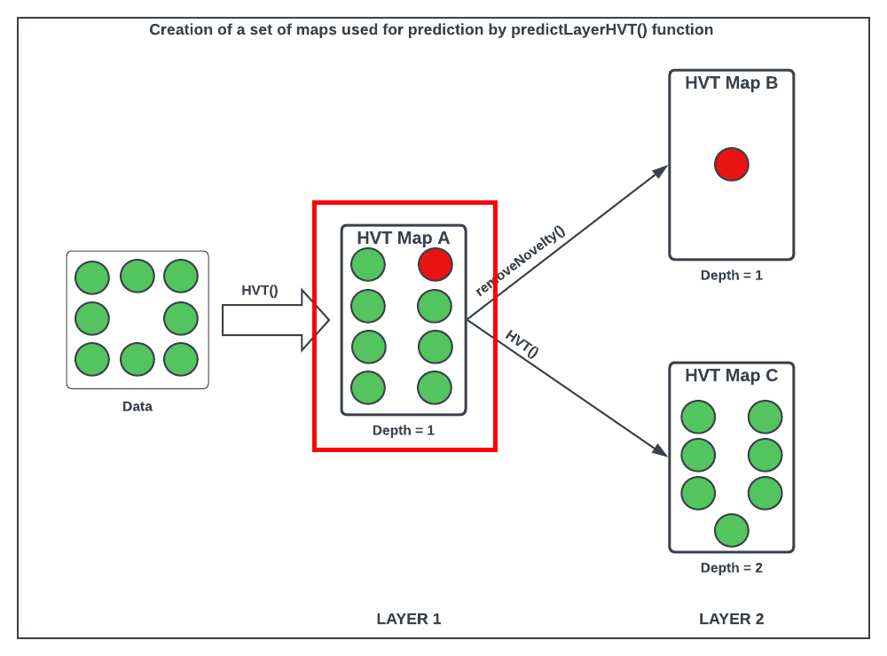
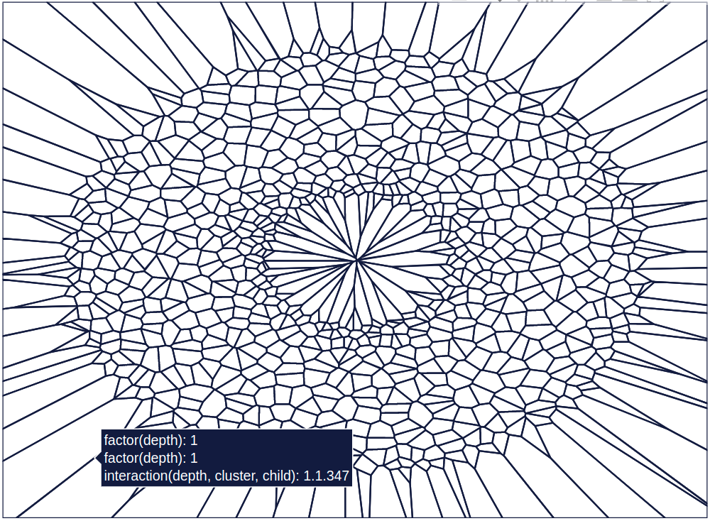

```{css, echo=FALSE}
/* CSS for floating TOC on the left side */
#TOC {
    /* float: left; */
    position: fixed;
    margin-left: -22vw;
    width: 18vw;
    height: fit-content;
    overflow-y: auto;
    padding-top: 20px;
    padding-bottom: 20px;
    background-color: #f9f9f9;
    border-right: 1px solid #ddd;
    margin-top: -12em; 
}

.main-container {
  margin-left: 222px; /* Adjust this value to match the width of the TOC + some margin */
}

li {
  padding-bottom: 5px;
}

  
```

```{r setup, warning = FALSE, include = FALSE}
knitr::opts_chunk$set(
  collapse = TRUE,
  comment = "#>",
  out.width = "672px",
  out.height = "480px",
  fig.width = 7,
  fig.height = 5,
  fig.align = "center",
  fig.retina = 1,
  dpi = 150
)

# installing all required packages
list.of.packages <- c("plyr", "dplyr", "reactable", "kableExtra", "geozoo", "plotly", "purrr", "sp", "HVT", "data.table", "gridExtra")

new.packages <-
  list.of.packages[!(list.of.packages %in% installed.packages()[, "Package"])]
if (length(new.packages))
  install.packages(new.packages, dependencies = TRUE)

# Loading the required libraries
lapply(list.of.packages, library, character.only = T)

# Sourcing the modified files for HVT
## Do this if HVT is unavailable on CRAN

source("../R/Add_boundary_points.R")
source("../R/Corrected_Tessellations.R")
source("../R/DelaunayInfo.R")
source("../R/Delete_Outpoints.R")
source("../R/getCentroids.R")
source("../R/getOptimalCentroids.R")
source("../R/hvq.R")
source("../R/HVT.R")
source("../R/hvtHmap.R")
source("../R/plotCells.R")
source("../R/plotHVT.R")
source("../R/predictHVT.R")
source("../R/ScaleMat.R")
source("../R/Transform_Coordinates.R")
source("../R/madPlot.R")
source("../R/diagPlot.R")
source("../R/get_cell_id.R")
source("../R/getCentroids_for_opti.R")
source("../R/multiNormalDist.R")
source("../R/plotDiag.R")
source("../R/qeHistPlot.R")
source("../R/diagSuggestion.R")
source("../R/exploded_hmap.R")
source("../R/predictLayerHVT.R")
source("../R/removeNovelty.R")


options(expressions = 10000)

global_var <- nzchar(Sys.getenv("RUN_VIGNETTE"))
global_var <- TRUE

scrolLimit <- function(noOfRows){
  if(noOfRows<10){
    
    swe = paste(as.character(noOfRows*50),"px")
  }
  else{
    swe = "400px"
  }
  return(swe)
}

Table <- function(data,scroll = T, limit = NULL){
  
  if(!is.null(limit)){
    data <- head(data,limit)
  }

  kable_table <- data %>% kable(escape = F,align = "c") %>% kable_styling(bootstrap_options = c("striped", "hover", "responsive"))
  scroll <- scroll
  
  if(scroll == T){
  kable_table <- kable_table %>% scroll_box(width = "100%", height = scrolLimit(nrow(data)))
  }
  return(kable_table)
}

summaryTable <- function(data,scroll = T,columnName='Quant.Error',value=0.2,limit=NULL){
  
  scroll <- scroll
  summaryTable <- data %>%  dplyr::mutate_if(is.numeric, funs(round(.,2))) %>% dplyr::mutate(!!columnName:=  cell_spec(eval(parse(text = columnName)),color = ifelse(is.na(eval(parse(text = columnName))),"#333",ifelse(eval(parse(text = columnName)) < value,"red","#333"))))  
  
  return(Table(summaryTable,scroll = scroll,limit = limit))
}

compressionSummaryTable <- function(data,scroll = T,columnName='percentOfCellsBelowQuantizationErrorThreshold',value=0.8){
  summaryTable <- data %>%  dplyr::mutate_if(is.numeric, funs(round(.,2))) %>% dplyr::mutate(!!columnName:=  cell_spec(eval(parse(text = columnName)),color = ifelse(is.na(eval(parse(text = columnName))),"#00bb27",ifelse(eval(parse(text = columnName)) > value,"#00bb27","#333")))) 

  return(Table(summaryTable,scroll = scroll))
}

set.seed(240)
```

# Abstract

The HVT package is a collection of R functions to facilitate building [topology preserving maps](https://users.ics.aalto.fi/jhollmen/dippa/node9.html) for rich multivariate data analysis. Tending towards a big data preponderance, a large number of rows. A collection of R functions for this typical workflow is organized below:

1.  **Data Compression**: Vector quantization (VQ), HVQ (hierarchical vector quantization) using means or medians. This step compresses the rows (long data frame) using a compression objective.

2.  **Data Projection**: Dimension projection of the compressed cells to 1D,2D or 3D with the Sammons Non-linear Algorithm. This step creates topology preserving map (also called as [embedding](https://en.wikipedia.org/wiki/Embedding)) coordinates into the desired output dimension.

3.  **Tessellation**: Create cells required for object visualization using the Voronoi Tessellation method, package includes heatmap plots for hierarchical Voronoi tessellations (HVT). This step enables data insights, visualization, and interaction with the topology preserving map. Useful for semi-supervised tasks.

4.  **Prediction**: Scoring new data sets and recording their assignment using the map objects from the above steps, in a sequence of maps if required.

# Example: HVT with the Personal Computer dataset

**Data Understanding**

In this vignette, we will use the **`Prices of Personal Computers`** dataset. This dataset contains 6259 observations and 6 features. The dataset observes the price from 1993 to 1995 of 486 personal computers in the US. The variables are price, speed, hd, ram, screen and ads.

Here, we load the data and store into a variable `computers`.

```{r load data computer,warning=FALSE,message=FALSE,eval = T}
set.seed(240)
# Load data from csv files
computers <- read.csv("https://raw.githubusercontent.com/Mu-Sigma/HVT/master/vignettes/sample_dataset/Computers.csv")
```

**Raw Personal Computers Dataset**

The Computers dataset includes the following columns:

-   Price: The price of 486 PCs in US dollars.
-   Speed: The clock speed of the PCs in MHz.
-   HD: The size of the hard drive in MB.
-   RAM: The size of RAM in MB.
-   Screen: The size of the screen in inches.
-   Ads: The number of listings for 486 PCs' prices for each month.

Let's explore the **Personal Computers Dataset containing (6259 points)**. For the shake of brevity we are displaying first six rows.

```{r}
Table(head(computers), scroll = T, limit = 20)
```

Now, let us check the **structure** of the data and analyse its **summary**.

```{r, message=FALSE, warning=FALSE}
str(computers)
```

```{r, message=FALSE,warning=FALSE}
summary(computers)
```

Let us first split the data into train and test. We will randomly select 80% of the data for training and remaining as testing.

```{r train-test computer,warning=FALSE,message=FALSE,eval = global_var}

num_rows <- nrow(computers)
set.seed(123)
train_indices <- sample(1:num_rows, 0.8 * num_rows)
trainComputers <- computers[train_indices, ]
testComputers <- computers[-train_indices, ]
```

K-means is not suitable for factor variables as the sample space for factor variables is discrete. A Euclidean distance function on such a space isn't really meaningful. Hence, we will delete the factor variables(X, cd, multi, premium, trend) in our dataset.

```{r pre-processing data computer,warning=FALSE,message=FALSE,eval = global_var}
trainComputers <-
  trainComputers %>% dplyr::select(-c(X, cd, multi, premium, trend))
testComputers <-
  testComputers %>% dplyr::select(-c(X, cd, multi, premium, trend))
```

**Raw Training Dataset**

Now, lets have a look at the randomly selected **raw training dataset** containing (5007 data points). For the sake of brevity we are displaying first six rows.

```{r, warning=FALSE,message=FALSE}
trainComputers_data <- trainComputers %>% as.data.frame() %>% round(4)
trainComputers_data$Row.No <- as.numeric(row.names(trainComputers_data))
trainComputers_data <- trainComputers_data %>% dplyr::select(Row.No,price,speed,hd,ram,screen,ads)
row.names(trainComputers_data) <- NULL
Table(head(trainComputers_data))
```

**Raw Testing Dataset**

Now, lets have a look at the randomly selected **raw testing dataset** containing (1252 data points). For the sake of brevity we are displaying first six rows.

```{r,warning=FALSE,message=FALSE}
#testComputers <- scale(testComputers, center = scale_attr$`scaled:center`, scale = scale_attr$`scaled:scale`) 
testComputers_data <- testComputers %>% as.data.frame() %>% round(4)
testComputers_data$Row.No <- as.numeric(row.names(testComputers_data))
testComputers_data <- testComputers_data %>% dplyr::select(Row.No,price,speed,hd,ram,screen,ads)
rownames(testComputers_data) <- NULL
Table(head(testComputers_data))
```

# Map A : Base Compressed Map

Let us try to visualize the compressed Map A from the flow diagram below.

```{r ,echo=FALSE,warning=FALSE,fig.show='hold',message=FALSE,out.width='90%',fig.height=8,fig.cap='Figure 1: Flow map with highlighted bounding box in red around compressed map A'}

```

This package can perform vector quantization using the following algorithms -

-   Hierarchical Vector Quantization using k−means
-   Hierarchical Vector Quantization using k−medoids

For more information on vector quantization, refer the following [link](https://htmlpreview.github.io/?https://github.com/Mu-Sigma/HVT/blob/master/vignettes/HVT_vignette.html#compress-vector-quantization).

The HVT function constructs highly compressed hierarchical Voronoi tessellations. The raw data is first scaled and this scaled data is supplied as input to the vector quantization algorithm. The vector quantization algorithm compresses the dataset until a user-defined compression percentage/rate is achieved using a parameter called quantization error which acts as a threshold and determines the compression percentage. It means that for a given user-defined compression percentage we get the 'n' number of cells, then all of these cells formed will have a quantization error less than the threshold quantization error.

Let's try to comprehend the **HVT function** first before moving ahead.

```{r HVT function, echo=TRUE, eval=FALSE}
HVT(
  dataset,
  min_compression_perc,
  n_cells,
  depth,
  quant.err,
  distance_metric = c("L1_Norm", "L2_Norm"),
  error_metric = c("mean", "max"),
  quant_method = c("kmeans", "kmedoids"),
  normalize = TRUE,
  diagnose = FALSE,
  hvt_validation = FALSE,
  train_validation_split_ratio = 0.8
)
```

Each of the parameters of HVT function have been explained below:

-   **`dataset`** - A dataframe, with numeric columns (features) that will be used for training the model.

-   **`min_compression_perc`** - An integer, indicating the minimum compression percentage to be achieved for the dataset. It indicates the desired level of reduction in dataset size compared to its original size.

-   **`n_cells`** - An integer, indicating the number of cells per hierarchy (level). This parameter determines the granularity or level of detail in the hierarchical vector quantization.

-   **`depth`** - An integer, indicating the number of levels. A depth of 1 means no hierarchy (single level), while higher values indicate multiple levels (hierarchy).

-   **`quant.error`** - A number indicating the quantization error threshold. A cell will only breakdown into further cells if the quantization error of the cell is above the defined quantization error threshold.

-   **`projection.scale`** - A number indicating the scale factor for the tesselations so as to visualize the sub-tesselations well enough. It helps in adjusting the visual representation of the hierarchy to make the sub-tesselations more visible.

-   **`scale_summary`** - A list with mean and standard deviation values for all the features in the dataset. Pass the scale summary when the input dataset is already scaled or normalize is set to False.

-   **`distance_metric`** - The distance metric can be `L1_Norm`(Manhattan) or `L2_Norm`(Eucledian). `L1_Norm` is selected by default. The distance metric is used to calculate the distance between an `n` dimensional point and centroid.

-   **`error_metric`** - The error metric can be `mean` or `max`. `max` is selected by default. `max` will return the max of `m` values and `mean` will take mean of `m` values where each value is a distance between a point and centroid of the cell.

-   **`quant_method`** - The quantization method can be `kmeans` or `kmedoids`. Kmeans uses means (centroids) as cluster centers while Kmedoids uses actual data points (medoids) as cluster centers. `kmeans` is selected by default.

-   **`normalize`** - A logical value indicating if the dataset should be normalized. When set to TRUE, scales the values of all features to have a mean of 0 and a standard deviation of 1 (Z-score)

-   **`diagnose`** - A logical value indicating whether user wants to perform diagnostics on the model. The 4th element of the hvt.result (list) contains detailed informations for debugging. Default value is TRUE.

-   **`hvt_validation`** - A logical value indicating whether user wants to holdout a validation set and find mean absolute deviation of the validation points from the centroid. These values can be found in the 6th element of the hvt.result (list) under the model.info under the title validation_result. Default value is FALSE.

-   **`train_validation_split_ratio`** - A numeric value indicating train validation split ratio. This argument is only used when hvt_validation has been set to TRUE. Default value for the argument is 0.8.

The output of HVT function (list of 6 elements) have been explained below:

-   The '1st element' is a list containing information related to plotting tessellations. This information might include coordinates, boundaries, or other details necessary for visualizing the tessellations

-   The '2nd element' is a list containing information related to Sammon's projection coordinates of the data points in the reduced-dimensional space.

-   The '3rd element' is a list containing detailed information about the hierarchical vector quantized data along with a summary section containing no of points, Quantization Error and the centroids for each cell.

-   The '4th element' is a list that contains all the diagnostics information of the model when diagnose is set to TRUE.Otherwise NA

-   The '5th element' is a list that contains all the information required to generates a Mean Absolute Deviation (MAD) plot, if hvt_validation is set to TRUE. Otherwise NA

-   The '6th element' (model info) is a list that contains model generated timestamp, input parameters passed to the model and the validation results.

We will use the `HVT` function to compress our data while preserving essential features of the dataset. Our goal is to achieve data compression upto atleast `80%`. In situations where the compression ratio does not meet the desired target, we can explore adjusting the model parameters as a potential solution. This involves making modifications to parameters such as the `quantization error threshold` or `increasing the number of cells` and then rerunning the HVT function again.

**In our example we will iteratively increase the number of cells until the desired compression percentage is reached instead of increasing the quantization threshold because it may reduce the level of detail captured in the data representation**

First, we will construct **`map A`** by using the below mentioned model parameters.

### [Iteration 1:]{style="color:blue"}

We will pass the below mentioned model parameters along with training dataset (containing 5007 data points) to `HVT` function.

**Model Parameters**

-   Number of Cells at each Level = 200
-   Maximum Depth = 1
-   Quantization Error Threshold = 0.2
-   Error Metric = Max
-   Distance Metric = Manhattan

```{r torus hvt first1,warning=FALSE,fig.show='hold',results='hide',message=FALSE,fig.cap='Figure : The Voronoi tessellation for layer 1 shown for the 200 cells in the dataset ’computers’',eval = global_var}
set.seed(240)
map_A <- list()
map_A  <- HVT::HVT(
  trainComputers,
  n_cells = 200,
  depth = 1,
  quant.err = 0.2,
  projection.scale = 10,
  normalize = T,
  distance_metric = "L1_Norm",
  error_metric = "max",
  quant_method = "kmeans"
)

```

Let's checkout the **compression summary** with n_cells set to 200.

```{r compression summary map A,warning=FALSE,eval = global_var}
compressionSummaryTable(map_A[[3]]$compression_summary)
```

**As it can be seen from the table above, 42% of cells have reached the quantization threshold error. Therefore we can further subdivide the cells by increasing the n_cells parameters and then see if desired compression (80%) is reached**

### [Iteration 2:]{style="color:blue"}

Since, we are yet to achive atleast 80% compression. Let's try to compress again using the below mentioned set of model parameters and the Computers training dataset (containing 5007 data points) .

**Model Parameters**

-   Number of Cells at each Level = 440
-   Maximum Depth = 1
-   Quantization Error Threshold = 0.2
-   Error Metric = Max
-   Distance Metric = Manhattan

```{r hvt_mapA HVT,warning=FALSE,message=FALSE,results='asis'}
map_A <- list()
map_A <-HVT::HVT(trainComputers,
                n_cells = 440,
                quant.err = 0.2,
                depth = 1,
                distance_metric = "L1_Norm",
                error_metric = "max",
                quant_method = "kmeans",
                normalize = T)
```

As per the manual, **`map_A[[3]]`** gives us detailed information about the hierarchical vector quantized data. **`map_A[[3]][['summary']]`** gives a nice tabular data containing no of points, Quantization Error and the codebook.

The datatable displayed below is the **summary from map A** showing Cell.ID, Centroids and Quantization Error for each of the 440 cells.

```{r hvt_mapA display results, warning=FALSE, echo=TRUE}
summaryTable(map_A[[3]]$summary,scroll = T,limit = 500)

```

Now let us understand what each column in the above table means:

-   **`Segment.Level`** - Level of the cell. In this case, we have performed Vector Quantization for depth 1. Hence Segment Level is 1.

-   **`Segment.Parent`** - Parent segment of the cell.

-   **`Segment.Child (Cell.Number)`** - The children of a particular cell. In this case, it is the total number of cells at which we achieved the defined compression percentage.

-   **`n`** - No of points in each cell.

-   **`Cell.ID`** - Cell_ID's are generated for the multivariate data using 1-D Sammon's Projection algorithm.

-   **`Quant.Error`** - Quantization Error for each cell.

All the columns after this will contain centroids for each cell. They can also be called a codebook, which represents a collection of all centroids or codewords.

Now, let's check the **compression summary** for HVT (map A) where n_cell was set to 440. The table below shows no of cells, no of cells having quantization error below threshold and percentage of cells having quantization error below threshold for each level.

```{r hvt_mapA compression summary,warning=FALSE,eval = global_var}
mapA_compression_summary <- map_A[[3]]$compression_summary %>%  dplyr::mutate_if(is.numeric, funs(round(.,4)))
compressionSummaryTable(mapA_compression_summary)
```

**As it can be seen from the table above, `81%`** of the cells have hit the quantization threshold error.Since we are successfully able to attain the desired compression percentage, so we will not further subdivide the cells

Now let's try to understand **plotHVT** function. The parameters have been explained in detail below:

```{r plotHVT function,echo = TRUE, eval= FALSE}
plotHVT(hvt.results, line.width, color.vec, pch1 = 21, centroid.size = 3, title = NULL, maxDepth = 1)
```

-   **`hvt.results`** - A list (hvt.result) obtained from the HVT function while performing hierarchical vector quantization on training data. This list provides an overview of the hierarchical vector quantized data, including diagnostics, tessellation details, Sammon's projection coordinates, and model input information.

-   **`line.width`** - A vector indicating the line widths of the tessellation boundaries for each layer.

-   **`color.vec`** - A vector indicating the colors of the tessellations boundaries at each layer.

-   **`pch1`** - Symbol, It plots the centroids with a particular symbol such as (solid circle, bullet, filled square, filled diamond) in the tessellations.(default = 21 i.e filled circle).

-   **`centroid.size`** - Size of centroids for each level of tessellations (default = 3).

-   **`title`** - Set a title for the plot (default = NULL).

-   **`maxDepth`** - An integer indicating the number of levels. (default = NULL)

Let's plot the Voronoi tessellation for layer 1 (map A).

```{r, warning=FALSE,message=FALSE,fig.cap='Figure 2: The Voronoi Tessellation for layer 1 (map A) shown for the 440 cells in the dataset ’computers’'}
HVT::plotHVT(map_A,
        line.width = c(0.4), 
        color.vec = c("#141B41"),
        centroid.size = 0.01,
        maxDepth = 1) 
```

**Heat Maps**

We will now overlay all the features as heatmap over the Voronoi Tessellation plot for better visualization and identification of patterns, trends, and variations in the data.

Let's have a look at the function `hvtHmap` that we will use to overlay features as heatmap.

```{r hvt_mapA hvtHmap,echo = TRUE, eval= FALSE}
hvtHmap(hvt.results, dataset, child.level, hmap.cols, color.vec ,line.width, palette.color = 6)
```

-   **`hvt.results`** - A list (hvt.result) obtained from the HVT function while performing hierarchical vector quantization on training data. This list provides an overview of the hierarchical vector quantized data, including diagnostics, tessellation details, Sammon's projection coordinates, and model input information.

-   **`dataset`** - A dataframe, with numeric columns (features) that was used for training the model.

-   **`child.level`** - A number indicating the depth for which the heat map is to be plotted (Only used if hmap.cols is not NULL), Each depth represents a different level of clustering or partitioning of the data.

-   **`hmap.cols`** - A feature (string) or a set of features(vector) from the dataset for which the heat map is to be plotted. A heatmap won't be plotted if NULL is passed (Default = NULL)

-   **`color.vec`** - A color vector such that length(color.vec) = child.level, let say if the child.level is 2 then 2 color vector should be provided for each level. (default = NULL).

-   **`line.width`** - A line width vector such that length(line.width) = child.level, let say if the child.level is 2 then 2 line width vector should be provided for each level (default = NULL).

-   **`palette.color`** - A number indicating the heat map color palette. 1 - rainbow, 2 - heat.colors, 3 - terrain.colors, 4 - topo.colors, 5 - cm.colors, 6 - BlCyGrYlRd (Blue,Cyan,Green,Yellow,Red) color (default = 6).

-   **`show.points`** - A boolean indicating whether the centroids should be plotted on the tessellations (default = FALSE).

Now let's plot the Voronoi Tessellation with the heatmap overlaid for all the features in the torus data for better visualization and interpretation of data patterns and distributions.

The heatmaps displayed below provides a visual representation of the spatial characteristics of the computers data, allowing us to observe patterns and trends in the distribution of each of the features (n,price,speed,hd,ram,screen,ads). The sheer green shades highlight regions with higher values in each of the heatmaps, while the indigo shades indicate areas with the lowest values in each of the heatmaps. By analyzing these heatmaps, we can gain insights into the variations and relationships between each of these features within the computers data.

```{r hvt_mapA hmp level one n computers,warning=FALSE,fig.show='hold',results='hide',message=FALSE,fig.cap='Figure 3: The Voronoi Tessellation with the heat map overlaid for No. of entities in each cell ',eval = global_var}

  hvtHmap(
  map_A,
  trainComputers,
  child.level = 1,
  hmap.cols = "n",
  line.width = c(0.2),
  color.vec = c("#141B41"),
  palette.color = 6,
  centroid.size = 0.1,
  show.points = T,
  quant.error.hmap = 0.2,
  n_cells.hmap = 440,
) 

```

```{r hvt_mapA hmp level one price computers,warning=FALSE,fig.show='hold',results='hide',message=FALSE,fig.cap='Figure 4: The Voronoi Tessellation with the heat map overlaid for variable ’price’ in the ’computers’ dataset',eval = global_var}

  hvtHmap(
  map_A,
  trainComputers,
  child.level = 1,
  hmap.cols = "price",
  line.width = c(0.2),
  color.vec = c("#141B41"),
  palette.color = 6,
  centroid.size = 0.1,
  show.points = T,
  quant.error.hmap = 0.2,
  n_cells.hmap = 440,
) 

```

```{r hvt_mapA hmp level one speed computers,warning=FALSE,fig.show='hold',results='hide',message=FALSE,fig.cap='Figure 5: The Voronoi Tessellation with the heat map overlaid for variable ’speed’ in the ’computers’ dataset',eval = global_var}

  hvtHmap(
  map_A,
  trainComputers,
  child.level = 1,
  hmap.cols = "speed",
  line.width = c(0.2),
  color.vec = c("#141B41"),
  palette.color = 6,
  centroid.size = 0.1,
  show.points = T,
  quant.error.hmap = 0.2,
  n_cells.hmap = 440,
) 

```

```{r hvt_mapA hmp  level one hd computers,warning=FALSE,fig.show='hold',results='hide',message=FALSE,fig.cap='Figure 6: The Voronoi Tessellation with the heat map overlaid for variable ’hd’ in the ’computers’ dataset',eval = global_var}

  hvtHmap(
  map_A,
  trainComputers,
  child.level = 1,
  hmap.cols = "hd",
  line.width = c(0.2),
  color.vec = c("#141B41"),
  palette.color = 6,
  centroid.size = 0.1,
  show.points = T,
  quant.error.hmap = 0.2,
  n_cells.hmap = 440,
) 

```

```{r hvt_mapA hmp level one ram computers,warning=FALSE,fig.show='hold',results='hide',message=FALSE,fig.cap='Figure 7: The Voronoi Tessellation with the heat map overlaid for variable ’ram’ in the ’computers’ dataset',eval = global_var}

  hvtHmap(
  map_A,
  trainComputers,
  child.level = 1,
  hmap.cols = "ram",
  line.width = c(0.2),
  color.vec = c("#141B41"),
  palette.color = 6,
  centroid.size = 0.1,
  show.points = T,
  quant.error.hmap = 0.2,
  n_cells.hmap = 440,
) 

```

```{r hvt_mapA hmp level one screen computers,warning=FALSE,fig.show='hold',results='hide',message=FALSE,fig.cap='Figure 8: The Voronoi Tessellation with the heat map overlaid for variable ’screen’ in the ’computers’ dataset',eval = global_var}

  hvtHmap(
  map_A,
  trainComputers,
  child.level = 1,
  hmap.cols = "screen",
  line.width = c(0.2),
  color.vec = c("#141B41"),
  palette.color = 6,
  centroid.size = 0.1,
  show.points = T,
  quant.error.hmap = 0.2,
  n_cells.hmap = 440,
) 

```

```{r hvt_mapA hmp level one ads computers,warning=FALSE,fig.show='hold',results='hide',message=FALSE,fig.cap='Figure 9: The Voronoi Tessellation with the heat map overlaid for variable ’ads’ in the ’computers’ dataset',eval = global_var}

  hvtHmap(
  map_A,
  trainComputers,
  child.level = 1,
  hmap.cols = "ads",
  line.width = c(0.2),
  color.vec = c("#141B41"),
  palette.color = 6,
  centroid.size = 0.1,
  show.points = T,
  quant.error.hmap = 0.2,
  n_cells.hmap = 440,
) 

```

# Map B : Compressed Novelty Map

Let us try to visualize the Map B from the flow diagram below.

```{r ,echo=FALSE,warning=FALSE,fig.show='hold',message=FALSE,out.width='90%',fig.height=8,fig.cap='Figure 10: Flow map with highlighted bounding box in red around map B'}
knitr::include_graphics('predictLayerHVT_function_mapB.png')
```

In this section, we will manually figure out the novelty cells from the plotted map A and store it in **identified_Novelty_cells** variable.

**Note**: For manual selecting the novelty cells from map A, one can enhance its interactivity by adding plotly elements to the code. This will transform map A into an interactive plot, allowing users to actively engage with the data. By hovering over the centroids of the cells, a tag containing segment `child` information will be displayed. Users can explore the map by hovering over different cells and selectively choose the novelty cells they wish to consider. Added an image for reference.

```{r ,echo=FALSE,warning=FALSE,fig.show='hold',message=FALSE,out.width='90%',fig.height=8,fig.cap='Figure 11: Manually selecting novelty cells'}

```

The **`removeNovelty`** function removes the identified novelty cell(s) from the training dataset (containing 5007 datapoints) and stores those records separately.

It takes input as the cell number (Segment.Child) of the manually identified novelty cell(s) and the compressed HVT map (map A) with 440 cells. It returns a list of two items: `dataset with novelty records`, and a subset of the `dataset without the novelty records`.

```{r remove_novelty,results='asis'}
identified_Novelty_cells <<- c(73,321,332,338,435)   #73,321,332,338,435
output_list <- removeNovelty(identified_Novelty_cells, map_A)
data_with_novelty <- output_list[[1]]
dataset_without_novelty <- output_list[[2]]
```

Let's have a look at the **data with novelties**(containing 24 records). For the sake of brevity, we will only show the first 20 rows.

```{r hvt_mapB results, warning=FALSE, echo=TRUE}
novelty_data <- data_with_novelty
novelty_data$Row.No <- row.names(novelty_data)
novelty_data <- novelty_data %>% dplyr::select("Row.No","Cell.ID","Cell.Number","price","speed","hd","ram","screen","ads")
colnames(novelty_data) <- c("Row.No","Cell.ID","Segment.Child","price","speed","hd","ram","screen","ads")
novelty_data %>% head(100) %>% 
  as.data.frame() %>%
  Table(scroll = T, limit = 20)
```

```{=html}
<style>
/* Add space after the table */
table {
  margin-bottom: 20px;
}
</style>
```
## Voronoi Tessellation with highlighted novelty cell

The **`plotCells`** function is used to plot the Voronoi tessellation using the compressed HVT map (map A) containing 440 cells and highlights the identified novelty cell(s) i.e 5 cells (containing 24 records) in red on the map.

```{r compress_novelty_plot,warning=FALSE,fig.show='hold',results='hide',message=FALSE,fig.cap='Figure 12: The Voronoi Tessellation constructed using the compressed HVT map (map A) with the novelty cell(s) highlighted in red',eval = global_var}
plotCells(identified_Novelty_cells, map_A,line.width = c(0.4),centroid.size = 0.01)
```

We pass the dataframe with novelty records (24 records) to HVT function along with other model parameters mentioned below to generate **map B** (layer2)

**Model Parameters**

-   Number of Cells at each Level = 12
-   Maximum Depth = 1
-   Quantization Error Threshold = 0.2
-   Error Metric = Max
-   Distance Metric = Manhattan

```{r, message=FALSE,warning=FALSE}
colnames(data_with_novelty) <- c("Cell.ID","Segment.Child","price","speed","hd","ram","screen","ads")
dataset_with_novelty <- data_with_novelty[,-1:-2]
map_B <- list()
mapA_scale_summary = map_A[[3]]$scale_summary
map_B <- HVT::HVT(dataset_with_novelty,
                  n_cells = 12 ,   #6
                  depth = 1,
                  quant.err = 0.2,
                  projection.scale = 10,
                  normalize = F,
                  distance_metric = "L1_Norm",
                  error_metric = "max",
                  quant_method = "kmeans",
                  diagnose = F
                  )

```

The datatable displayed below is the **summary from map B (layer 2)** showing Cell.ID, Centroids and Quantization Error for each of the 12 cells.

```{r, message=FALSE,warning=FALSE}
summaryTable(map_B[[3]]$summary,scroll = T,limit = 500)

```

Now let's check the compression summary for HVT (map B). The table below shows no of cells, no of cells having quantization error below threshold and percentage of cells having quantization error below threshold for each level.

```{r hvt_map_B compression summary,warning=FALSE,eval = global_var}
mapB_compression_summary <- map_B[[3]]$compression_summary %>%  dplyr::mutate_if(is.numeric, funs(round(.,4)))
compressionSummaryTable(mapB_compression_summary)
```

**As it can be seen from the table above, `83%`** of the cells have hit the quantization threshold error.Since we are successfully able to attain the desired compression percentage, so we will not further subdivide the cells

# Map C : Compressed Map without Novelty

Let us try to visualize the compressed Map C from the flow diagram below.

```{r ,echo=FALSE,warning=FALSE,fig.show='hold',message=FALSE,out.width='90%',fig.height=8,fig.cap='Figure 13:Flow map with highlighted bounding box in red around compressed map C'}
knitr::include_graphics('predictLayerHVT_function_mapC.png')
```

### [Iteration 1:]{style="color:blue"}

With the Novelties removed, we construct another hierarchical Voronoi tessellation **map C** layer 2 on the dataset without Novelty (containing 4983 records) and below mentioned model parameters.

**Model Parameters**

-   Number of Cells at each Level = 10
-   Maximum Depth = 2
-   Quantization Error Threshold = 0.2
-   Error Metric = Max
-   Distance Metric = Manhattan

```{r,warning=FALSE,message=FALSE}
map_C <- list()
mapA_scale_summary = map_A[[3]]$scale_summary
map_C <- HVT::HVT(dataset_without_novelty,
                  n_cells = 10,
                  depth = 2,
                  quant.err = 0.2,
                  projection.scale = 10,
                  normalize = F,
                  distance_metric = "L1_Norm",
                  error_metric = "max",
                  quant_method = "kmeans",
                  diagnose = F,
                  scale_summary = mapA_scale_summary)

```

Now let's check the compression summary for HVT (map C) where n_cell was set to 10. The table below shows no of cells, no of cells having quantization error below threshold and percentage of cells having quantization error below threshold for each level.

```{r hvt_map_C compression summary,warning=FALSE,eval = global_var}
mapC_compression_summary <- map_C[[3]]$compression_summary %>%  dplyr::mutate_if(is.numeric, funs(round(.,4)))
compressionSummaryTable(mapC_compression_summary)
```

**As it can be seen from the table above, `0%`** of the cells have hit the quantization threshold error in level 1 and **`7%`** of the cells have hit the quantization threshold error in level 2

### [Iteration 2:]{style="color:blue"}

Since, we are yet to achive atleast 80% compression at depth 2. Let's try to compress again using the below mentioned set of model parameters and the dataset without novelty (containing 4983 records).

**Model Parameters**

-   Number of Cells at each Level = 23
-   Maximum Depth = 2
-   Quantization Error Threshold = 0.2
-   Error Metric = Max
-   Distance Metric = Manhattan

```{r,warning=FALSE,message=FALSE}
map_C <- list()
map_C <- HVT::HVT(dataset_without_novelty,
                  n_cells = 23,    #23
                  depth = 2,
                  quant.err = 0.2,
                  projection.scale = 10,
                  normalize = F,
                  distance_metric = "L1_Norm",
                  error_metric = "max",
                  quant_method = "kmeans",
                  diagnose = F,
                  scale_summary = mapA_scale_summary)

```

The datatable displayed below is the **summary from map C (layer2)**. showing Cell.ID, Centroids and Quantization Error for each of the 531 cells.

```{r,message=FALSE,warning=FALSE}
summaryTable(map_C[[3]]$summary,scroll = T,limit = 500)

```

Now let's check the **compression summary** for HVT (map C). The table below shows no of cells, no of cells having quantization error below threshold and percentage of cells having quantization error below threshold for each level.

```{r hvt_mapC compression summary,warning=FALSE,eval = global_var}
mapC_compression_summary <- map_C[[3]]$compression_summary %>%  dplyr::mutate_if(is.numeric, funs(round(.,4)))
compressionSummaryTable(mapC_compression_summary)
```

**As it can be seen from the table above, `0%`** of the cells have hit the quantization threshold error in level 1 and **`85%`** of the cells have hit the quantization threshold error in level 2

Let's plot the Voronoi tessellation for layer 2 (map C)

```{r, warning=FALSE,message=FALSE,fig.cap='Figure 14: The Voronoi Tessellation for layer 2 (map C) shown for the 100 cells in the dataset ’computers’ at level 2'}
HVT::plotHVT(map_C,
        line.width = c(0.4,0.2), 
        color.vec = c("#141B41","#0582CA"),
        centroid.size = 0.1,
        maxDepth = 2) 
```

**Heat Maps**

Now let's plot all the features for each cell at level two as a heatmap for better visualization.

The heatmaps displayed below provides a visual representation of the spatial characteristics of the computers data, allowing us to observe patterns and trends in the distribution of each of the features (n,price,speed,hd,ram,screen,ads). The sheer green shades highlight regions with higher values in each of the heatmaps, while the indigo shades indicate areas with the lowest values in each of the heatmaps. By analyzing these heatmaps, we can gain insights into the variations and relationships between each of these features within the computers data.

```{r hvt_mapC hmp level one n computers,warning=FALSE,fig.show='hold',results='hide',message=FALSE,fig.cap='Figure 15: The Voronoi Tessellation with the heat map overlaid for features No. of entities in each cell',eval = global_var}

  hvtHmap(
  map_C,
  trainComputers,
  child.level = 2,
  hmap.cols = "n",
  line.width = c(0.6,0.4),
  color.vec = c("#141B41","#0582CA"),
  palette.color = 6,
  centroid.size = 0.1,
  show.points = T,
  quant.error.hmap = 0.2,
  n_cells.hmap = 100,
) 

```

```{r hvt_mapC hmp level one price computers,warning=FALSE,fig.show='hold',results='hide',message=FALSE,fig.cap='Figure 16: The Voronoi Tessellation with the heat map overlaid for features price in the ’computers’ dataset',eval = global_var}

  hvtHmap(
  map_C,
  trainComputers,
  child.level = 2,
  hmap.cols = "price",
  line.width = c(0.6,0.4),
  color.vec = c("#141B41","#0582CA"),
  palette.color = 6,
  centroid.size = 0.1,
  show.points = T,
  quant.error.hmap = 0.2,
  n_cells.hmap = 100,
) 

```

```{r hvt_mapC hmp level one speed computers,warning=FALSE,fig.show='hold',results='hide',message=FALSE,fig.cap='Figure 17: The Voronoi Tessellation with the heat map overlaid for features speed in the ’computers’ dataset',eval = global_var}

  hvtHmap(
  map_C,
  trainComputers,
  child.level = 2,
  hmap.cols = "speed",
  line.width = c(0.6,0.4),
  color.vec = c("#141B41","#0582CA"),
  palette.color = 6,
  centroid.size = 0.1,
  show.points = T,
  quant.error.hmap = 0.2,
  n_cells.hmap = 100,
) 

```

```{r hvt_mapC hmp level one hd computers,warning=FALSE,fig.show='hold',results='hide',message=FALSE,fig.cap='Figure 18: The Voronoi Tessellation with the heat map overlaid for features hd in the ’computers’ dataset',eval = global_var}

  hvtHmap(
  map_C,
  trainComputers,
  child.level = 2,
  hmap.cols = "hd",
  line.width = c(0.6,0.4),
  color.vec = c("#141B41","#0582CA"),
  palette.color = 6,
  centroid.size = 0.1,
  show.points = T,
  quant.error.hmap = 0.2,
  n_cells.hmap = 100,
) 

```

```{r hvt_mapC hmp level one ram computers,warning=FALSE,fig.show='hold',results='hide',message=FALSE,fig.cap='Figure 19: The Voronoi Tessellation with the heat map overlaid for features ram in the ’computers’ dataset',eval = global_var}

  hvtHmap(
  map_C,
  trainComputers,
  child.level = 2,
  hmap.cols = "ram",
  line.width = c(0.6,0.4),
  color.vec = c("#141B41","#0582CA"),
  palette.color = 6,
  centroid.size = 0.1,
  show.points = T,
  quant.error.hmap = 0.2,
  n_cells.hmap = 100,
) 

```

```{r hvt_mapC hmp level one screen computers,warning=FALSE,fig.show='hold',results='hide',message=FALSE,fig.cap='Figure 20: The Voronoi Tessellation with the heat map overlaid for features screen in the ’computers’ dataset',eval = global_var}

  hvtHmap(
  map_C,
  trainComputers,
  child.level = 2,
  hmap.cols = "screen",
  line.width = c(0.6,0.4),
  color.vec = c("#141B41","#0582CA"),
  palette.color = 6,
  centroid.size = 0.1,
  show.points = T,
  quant.error.hmap = 0.2,
  n_cells.hmap = 100,
) 

```

```{r hvt_mapC hmp level one ads computers,warning=FALSE,fig.show='hold',results='hide',message=FALSE,fig.cap='Figure 21: The Voronoi Tessellation with the heat map overlaid for features ads in the ’computers’ dataset',eval = global_var}

  hvtHmap(
  map_C,
  trainComputers,
  child.level = 2,
  hmap.cols = "ads",
  line.width = c(0.6,0.4),
  color.vec = c("#141B41","#0582CA"),
  palette.color = 6,
  centroid.size = 0.1,
  show.points = T,
  quant.error.hmap = 0.2,
  n_cells.hmap = 100,
) 

```

**We now have the set of maps (map A, map B & map C) which will be used to predict which map and cell each test record is assigned to, but before that lets view our test dataset**

# Prediction on Test Data

Now once we have built the model, let us try to predict using our test dataset (containing 1252 data points) which cell and which layer each point belongs to.

**Raw Testing Dataset**

The testing dataset includes the following columns:

-   Price: The price of 486 PCs in US dollars.
-   Speed: The clock speed of the PCs in MHz.
-   HD: The size of the hard drive in MB.
-   RAM: The size of RAM in MB.
-   Screen: The size of the screen in inches.
-   Ads: The number of listings for 486 PCs' prices for each month.

Let's have a look at our randomly selected **test dataset** containing 1252 datapoints.

```{r sample test data computer,warning=FALSE,message=FALSE,eval = T}
Table(head(testComputers_data))
```

The **predictLayerHVT** function is used to score the test data using the predictive set of maps. This function takes an input - a test data and a set of maps (map A, map B, map C).

Now, Let us understand the **`predictLayerHVT`** function.

```{r predictLayerHVT function,echo = TRUE, eval= FALSE}
predictLayerHVT(data,
                map_A,
                map_B,
                map_C,
                mad.threshold = 0.2,
                normalize = T, 
                distance_metric="L1_Norm",
                error_metric="max",
                child.level = 1, 
                line.width = c(0.6, 0.4, 0.2),
                color.vec = c("#141B41", "#6369D1", "#D8D2E1"),
                yVar= NULL,
                ...)
```

Each of the parameters of **predictLayerHVT** function has been explained below:

-   **`data`** - A dataframe containing the test dataset. The dataframe should have all the variable(features) used for training.

-   **`map A`** - Result (hvt.result) obtained from HVT function while performing hierarchical vector quantization on train data. This list containes information about the hierarchical vector quantized data along with a summary section.

-   **`map B`** - Result (hvt.result) obtained from HVT function while performing hierarchical vector quantization on novelty data. Novelty data is a subset of the training data obtained as a result of removeNovelty function (1st element).

-   **`map C`** - Result (hvt.result) obtained from HVT function while performing hierarchical vector quantization on training data without novelty. This data is a subset of the training data obtained as a result of removeNovelty function (2nd element).

-   **`child.level`** - A number indicating the depth for which the heat map is to be plotted (Only used if hmap.cols is not NULL), Each depth represents a different level of clustering or partitioning of the data.

-   **`mad.threshold`** - A threshold value used to filter data based on the Median Absolute Deviation (MAD) of the Quant.Error variable. It determines how extreme a deviation from the median has to be in order to consider as novelty

-   **`normalize`** - A logical value indicating if the dataset should be normalized. When set to TRUE, scales the values of all features to have a mean of 0 and a standard deviation of 1 (Z-score)

-   **`distance_metric`** - The distance metric can be `L1_Norm`(Manhattan) or `L2_Norm`(Eucledian). `L1_Norm` is selected by default. The distance metric is used to calculate the distance between an `n` dimensional point and centroid. The distance metric can be different from the one used during training.

-   **`error_metric`** - The error metric can be `mean` or `max`. `max` is selected by default. `max` will return the max of `m` values and `mean` will take mean of `m` values where each value is a distance between a point and centroid of the cell. The error metric can be different from the one used during training.

-   **`yVar`** - A character or a vector representing the name of the dependent variable(s)

-   **`line.width`** - A vector indicating the line widths of the tessellation boundaries for each layer. (Optional Parameters)

-   **`color.vec`** - A vector indicating the colors of the tessellations boundaries at each layer. (Optional Parameters)

The function predicts based on the HVT maps - map A, map B and map C, constructed using HVT function. For each test record, the function will assign that record to Layer1 or Layer2. Layer1 contains the cell ids from map A and Layer 2 contains cell ids from map B (novelty map) and map C (map without novelty).

**Prediction Algorithm**

The prediction algorithm recursively calculates the distance between each point in the test dataset and the cell centroids for each level. The following steps explain the prediction method for a single point in the test dataset:

1.  Calculate the distance between the point and the centroid of all the cells in the first level.
2.  Find the cell whose centroid has minimum distance to the point.
3.  Check if the cell drills down further to form more cells.
4.  If it doesn't, return the path. Or else repeat steps 1 to 4 till we reach a level at which the cell doesn't drill down further.

**Note : The prediction algorithm will not work if some of the variables used to perform quantization are missing. In the test dataset, we should not remove any features**

```{r, message=FALSE,warning=FALSE}

validation_data <- testComputers
new_predict <- predictLayerHVT(
    data=validation_data,
    map_A,
    map_B,
    map_C,
    normalize = T
  )


```

Let's see which cell and layer each point belongs to and check the Mean Absolute Difference for each of the **1252 records**.

```{r}

act_pred <- new_predict[["actual_predictedTable"]]
rownames(act_pred) <- NULL
act_pred %>% head(1000) %>%as.data.frame() %>%Table(scroll = T)


```

```{r,message=FALSE,warning=FALSE,fig.cap='Figure 22: Mean Absolute Difference'}

hist(act_pred$diff, breaks = 30, col = "blue", main = "Mean Absolute Difference", xlab = "Difference")

```

# Executive Summary

-   We have considered computers dataset for creating a predictive sequence of maps using predictLayerHVT() in this vignette.

-   Our goal is to achieve data compression upto atleast `80%`.

-   We construct a compressed HVT map (Map A) using the HVT() on the training dataset by setting **`n_cells`** to 440 and **`quant.error`** to 0.2 and we were able to attain a compression of 81%.

-   Based on the output of the above step, we manually identify the novelty cell(s) from the plotted map A. For this dataset, we identify the 73rd,321,332th,338th,435th cells as the novelty cell.

-   We pass the identified novelty cell(s) as a parameter to the removeNovelty() along with HVT map A. The function removes that novelty cell(s) from the dataset and stores them separately. It also returns the dataset without novelty(s).

-   The plotCells() constructs hierarchical voronoi tessellations and highlights the identified novelty cell(s) in red.

-   The dataset with novelty is then passed to the HVT() to construct another HVT map (map B). But here, we set the parameters **`n_cells`** = 3, **`depth`** = 1 etc. when constructing the map.

-   The dataset without novelties is then passed to the HVT() to construct another HVT map (map C). But here, we set the parameters **`n_cells`** = 100, **`depth`** = 2 etc. when constructing the map.

-   Finally, the set of maps - map A, map B, and map C are passed to the predictLayerHVT() along with the test dataset to predict which map and what cell each test record is assigned to.

-   The output of predictLayerHVT is a dataset with two columns Layer1.Cell.ID and Layer2.Cell.ID. Layer1.Cell.ID contains cell ids from map A in the form A1,A2,A3.... and Layer2.Cell.ID contains cell ids from map B as B1,B2... depending on the identified novelties and map C as C1,C2,C3.....

<!-- * From the output of `predictLayerHVT`we can see that 343rd observation from the test data having Cell.ID as A399 have been identified as novelty and is mapped to 1st(B1) novelty cell in Layer2.Cell.ID column .Similarly, 367th,423rd....... test record having Cell.ID as A399 is correctly identified as novelty and gets mapped to B1 novelty cell in the Layer2.Cell.ID column respectively. -->

# References

1.  Topology Preserving Maps : <https://users.ics.aalto.fi/jhollmen/dippa/node9.html>

2.  Vector Quantization : <https://en.wikipedia.org/wiki/Vector_quantization>

3.  K-means : <https://en.wikipedia.org/wiki/K-means_clustering>

4.  Sammon's Projection : <http://en.wikipedia.org/wiki/Sammon_mapping>

5.  Voronoi Tessellations : <http://en.wikipedia.org/wiki/Centroidal_Voronoi_tessellation>
