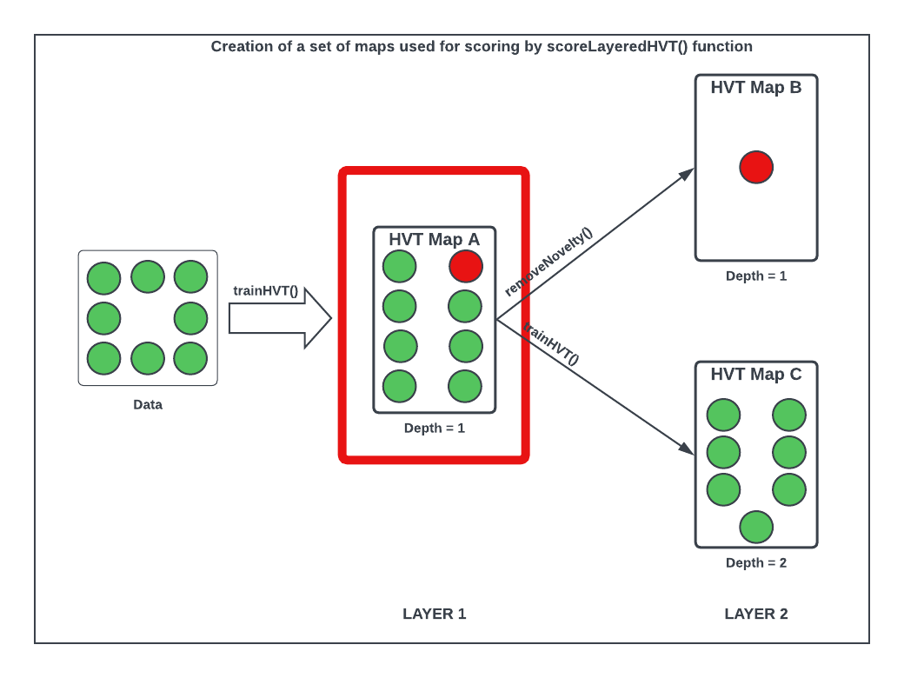
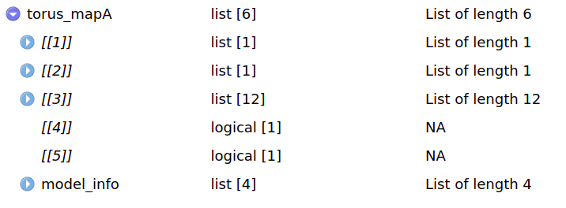
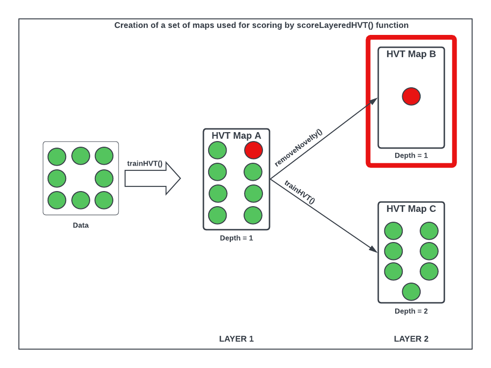
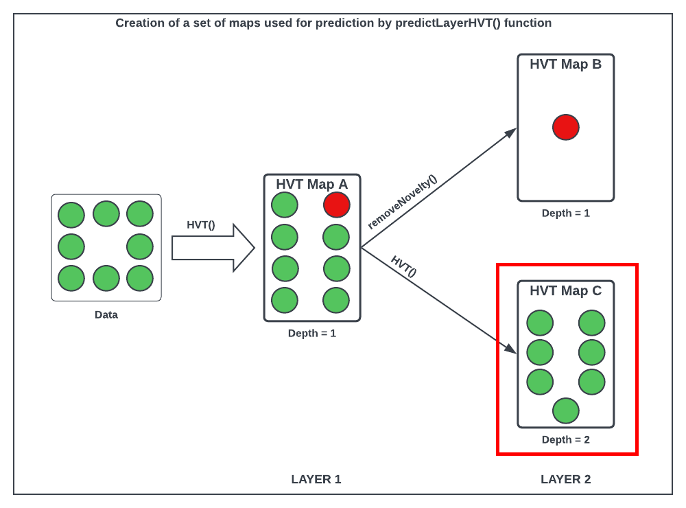

```{css, echo=FALSE}
/* CSS for floating TOC on the left side */
#TOC {
    /* float: left; */
    position: fixed;
    margin-left: -22vw;
    width: 18vw;
    height: fit-content;
    overflow-y: auto;
    padding-top: 20px;
    padding-bottom: 20px;
    background-color: #f9f9f9;
    border-right: 1px solid #ddd;
    margin-top: -10em; 
}
.main-container {
  margin-left: 222px; /* Adjust this value to match the width of the TOC + some margin */
}
body{
max-width:1200px;
width: 50%;
}
p {
text-align: justify;
}
.caption {
  text-align: center;
}
li {
  padding-bottom: 5px;
}
```

```{r setup, warning = FALSE, include = FALSE}
knitr::opts_chunk$set(
  collapse = TRUE,
  comment = "#>",
  out.width = "auto",
  out.height = "480px",
  fig.width = 7,
  fig.height = 5,
  fig.align = "center",
  fig.retina = 1,
  dpi = 150
)
list.of.packages <- c("plyr", "dplyr", "reactable", "kableExtra", "geozoo", "plotly", "purrr", "sp", "HVT", "data.table", "gridExtra", "tidyr")
new.packages <-
  list.of.packages[!(list.of.packages %in% installed.packages()[, "Package"])]
if (length(new.packages))
  install.packages(new.packages, dependencies = TRUE, repos='https://cloud.r-project.org/')
lapply(list.of.packages, library, character.only = TRUE)


options(expressions = 10000)
global_var <- nzchar(Sys.getenv("RUN_VIGNETTE"))
global_var <- TRUE

scrolLimit <- function(noOfRows){
  if(noOfRows<10){
    swe = paste(as.character(noOfRows*50),"px")
  }
  else{
    swe = "400px"
  }
  return(swe)
}

Table <- function(data,scroll = TRUE, limit = NULL){
  if(!is.null(limit)){
    data <- head(data,limit)
  }
  kable_table <- data %>% kable(escape = FALSE,align = "c") %>% kable_styling(bootstrap_options = c("striped", "hover", "responsive"))
  scroll <- scroll
  
  if(scroll == TRUE){
  kable_table <- kable_table %>% scroll_box(width = "100%", height = scrolLimit(nrow(data)))
  }
  return(kable_table)
}

set.seed(240)
```

# 1. Abstract

The HVT package is a collection of R functions to facilitate building [topology preserving maps](https://users.ics.aalto.fi/jhollmen/dippa/node9.html) for rich multivariate data analysis. Tending towards a big data preponderance, a large number of rows. A collection of R functions for this typical workflow is organized below:

1.  **Data Compression**: Vector quantization (VQ), HVQ (hierarchical vector quantization) using means or medians. This step compresses the rows (long data frame) using a compression objective.

2.  **Data Projection**: Dimension projection of the compressed cells to 1D,2D or Interactive surface plot with the Sammons Non-linear Algorithm. This step creates topology preserving map (also called as [embedding](https://en.wikipedia.org/wiki/Embedding)) coordinates into the desired output dimension.

3.  **Tessellation**: Create cells required for object visualization using the Voronoi Tessellation method, package includes heatmap plots for hierarchical Voronoi tessellations (HVT). This step enables data insights, visualization, and interaction with the topology preserving map. Useful for semi-supervised tasks.

4.  **Scoring**: Scoring new data sets and recording their assignment using the map objects from the above steps, in a sequence of maps if required.

# 2. Import Code Modules

Here is the guide to install the HVT package. This helps user to install the most recent version of the HVT package.
```{r}
###direct installation###
#install.packages("HVT")

#or

###git repo installation###
#library(devtools)
#devtools::install_github(repo = "Mu-Sigma/HVT")

```


**NOTE:** At the time documenting this vignette, the updated changes were not still in CRAN, hence we are sourcing the scripts from the R folder directly to the session environment.
```{r, loading all the script files of the package, message=FALSE, warning=FALSE, include = TRUE}
# Sourcing required code scripts for HVT
script_dir <- "../R"
r_files <- list.files(script_dir, pattern = "\\.R$", full.names = TRUE)
invisible(lapply(r_files, function(file) { source(file, echo = FALSE); }))
```


# 3. Example : HVT with the Torus dataset

**In this section, we will see how we can use the package to visualize multidimensional data by projecting them to two dimensions using Sammon's projection and further used for Scoring.**

**Data Understanding**

First of all, let us see how to generate data for torus. We are using a library `geozoo` for this purpose. Geo Zoo (stands for Geometric Zoo) is a compilation of geometric objects ranging from three to 10 dimensions. Geo Zoo contains regular or well-known objects, eg cube and sphere, and some abstract objects, e.g. Boy's surface, Torus and Hyper-Torus. 

Here, we will generate a 3D torus (a torus is a surface of revolution generated by revolving a circle in three-dimensional space one full revolution about an axis that is coplanar with the circle) with 12000 points.

**Raw Torus Dataset**

The torus dataset includes the following columns:

* x: This column represents the X-coordinate of each point in the torus.
* y: This column represents the Y-coordinate of each point in the torus.
* z: This column represents the Z-coordinate of each point in the torus.

Lets, explore the **torus dataset containing 12000 points**. For the sake of brevity we are displaying first 6 rows.

```{r torus generate,warning=FALSE,message=FALSE,eval = global_var}
set.seed(240)
# Here p represents dimension of object, n represents number of points
torus <- geozoo::torus(p = 3,n = 12000)
torus_df <- data.frame(torus$points)
colnames(torus_df) <- c("x","y","z")
torus_df <- torus_df %>% round(4)
Table(head(torus_df), scroll = FALSE)
```


Now let's have a look at **structure** of the torus dataset.

```{r, message=FALSE, warning=FALSE}
str(torus_df)
```

**Data distribution**

This section displays four objects.

1) *Variable Histograms*: The histogram distribution of all the variables in the dataset.

2) *Box Plots*: Box plots for each numeric column in the dataset across panels. These plots will display the median and Inter Quartile Range of each column at a panel level.

3) *Correlation Matrix*: This calculates the pearson correlation which is a
bivariate correlation value measuring the linear correlation between two
numeric columns. The output plot is shown as a matrix.

4) *Summary EDA*: The table provides descriptive statistics for all the variables in the dataset.

It uses an inbuilt function called `edaPlots` to display the above mentioned four objects.

```{r, warning=FALSE, message=FALSE}
edaPlots(torus_df)
```


**Train - Test Split**

Let us split the torus dataset into train and test. We will randomly select 80% of the torus dataset as train and remaining as test.

```{r train-test torus,warning=FALSE,message=FALSE,eval = global_var}
smp_size <- floor(0.80 * nrow(torus_df))
set.seed(279)
train_ind <- sample(seq_len(nrow(torus_df)), size = smp_size)
torus_train <- torus_df[train_ind, ]
torus_test <- torus_df[-train_ind, ]
```


**Training Dataset**

Now, lets have a look at the selected **training dataset** containing (9600 data points). For the sake of brevity we are displaying first six rows.

```{r torus head, warning=FALSE, eval = global_var}
rownames(torus_train) <- NULL
Table(head(torus_train), scroll= FALSE)
```

Now lets have a look at **structure** of the training dataset.

```{r train torus structure, warning=FALSE, eval = global_var}
str(torus_train)
```

**Data Distribution**

```{r, warning=FALSE,message=FALSE}
edaPlots(torus_train)
```


**Testing Dataset**

Now, lets have a look at **testing dataset containing(2400 data points)**.For the sake of brevity we are displaying first six rows.


```{r torus 2 head, warning=FALSE, eval = global_var}
rownames(torus_test) <- NULL
Table(head(torus_test), scroll = FALSE)
```

Now lets have a look at **structure** of the testing dataset.

```{r torus test structure, warning=FALSE, eval = global_var}
str(torus_test)
```

**Data Distribution**

```{r, warning=FALSE,message=FALSE}
edaPlots(torus_test)
```

# 4. Map A : Base Compressed Map

Let us try to visualize the compressed Map A from the diagram below.

```{r ,echo=FALSE,warning=FALSE,fig.show='hold',message=FALSE,fig.cap='Figure 1: Data Segregation with highlighted bounding box in red around compressed map A'}

```

This package can perform vector quantization using the following algorithms -

-   Hierarchical Vector Quantization using k−means
-   Hierarchical Vector Quantization using k−medoids

For more information on vector quantization, refer the following [link](https://gitlab.ird.mu-sigma.com/applied_prescriptive_methods/HVT/-/blob/restructure/vignettes/HVT_vignette.html#data-compression).

The trainHVT function constructs highly compressed hierarchical Voronoi tessellations. The raw data is first scaled and this scaled data is supplied as input to the vector quantization algorithm. The vector quantization algorithm compresses the dataset until a user-defined compression percentage rate is achieved using a parameter called quantization error which acts as a threshold and determines the compression percentage. It means that for a given user-defined compression percentage we get the 'n' number of cells, then all of these cells formed will have a quantization error less than the threshold quantization error.

Let's try to comprehend the **trainHVT function** first before moving ahead.

```{r trainHVT function, echo=TRUE, eval=FALSE}
trainHVT(
  dataset,
  min_compression_perc,
  n_cells,
  depth,
  quant.err,
  distance_metric = c("L1_Norm", "L2_Norm"),
  error_metric = c("mean", "max"),
  quant_method = c("kmeans", "kmedoids"),
  normalize = TRUE,
  seed = 279,
  diagnose = FALSE,
  hvt_validation = FALSE,
  train_validation_split_ratio = 0.8
)
```

Each of the parameters of trainHVT function have been explained below:

* __`dataset`__ - A dataframe, with numeric columns (features) that will be used for training the model.

* __`min_compression_perc`__ - An integer, indicating the minimum compression percentage to be achieved for the dataset. It indicates the desired level of reduction in dataset size compared to its original size.

* __`n_cells`__  - An integer, indicating the number of cells per hierarchy (level). This parameter determines the granularity or level of detail in the hierarchical vector quantization.

* __`depth`__   - An integer, indicating the number of levels. A depth of 1 means no hierarchy (single level), while higher values indicate multiple levels (hierarchy).

* __`quant.err`__ - A number indicating the quantization error threshold. A cell will only breakdown into further cells if the quantization error of the cell is above the defined quantization error threshold.

* __`projection.scale`__ - A number indicating the scale factor for the tessellations so as to visualize the sub-tesselations well enough. It helps in adjusting the visual representation of the hierarchy to make the sub-tesselations more visible.

* __`normalize`__	- A logical value indicating if the dataset should be normalized. When set to TRUE, scales the values of all features to have a mean of 0 and a standard deviation of 1 (Z-score)

* __`seed`__ - A Random Numeric Seed to preserve the repeatability.

* __`distance_metric`__	- The distance metric can be `L1_Norm`(Manhattan) or `L2_Norm`(Eucledian). `L1_Norm` is selected by default. The distance metric is used to calculate the distance between an `n` dimensional point and centroid. 

* __`error_metric`__ - The error metric can be `mean` or `max`. `max` is selected by default. `max` will return the max of `m` values and `mean` will take mean of `m` values where each value is a distance between a point and centroid of the cell.

* __`quant_method`__ - The quantization method can be `kmeans` or `kmedoids`. Kmeans uses means (centroids) as cluster centers while Kmedoids uses actual data points (medoids) as cluster centers. `kmeans` is selected by default.
    
* __`scale_summary`__ -  A list with user defined mean and standard deviation values for all the features in the dataset. Pass the scale summary when normalize is set to FALSE.

* __`diagnose`__ - A logical value indicating whether user wants to perform diagnostics on the model. Default value is FALSE. 

* __`hvt_validation`__ - A logical value indicating whether user wants to holdout a validation set and find mean absolute deviation of the validation points from the centroid. Default value is FALSE.

* __`train_validation_split_ratio`__ - A numeric value indicating train validation split ratio. This argument is only used when hvt_validation has been set to TRUE. Default value for the argument is 0.8.

The output of trainHVT function (list of 7 elements) have been explained below with an image attached for clear understanding.

**NOTE: Here the attached image is the snapshot of output list generated from map A which can be referred later in this section**

```{r trainhvt list,echo=FALSE,warning=FALSE,fig.show='hold',message=FALSE,fig.cap='Figure 2: The Output list generated by trainHVT function.', out.width="50%", out.height=  "20%", fig.align='center'}

```

* The '1st element' is a list containing information related to plotting tessellations. This information might include coordinates, boundaries, or other details necessary for visualizing the tessellations

* The '2nd element' is a list containing information related to Sammon's projection coordinates of the data points in the reduced-dimensional space.

* The '3rd element'  is a list containing detailed information about the hierarchical vector quantized data along with a summary section containing no of points, Quantization Error and the centroids for each cell for 2D.

* The '4th element'  is a list that contains all the diagnostics information of the model when diagnose is set to TRUE. Otherwise NA.

* The '5th element' is a list that contains all the information required to generates a Mean Absolute Deviation (MAD) plot, if hvt_validation is set to TRUE. Otherwise NA 

* The '6th element'  is a list containing detailed information about the hierarchical vector quantized data along with a summary section containing no of points, Quantization Error and the centroids for each cell which is the output of `hvq`.

* The '7th element' (model info) is a list that contains model generated timestamp, input parameters passed to the model and the validation results.

We will use the `trainHVT` function to compress our data while preserving essential features of the dataset. Our goal is to achieve data compression upto atleast `80%`. In situations where the compression ratio does not meet the desired target, we can explore adjusting the model parameters as a potential solution. This involves making modifications to parameters such as the `quantization error threshold` or `increasing the number of cells` and then rerunning the trainHVT function again.

As this is already done in  [**HVT Vignette:**](https://gitlab.ird.mu-sigma.com/applied_prescriptive_methods/HVT/-/blob/restructure/vignettes/HVT_vignette.html)  please refer for more information.

**Model Parameters**

* Number of Cells at each Level = 900
* Maximum Depth = 1
* Quantization Error Threshold = 0.1
* Error Metric = Max
* Distance Metric = Manhattan

```{r torus hvt third ,warning=FALSE,fig.show='hold',results='hide',message=FALSE,fig.cap='Figure 5: The Voronoi tessellation for layer 1 shown for the 900 cells in the dataset ’torus’',eval = global_var}
set.seed(240)
torus_mapA <- trainHVT(
  torus_train,
  n_cells = 900,
  depth = 1,
  quant.err = 0.1,
  normalize = FALSE,
  distance_metric = "L1_Norm",
  error_metric = "max",
  quant_method = "kmeans"
)

```


Let's check the compression summary for torus.

```{r compression summary torus third,warning=FALSE,eval = global_var}
displayTable(data = torus_mapA[[3]]$compression_summary,columnName = 'percentOfCellsBelowQuantizationErrorThreshold', value = 0.8, tableType = "compression")
```

We successfully compressed 83% of the data using n_cells parameter as 900, the next step involves performing data projection on the compressed data. In this step, the compressed data will be transformed and projected onto a lower-dimensional space to visualize and analyze the data in a more manageable form.

As per the manual, **`torus_mapA[[3]]`** gives us detailed information about the hierarchical vector quantized data. **`torus_mapA[[3]][['summary']]`** gives a nice tabular data containing no of points, Quantization Error and the codebook.

The datatable displayed below is the **summary from torus_mapA** showing Cell.ID, Centroids and Quantization Error for each of the 900 cells. For the sake of brevity, we are displaying only the first 100 rows.

```{r hvt_mapA display results, warning=FALSE, echo=TRUE}
displayTable(data =torus_mapA[[3]][['summary']], columnName= 'Quant.Error', value = 0.1, tableType = "summary")

```

Now let us understand what each column in the above table means:

-   **`Segment.Level`** - Level of the cell. In this case, we have performed Vector Quantization for depth 1. Hence Segment Level is 1.

-   **`Segment.Parent`** - Parent segment of the cell.

-   **`Segment.Child (Cell.Number)`** - The children of a particular cell. In this case, it is the total number of cells at which we achieved the defined compression percentage.

-   **`n`** - No of points in each cell.

-   **`Cell.ID`** - Cell_ID's are generated for the multivariate data using 1-D Sammon's Projection algorithm.

-   **`Quant.Error`** - Quantization Error for each cell.

All the columns after this will contain centroids for each cell. They can also be called a codebook, which represents a collection of all centroids or codewords.


Now let's try to understand **plotHVT** function. The parameters have been explained in detail below:

```{r plotHVT function,echo = TRUE, eval= FALSE}
plotHVT <-(hvt.results, line.width, color.vec, pch1 = 21, centroid.size = 1.5, 
           title = NULL, maxDepth = NULL, child.level, hmap.cols,
           quant.error.hmap = NULL, n_cells.hmap = NULL, label.size = 0.5, 
           sepration_width = 7, layer_opacity = c(0.5, 0.75, 0.99), dim_size = 1000, plot.type = '2Dhvt') 
```

*  **`hvt.results`** - (2Dproj/2Dhvt/2Dheatmap/surface_plot)  A list obtained from the trainHVT function while performing hierarchical vector quantization on training dataset. This list provides an overview of the hierarchical vector quantized data, including diagnostics, tessellation details, Sammon's projection coordinates, and model input information.

* **`line.width`**	- (2Dhvt/2Dheatmap) A vector indicating the line widths of the tessellation boundaries for each layer.

* **`color.vec`**	- (2Dhvt/2Dheatmap) A vector indicating the colors of the tessellations boundaries at each layer.

* **`pch1`**	- (2Dhvt/2Dheatmap) Symbol, It plots the centroids with a particular symbol such as (solid circle, bullet, filled square, filled diamond) in the tessellations.(default = 21 i.e filled circle).

* **`centroid.size`**	- (2Dhvt/2Dheatmap) Size of centroids for each level of tessellations (default = 3).

* **`title`**	-  (2Dhvt) Set a title for the plot (default = NULL).

* **`maxDepth`** -  (2Dhvt) An integer indicating the number of levels. (default = NULL)

* **`cell_id`** - (2Dhvt) Logical. To indicate whether the plot should have Cell IDs or not for the level 1. (default = FALSE)

* **`child.level`** - (2Dheatmap/surface_plot) A Number indicating the level for which the heat map is to be plotted.

* **`hmap.cols`** - (2Dheatmap/surface_plot) A Number or a Character which is the column number or column name from
the dataset indicating the variables for which the heat map is to be plotted.

* **`label.size`** - (2Dheatmap) The size by which the tessellation labels should
be scaled.(default = 0.5)

* **`quant.error.hmap`** - (2Dheatmap) A number indicating the quantization error threshold.

* **`sepration_width`** - (surface_plot) An integer indicating the width between two Levels.

* **`layer_opacity`** - (surface_plot) A vector indicating the opacity of each layer/ level.

* **`dim_size`** - (surface_plot) An integer indicating the dimension size used to create the matrix for the plot.

* **`plot.type`** -  A Character indicating which type of plot should be generated. Accepted entries are '1D','2Dproj',  '2Dhvt','2Dheatmap', 'surface_plot'. Default value is '2Dhvt'.


Let's plot the Voronoi tessellation for layer 1 (map A).

```{r, warning=FALSE,message=FALSE,fig.cap='Figure 3: The Voronoi Tessellation for layer 1 (map A) shown for the 900 cells in the dataset ’torus’'}
plotHVT(torus_mapA,
        line.width = c(0.4), 
        color.vec = c("navy blue"),
        centroid.size = 0.01,
        maxDepth = 1,
        plot.type = "2Dhvt") 
```

## 4.1 Heatmaps

Now let's plot the Voronoi Tessellation with the heatmap overlaid for all the features in the torus dataset for better visualization and interpretation of data patterns and distributions.

The heatmaps displayed below provides a visual representation of the spatial characteristics of the torus dataset, allowing us to observe patterns and trends in the distribution of each of the features (x,y,z). The sheer green shades highlight regions with higher values in each of the heatmaps, while the indigo shades indicate areas with the lowest values in each of the heatmaps. By analyzing these heatmaps, we can gain insights into the variations and relationships between each of these features within the torus dataset.


```{r hvt_mapA hmp level x torus,warning=FALSE,fig.show='hold',results='hide',message=FALSE,fig.cap='Figure 4: The Voronoi Tessellation with the heat map overlaid for variable ’x’ in the ’torus’ dataset',eval = global_var}

  plotHVT(
  torus_mapA,
  child.level = 1,
  hmap.cols = "x",
  line.width = c(0.2),
  color.vec = c("navy blue"),
  centroid.size = 0.1,
  plot.type = '2Dheatmap'
) 

```

```{r hvt_mapA hmp level y torus,warning=FALSE,fig.show='hold',results='hide',message=FALSE,fig.cap='Figure 5: The Voronoi Tessellation with the heat map overlaid for variable ’y’ in the ’torus’ dataset',eval = global_var}

  plotHVT(
  torus_mapA,
  child.level = 1,
  hmap.cols = "y",
  line.width = c(0.2),
  color.vec = c("navy blue"),
  centroid.size = 0.1,
  plot.type = '2Dheatmap'
) 

```

```{r hvt_mapA hmp  level one z torus,warning=FALSE,fig.show='hold',results='hide',message=FALSE,fig.cap='Figure 6: The Voronoi Tessellation with the heat map overlaid for variable ’z’ in the ’torus’ dataset',eval = global_var}

  plotHVT(
  torus_mapA,
  child.level = 1,
  hmap.cols = "z",
  line.width = c(0.2),
  color.vec = c("navy blue"),
  centroid.size = 0.1,
  plot.type = '2Dheatmap'
) 

```


# 5. Map B : Compressed Novelty Map

Let us try to visualize the Map B from the diagram below.

```{r ,echo=FALSE,warning=FALSE,fig.show='hold',message=FALSE,fig.cap='Figure 7: Data Segregation with highlighted bounding box in red around map B'}

```

In this section, we will manually figure out the novelty cells from the plotted torus_mapA and store it in **identified_Novelty_cells** variable.

**Note**: For manual selecting the novelty cells from map A, one can enhance its interactivity by adding plotly elements to the code. This will transform map A into an interactive plot, allowing users to actively engage with the data. By hovering over the centroids of the cells, a tag containing segment `child` information will be displayed. Users can explore the map by hovering over different cells and selectively choose the novelty cells they wish to consider. Added an image for reference.

```{r ,echo=FALSE,warning=FALSE,fig.show='hold',message=FALSE,fig.cap='Figure 8: Manually selecting novelty cells'}
knitr::include_graphics('reference.png')
```

The **`removeNovelty`** function removes the identified novelty cell(s) from the training dataset (containing 9600 datapoints) and stores those records separately.

It takes input as the cell number (Segment.Child) of the manually identified novelty cell(s) and the compressed HVT map (torus_mapA) with 900 cells. It returns a list of two items: `data with novelty`, and `data without novelty`.

*NOTE:* As we are using `torus dataset` here, the identified novelty cells given are for demo purpose.

```{r remove_novelty,results='asis', message=FALSE}
identified_Novelty_cells <<- c(595,425,165,875,822,697,166)   #as a example
output_list <- removeNovelty(identified_Novelty_cells, torus_mapA)
data_with_novelty <- output_list[[1]]
data_without_novelty <- output_list[[2]]
```

Let's have a look at the **data with novelty**(containing 83 records).

```{r hvt_mapB results, warning=FALSE, echo=TRUE}
novelty_data <- data_with_novelty
novelty_data$Row.No <- row.names(novelty_data)
novelty_data <- novelty_data %>% dplyr::select("Row.No","Cell.ID","Cell.Number","x","y","z")
colnames(novelty_data) <- c("Row.No","Cell.ID","Segment.Child","x","y","z")
Table(novelty_data,scroll = TRUE, limit = 100)
```

```{=html}
<style>
/* Add space after the table */
table {
  margin-bottom: 20px;
}
</style>
```
## 5.1 Voronoi Tessellation with highlighted novelty cell

The **`plotNovelCells`** function is used to plot the Voronoi tessellation using the compressed HVT map (torus_mapA) containing 900 cells and highlights the identified novelty cell(s) i.e 7 cells (containing 83 records) in red on the map.

```{r compress_novelty_plot,warning=FALSE,fig.show='hold',results='hide',message=FALSE,fig.cap='Figure 9: The Voronoi Tessellation constructed using the compressed HVT map (map A) with the novelty cell(s) highlighted in red',eval = global_var}
plotNovelCells(identified_Novelty_cells, torus_mapA,line.width = c(0.4),centroid.size = 0.01)
```

We pass the dataframe with novelty records (83 records) to trainHVT function along with other model parameters mentioned below to generate **map B** (layer2)

**Model Parameters**

-   Number of Cells at each Level = 11
-   Maximum Depth = 1
-   Quantization Error Threshold = 0.1
-   Error Metric = Max
-   Distance Metric = Manhattan

```{r, message=FALSE,warning=FALSE}
colnames(data_with_novelty) <- c("Cell.ID","Segment.Child","x","y","z")
data_with_novelty <- data_with_novelty[,-1:-2]
torus_mapB <- list()
mapA_scale_summary = torus_mapA[[3]]$scale_summary
torus_mapB <- trainHVT(data_with_novelty,
                  n_cells = 11,   
                  depth = 1,
                  quant.err = 0.1,
                  normalize = FALSE,
                  distance_metric = "L1_Norm",
                  error_metric = "max",
                  quant_method = "kmeans"
                  )

```

The datatable displayed below is the **summary from map B (layer 2)** showing Cell.ID, Centroids and Quantization Error for each of the 11 cells.

```{r, message=FALSE,warning=FALSE}
displayTable(data =torus_mapB[[3]][['summary']], columnName= 'Quant.Error', value = 0.1, tableType = "summary")
```

Now let's check the compression summary for HVT (torus_mapB). The table below shows no of cells, no of cells having quantization error below threshold and percentage of cells having quantization error below threshold for each level.

```{r hvt_map_B compression summary,warning=FALSE,eval = global_var}
displayTable(data = torus_mapB[[3]]$compression_summary,columnName = 'percentOfCellsBelowQuantizationErrorThreshold', value = 0.8, tableType = "compression")
```

**As it can be seen from the table above, `82%`** of the cells have hit the quantization threshold error.Since we are successfully able to attain the desired compression percentage, so we will not further subdivide the cells

# 6. Map C : Compressed Map without Novelty

Let us try to visualize the compressed Map C from the diagram below.

```{r ,echo=FALSE,warning=FALSE,fig.show='hold',message=FALSE,fig.cap='Figure 10:Data Segregation with highlighted bounding box in red around compressed map C'}

```

## 6.1 Iteration 1

With the Novelties removed, we construct another hierarchical Voronoi tessellation **map C** layer 2 on the data without Novelty (containing 9517 records) and below mentioned model parameters.

**Model Parameters**

-   Number of Cells at each Level = 10
-   Maximum Depth = 2
-   Quantization Error Threshold = 0.1
-   Error Metric = Max
-   Distance Metric = Manhattan

```{r,warning=FALSE,message=FALSE}
torus_mapC <- list()
torus_mapC <- trainHVT(data_without_novelty,
                  n_cells = 10,
                  depth = 2,
                  quant.err = 0.1,
                  normalize = FALSE,
                  distance_metric = "L1_Norm",
                  error_metric = "max",
                  quant_method = "kmeans")
```

Now let's check the compression summary for HVT (torus_mapC) where n_cell was set to 10. The table below shows no of cells, no of cells having quantization error below threshold and percentage of cells having quantization error below threshold for each level.

```{r hvt_map_C compression summary,warning=FALSE,eval = global_var}
displayTable(data = torus_mapC[[3]]$compression_summary,columnName = 'percentOfCellsBelowQuantizationErrorThreshold', value = 0.8, tableType = "compression")

```

**As it can be seen from the table above, `0%`** of the cells have hit the quantization threshold error in level 1 and **`0%`** of the cells have hit the quantization threshold error in level 2

## 6.2 Iteration 2

Since, we are yet to achive atleast 80% compression at depth 2. Let's try to compress again using the below mentioned set of model parameters and the data without novelty (containing 9517 records).

**Model Parameters**

-   Number of Cells at each Level = 30
-   Maximum Depth = 2
-   Quantization Error Threshold = 0.1
-   Error Metric = Max
-   Distance Metric = Manhattan

```{r,warning=FALSE,message=FALSE}
torus_mapC <- list()
torus_mapC <- trainHVT(data_without_novelty,
                  n_cells = 30,    
                  depth = 2,
                  quant.err = 0.1,
                  normalize = FALSE,
                  distance_metric = "L1_Norm",
                  error_metric = "max",
                  quant_method = "kmeans")
```

The datatable displayed below is the **summary from map C (layer2)**. showing Cell.ID, Centroids and Quantization Error for each of the 928 cells.

```{r,message=FALSE,warning=FALSE}
displayTable(data =torus_mapC[[3]][['summary']], columnName= 'Quant.Error', value = 0.1, tableType = "summary")
```

Now let's check the **compression summary** for HVT (torus_mapC). The table below shows no of cells, no of cells having quantization error below threshold and percentage of cells having quantization error below threshold for each level.

```{r hvt_mapC compression summary,warning=FALSE,eval = global_var}
displayTable(data = torus_mapC[[3]]$compression_summary,columnName = 'percentOfCellsBelowQuantizationErrorThreshold', value = 0.8, tableType = "compression")
```

**As it can be seen from the table above, `0%`** of the cells have hit the quantization threshold error in level 1 and **`82%`** of the cells have hit the quantization threshold error in level 2

Let's plot the Voronoi tessellation for layer 2 (map C)

```{r, warning=FALSE,message=FALSE,fig.cap='Figure 11: The Voronoi Tessellation for layer 2 (map C) shown for the 928 cells in the dataset ’torus’ at level 2'}
plotHVT(torus_mapC,
        line.width = c(0.2,0.1), 
        color.vec = c("navyblue","steelblue"),
        centroid.size = 0.1,
        maxDepth = 2, 
        plot.type = '2Dhvt')
 
```


## 6.3 Heatmaps


Now let's plot all the features for each cell at level two as a heatmap for better visualization.

The heatmaps displayed below provides a visual representation of the spatial characteristics of the torus dataset, allowing us to observe patterns and trends in the distribution of each of the features (x,y,z). The sheer green shades highlight regions with higher values in each of the heatmaps, while the indigo shades indicate areas with the lowest values in each of the heatmaps. By analyzing these heatmaps, we can gain insights into the variations and relationships between each of these features within the torus dataset.


```{r hvt_mapC hmp level one x torus,warning=FALSE,fig.show='hold',results='hide',message=FALSE,fig.cap='Figure 12: The Voronoi Tessellation with the heat map overlaid for feature `x` in the ’torus’ dataset' , eval = global_var}
  plotHVT(
  torus_mapC,
  child.level = 2,
  hmap.cols = "x",
  line.width = c(0.2,0.1),
  color.vec = c("navyblue","steelblue"),
  centroid.size = 0.1,
  plot.type = '2Dheatmap'
) 

```


```{r hvt_mapC hmp levelonetorus,warning=FALSE,fig.show='hold',results='hide',message=FALSE,fig.cap='Figure 13: The Voronoi Tessellation with the heat map overlaid for feature `y` in the ’torus’ dataset',eval = global_var}

  plotHVT(
  torus_mapC,
  child.level = 2,
  hmap.cols = "y",
  line.width = c(0.2,0.1),
  color.vec = c("navyblue","steelblue"),
  centroid.size = 0.1,
  plot.type = '2Dheatmap'
) 

```

```{r hvt_mapC hmp level one z torus,warning=FALSE,fig.show='hold',results='hide',message=FALSE,fig.cap='Figure 14: The Voronoi Tessellation with the heat map overlaid for feature `z` in the ’torus’ dataset',eval = global_var}

  plotHVT(
  torus_mapC,
  child.level = 2,
  hmap.cols = "z",
  line.width = c(0.2,0.1),
  color.vec = c("navyblue","steelblue"),
  centroid.size = 0.1,
  plot.type = '2Dheatmap'
) 

```


**We now have the set of maps (map A, map B & map C) which will be used to score, which map and cell each test record is assigned to.**

# 7. Scoring

Now once we have built the model, let us try to score using our testing dataset (containing 2400 data points) which cell and which layer each point belongs to.

The **scoreLayeredHVT** function is used to score the testing dataset using the scored set of maps. This function takes an input - a testing dataset and a set of maps (map A, map B, map C).

Now, Let us understand the **`scoreLayeredHVT`** function.

```{r scoreLayeredHVT function,echo = TRUE, eval= FALSE}
scoreLayeredHVT(data,
                hvt_mapA,
                hvt_mapB,
                hvt_mapC,
                child.level = 1,
                mad.threshold = 0.2,
                normalize = TRUE, 
                seed=300,
                distance_metric="L1_Norm",
                error_metric="max",
                yVar= NULL)
```

Each of the parameters of **scoreLayeredHVT** function has been explained below:

Before that, the approach of `scoreLayeredHVT` function is to use scoreHVT function to score the test data against the given results of trainHVT which is referred as 'map' here. Hence the scoreLayeredHVT scores the test dataset against map A, B & C and further process and merge the final output. So the arguments used in scoreHVT is important here for smooth execution of function.

-   **`data`** - A dataframe containing the test dataset. The dataframe should have all the variable(features) used for training.

-   **`hvt_mapA`** - Result obtained from trainHVT function while performing hierarchical vector quantization on train data. This list containes information about the hierarchical vector quantized data along with a summary section.

-   **`hvt_mapB`** - Result obtained from trainHVT function while performing hierarchical vector quantization on data with novelty data.It is a subset of the training data obtained as a result of removeNovelty function (1st element).

-   **`hvt_mapC`** - Result obtained from trainHVT function while performing hierarchical vector quantization on data without novelty. It is a subset of the training data obtained as a result of removeNovelty function (2nd element).

-  **`child.level`** - A number indicating the depth for which the heat map is to be plotted. Each depth represents a different level of clustering or partitioning of the data.

-   **`mad.threshold`** -  A numeric value indicating the permissible Mean Absolute Deviation which is obtained from Minimum Intra centroid plot(when diagnose is set to TRUE in trainHVT). `mad.threshold` value is important since it is used in anomaly detection. Default value is 0.2
*NOTE: for a given datapoint, when the quantization error is above `mad.threshold` it is denoted as anomaly else not.*

-   **`normalize`** -  A logical value indicating if the dataset should be normalized. When set to TRUE, the data (testing dataset) is standardized by mean and sd of the training dataset referred from the trainHVT(). When set to FALSE, the `data` is used as such without any changes.

-  **`seed`**   - A Random Numeric Seed to preserve the repeatability.

-   **`distance_metric`** - The distance metric can be `L1_Norm`(Manhattan) or `L2_Norm`(Eucledian). The metric is used when calculating distance between each datapoint(in test dataset) with the centroids obtained from results of trainHVT. Default is `L1_Norm`.

-   **`error_metric`** - The error metric can be `mean` or `max`.  `max` will return the max of `m` values and `mean` will take mean of `m` values where each value is a distance between the datapoint and centroid of the cell. This helps in calculating the scored quantization error. Default value is `max`.

-   **`yVar`** - A character or a vector representing the name of the dependent variable(s)


**When normalize is set to TRUE, the scoreHVT function has an inbuilt feature to standardize the  testing dataset based on the mean and standard deviation of the training dataset from the trainHVT results.**

* Steps involved in Normalizing the data:
* From the trainHVT results (here it is torus_mapA, torus_mapB & torus_mapC) the summary is accessed which is the third list object.
* From the summary list, the scale.summary object is taken which have two entries that stores mean_data and std_data of all the columns in training dataset.
* Those two entries are taken for the center and scale parameter in scale() which normalizes the testing dataset similar to training dataset in scoreHVT()
* Here in `scoreLayeredHVT` function the testing dataset is scored against all the maps (A, B & C) by using scoreHVT function and the results are merged and further processed.
* This approach ensures that the model that is evaluated on testing dataset scaled in the same way as the training dataset, maintaining consistency and improving the model’s ability to generalize to new, unseen data.


The function score based on the HVT maps - map A, map B and map C, constructed using trainHVT function. For each test record, the function will assign that record to Layer1 or Layer2. Layer1 contains the cell ids from map A and Layer 2 contains cell ids from map B (novelty map) and map C (map without novelty).

**Scoring Algorithm**

The Scoring algorithm recursively calculates the distance between each point in the testing dataset and the cell centroids for each level. The following steps explain the scoring method for a single point in the test dataset:

1.  Calculate the distance between the point and the centroid of all the cells in the first level.
2.  Find the cell whose centroid has minimum distance to the point.
3.  Check if the cell drills down further to form more cells.
4.  If it doesn't, return the path. Or else repeat steps 1 to 4 till we reach a level at which the cell doesn't drill down further.

**Note : The Scoring algorithm will not work if some of the variables used to perform quantization are missing. In the testing dataset, we should not remove any features.**

```{r, message=FALSE,warning=FALSE}
validation_data <- torus_test
new_score <- scoreLayeredHVT(
    data=validation_data,
    hvt_mapA = torus_mapA,
    hvt_mapB = torus_mapB,
    hvt_mapC = torus_mapC,
    normalize = FALSE
  )
```

Let's see which cell and layer each point belongs to and check the Mean Absolute Difference for each of the **2400 records**. For the sake of brevity, we are only displaying the first 100 rows.

```{r}
act_pred <- new_score[["actual_predictedTable"]]
rownames(act_pred) <- NULL
act_pred %>% head(100) %>%as.data.frame() %>%Table(scroll = TRUE)
```

```{r,message=FALSE,warning=FALSE,fig.cap='Figure 16: Mean Absolute Difference'}
hist(act_pred$diff, breaks = 30, col = "blue", main = "Mean Absolute Difference", xlab = "Difference")
```

# 8. Executive Summary

-   We have considered torus dataset for creating a scored sequence of maps using scoreLayeredHVT() in this vignette.

-   Our goal is to achieve data compression upto atleast `80%`.

-   We construct a compressed HVT map (torus_mapA) using the trainHVT() on the training dataset by setting **`n_cells`** to 900 and **`quant.error`** to 0.1 and we were able to attain a compression of 83%.

-   Based on the output of the above step, we manually identify the novelty cell(s) from the plotted map A. For this dataset, we identify the 7 cells as the novelty cells. (since torus dataset does not have outliers we are using this for demo purpose.)

-   We pass the identified novelty cell(s) as a parameter to the removeNovelty() along with HVT torus_mapA. The function removes that novelty cell(s) from the dataset and stores them separately. It also returns the data without novelty(s).

-   The plotNovelCells() constructs hierarchical voronoi tessellations and highlights the identified novelty cell(s) in red.

-   The data with novelty is then passed to the trainHVT() to construct another HVT map (torus_mapB). But here, we set the parameters **`n_cells`** = 11, **`depth`** = 1 etc. when constructing the map.

-   The data without novelty is then passed to the trainHVT() to construct another HVT map (torus_mapC). But here, we set the parameters **`n_cells`** = 30, **`depth`** = 2 etc. when constructing the map.

-   Finally, the set of maps - torus_mapA,torus_mapB,torus_mapC are passed to the scoreLayeredHVT() along with the test dataset to score which map and what cell each test record is assigned to.

-   The output of scoreLayeredHVT is a dataset with two columns Layer1.Cell.ID and Layer2.Cell.ID. Layer1.Cell.ID contains cell ids from map A in the form A1,A2,A3.... and Layer2.Cell.ID contains cell ids from map B as B1,B2... depending on the identified novelties and map C as C1,C2,C3.....


# 9. References

1.  Topology Preserving Maps : <https://users.ics.aalto.fi/jhollmen/dippa/node9.html>

2.  Vector Quantization : <https://en.wikipedia.org/wiki/Vector_quantization>

3.  K-means : <https://en.wikipedia.org/wiki/K-means_clustering>

4.  Sammon's Projection : <https://en.wikipedia.org/wiki/Sammon_mapping>

5.  Voronoi Tessellations : <https://en.wikipedia.org/wiki/Centroidal_Voronoi_tessellation>
