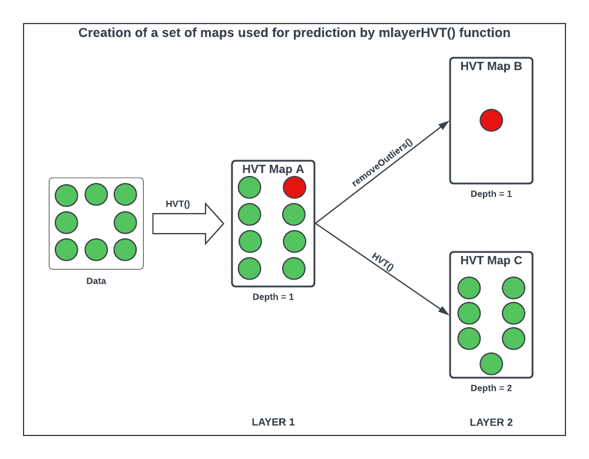

```{css, echo=FALSE}
/* CSS for floating TOC on the left side */
#TOC {
    /* float: left; */
    position: fixed;
    margin-left: -22vw;
    width: 18vw;
    height: fit-content;
    overflow-y: auto;
    padding-top: 20px;
    padding-bottom: 20px;
    background-color: #f9f9f9;
    border-right: 1px solid #ddd;
    margin-top: -18em;
}

.main-container {
  margin-left: 220px; /* Adjust this value to match the width of the TOC + some margin */
}

li {
  padding-bottom: 5px;
}
  
```

```{r setup, warning = FALSE, include = FALSE}
knitr::opts_chunk$set(
  collapse = TRUE,
  comment = "#>",
  out.width = "672px",
  out.height = "480px",
  fig.width = 7,
  fig.height = 5,
  fig.align = "center",
  fig.retina = 1,
  dpi = 150
)
```

# Abstract

The muHVT package is a collection of R functions to facilitate building [topology preserving maps](https://users.ics.aalto.fi/jhollmen/dippa/node9.html#:~:text=The%20property%20of%20topology%20preserving,tool%20of%20high-dimensional%20data) for rich multivariate data analysis, see `Figure 1` as an example of a 3D torus map generated from the package. Tending towards a big data preponderance, a large number of rows. A collection of R functions for this typical workflow is organized below:

1.  **Data Compression**: Vector quantization (VQ), HVQ (hierarchical vector quantization) using means or medians. This step compresses the rows (long data frame) using a compression objective.

2.  **Data Projection**: Dimension projection of the compressed cells to 1D,2D or 3D with the Sammons Non-linear Algorithm. This step creates topology preserving map (also called as [embedding](https://en.wikipedia.org/wiki/Embedding)) coordinates into the desired output dimension. 

3.  **Tessellation**: Create cells required for object visualization using the Voronoi Tessellation method, package includes heatmap plots for hierarchical Voronoi tessellations (HVT). This step enables data insights, visualization, and interaction with the topology preserving map useful for semi-supervised tasks.

4.  **Prediction**: Scoring new data sets and recording their assignment using the map objects from the above steps, in a sequence of maps if required.

The muHVT package allows creation of visually stunning tessellations, showcasing the power of topology preserving maps. below is an image depicting a captivating tessellation of a torus-


```{r predictlayer_flow,echo=FALSE,warning=FALSE,fig.show='hold',message=FALSE,out.width='90%',fig.height=8,fig.cap='Figure 1:  Heatmap Visualization of a Torus with 900 Cells'}
knitr::include_graphics('./torus2.png')
```


# Version History

## muHVT (v23.06.07) | What's New?

07th June, 2023

In this version of muHVT package, the following new features have been introduced:

This package provides functionality to predict cells with layers based on a sequence of maps using `predictLayerHVT`. 


## muHVT (v22.12.06)

06th December, 2022

This package provides functionality to predict based on a set of maps to monitor entities over time.

The creation of a predictive set of maps involves three steps -

1. **Compress:** Compress the dataset using a percentage compression rate and a quantization threshold using the HVT() function (Map A).
2. **Remove novelty cells:** Manually identify and remove the novelty cells from the dataset using the removeNovelty() function (Map B).
3. **Compress the dataset without novelty:** Again, compress the dataset without novelty using n_cells, depth and a quantization threshold using the HVT() function (Map C).


Let us try to understand the steps with the help of the diagram below-

```{r mlayer_flow,echo=FALSE,warning=FALSE,fig.show='hold',message=FALSE,out.width='90%',fig.height=8,fig.cap='Figure 2: Flow diagram for predicting based on a sequence of maps using predictLayerHVT()'}
#
knitr::include_graphics('./predictLayerHVT_function.png')
```


# Installation of muHVT (v23.06.07)

``` r
library(devtools)
devtools::install_github(repo = "Mu-Sigma/muHVT")
```


# Vignettes

Following are the links to the vignettes for the muHVT package:


1. [**muHVT Vignette:**](https://htmlpreview.github.io/?https://github.com/Somya545/muHVT/blob/master/vignettes/muHVT_vignette.html) Contains descriptions of the functions used for vector quantization and construction of hierarchical voronoi tessellations for data analysis.

2. [**muHVT Model Diagnostics Vignette:**](https://htmlpreview.github.io/?https://github.com/Somya545/muHVT/blob/master/vignettes/muHVT_model_diagnostics_vignette.html) Contains descriptions of functions used to perform model diagnostics and validation for muHVT model.

3. [**muHVT : Predicting Cells with Layers using predictLayerHVT:**](https://htmlpreview.github.io/?https://github.com/Somya545/muHVT/blob/master/vignettes/Predicting_Cells_with_Layers_using_predictLayerHVT.html) Contains descriptions of the functions used for predicting cells with layers based on a sequence of maps using predictLayerHVT.


