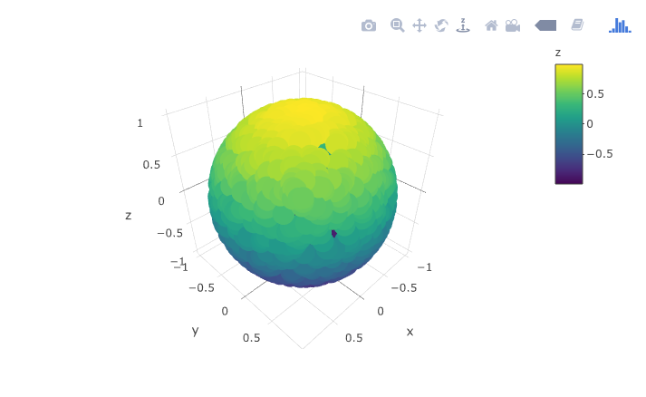

```{r setup, include = FALSE}
knitr::opts_chunk$set(
  collapse = TRUE,
  comment = "#>",
  fig.width = 8, 
  fig.height = 5, 
  fig.align = "center",
  dpi = 96
)

library(muHVT)
library(dplyr)
global_var <- FALSE

set.seed(420)
```


# Abstract


The muHVT package is a collection of R functions for clustering and
construction of hierarchical voronoi tessellations as a data visualization
tool to visualize clusters using quantization. The hierarchical clusters are computed using
Hierarchical K-means where a quantization threshold governs the levels
in the hierarchy for a set $k$ parameter (the maximum number of clusters
at each level).The package is helpful to visualize rich mutlivariate data. 


This package additionally provides functions for computing the
Sammon’s projection and plotting the heat map of the variables on the tiles of the tessellations.


#Vector Quantization


This package does vector quantization using the following algorithm- 

1. Hierarchical Vector Quantization using k-means clustering


##Hierarchical VQ using k-means clustering

### k-means clustering

1. The k-means algorithm randomly selects *k* data points as initial means.
1. *k* clusters are formed by assigning each data point to its closest cluster mean. The algorithm uses the Euclidean distance.
1. Virtual means for each cluster are calculated by using all datapoints contained in a cluster.

The second and third step is iterated until a predefined number of iteration is reached or the clusters converge. The runtime for the algorithm is O(n).

### Hierarchical VQ using k-means clustering

The algorithm divides the dataset recursively into clusters. The $k-means$ algorithm is used by setting $k$ to say, two in order to divide the dataset into two subsets.Then, the two subsets are divided again into two subsets by setting $k$ to two to result in a total of four subsets. The recursion terminates when the clusters contain single data points or a stop criterion is reached. In this case, the stop criterion is when the cluster error exceeds the quantization threshold.

Following are the steps for the method :-

1. Select k(number of clusters), depth and quantization error threshold
1. Perform k-means clustering on the input dataset
1. Calculate quantization error for each of the k clusters
1. Compare the quantization error for each cluster to quantization threshold error
1. Repeat steps 2 to 4 for each of the k clusters whose quantization error is above threshold until stop criterion is reached. The stop criterion is when the quantization error of a cluster reaches below quantization error threshold or there is a single point in the cluster or we have reached the user specified depth.

The quantization error for a cell is defined as follows :

$$QE  = \frac{1}{m}\sum_{t=1}^m||A-F_t||_{p}$$ 


where $A$ is the centroid and $F_t$ is the data point in the cluster. $m$ is the number of points in the cluster.

### Quantization error

Let's try to understand quantization error with an example


An example of 2 dimensional VQ is shown above

In the above image, we can see that there are 5 clusters/cells and each cells contain certain number of points. The centroid for each cluster is shown in blue. We can also call the centroids as codewords as they represent all the points in that cluster. The set of all codewords is called a codebook.

Now we want to calculate quantization error for each cluster. For the sake of simplicity, let's consider only once cell having centroid `A` and `m` data points $F_t$ for calculating quantization error.

For each point, we calculate the distance between the point and the centroid.

$$ d = ||A - F_t||_{p} $$

In the above equation, p = 1 means Manhattan distance whereas p = 2 means Euclidean distance.In the package, the Euclidean distance is chosen by default. The user can pass either "Euclidean" or "Manhattan" or a custom function to calculate the distance between two points in n dimensions.

$$ QE  = \frac{1}{m}\sum_{t=1}^m||A-F_t||_{p} $$ 

Now, we take the mean of the distance of all m points. This gives us the average distance of a point in the cell from the centroid which we refer to as Quantization error. If the quantization error is higher than the given threshold, this means that the centroid/codevector is not a good representation for the points in the cell. Now we can cluster this points further and repeat the steps above.

Please note that the user can select mean, max or any custom function to calculate the quantization error. The custom function takes a vector of m value (where each value is a distance between point in `n` dimensions and centroids) and returns a single value which is the quantization error for the cell.


#Voronoi Tessellations

A Voronoi diagram is a way of dividing space into a number of regions. A set of points (called seeds, sites, or generators) is specified beforehand and for each seed there will be a corresponding region consisting of all points closer to that seed than to any other. The regions are called Voronoi cells. It is dual to the Delaunay triangulation.

##Sammon’s projection

Sammon projection is an algorithm that maps a high-dimensional space to a space of lower dimensionality by trying to preserve the structure of inter-point distances in high-dimensional space in the lower-dimension projection. It is particularly suited for use in exploratory data analysis. It is considered a non-linear approach as the mapping cannot be represented as a linear combination of the original variables. The centroids are plotted in 2D after performing Sammon’s projection at every level of the tessellation.


Denote the distance between $i^{th}$ and $j^{th}$ objects in the original space by $d_{ij}^*$, and the distance between their projections by $d_{ij}$. Sammon’s mapping aims to minimize the following error function, which is often referred to as Sammon’s stress or Sammon’s error:

$$E=\frac{1}{\sum_{i<j} d_{ij}^*}\sum_{i<j}\frac{(d_{ij}^*-d_{ij})^2}{d_{ij}^*}$$

The minimization can be performed either by gradient descent, as proposed initially, or by other means, usually involving iterative methods. The number of iterations need to be experimentally determined and convergent solutions are not always guaranteed. Many implementations prefer to use the first Principal Components as a starting configuration.

####Example Usage 1

In this section, we will use the `Prices of Personal Computers` dataset. This dataset contains 6259 observations and 10 features. The dataset observes the price from 1993 to 1995 of 486 personal computers in the US. The variables are price,speed,ram,screen,cd,etc. The dataset can be downloaded from [here](https://github.com/thomaspernet/data_csv_r/blob/master/data/Computers.csv)

In this example, we will compress this dataset by using hierarhical VQ using k-means clustering and visualize the Voronoi tesselation plots using Sammons projection. Later on, we will overlay price variable as heatmap to generate further insights.

Here, we load the data and store into a variable `computers`.

```{r load data computer,warning=FALSE,message=FALSE,eval = global_var}

set.seed(420)

# Load data from csv files
computers <- read.csv("https://raw.githubusercontent.com/thomaspernet/data_csv_r/master/data/Computers.csv")

```

Let's have a look at sample of the data

```{r sample data computer,warning=FALSE,message=FALSE,eval = global_var}
head(computers)
```

Now let us check the structure of the data

```{r data structure computer,warning=FALSE,message=FALSE,eval = global_var}
str(computers)
```

Let's get a summary of the data

```{r data summary computer,warning=FALSE,message=FALSE,eval = global_var}
summary(computers)
```

Let us first split the data into train and test. We will use 80% of the data as train and remaining as test.

```{r train-test computer,warning=FALSE,message=FALSE,eval = global_var}

no_of_points <- dim(computers)[1]
train_length <- as.integer(no_of_points * 0.8)

train_computers <- computers[1:train_length,]
test_computers <- computers[(train_length+1):no_of_points,]

```

K-means in not suitable for factor variables as the sample space for factor variables is discrete. A Euclidean distance function on such a space isn't really meaningful. Hence we will delete the factor variables in our dataset. 

Here we keep the original train_computers and test_computers as we will use price variable from this dataset to overlay as heatmap and generate some insights.

```{r pre-processing data computer,warning=FALSE,message=FALSE,eval = global_var}
train_computers <- train_computers %>% dplyr::select(-c(X,cd,multi,premium,trend))
test_computers <- test_computers %>% dplyr::select(-c(X,cd,multi,premium,trend))
```

Let us try to understand HVT function first. 

```{r HVT function,echo = TRUE, eval= FALSE}
HVT(dataset, nclust, depth, quant.err, projection.scale, normalize = T, distance_metric = c("L1_Norm","L2_Norm"), error_metric = c("mean","max"))
```

Here I have explained all the parameters in detail

* __`dataset`__ - Dataframe. A dataframe with numeric columns 
* __`nlcust`__  - Numeric. An integer indicating the number of clusters per hierarchy (level)
* __`depth`__   - An integer indicating the number of levels. (1 = No hierarchy, 2 = 2 levels, etc ...). 
* __`quant.error`__ - A number indicating the quantization error threshold. A cell will only breakdown into further clusters only if thje quantization error of the cell is above quantization error threshold.
* __`projection.scale`__ - A number indicating the scale factor for the tesselations so as to visualize the sub-tesselations well enough.
* __`normalize`__	- A logical value indicating if the columns in your dataset should be normalized. Default value is TRUE. The algorithm supports Z-score normalization.
* __`distance_metric`__	- The distance metric can be `L1_Norm` or `L2_Norm`. `L1_Norm` is selected by default. The distance metric is used to calculate the distance between a `n` dimensional point and centroid. The user can also pass a custom function to calculate the distance.
* __`error_metric`__ - The error metric can be `mean` or `max`. mean is selected by default. The `mean` will take mean of `m` values where each value is a distance between a point and centroid of the cluster. The `max` will return the max of `m` values. Moreover, the user can also pass a custom function to calculate the error metric.


First we will perform hierarchical vector quantization at level 1 by setting the parameter depth to 1. Here level 1 signifies no hierarchy. Let's keep the no of clusters as 5.

```{r level one computers,warning=FALSE,message=FALSE,results='asis',eval = global_var}

set.seed(420)

hvt.results <- list()

hvt.results <- muHVT::HVT(train_computers,nclust = 5,depth = 1,quant.err = 0.1,projection.scale = 10,normalize = T)

```

Now let's try to understand plotHVT function. Here I have explained all the parameters in detail

```{r plotHVT function,echo = TRUE, eval= FALSE}
plotHVT(hvt.results, line.width, color.vec, pch1 = 19, centroid.size = 3, title = NULL)
```

* __`hvt.results`__ -  A list containing the ouput of HVT function which has the details of the tessellations to be plotted.
* __`line.width`__	- A vector indicating the line widths of the tessellation boundaries for each level.
* __`color.vec`__	- A vector indicating the colors of the boundaries of the tessellations at each level.
* __`pch1`__	- Symbol type of the centroids of the tessellations (parent levels). Refer points. (default = 19)
* __`centroid.size`__	- Size of centroids of first level tessellations. (default = 3)
* __`title`__	- Set a title for the plot. (default = NULL)

Let's plot the voronoi tesselation

```{r plot level one computers,warning=FALSE,fig.show='hold',results='hide',message=FALSE,fig.cap='Figure 1: The Voronoi tessellation for level 1 shown for the 5 clusters in the dataset ’computers’',eval = global_var}

# Voronoi tesselation plot for level one
plotHVT(hvt.results,line.width = c(1.5), color.vec = c("#326273"))
```

As per the manual, __`hvt.results[[3]]`__ gives us detailed information about the hierarchical vector quantized data

__`hvt.results[[3]][['summary']]`__ gives a nice tabular data containing no of points, quantization error and the codebook.

Now let us understand what each column in the summary table means

* __`Segment Level`__ - Level of the cell. In this case, we have done the clustering for depth 1. Hence Segment Level is 1
* __`Segment Parent`__ - Parent Segment of the cell.
* __`Segment Child`__ - The children of a particular cell. In this case, first level has 5 clusters. Hence, we can see Segment Child 1,2,3,4,5.
* __`n`__ - No of points in each cell
* __`Quant.Error`__ - Quantization error for each cell.

All the columns after this will contains centroids for each cell for all the variables. They can be also called as codebook as is the collection of centroids for all cells (codewords)


```{r summary level one computers,warning=FALSE,eval = global_var}

hvt.results[[3]][['summary']]

```

Let's have a look at `Quant.Error` variable in the above table. It seems that none of the cells have hit the quantization threshold error.

Let's check the compression summary. The table below shows no of cells, no of cells having quantization error below threshold and percentage of cells having quantization error below threshold for each level

```{r compression summary level one computers,warning=FALSE,eval = global_var}

hvt.results[[3]]$compression_summary

```

As it can be seen in the table above, percentage of cells in level1 having quantization error below threshold is `0%`. Hence we can go one level deeper and try to compress it further.

We will now overlay the 'Quant.Error' variable as heatmap over the voronoi tesselation plot to visualize the quantization error better.

Let's have look at the function `hvtHmap` which we will use to overlay a variable as heatmap.

```{r hvtHmap function,echo = TRUE, eval= FALSE}
hvtHmap(hvt.results, dataset, child.level, hmap.cols, color.vec ,line.width, palette.color = 6)
```

* __`hvt.results`__ - A list of hvt.results obtained from the HVT function.
* __`dataset`__	- A dataframe containing the variables that you want to overlay as heatmap. The user can pass an external dataset or the dataset that was used to build the hierarchical clustering. The dataset should have same number of points as the dataset used to cluster in the HVT function
* __`child.level`__	- A number indicating the level for which the heat map is to be plotted.
* __`hmap.cols`__	- The column number of column name from the dataset indicating the variables for which the heat map is to be plotted. To plot the quantization error as heatmap, pass `'quant_error'`. Similary to plot the no of points in each cell as heatmap, pass `'no_of_points'` as a parameter
* __`color.vec`__	- A color vector such that length(color.vec) = child.level (default = NULL)
* __`line.width`__ - A line width vector such that length(line.width) = child.level. (default = NULL)
* __`palette.color`__ - A number indicating the heat map color palette. 1 - rainbow, 2 - heat.colors, 3 - terrain.colors, 4 - topo.colors, 5 - cm.colors, 6 - seas color. (default = 6)


Now let's plot the quantization error for each cell at level one as heatmap.

```{r hmp level one quantization computers,warning=FALSE,fig.show='hold',results='hide',message=FALSE,fig.cap='Figure 2: The Voronoi tessellation with the heat map overlaid for variable ’quant_error’ in the ’computers’ dataset',eval = global_var}

hvtHmap(hvt.results, train_computers, child.level = 1,hmap.cols = "quant_error", show.points=TRUE,line.width = c(0.2),color.vec = c("#326273"),palette.color = 6)

```

Now let's go one level deeper and perform hierarchical vector quantization.

```{r level two computers,warning=FALSE,message=FALSE,results="hide",eval = global_var}

# We will consider only latitude and longitude data. 
set.seed(420)

hvt.results2 <- list()

# depth=2 is used for level2 in the hierarchy

hvt.results2 <- muHVT::HVT(train_computers,nclust = 5,depth = 2,quant.err = 0.1,projection.scale = 10,normalize = T)

```

Let's plot the voronoi tesselation for both the levels.

```{r plot level two computers,warning=FALSE,fig.show='hold',results='hide',message=FALSE,fig.cap='Figure 3: The Voronoi tessellation for level 2 shown for the 5 clusters in the dataset ’computers’',eval = global_var}

# Voronoi tesselation plot for level two

plotHVT(hvt.results2, line.width = c(1.5, 0.8), color.vec = c("#326273","#BF782D"))

```

In the table below, Segment Level signifies the depth.

Level 1 has 5 clusters

Level 2 has 25 clusters.i.e. each cluster in level1 is divided into 5 clusters

Let's analyze the summary table again for `Quant.Error` and see if any of the cells in the 2nd level have quantization error below quantization error threshold.

```{r summary level two computers,warning=FALSE,eval = global_var}

hvt.results2[[3]][['summary']]

```

As it can be seen in the table above, none of the cells in the 2nd level have quantization error below threshold. Therefore, we can go one more level deeper and try to compress the data further.

The users can look at the compression summary to get a quick summary on the compression as it becomes quite cumbersome to look at the summary table above as we go deeper.

```{r compression summary level two computers,warning=FALSE,eval = global_var}

hvt.results2[[3]][['summary']]

```

We can observe from the table above that for level 2 also, none of the cells have hit quantization error threshold. Hence we can compress it further to reach below the quantization error threshold.

We will look at the heatmap for quantization error for level 2.

```{r hmp level two quantization computers,warning=FALSE,fig.show='hold',results='hide',message=FALSE,fig.cap='Figure 4: The Voronoi tessellation with the heat map overlaid for variable ’quant_error’ in the ’computers’ dataset',eval = global_var}

hvtHmap(hvt.results2, train_computers, child.level = 2,hmap.cols = "quant_error", line.width = c(0.8,0.2),color.vec = c("#326273","#BF782D"),palette.color = 6,show.points=TRUE)

```

As the quantization error criteria is not met, let's do hierarchical vector quantization at level 3.

```{r level three computers,warning=FALSE,message=FALSE,results="hide",eval = global_var}

set.seed(420)

hvt.results3 <- list()

# depth=3 is used for level3 in the hierarchy

hvt.results3 <- muHVT::HVT(train_computers,nclust = 5,depth = 3,quant.err = 0.1,projection.scale = 10,normalize = T)

```

Let's plot the voronoi tesselation for all 3 levels.

```{r plot level three computers,warning=FALSE,fig.show='hold',results='hide',message=FALSE,fig.cap='Figure 5: The Voronoi tessellation for level 3 shown for the 5 clusters in the dataset ’computers’',eval = global_var}

# Voronoi tesselation plot for level three

plotHVT(hvt.results3,line.width = c(1.5,0.8,0.3),color.vec = c("#326273","#BF782D","#735C43"))

```

Each of the 25 cells in level 2 will break down into 5 cells each in level 3. Hence, as it can be seen below, level 3 has 125 cells.

```{r summary level three computers,warning=FALSE,eval = global_var}

hvt.results3[[3]][['summary']]

```

```{r hmp level three quantization computers,warning=FALSE,fig.show='hold',results='hide',message=FALSE,fig.cap='Figure 6: The Voronoi tessellation with the heat map overlaid for variable ’quant_error’ in the ’computers’ dataset',eval = global_var}

hvtHmap(hvt.results2, train_computers, child.level = 3,hmap.cols = "quant_error", line.width = c(0.8,0.2),color.vec = c("#326273","#BF782D"),palette.color = 6,show.points=TRUE)

```


As it can be seen from the heatmap/table summary above that the quantization error for most of the cells in level 3 fall below quantization threshold. Hence we were succesfully able to compress `80%` of the data.

Now we will try to get more insights from the clusters by overlaying heatmap for variable 'price' at different levels.

Let's do it for level one

####  Heatmap

In the plot below, a heatmap for variable 'price' is overlayed on level one tesselation plot.We calculate the mean price for each cluster and represent it as heatmap. 

The heatmap for 'price' variable for different clusters can be seen in the plot below.It can be seen that we have been able to segment computers in 3 price ranges - (i) 2000-2100 (ii) 2200 - 2500 (iii) 2500 and above

```{r hmp level one computers,warning=FALSE,fig.show='hold',results='hide',message=FALSE,fig.cap='Figure 4: The Voronoi tessellation with the heat map overlaid for variable ’price’ in the ’computers’ dataset',eval = global_var}


hvtHmap(hvt.results, train_computers, child.level = 1,hmap.cols = "price", show.points=TRUE,line.width = c(0.2),color.vec = c("#326273"),palette.color = 6)

```


Now we will go one level deeper and overlay heatmap for 'price' at level 2. This should give us better insight about the price distribution for different clusters

In the plot below, we have overlayed heatmap for variable 'price' on level 2. 

```{r hmp level two computers,warning=FALSE,fig.show='hold',results='hide',message=FALSE,fig.cap='Figure 5: The Voronoi tessellation with the heat map overlaid for the variable ’price’ in the ’computer’ dataset',eval = global_var}


hvtHmap(hvt.results2, computers, child.level = 2, hmap.cols = "price",line.width = c(0.8,0.2),color.vec = c("#326273","#BF782D"),palette.color = 6,show.points=TRUE)

```


### Test

Now once we have built the model, let us try to predict using our test dataset which cell and which level each point belongs to.

Let us see predictHVT function. 

```{r predictHVT function,echo = TRUE, eval= FALSE}
predictHVT(data,hvt.results,hmap.cols = NULL,child.level = 1,...)
```

Here I will try to explain the important parameters

* __`data`__ - A dataframe containing test dataset. The dataframe should have atleast one variable used while training. The variables from this dataset can also be used to overlay as heatmap.
* __`hvt.results`__ - A list of hvt.results obtained from HVT function while clustering on train data
* __`hmap.cols`__ - The column number of column name from the dataset indicating the variables for which the heat map is to be plotted.(Default = NULL). A heatmap won't be plotted if NULL is passed
* __`child.level`__ -A number indicating the level for which the heat map is to be plotted.(Only used if hmap.cols is not NULL)
* __`...`__ - color.vec and line.width can be passed from here

```{r predictHVT hmap computers,warning=FALSE,message=FALSE,eval = global_var}

set.seed(420)

predictions <- muHVT::predictHVT(test_computers,hvt.results3,hmap.cols = "price",child.level = 3)

```


The prediction algorithm recursively calculates the distance between each point in the test dataset and the cell centroids for each level. The following steps explain the prediction method for a single point in test dataset :- 

1. Calculate the distance between the point and the centroid of all the cells in the first level.
2. Find the cell whose centroid has minimum distance to the point.
3. Check if the cell drills down further to form more cells.
4. If it doesn't, return the path. Or else repeat the steps 1 to 4 till we reach to the level at which the cell doesn't drill down further.

Let's see what cell and which level do each point belongs to. Here I will print first 10 points.

```{r predictHVT pred computers,warning=FALSE,eval = global_var}

predictions$predictions[1:10,]

```

We can see the predictions for all the points in the table above. The variable `cluster_path` shows us the level and the cell that each point is mapped to. The centroid of the cell that the point is mapped to is the codeword (predictor) for that cell. 

### Example Usage 2

In this section, we will see how we can use the package to visualize mutlidimensional data by projecting them to two dimensions using Sammon's projection.


#### Torus (Donut)

First of all, let us see how to generate data for torus. We are using an amazing library `geozoo` for this purpose. Geo Zoo stands for Geometric Zoo. It is a compilation of geometric objects ranging from three dimensions all the way to the 10 dimension. Geo Zoo contains regular or well-known object, eg cube and sphere, and some abstract objects, eg Boy's surface, Torus and Hyper-Torus. 

Here will generate a 3D torus with 1000 points.

```{r torus generate,warning=FALSE,message=FALSE,results="hide",eval = T}
library(geozoo)
library(plotly)

# We will consider only latitude and longitude data. 
set.seed(420)

# Here p reprensents dimension of object
# n reperesents number of points

torus <- geozoo::torus(p = 3,n = 10000)
torus_df <- data.frame(torus$points)
colnames(torus_df) <- c("x","y","z")


```

Now let's do some EDA on the data. First of all, we will see how the data looks like

```{r torus head, warning=FALSE, eval = global_var}
head(torus_df)
```

Now let's have a look at summary and structure of the data.

```{r torus structure, warning=FALSE, eval = global_var}
str(torus_df)
```

```{r torus summary, warning=FALSE,eval = global_var}
summary(torus_df)
```


Now let's try to visualize the object in 3D Space.

```{r torus plot,warning=FALSE,message=FALSE,results="asis",eval = T}

plot_torus <- plot_ly(torus_df, x= ~x, y= ~y, z = ~z, color = ~z) %>% add_markers()
plot_torus

```


Now let's try to use the package and project the above 3D geographic object in 2D Space. We will start with number of clusters as 100.

```{r torus hvt,warning=FALSE,message=FALSE,results="hide",eval = global_var}

# We will consider only latitude and longitude data. 
set.seed(420)

hvt.torus <- muHVT::HVT(torus_df,nclust = 100,depth = 3,quant.err = 0.1,projection.scale = 10,normalize = T)

plotHVT(hvt.torus,line.width = c(1.5,0.8,0.2),color.vec = c("#326273","#BF782D","#735C43"))

```

Now let's repeat the same process with 3D Sphere

#### Sphere

Here also, we will generate 1000 points in 3D space to form a sphere.

```{r sphere generate,warning=FALSE,message=FALSE,results="hide",eval = global_var}
library(geozoo)
library(plotly)

# We will consider only latitude and longitude data. 
set.seed(420)

sphere <- geozoo::sphere.hollow(p = 3, n = 10000)
sphere_df <- data.frame(sphere$points)
colnames(sphere_df) <- c("x","y","z")

```

Let's get a quick-peek of the data

```{r sphere head, warning=FALSE, eval = global_var}
head(sphere_df)
```

Now let's have a look at summary and structure of the data.

```{r sphere structure, warning=FALSE, eval = global_var}
str(sphere_df)
```

```{r sphere summary, warning=FALSE,eval = global_var}
summary(sphere_df)
```


Now let's try to visualize the object in 3D Space.

```{r sphere plot,warning=FALSE,message=FALSE,results="asis",eval = global_var}

plot_torus <- plot_ly(sphere_df, x= ~x, y= ~y, z = ~z, color = ~z) %>% add_markers()
print(plot_torus)

```




Now let's try to use the package and project the above 3D geographic object in 2D Space

```{r sphere hvt,warning=FALSE,message=FALSE,results="hide",eval = global_var}
set.seed(420)

hvt.sphere <- muHVT::HVT(sphere_df,nclust = 100,depth = 3,quant.err = 0.1,projection.scale = 10,normalize = T)

plotHVT(hvt.sphere,line.width = c(1.5,0.8,0.2),color.vec = c("#326273","#BF782D","#735C43"))

```

## Applications 

1. Pricing Segmentation - The package can be used to discover groups of similar customers based on the customer spend pattern and understand price sensitivity of customers. 

2. Market Segmentation - The package can be helpful in market segmentation where we have to cluster micro and macro segments. The method used in this package can do both kinds of segmentation in one go.

3. Anomaly detection - This method can help us categorize system behaviour over time and help us find anomaly when there are changes in the system. For e.g. Finding fraudulent claims in healthcare insurance.

4. The package can help us understand the underlying structure of the data. Suppose that we want to analyze a curved surface such as sphere or vase, we can approximate it by a lot of small low-order polygons in the form of tesselations

5. In biology, Voronoi diagrams are used to model a number of different biological structures, including cells and bone microarchitecture.

#References


1. Vector Quantization : http://www.data-compression.com/vq.html#lbg

2. Hierarchical k-means : http://gecco.org.chemie.uni-frankfurt.de/hkmeans/H-k-means.pdf

3. Sammon’s Projection : http://en.wikipedia.org/wiki/Sammon_mapping

4. Voronoi Tessellations : http://en.wikipedia.org/wiki/Centroidal_Voronoi_tessellation
