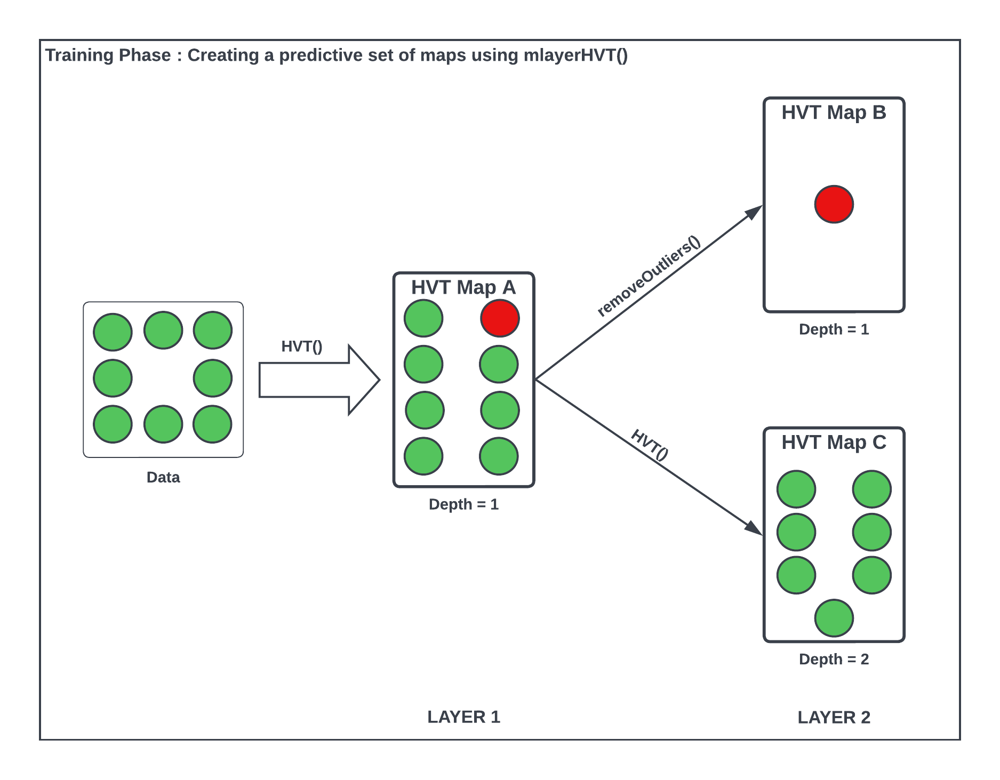

```{r setup, warning = FALSE, include = FALSE}
knitr::opts_chunk$set(
  collapse = TRUE,
  comment = "#>",
  out.width = "672px",
  out.height = "480px",
  fig.width = 7,
  fig.height = 5,
  fig.align = "center",
  fig.retina = 1,
  dpi = 150
)

# installing all required packages
list.of.packages <- c("plyr", "dplyr", "reactable", "kableExtra", "geozoo", "plotly", "purrr", "sp", "muHVT", "data.table", "gridExtra")

new.packages <-
  list.of.packages[!(list.of.packages %in% installed.packages()[, "Package"])]
if (length(new.packages))
  install.packages(new.packages, dependencies = TRUE)

# Loading the required libraries
lapply(list.of.packages, library, character.only = T)

# Sourcing the modified files for muHVT
## Do this if muHVT is unavailable on CRAN

source("../R/Add_boundary_points.R")
source("../R/Corrected_Tessellations.R")
source("../R/DelaunayInfo.R")
source("../R/Delete_Outpoints.R")
source("../R/getCentroids.R")
source("../R/getOptimalCentroids.R")
source("../R/hvq.R")
source("../R/removeOutliers.R")
source("../R/HVT.R")
source("../R/hvtHmap.R")
source("../R/plotCells.R")
source("../R/plotHVT.R")
source("../R/predictHVT.R")
source("../R/mlayerHVT.R")
source("../R/ScaleMat.R")
source("../R/Transform_Coordinates.R")
source("../R/madPlot.R")
source("../R/diagPlot.R")
source("../R/get_cell_id.R")
source("../R/getCentroids_for_opti.R")
source("../R/multiNormalDist.R")
source("../R/plotDiag.R")
source("../R/qeHistPlot.R")
source("../R/diagSuggestion.R")
source("../R/exploded_hmap.R")


options(expressions = 10000)

global_var <- nzchar(Sys.getenv("RUN_VIGNETTE"))
global_var <- TRUE

scrolLimit <- function(noOfRows){
  if(noOfRows<10){
    
    swe = paste(as.character(noOfRows*50),"px")
  }
  else{
    swe = "400px"
  }
  return(swe)
}

Table <- function(data,scroll = T, limit = NULL){
  
  if(!is.null(limit)){
    data <- head(data,limit)
  }

  kable_table <- data %>% kable(escape = F,align = "c") %>% kable_styling(bootstrap_options = c("striped", "hover", "responsive"))
  scroll <- scroll
  
  if(scroll == T){
  kable_table <- kable_table %>% scroll_box(width = "100%", height = scrolLimit(nrow(data)))
  }
  return(kable_table)
}

summaryTable <- function(data,scroll = T,columnName='Quant.Error',value=0.2,limit=NULL){
  
  scroll <- scroll
  summaryTable <- data %>%  dplyr::mutate_if(is.numeric, funs(round(.,2))) %>% dplyr::mutate(!!columnName:=  cell_spec(eval(parse(text = columnName)),color = ifelse(is.na(eval(parse(text = columnName))),"#333",ifelse(eval(parse(text = columnName)) < value,"red","#333"))))  
  
  return(Table(summaryTable,scroll = scroll,limit = limit))
}

compressionSummaryTable <- function(data,scroll = T,columnName='percentOfCellsBelowQuantizationErrorThreshold',value=0.8){
  summaryTable <- data %>%  dplyr::mutate_if(is.numeric, funs(round(.,2))) %>% dplyr::mutate(!!columnName:=  cell_spec(eval(parse(text = columnName)),color = ifelse(is.na(eval(parse(text = columnName))),"#00bb27",ifelse(eval(parse(text = columnName)) > value,"#00bb27","#333")))) 

  return(Table(summaryTable,scroll = scroll))
}

set.seed(240)
```


# Abstract

The muHVT package is a collection of R functions to facilitate building [topology preserving maps](https://link.springer.com/chapter/10.1007/1-84628-118-0_7) for rich multivariate data. Tending towards a big data preponderance, large number of rows. A collection of R functions for this typical workflow is organized below:

Data Compression: Vector quantization (VQ), HVQ (hierarchical vector quantization) using means or medians. This step compresses the rows (long data frame) using a compression objective.

Data Projection: Dimension projection of the compressed cells to 1D,2D,3D with the Sammons Nonlinear Algorithm. This step creates topology preserving map coordinates into the desired output dimension.

Tessellation: Create cells required for object visualization using the Voronoi Tessellation method, package includes heatmap plots for hierarchical Voronoi tessellations (HVT). This step enables data insights, visualization, and interaction with the topology preserving map. Useful for semi-supervised tasks.

Prediction: Scoring new data sets and recording its assignment using the map objects from the above steps, in a sequence of maps if required. 

This package also provides functions for computing the Sammon’s projection and plotting the heat map of the variables on the tiles of the tessellations.

This package now additionally provides functionality to predict based on a set of maps to monitor entities over time.

The creation of a predictive set involves four steps -

1. **Compress:** Compress the dataset using a percentage compression rate and a quantization threshold using the HVT() function (Map A)
2. **Remove outlier cells:** Manually identify and remove the outlier cells from the dataset using the removeOutliers() function (Map B)
3. **Compress the dataset without outliers:** Again compress the dataset without outlier(s) using n_cells, depth and a quantization threshold using the HVT() function (Map C)
4. **Predict based on a predictive set of maps:** Using the mlayerHVT() function

Let us try to understand the steps with the help of the diagram below.

```{r mlayer_flow,echo=FALSE,warning=FALSE,fig.show='hold',message=FALSE,out.width='90%',fig.height=8,fig.cap='Figure 1: Flow diagram for predicting based on a set of maps using mlayerHVT()'}

```

Initially, the raw data is passed, and a highly compressed Map A is constructed using the __`HVT`__ function. The output of this function will be hierarchically arranged vector quantized data that is used to identify the outlier cells in the dataset using the number of data points within each cell and the z-scores for each cell.

The identified outlier cell(s) is then passed to the __`removeOutliers`__ function along with Map A. This function removes the identified outlier cell(s) from the dataset and stores them in Map B as shown in the diagram. The final output of this function is a list of two items - a newly constructed map (Map B), and a subset of the dataset without outlier cell(s).

The __`plotCells`__ function plots the Voronoi tessellations for the compressed map (Map A) and highlights the identified outlier cell(s) in red on the plot. The function requires the identified outlier cell(s) number and the compressed map (Map A) as input in order to plot the tessellations map and highlight those outlier cells on it.

The dataset without outlier(s) gotten as an output from the removeOutliers function is then passed as an argument to the __`HVT`__ function with other parameters such as n_cells, quant.error, depth, etc. to construct another map (Map C).

Finally, all the constructed maps are passed to the __`mlayerHVT`__ function along with the test dataset on which the function will predict/score for finding which map and what cell each test record gets assigned to.


# Data Understanding

In this notebook, we will use the __`Prices of Personal Computers`__ dataset. This dataset contains 6261 observations and 6 features. The dataset observes the price from 1993 to 1995 of 486 personal computers in the US. The variables are price, speed, hd, ram, screen and ads. 

Here, we load the data and store into a variables.

```{r load data computer,warning=FALSE,message=FALSE,eval = T}
set.seed(240)
# Load data from csv files
trainComputers <- read.csv("https://raw.githubusercontent.com/Mu-Sigma/muHVT/dev/vignettes/sample_dataset/trainComputers.csv")
testComputers <- read.csv("https://raw.githubusercontent.com/Mu-Sigma/muHVT/dev/vignettes/sample_dataset/testComputers.csv")
```

Let's have a look at some of the training data

```{r sample data computer,warning=FALSE,message=FALSE,eval = T}
# Quick peek
Table(head(trainComputers))
```

Now let us check the structure of the training data

```{r data structure computer,warning=FALSE,message=FALSE,eval = global_var}
str(trainComputers)
```

Let's get a summary of the training data

```{r data summary computer,warning=FALSE,message=FALSE,eval = global_var}
summary(trainComputers)
```

# Map A : Compress using vector quantization

This package can perform vector quantization using the following algorithms -

*  Hierarchical Vector Quantization using k−means
*  Hierarchical Vector Quantization using k−medoids

For more information on vector quantization, refer the following [link](https://htmlpreview.github.io/?https://raw.githubusercontent.com/Mu-Sigma/muHVT/dev/vignettes/muHVT_vignette.html#compress-vector-quantization).

The HVT function constructs highly compressed hierarchical Voronoi tessellations. 
The raw data is first scaled and this scaled data is supplied as input to the vector quantization algorithm. The vector quantization algorithm compresses the dataset until a user-defined compression percentage/rate is achieved using a parameter called quantization error which acts as a threshold and determines the compression percentage. It means that for a given user-defined compression percentage we get the 'n' number of cells, then all of these cells formed will have a quantization error less than the threshold quantization error.

Let us try to understand the HVT function -

```{r HVT function, echo=TRUE, eval=FALSE}
HVT(
  dataset,
  min_compression_perc,
  n_cells,
  depth,
  quant.err,
  distance_metric = c("L1_Norm", "L2_Norm"),
  error_metric = c("mean", "max"),
  quant_method = c("kmeans", "kmedoids"),
  normalize = TRUE,
  diagnose = FALSE,
  hvt_validation = FALSE,
  train_validation_split_ratio = 0.8
)
```

Each of the parameters have been explained below :

* __`dataset`__ - A dataframe with numeric columns 

* __`min_compression_perc`__  -  An integer indicating the minimum percent compression rate to be achieved for the dataset

* __`n_cells`__  - An integer indicating the number of cells per hierarchy (level)

* __`depth`__   - An integer indicating the number of levels. (1 = No hierarchy, 2 = 2 levels, etc ...)

* __`quant.error`__ - A number indicating the quantization error threshold. A cell will only breakdown
into further cells if the quantization error of the cell is above the defined quantization error threshold

* __`distance_metric`__	- The distance metric can be `L1_Norm` or `L2_Norm`. `L1_Norm` is selected by default. The distance metric is used to calculate the distance between an `n` dimensional point and centroid. The user can also pass a custom function to calculate this distance

* __`error_metric`__ - The error metric can be `mean` or `max`. `max` is selected by default. `max` will return the max of `m` values and `mean` will take mean of `m` values where each value is a distance between a point and centroid of the cell. Moreover, the user can also pass a custom function to calculate the error metric

* __`quant_method`__ - The quantization method can be `kmeans` or `kmedoids`. `kmeans` is selected by default
    
* __`normalize`__	- A logical value indicating whether the columns in your dataset need to be normalized. Default value is TRUE. The algorithm supports Z-score normalization

* __`diagnose`__ - A logical value indicating whether user wants to perform diagnostics on the model. Default value is TRUE.

* __`hvt_validation`__ - A logical value indicating whether user wants to holdout a validation set and find mean absolute deviation of the validation points from the centroid. Default value is FALSE.

* __`train_validation_split_ratio`__ - A numeric value indicating train validation split ratio. This argument is only used when hvt_validation has been set to TRUE. Default value for the argument is 0.8

First, we will construct Map A by performing Hierarchical Vector Quantization by setting the parameter min_compression_perc to 70% and quantization error threshold to 0.2. The compressed map is always constructed at depth = 1.

```{r hvt_mapA HVT,warning=FALSE,message=FALSE,results='asis'}
hvt_mapA <- list()

hvt_mapA <- HVT(trainComputers,
                min_compression_perc = 70,
                quant.err = 0.2,
                distance_metric = "L1_Norm",
                error_metric = "max",
                quant_method = "kmeans",
                normalize = TRUE
)
```

Now, let's check the compression summary for HVT Map A. The table below shows no of cells, no of cells having quantization error below threshold and percentage of cells having quantization error below threshold for each level.

```{r hvt_mapA compression summary,warning=FALSE,eval = global_var}
mapA_compression_summary <- hvt_mapA[[3]]$compression_summary %>%  dplyr::mutate_if(is.numeric, funs(round(.,4)))
DT::datatable(mapA_compression_summary, class = 'cell-border stripe', options = list(scrollX = TRUE))
```

As per the manual, __`hvt_mapA[[3]]`__ gives us detailed information about the hierarchical vector quantized data.
__`hvt_mapA[[3]][['summary']]`__ gives a nice tabular data containing no of points, Quantization Error and the codebook.

Now let us understand what each column in the above table means:

* __`Segment.Level`__ - Level of the cell. In this case, we have performed Vector Quantization for depth 1. Hence Segment Level is 1

* __`Segment.Parent`__ - Parent segment of the cell

* __`Segment.Child (Cell.Number)`__ - The children of a particular cell. In this case, it is the total number of cells at which we achieved the defined compression percentage 

* __`n`__ - No of points in each cell

* __`Cell.ID`__ - Cell_ID’s are generated for the multivariate data using 1-D Sammon’s Projection algorithm

* __`Quant.Error`__ - Quantization Error for each cell

All the columns after this will contain centroids for each cell. They can also be called a codebook, which represents a collection of all centroids or codewords.

```{r hvt_mapA display results, warning=FALSE, echo=TRUE}
cell_mapping_df <- arrange(hvt_mapA[[3]]$summary, n) %>% mutate_if(is.numeric, round, digits = 4)
DT::datatable(cell_mapping_df, filter = 'top', options = list(pageLength = 10, scrollX = TRUE), class = 'cell-border stripe')
```

Let's have look at the function `hvtHmap` which we will use to overlay a variable as heatmap.

```{r hvt_mapA hvtHmap,echo = TRUE, eval= FALSE}
hvtHmap(hvt.results, dataset, child.level, hmap.cols, color.vec ,line.width, palette.color = 6)
```


* __`hvt.results`__ - A list of hvt.results obtained from the HVT function

* __`dataset`__	- A dataframe containing the variables to overlay as a heatmap. The user can pass an external dataset or the dataset that was used to perform hierarchical vector quantization. The dataset should have the same number of points as the dataset used to perform hierarchical Vector Quantization in the HVT function

* __`child.level`__	- A number indicating the level for which the heat map is to be plotted

* __`hmap.cols`__	- The column number of column name from the dataset indicating the variables for which the heat map is to be plotted. To plot the quantization error as heatmap, pass `'quant_error'`. Similarly to plot the no of points in each cell as heatmap, pass `'no_of_points'` as a parameter

* __`color.vec`__	- A color vector such that length(color.vec) = child.level (default = NULL)

* __`line.width`__ - A line width vector such that length(line.width) = child.level (default = NULL)

* __`palette.color`__ - A number indicating the heat map color palette. 1 - rainbow, 2 - heat.colors, 3 - terrain.colors, 4 - topo.colors, 5 - cm.colors, 6 - BlCyGrYlRd (Blue,Cyan,Green,Yellow,Red) color (default = 6)

* __`show.points`__ - A boolean indicating whether the centroids should be plotted on the tessellations (default = FALSE)


Now let's plot all the features for each cell at level one as a heatmap.

```{r hvt_mapA hmp level one price computers,warning=FALSE,fig.show='hold',results='hide',message=FALSE,fig.cap='Figure 2: The Voronoi Tessellation with the heat map overlaid for variable ’price’ in the ’computers’ dataset',eval = global_var}
hmap <- list()
col_list <- colnames(trainComputers)
hmap <- lapply(1:length(col_list), function(x){
  hvtHmap(
  hvt_mapA,
  scores,
  child.level = 1,
  hmap.cols = col_list[[x]],
  line.width = c(0.2),
  color.vec = c("#141B41"),
  palette.color = 6,
  centroid.size = 1.0,
  show.points = T,
  quant.error.hmap = 0.2,
  nclust.hmap = 15,
) #%>% ggplotly() # for plotly
})
```

```{r warning=FALSE, message=FALSE, eval=TRUE}
grid.arrange(hmap[[1]], nrow = 1, ncol=1)
grid.arrange(hmap[[2]], nrow = 1, ncol=1)
grid.arrange(hmap[[3]], nrow = 1, ncol=1)
grid.arrange(hmap[[4]], nrow = 1, ncol=1)
grid.arrange(hmap[[5]], nrow = 1, ncol=1)
grid.arrange(hmap[[6]], nrow = 1, ncol=1)
```


# Map B : Identify and remove the outlier cells 

The removeOutliers function removes the identified outlier cell(s) from the dataset and stores them in Map B.

It takes input as the cell number (Segment.Child) of the identified outlier cell(s) from the above table and the compressed HVT map (Map A). It returns a list of three items: HVT Map A, removed outlier rows, and a subset of the dataset without the outliers.

```{r remove_outliers,results='asis'}
identified_outlier_cells <- c(10, 53, 198)
output_list <- removeOutliers(identified_outlier_cells, hvt_mapA)
hvt_mapB <- output_list[[1]]
dataset_without_outliers <- output_list[[2]]
```

__Note__ - In the HVT Map B, the total number of cells would be equal to the total number of outlier cell(s) removed from the HVT Map A. Let's say, as in the above case where three cells (10th, 53rd, and 198th) are identified as the outlier are removed. Then the 10th cell would be the first cell in the HVT Map B, 53rd as the second cell, and 198th as the third cell.

Let's have a look at the removed outlier rows data

```{r hvt_mapB results, warning=FALSE, echo=FALSE}
hvt_mapB <- hvt_mapB %>% mutate_if(is.numeric, round, digits = 4)
DT::datatable(hvt_mapB, filter = 'top', options = list(pageLength = 10, scrollX = TRUE), class = 'cell-border stripe')
```

## Voronoi tessellation to highlight outlier cell in the map

The plotCells function is used to plot the Voronoi tessellation using the compressed HVT map (Map A) and highlights the identified outlier cell(s) in red on the map.

```{r compress_outliers_plot,warning=FALSE,fig.show='hold',results='hide',message=FALSE,fig.cap='Figure 3: The Voronoi Tessellation constructed using the compressed HVT map (Map A) with the outlier cell(s) highlighted in red',eval = global_var}
plotCells(identified_outlier_cells, hvt_mapA)
```


# Map C : Construct a map on the dataset without outlier(s)

Construct another hierarchical Voronoi tessellation (Map C) on the dataset without outlier(s) using the HVT function.

Pass the following as inputs to the HVT function - the 'n_cells' parameter which determines the number of cells at each depth, 'depth' indicates the number of levels, and 'quant.err' acts as a threshold and determines the number of levels in the hierarchy.


```{r hvt_mapC,warning=FALSE,message=FALSE,results='asis',eval = global_var}
set.seed(240)
hvt_mapC <- list()

mapA_scale_summary = hvt_mapA[[3]]$scale_summary
hvt_mapC <- HVT(dataset_without_outliers,
                    n_cells = 15,
                    depth = 2,
                    quant.err = 0.2,
                    distance_metric = "L1_Norm",
                    error_metric = "max",
                    quant_method = "kmeans",
                    projection.scale = 10,
                    normalize = FALSE,
                    scale_summary = mapA_scale_summary)

```

Now let's check the compression summary for HVT Map C. The table below shows no of cells, no of cells having quantization error below threshold and percentage of cells having quantization error below threshold for each level.

```{r hvt_mapC compression summary,warning=FALSE,eval = global_var}
mapC_compression_summary <- hvt_mapC[[3]]$compression_summary %>%  dplyr::mutate_if(is.numeric, funs(round(.,4)))
DT::datatable(mapC_compression_summary, class = 'cell-border stripe', options = list(scrollX = TRUE))
```

__`hvt_mapC[[3]]`__ gives us detailed information about the hierarchical vector quantized data. __`hvt_mapC[[3]][['summary']]`__ gives a nice tabular data containing no of points, Quantization Error and the codebook.

```{r display_mapC_table, warning=FALSE, echo=FALSE}
cell_mapping_mapC <- arrange(hvt_mapC[[3]]$summary, Cell.ID) %>% mutate_if(is.numeric, round, digits = 4)
DT::datatable(cell_mapping_mapC, filter = 'top', options = list(pageLength = 10, scrollX = TRUE), class = 'cell-border stripe')
```

Now let's plot the __`price`__ feature for each cell at level one as a heatmap.

```{r hvt_mapC hmp level one price computers,warning=FALSE,fig.show='hold',results='hide',message=FALSE,fig.cap='Figure 4: The Voronoi Tessellation with the heat map overlaid for variable ’price’ in the ’computers’ dataset',eval = global_var}
hvtHmap(
  hvt_mapC,
  trainComputers,
  child.level = 2,
  hmap.cols = "price",
  line.width = c(0.6, 0.4),
  color.vec = c("#141B41", "#0582CA"),
  palette.color = 6,
  centroid.size = 1.0,
  show.points = T,
  quant.error.hmap = 0.2,
  nclust.hmap = 15
)
```

# Prediction on Test Data

The following mlayerHVT function is used to score the test data using the predictive set of maps. This function takes an input - a test data and a set of maps which is used to predict which map and what cell each test record is assigned to.

Let's have a look at some of the test data

```{r sample test data computer,warning=FALSE,message=FALSE,eval = T}
# Quick peek
Table(head(testComputers))
```

Now let us check the structure of the test data

```{r test data structure computer,warning=FALSE,message=FALSE,eval = global_var}
str(testComputers)
```

Let's get a summary of the test data

```{r test data summary computer,warning=FALSE,message=FALSE,eval = global_var}
summary(testComputers)
```

For validating the predictions, the row numbers : 493, 550, 753, and 1253 were manually added in the test dataset to see if those are getting mapped to the correct outlier cell in the HVT Map B as per below table (ground truth).

```{r ground truth, echo=FALSE}

ground_truth_df <- data.frame(Row.Number = c(493, 550, 753, 1253),
                              Ground.Truth_Cell.ID = c(3, 1, 3, 2))

DT::datatable(ground_truth_df,class = 'cell-border stripe', 
             filter = 'top', options = list(pageLength = 10, autoWidth = TRUE), rownames = FALSE)
```

Now, Let us understand the mlayerHVT function -

```{r mlayerHVT function, echo=TRUE, eval=FALSE}
predictions <- mlayerHVT(testComputers,
                          hvt_mapA,
                          hvt_mapB,
                          hvt_mapC,
                          ...)
```

The parameters for the function `mlayerHVT` are as below

* __`data`__ - A dataframe containing the test dataset. The dataframe should have atleast one variable used for training. The variables from this dataset can also be used to overlay as heatmap

* __`hvt_mapA`__ - A list of hvt.results obtained from the HVT function : Map A

* __`hvt_mapB`__ - A list of outlier(s) cells obtained from the removeOutliers function : Map B

* __`hvt_mapC`__ - A list of hvt.results obtained from the HVT function : Map C

* __`...`__ - distance_metric and error_metric can be passed from here


The function predicts based on the HVT maps - Map A, Map B and Map C, constructed using HVT function.
For each test record, the function will assign that record to Map A and and either of the other two - Map B or Map C. It can never get assigned to all of the three maps. For example, if there exists any outlier record in the test dataset, then that record will get assigned to Map A and Map B. It won't get assigned to Map C since that is constructed on the dataset without outliers.

For more information on prediction algorithm, refer the [link](https://htmlpreview.github.io/?https://raw.githubusercontent.com/Mu-Sigma/muHVT/dev/vignettes/muHVT_vignette.html#predict).

Note : The prediction algorithm will not work if some of the variables used to perform quantization are missing. In the test dataset, we should not remove any features.


```{r mlayerHVT,warning=FALSE,message=FALSE,eval = global_var}
set.seed(240)
predictions <- list()

predictions <- mlayerHVT(testComputers,
                          hvt_mapA,
                          hvt_mapB,
                          hvt_mapC
                          )
```

Below are the predicted results on the test data based on the predictive set of maps : Map A, Map B and Map C -

```{r predictions_table, echo=FALSE}
DT::datatable(as.data.frame(predictions),class = 'cell-border stripe', 
             filter = 'top', options = list(
                pageLength = 10, autoWidth = TRUE
              ), rownames = FALSE)
```


Hence, from the table above, we can clearly see that the predictions are exactly matching with the ground truth. 

*  The 493rd and 753rd test record is predicted as outlier record and is mapped to the 3rd outlier cell of the HVT Map B.

*  Similarly, the 550th and 1253rd test record is correctly predicted as the outlier record and gets mapped to the 1st and 2nd cell of the HVT Map B respectively.

*  Also, 889th record is identified as a outlier and gets mapped to the 3rd cell of the HVT Map B.

*  The remaining non-outlier records get mapped to the HVT Map C.


# Executive Summary

*  We have considered computers dataset for creating a predictive set of maps to monitor entities over time using mlayerHVT() in this notebook

* We construct a compressed HVT map (Map A) using the HVT() on the training dataset by setting __`min_compression_perc`__ to 70% and __`quant.error`__ to 0.2

*  Based on the z-scores from the output of the above step, we identify the outlier cell(s) in the training dataset. For this dataset, we identify the 10th, 53rd, 137th, and 198th cells as the outlier cell.

*  We pass the identified outlier cell(s) as a parameter to the removeOutliers() along with HVT Map A. The function removes that outlier cell(s) from the dataset and stores them in another map called HVT Map B. It also returns the dataset without outlier(s) along with Map B. Here, the 53rd cell gets removed as the outlier cell

*  The plotCells() constructs hierarchical voronoi tessellations and highlights the identified outlier cell(s) in red

*  The dataset without outlier(s) is then passed to the HVT() to construct another HVT map (Map A). But here, we set the parameters __`n_cells`__ = 15, __`depth`__ = 2 etc. when constructing the map.

*  Finally, the set of maps - Map A, Map B, and Map C are passed to the mlayerHVT() along with the test dataset to predict which map and what cell each test record is assigned to. The outlier cell(s) present in the test dataset gets mapped to Map A and Map B whereas the non-outlier cell(s) gets mapped to Map A and Map C. 

*  In the test data, the 493rd, 753rd and 889th test record is predicted as outlier record and is mapped to the 3rd outlier cell of the HVT Map B. Similarly, the 550th and 1253rd test record is correctly predicted as the outlier record and gets mapped to the 1st and 2nd cell of the HVT Map B respectively.


