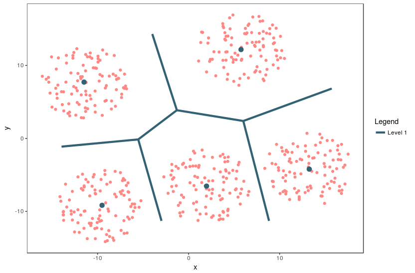

```{=html}
<style>
  .superbigimage{
      overflow-x:scroll;
      white-space: nowrap;
  }

  .superbigimage img{
     max-width: none;
  }


</style>
```
```{r, warning = FALSE, include = FALSE,echo=FALSE}
# Sourcing required code modules for muHVT
source("../R/Add_boundary_points.R")
source("../R/Corrected_Tessellations.R")
source("../R/DelaunayInfo.R")
source("../R/Delete_Outpoints.R")
source("../R/getCentroids.R")
source("../R/getOptimalCentroids.R")
source("../R/hvq.R")
source("../R/HVT.R")
source("../R/hvtHmap.R")
source("../R/plotHVT.R")
source("../R/predictHVT.R")
source("../R/ScaleMat.R")
source("../R/Transform_Coordinates.R")
source("../R/madPlot.R")
source("../R/diagPlot.R")
source("../R/get_cell_id.R")
source("../R/getCentroids_for_opti.R")
source("../R/multiNormalDist.R")
source("../R/plotDiag.R")
source("../R/qeHistPlot.R")
source("../R/diagSuggestion.R")


```

```{r, warning=FALSE, message=FALSE, include=FALSE, error=FALSE }

options=list(paging = TRUE,       # Paging of the data table
escape = FALSE, 
scrollX = TRUE,      # Horizontal scroll for the tables
searching = FALSE, # Search option at each column
lengthChange = FALSE,
      dom = 'prlti',
      initComplete = DT::JS(
        "function(settings, json) {",
        "$(this.api().table().header()).css({'font-size': '14px',
                                                        'background-color': '#8b9194', 'color': '#fff'});",
        "}"
      ),
      columnDefs = list(list(
        className = 'dt-center', targets = "_all"
      )),
      autowidth = T
    )

# use where you need to show more than 10 rows of dataset
other_option <- list(
  escape = FALSE,
  scrollX = TRUE,
  paging = TRUE,
  pageLength = 10,
  searching = TRUE
)

# Counter Initialization
options(scipen=999)

table_no <- 0
fig_no <- 0
eq_no <- 0
ref_no <- 0

if(!require('devtools')){
  install.packages("devtools", repos = 'http://cran.us.r-project.org')
  library(devtools)
}else{
  library(devtools)
}

# for windows user
if (Sys.info()['sysname'] == 'Windows' && find_rtools() == FALSE){
  if(!require('installr')){
    install.packages("installr", repos = 'http://cran.us.r-project.org')
  }
  installr::install.URL(exe_URL = 'https://cran.r-project.org/bin/windows/Rtools/Rtools35.exe')
}

library(knitr)
knitr::opts_chunk$set(echo = TRUE,
                      message = FALSE,
                      warning = FALSE,
                      comment = NA)


row_keep=c("mean","std.dev","var","median","range","min","max","sum")


```

```{r lib, warning=FALSE, message=FALSE, include=FALSE, error=FALSE}
#Add the package name inside quotes '' to the list below  
# List of packages used in the notebook
list.of.packages <<- c(
  "DT",
  'plotly',
  "magrittr",
  "data.table",
  "tidyverse",
  "crosstalk",
  "kableExtra",
  "gganimate",
      "gdata",
  # "muHVT",
  "data.table",
  "jmuOutlier",
  "viridis",
  "deldir",
  "conf.design",
    "splancs",
    "Hmisc",
    "xfun",
    "sp",
    "rgeos",
    "polyclip",
    "devtools",
    "deldir",
    "gdata",
    "tidyverse",
    "skimr",
      "patchwork",
  "crosstalk",
  "ggforce",
  "SmartEDA",
  "scales",
  "ggplot2",
  "htmlwidgets",
  "gridExtra",
  "gtable",
  "tibble"
)

new.packages <- list.of.packages[!(list.of.packages %in% installed.packages()[, "Package"])]

# Installing the missing packages
if (length(new.packages)){install.packages(new.packages, repos='http://cran.us.r-project.org')}

# Load all required packages
invisible(lapply(list.of.packages, library, character.only=T))

```

```{r setup, warning = FALSE, include = FALSE,echo=FALSE}
# knitr::opts_chunk$set(
#   collapse = TRUE,
#   comment = "#>",
#   out.width = "672px",
#   out.height = "480px",
#   fig.width = 7,
#   fig.height = 5,
#   fig.align = "center",
#   fig.retina = 1,
#   dpi = 72
# )

knitr::opts_chunk$set(echo = TRUE,
                      collapse = FALSE,
                      message = FALSE,
                      warning = FALSE,
                      comment = NA)


options=list(paging = TRUE,       # Paging of the data table
escape = FALSE, 
scrollX = TRUE,      # Horizontal scroll for the tables
searching = FALSE, # Search option at each column
lengthChange = FALSE,
      dom = 'prlti',
      initComplete = DT::JS(
        "function(settings, json) {",
        "$(this.api().table().header()).css({'font-size': '14px',
                                                        'background-color': '#8b9194', 'color': '#fff'});",
        "}"
      ),
      columnDefs = list(list(
        className = 'dt-center', targets = "_all"
      )),
      autowidth = T
    )


# installing all required packages
list.of.packages <- c("dplyr", "kableExtra", "geozoo", "plotly", "purrr", "sp", "muHVT")

new.packages <-
  list.of.packages[!(list.of.packages %in% installed.packages()[, "Package"])]
if (length(new.packages))
  install.packages(new.packages, dependencies = TRUE)

# Loading the required libraries
lapply(list.of.packages, library, character.only = T)

options(expressions = 10000)


global_var <- nzchar(Sys.getenv("RUN_VIGNETTE"))
global_var <- TRUE

scrolLimit <- function(noOfRows){
  if(noOfRows<10){
    
    swe = paste(as.character(noOfRows*50),"px")
  }
  else{
    swe = "400px"
  }
  return(swe)
}

Table <- function(data,scroll = F, limit = NULL){
  
  if(!is.null(limit)){
    data <- head(data,limit)
  }
  
  kable_table <- data %>% kable(escape = F,align = "c") %>% kable_styling(bootstrap_options = c("striped", "hover", "responsive"))
  
  scroll <- scroll
  
  if(scroll == T){
  kable_table <- kable_table %>% scroll_box(width = "100%", height = scrolLimit(nrow(data)))
  }
  

  
  return(kable_table)
  
}

summaryTable <- function(data,scroll = T,columnName='Quant.Error',value=0.2,limit=NULL){
  
  scroll <- scroll
  summaryTable <- data %>%  dplyr::mutate_if(is.numeric, funs(round(.,2))) %>% dplyr::mutate(!!columnName:=  cell_spec(eval(parse(text = columnName)),color = ifelse(is.na(eval(parse(text = columnName))),"#333",ifelse(eval(parse(text = columnName)) < value,"red","#333"))))  
  
  return(Table(summaryTable,scroll = scroll,limit = limit))
  
}


compressionSummaryTable <-
  function(data,
           scroll = T,
           columnName = 'percentOfCellsBelowQuantizationErrorThreshold',...) {
  
        table_out=  DT::datatable(
        data %>% 
          mutate_if(is.numeric, ~round(., 4)),
        # round(QEdata(), digits = 4),
        class = 'cell-border stripe',
        rownames = FALSE,
        escape = FALSE,
        selection = "none",
        options=options,
        caption = "Compression Summary Table"
      ) %>%
        formatStyle(columns = c(1:ncol(data)),
                    'text-align' = 'center') %>%
        formatStyle(columns = columnName,
                    color = "green",fontWeight = 'bold')
    
    
    return(table_out)
    
  }


set.seed(240)
```

# Abstract

The muHVT package is a collection of R functions to facilitate building [topology preserving maps](https://link.springer.com/chapter/10.1007/1-84628-118-0_7) for rich multivariate data. Tending towards a big data preponderance, a large number of rows. A collection of R functions for this typical workflow is organized below :

1. **Data Compression**: Vector quantization (VQ), HVQ (hierarchical vector quantization) using means or medians. This step compresses the rows (long data frame) using a compression objective.

2. **Data Projection**: Dimension projection of the compressed cells to 1D,2D and 3D with the Sammons Nonlinear Algorithm. This step creates topology preserving map coordinates into the desired output dimension.

3. **Tessellation**: Create cells required for object visualization using the Voronoi Tessellation method, package includes heatmap plots for hierarchical Voronoi tessellations (HVT). This step enables data insights, visualization, and interaction with the topology preserving map. Useful for semi-supervised tasks.

4. **Prediction**: Scoring new data sets and recording their assignment using the map objects from the above steps, in a sequence of maps if required.

This package additionally provides functions for computing Sammon’s projection and plotting the heat map of the variables on the tiles of the tessellations.

The muHVT process involves three steps:

1. **Compress:** Using a quantization threshold
2. **Project:** Using a dimension projection algorithm
3. **Tessellate:** Using a Voronoi Tessellation


# Compress: Vector Quantization

This package can perform vector quantization using the following algorithms -

-   Hierarchical Vector Quantization using $k-means$
-   Hierarchical Vector Quantization using $k-medoids$

## Using k-means

1.  The k-means algorithm randomly selects *k* data points as initial
    means
2.  *k* clusters are formed by assigning each data point to its closest
    cluster mean using the Euclidean distance
3.  Virtual means for each cluster are calculated by using all
    datapoints contained in a cluster

The second and third steps are iterated until a predefined number of
iterations is reached or the clusters converge. The runtime for the
algorithm is O(n).

## Using k-medoids

1.  The k-medoids algorithm randomly selects *k* data points as initial
    means out of the n data points as the medoids.
2.  *k* clusters are formed by assigning each data point to its closest
    medoid by using any common distance metric methods.
3.  Virtual means for each cluster are calculated by using all
    datapoints contained in a cluster

The second and third steps are iterated until a predefined number of
iterations is reached or the clusters converge. The runtime for the
algorithm is O(k \* (n-k)\^2).

## Hierarchical Vector Quantization

The algorithm divides the dataset recursively into cells using $k-means$
or $k-medoids$ algorithm. The maximum number of subsets are decided by
setting $nclust$ to, say five, in order to divide the dataset into
maximum of five subsets. These five subsets are further divided into
five subsets(or less), resulting in a total of twenty five (5\*5)
subsets. The recursion terminates when the cells either contain less
than three data point or a stop criterion is reached. In this case, the
stop criterion is set to when the cell error exceeds the quantization
threshold.

The steps for this method are as follows :

1.  Select k(number of cells), depth and quantization error threshold
2.  Perform quantization (using $k-means$ or $k-medoids$) on the input
    dataset
3.  Calculate quantization error for each of the k cells
4.  Compare the quantization error for each cell to quantization error
    threshold
5.  Repeat steps 2 to 4 for each of the k cells whose quantization error
    is above threshold until stop criterion is reached.

The stop criterion is when the quantization error of a cell satisfies
one of the below conditions

-   reaches below quantization error threshold
-   there are less than three data point in the cell
-   the user specified depth has been attained

### Quantization Error

Let us try to understand quantization error with an example.

```{r Quantization Error,echo=FALSE,warning=FALSE,fig.show='hold',message=FALSE,out.width='90%',fig.height=8,fig.cap='Figure 1: The Voronoi tessellation for level 1 shown for the 5 cells with the points overlayed'}

```

An example of a 2 dimensional VQ is shown above.

In the above image, we can see 5 cells with each cell containing a
certain number of points. The centroid for each cell is shown in blue.
These centroids are also known as codewords since they represent all the
points in that cell. The set of all codewords is called a codebook.

Now we want to calculate quantization error for each cell. For the sake
of simplicity, let's consider only one cell having centroid `A` and `m`
data points $F_i$ for calculating quantization error.

For each point, we calculate the distance between the point and the
centroid.

$$ d = ||A - F_i||_{p} $$

In the above equation, p = 1 means `L1_Norm` distance whereas p = 2
means `L2_Norm` distance. In the package, the `L1_Norm` distance is
chosen by default. The user can pass either `L1_Norm`, `L2_Norm` or a
custom function to calculate the distance between two points in n
dimensions.

$$QE  = \max(||A-F_i||_{p})$$

where

-   $A$ is the centroid of the cell
-   $F_i$ represents a data point in the cell
-   $p$ is the $p$-norm metric. Here $p$ = 1 represents L1 Norm and $p$
    = 2 represents L2 Norm.

Now, we take the maximum calculated distance of all m points. This gives
us the furthest distance of a point in the cell from the centroid, which
we refer to as `Quantization Error`. If the Quantization Error is higher
than the given threshold, the centroid/codevector is not a good
representation for the points in the cell. Now we can perform further
Vector Quantization on these points and repeat the above steps.

Please note that the user can select mean or max to calculate the
Quantization Error. The custom function takes a vector of m value (where
each value is a distance between point in `n` dimensions and centroids)
and returns a single value which is the Quantization Error for the cell.

If we select `mean` as the error metric, the above Quantization Error
equation will look like this :

$$QE  = \frac{1}{m}\sum_{i=1}^m||A-F_i||_{p}$$

where

-   $A$ is the centroid of the cell
-   $F_i$ represents a data point in the cell
-   $m$ is the number of points in the cell
-   $p$ is the $p$-norm metric. Here $p$ = 1 represents L1 Norm and $p$
    = 2 represents L2 Norm.

# Voronoi Tessellations

A Voronoi diagram is a way of dividing space into a number of regions. A
set of points (called seeds, sites, or generators) is specified
beforehand and for each seed, there will be a corresponding region
consisting of all points within proximity of that seed. These regions
are called Voronoi cells. It is complementary to Delaunay triangulation.

## Project: Sammon's projection

Sammon's projection is an algorithm that maps a high-dimensional space
to a space of lower dimensionality while attempting to preserve the
structure of inter-point distances in the projection. It is particularly
suited for use in exploratory data analysis and is usually considered a
non-linear approach since the mapping cannot be represented as a linear
combination of the original variables. The centroids are plotted in 2D
after performing Sammon's projection at every level of the tessellation.

Denoting the distance between $i^{th}$ and $j^{th}$ objects in the
original space by $d_{ij}^*$, and the distance between their projections
by $d_{ij}$. Sammon's mapping aims to minimize the below error function,
which is often referred to as Sammon's stress or Sammon's error

$$E=\frac{1}{\sum_{i<j} d_{ij}^*}\sum_{i<j}\frac{(d_{ij}^*-d_{ij})^2}{d_{ij}^*}$$

The minimization of this can be performed either by gradient descent, as
proposed initially, or by other means, usually involving iterative
methods. The number of iterations need to be experimentally determined
and convergent solutions are not always guaranteed. Many implementations
prefer to use the first Principal Components as a starting
configuration.

## Tessellate: Constructing Voronoi Tesselations

In this package, we use `sammons` from the package `MASS` to project
higher dimensional data to a 2D space. The function `hvq` called from
the `HVT` function returns hierarchical quantized data which will be the
input for construction of the tessellations. The data is then represented
in 2D coordinates and the tessellations are plotted using these
coordinates as centroids. We use the package `deldir` for this purpose.
The `deldir` package computes the Delaunay triangulation (and hence the
Dirichlet or Voronoi tessellation) of a planar point set according to the
second (iterative) algorithm of Lee and Schacter. For subsequent levels,
transformation is performed on the 2D coordinates to get all the points
within its parent tile. Tessellations are plotted using these
transformed points as centroids. The lines in the tessellations are
chopped in places so that they do not protrude outside the parent
polygon. This is done for all the subsequent levels.

# Import Dataset

## Import Dataset from Local

The user can provide an absolute or relative path in the cell below to
access the data from his/her computer. User can set `import_data_from_local` variable to TRUE to upload dataset from local. <br>
**Note: For this notebook import_data_from_local has been set to FALSE as we are simulating a dataset in next section.**

```{r loading csv, message=FALSE, warning=FALSE}
import_data_from_local = FALSE # expects logical input

  file_name <- "hotel_data_train.csv" ## Single_hotel_Time_Series.csv,HotelPanel_100.csv
  file_path <- "./sample_dataset/"

# Loading the data in the Rstudio environment 
# Please change the path in the code line below to the path location of the .csv file
if(import_data_from_local){

  file_load <- paste0(file_path, file_name)
  
  dataset_updated <- as.data.frame(fread(file_load))
  
  if(nrow(dataset_updated) > 0){


    paste0("File ", file_name, " having ", nrow(dataset_updated), " row(s) and ", ncol(dataset_updated), " column(s)",  " imported successfully. ") %>% cat("\n")
    
    # Round only the numeric columns in dataset
    dataset_updated <- dataset_updated %>% mutate_if(is.numeric, round, digits = 4)
    
    paste0("Code chunk executed successfully. Below table showing first 10 row(s) of the dataset.") %>% cat("\n")
    # Display imported dataset
    dataset_updated %>% head(10) %>% 
      as.data.frame() %>%
      DT::datatable(options = options, rownames = TRUE)
  }
  
} 
```

# Simulate Dataset

In this section, we will use a simulated dataset. If you are not using this option set `simulate_dataset` to FALSE. Given below is a simulated dataset that contains
2500 observations and 5 features. In this step, a Normal Multivariate
cross-sectional dataset is simulated with 5 features using the rnorm()
function (N=2500,mean=0,sd=1) such that every feature has normal
distribution and linear combination of its k components also has a
univariate normal distribution.

Here, we load the data and store into a variable `dataset_updated`.

```{r}
simulate_dataset= TRUE

set.seed(257)
dataset_updated <- multiNormalDist(2500,5) 

names(dataset_updated) <- paste0("Variable",1:ncol(dataset_updated))


  if(nrow(dataset_updated) > 0){


    paste0( "Dataset having ", nrow(dataset_updated), " row(s) and ", ncol(dataset_updated), " column(s)",  " simulated successfully. ") %>% cat("\n")
    
    # Round only the numeric columns in dataset
    dataset_updated <- dataset_updated %>% mutate_if(is.numeric, round, digits = 4)
    
    paste0("Code chunk executed successfully. The table below is showing first 10 row(s) of the dataset.") %>% cat("\n")
    # Display imported dataset
    dataset_updated %>% head(10) %>% 
      as.data.frame() %>%
      DT::datatable(options = options, rownames = TRUE)
  }

```

------------------------------------------------------------------------

# Data Understanding

## Quick Peek of the Data

### Summary of Dataset

The table below shows summary of all (numeric & categorical) columns of
Data set

```{r sum_test,  message=FALSE, warning=FALSE}
df <- do.call(cbind, lapply(dataset_updated, summary)) %>% 
  data.frame() %>%
  tibble::rownames_to_column("Metrics")

DT::datatable(df %>% 
                mutate_if(is.numeric, round,4) %>% 
                head(),
    options  = options,
    rownames = FALSE)

rm(df)
```

### Structure of Data

In the below section we can see the structure of the data.

```{r struc_test3,  warning=FALSE, message=FALSE, error=FALSE}
dataset_updated %>% str()
```

## Deleting Irrelevant Columns

The cell below will allow user to drop irrelevant column.

```{r Deleting irrelevant columns, warning=FALSE, purl = FALSE}

########################################################################################
################################## User Input Needed ###################################
########################################################################################

# Add column names which you want to remove
want_to_delete_column <- "no"

    del_col<-c("hotel_id")  

if(want_to_delete_column == "yes"){
   dataset_updated <-  dataset_updated[ , !(names(dataset_updated) %in% del_col)]
  print("Code chunk executed successfully. Overview of data types after removed selected columns")
  str( dataset_updated)
}else{
  paste0("No Columns removed. Please enter column name if you want to remove that column") %>% cat("\n")
}


```

## Formatting and Renaming Columns

The code below contains a user defined function to rename or reformat
any column that the user chooses.

```{r Formatting and renaming columns, warning=FALSE, purl = FALSE}

########################################################################################
################################## User Input Needed ###################################
########################################################################################

# convert the column names to lower case
colnames( dataset_updated) <- colnames( dataset_updated) %>% casefold()

## rename column ?
want_to_rename_column <- "no" ## type "yes" if you want to rename a column

## renaming a column of a dataset 
rename_col_name <- "fac_id" ## use small letters
rename_col_name_to <- "unique_id"

if(want_to_rename_column == "yes"){
  names( dataset_updated)[names( dataset_updated) == rename_col_name] <- rename_col_name_to
}

# remove space, comma, dot from column names
spaceless <- function(x) {colnames(x) <- gsub(pattern = "[^[:alnum:]]+",
                             replacement = ".",
                             names(x));x}
 dataset_updated <- spaceless( dataset_updated)

## below is the dataset summary
paste0("Successfully converted the column names to lower case and check the renamed column name if you changed") %>% cat("\n")
str( dataset_updated) ## showing summary for updated 

```

## Changing Data Type of Columns

The section allows the user to change the data type of columns of his
choice.

```{r column type, purl = FALSE}

########################################################################################
################################## User Input Needed ###################################
########################################################################################

# If you want to change column type, change a below variable value to "yes"
want_to_change_column_type <- "no"

# you can change column type into numeric or character only
change_column_to_type <- "character" ## numeric

if(want_to_change_column_type == "yes" && change_column_to_type == "character"){
########################################################################################
################################## User Input Needed ###################################
########################################################################################
  select_columns <- c("panel_var") ###### Add column names you want to change here #####
   dataset_updated[select_columns]<- sapply( dataset_updated[select_columns],as.character)
  paste0("Code chunk executed successfully. Datatype of selected column(s) have been changed into numerical.")
  #str( dataset_updated)
}else if(want_to_change_column_type == "yes" && change_column_to_type == "numeric"){
  select_columns <- c('gearbox_oil_temperature')
   dataset_updated[select_columns]<- sapply( dataset_updated[select_columns],as.numeric)
  paste0("Code chunk executed successfully. Datatype of selected column(s) have been changed into categorical.")
  #str( dataset_updated)
}else{
  paste0("Datatype of columns have not been changed.") %>% cat("\n")
}
dataset_updated<-do.call(data.frame, dataset_updated)
str( dataset_updated)

```

## Checking and Removing Duplicates

Presence of duplicate observations can be misleading, this sections
helps get rid of such rows in the datasets.

```{r,  message=FALSE, warning=FALSE, purl = FALSE}

want_to_remove_duplicates <- "yes"  ## type "no" for choosing to not remove duplicates

## removing duplicate observation if present in the dataset
if(want_to_remove_duplicates == "yes"){
  
   dataset_updated <-  dataset_updated %>% unique()
  paste0("Code chunk executed successfully, duplicates if present successfully removed. Updated dataset has ", nrow( dataset_updated), " row(s) and ", ncol( dataset_updated), " column(s)") %>% print()
  cat("\n")
  str( dataset_updated) ## showing summary for updated dataset
} else{
  paste0("Code chunk executed successfully, NO duplicates were removed") %>% print()
}
```

## List of Numerical and Categorical Column Names

```{r, warning=FALSE, message=FALSE, purl = FALSE}

# Return the column type 
CheckColumnType <- function(dataVector) {
  #Check if the column type is "numeric" or "character" & decide type accordingly
  if (class(dataVector) == "integer" || class(dataVector) == "numeric") {
    columnType <- "numeric"
  } else { columnType <- "character" }
  #Return the result
  return(columnType)
}
### Loading the list of numeric columns in variable
numeric_cols <<- colnames( dataset_updated)[unlist(sapply( dataset_updated, 
                                                       FUN = function(x){ CheckColumnType(x) == "numeric"}))]

### Loading the list of categorical columns in variable
cat_cols <- colnames( dataset_updated)[unlist(sapply( dataset_updated, 
                                                   FUN = function(x){ 
                                                     CheckColumnType(x) == "character"|| CheckColumnType(x) == "factor"}))]

### Removing Date Column from the list of categorical column
paste0("Code chunk executed successfully, list of numeric and categorical variables created.") %>% cat()
paste0("\n\n Numerical Column(s): \n Count : ", length(numeric_cols), "\n") %>% cat()
paste0(numeric_cols) %>% print()
paste0("\n Categorical Column(s): \n Count : ", length(cat_cols), "\n") %>% cat()
paste0(cat_cols) %>% print()
```

## Filtering Dataset for Analysis

In this section, the dataset can be filtered for required row(s) for
further analysis.

```{r,  message=FALSE, warning=FALSE, purl = FALSE}

want_to_filter_dataset <- "no" ## type "yes" in case you want to filter
filter_col <- "building.type"  ## Enter Column name to filter
filter_val <- "3"        ## Enter Value to exclude for the column selected

if(want_to_filter_dataset == "yes"){
   dataset_updated <- filter_at( dataset_updated
                              , vars(contains(filter_col))
                              , all_vars(. != filter_val))
  
  paste0("Code chunk executed successfully, dataset filtered successfully on required columns. Updated dataset has ", nrow( dataset_updated), " row(s) and ", ncol( dataset_updated), " column(s)") %>% print()
  cat("\n")
  str( dataset_updated) ## showing summary for updated dataset
  
} else{
  paste0("Code chunk executed successfully, entire dataset is available for analysis.") %>% print()
}
```

------------------------------------------------------------------------

## Missing Value Analysis

Missing values in the training data can lead to a biased model because
we have not analyzed the behavior and relationship of those values with
other variables correctly. It can lead to a wrong prediction or
classification. Missing values can be of 3 types:

-   **Missing Completely At Random (MCAR)**: When missing data are MCAR,
    the presence/absence of data is completely independent of observable
    variables and parameters of interest. This is a case when the
    probability of missing variables is the same for all observations.
    For example, respondents of the data collection process decide that
    they will declare they're earning after tossing a fair coin. If a
    head occurs, the respondent declares his / her earnings & vice
    versa.
-   **Missing At Random (MAR)**: When missing data is not random but can
    be related to an observed variable where there is complete
    information. This kind of missing data can induce a bias in the
    analysis, especially if it unbalances the data because of many
    missing values in a certain category. For example, we are collecting
    data for age and female has higher missing value compare to male.
-   **Missing Depending on Unobserved Predictors**: This is a case when
    the missing values are not random and are related to the unobserved
    input variable.

### Missing Value on Entire dataset

```{r miss_value_entire_data, warning=FALSE, purl = FALSE}
na_total <- sum(is.na( dataset_updated))/prod(dim( dataset_updated))
if(na_total == 0){
  paste0("In the uploaded dataset, there is no missing value") %>% cat("\n")
}else{
  na_percentage <- paste0(sprintf(na_total*100, fmt = '%#.2f'),"%")
  paste0("Percentage of missing value in entire dataset is ",na_percentage) %>% cat("\n")
}

```

### Missing Value on Column-level

The following code is to visualize the missing values (if any) using bar
chart.

gg_miss_upset function are using to visualize the patterns of
missingness, or rather the combinations of missingness across cases.

This function gives us(if any missing value present):

-   how many variables have missing values
-   which variable has the most missing values
-   And give us the variables which have missing values together

```{r miss_value_column_level, warning=FALSE,,fig.width=10, purl = FALSE}

# Below code gives you missing value in each column
paste0("Number of missing value in each column") %>% cat("\n")
print(sapply( dataset_updated, function(x) sum(is.na(x))))

missing_col_names <- names(which(sapply( dataset_updated, anyNA)))

total_na <- sum(is.na( dataset_updated))
# visualize the missing values (if any) using bar chart
if(total_na > 0 && length(missing_col_names) > 1){
  paste0("Code chunk executed successfully. Visualizing the missing values using bar chart") %>% cat("\n")
  gg_miss_upset( dataset_updated,
  nsets = 10,
  nintersects = NA)
}else if(total_na > 0){
   dataset_updated %>%
  DataExplorer::plot_missing() 
  # paste0("Code chunk executed successfully. Only one column ",missing_col_names," have missing values ", sum(is.na( dataset_updated)),".") %>% cat("\n")
}else{
  paste("Code chunk executed successfully. No missing value exist.") %>% cat("\n")
}

```

### Missing Value Treatment

In this section user can make decisions, how to tackle missing values in
dataset. Both column(s) and row(s) can be removed in the following
dataset should the user choose to do so.

**Note** for missing value imputation, please refer to data wrangling
brick.

#### Drop Column(s) with Missing Values

The below code accepts user input and deletes the specified column.

```{r Col_Missing_Value_treatment,, purl = FALSE}

########################################################################################
################################## User Input Needed ###################################
########################################################################################

# OR do you want to drop column specific column
drop_cloumn_name_na <- "yes" ## type "yes" to drop column(s)
# write column name that you want to drop
drop_column_name <- c("building.type")
if(drop_cloumn_name_na == "yes"){
  names_df=names( dataset_updated) %in% drop_column_name
  dataset_updated <-  dataset_updated[ , which(!names( dataset_updated) %in% drop_column_name)]
  paste0("Code chunk executed, selected column(s) dropped successfully.") %>% print()
  cat("\n")
  str( dataset_updated)
} else {
  paste0("Code chunk executed, missing value not removed (if any).") %>% cat("\n")
  cat("\n")
}
```

#### Drop Row(s) with Missing Values

The below code accepts user input and deletes rows.

```{r Row_Missing_Value_treatment, message=FALSE, warning=FALSE, , purl = FALSE}

# Do you want to drop row(s) containing "NA"
drop_row <- "no" ## type "yes" to delete missing value observations
if(drop_row == "yes"){
  
  # imputing blank with NAs and removing all rows containing NAs
  #  dataset_updated[ dataset_updated == ""] <- NA
  # removing missing values from data
   dataset_updated <-  dataset_updated %>% na.omit()
  
  paste0("Code chunk executed, missing values successfully identified and removed. Updated dataset has ", nrow( dataset_updated), " row(s) and ", ncol( dataset_updated), " column(s)") %>% print()
  cat("\n")
  # str( dataset_updated)
  
} else{
  paste0("Code chunk executed, missing value(s) not removed (if any).") %>% cat("\n")
  cat("\n")
}
```

### One-Hot Encoding

This technique bins all categorical values as either 1 or 0. It is used
for categorical variables with 2 classes. This is done because
classification models can only handle features that have numeric values.

Shown below is the length of unique values in each categorical column

```{r}
cat_cols <-
  colnames(dataset_updated)[unlist(sapply(
    dataset_updated,
    FUN = function(x) {
      CheckColumnType(x) == "character" ||
        CheckColumnType(x) == "factor"
    }
  ))]

apply(dataset_updated[cat_cols], 2, function(x) {
  length(unique(x))
})
```

Selecting categorical columns with smaller unique values for
dummification

```{r dummify,purl = TRUE}
########################################################################################
################################## User Input Needed ###################################
########################################################################################
# Do you want to dummify the categorical variables?

dummify_cat <- FALSE ## TRUE,FALSE

# Select the columns on which dummification is to be performed
dum_cols <- c("location.type","class")
########################################################################################
```

```{r dummify1, purl=FALSE,echo=dummify_cat}
# Below we dummify the columns mentioned by the user in the above code chunk
if(dummify_cat){
dummified_cols <- dataset_updated %>% dplyr::select(dum_cols) %>%       
  dummies::dummy.data.frame(dummy.classes = "ALL", sep = "_")  # dummy encode columns
names(dummified_cols) <- gsub(pattern = "[^[:alnum:]]+",
                             replacement = ".",
                             names(dummified_cols))

dataset_updated <- dataset_updated %>% 
  cbind(dummified_cols) %>%     # append encoded columns
  dplyr::select(-dum_cols)      # remove the old categorical columns
print("Shown below are the One-Hot Encoded columns")
print(dummified_cols %>% head(5) %>% DT::datatable(options = options) ) # Display columns
dummified_cols=names(dummified_cols)

# here we manipulate column names, round numeric values and display first 100 rows of data
colnames(dataset_updated) <- gsub(pattern = "[^[:alnum:]]+",
                             replacement = ".",
                             names(dataset_updated)) # Removes white-spaces between column names

dataset_updated <- dataset_updated %>% dplyr::mutate_if(is.numeric,round,digits = 3) # rounding digits in numeric values

dataset_updated %>% head(100) %>% DT::datatable(options = options)
} else{
 print("One-Hot Encoding was not performed on dataset.") 
}

```

### Check for Singularity {#singularity}

```{r,purl = FALSE}
# Check data for singularity
singular_cols <- sapply(dataset_updated,function(x) length(unique(x))) %>%  # convert to dataframe
  data.frame(Unique_n = .) %>% dplyr::filter(Unique_n == 1) %>% 
  rownames() %>% data.frame(Constant_Variables = .)

if(nrow(singular_cols) != 0) {                              
  singular_cols  %>% DT::datatable()
} else {
  paste("There are no singular columns in the dataset") %>% htmltools::HTML()
}
# Display variance of columns
dataset_updated %>% dplyr::summarise_if(is.numeric, var) %>% t() %>% 
  data.frame() %>%  round(3) %>% DT::datatable(colnames = "Variance")
```

### Selecting only Numeric Cols after Dummification

```{r}
numeric_cols=as.vector(sapply(dataset_updated, is.numeric))
dataset_updated=dataset_updated[,numeric_cols]
colnames(dataset_updated)
```

------------------------------------------------------------------------

## Final Dataset Summary

All further operations will be performed on the following dataset.

```{r Final_Dataset_Summary, ,warning=FALSE, purl = FALSE}
nums <- colnames(dataset_updated)[unlist(lapply(dataset_updated, is.numeric))]
cat(paste0("Final data frame contains ", nrow( dataset_updated), " row(s) and ", ncol( dataset_updated), " column(s).","Code chunk executed. Below table showing first 10 row(s) of the dataset."))
dataset_updated <-  dataset_updated %>% mutate_if(is.numeric, round, digits = 4)

dataset_updated %>% head(10) %>%
  as.data.frame() %>%
  DT::datatable(options = options, rownames = TRUE)

```

```{r}
      DT::datatable(
        dataset_updated %>%
          select_if(., is.numeric) %>%
          skimr::skim() %>%
          mutate_if(is.numeric, round, digits = 4) %>%
          rename_at(.vars = vars(starts_with("skim_")), .funs = funs(sub("skim_", "", .))) %>%
          rename_at(.vars = vars(starts_with("numeric.")), .funs = funs(sub("numeric.", "", .))) %>%
          select(-c(type, n_missing, complete_rate)) %>%
          mutate(n_row = nrow(dataset_updated),
                 n_missing = rowSums(is.na(.))
                 # ,n_non_missing = n_row - n_missing
                 ) ,
        selection = "none",
        # filter = "top",
        class = 'cell-border stripe',
        escape = FALSE,
        options = options,
        callback = htmlwidgets::JS(
          "var tips = ['Index showing column number',
                        'Columns used for building the HVT model',
                        'Histogram for individual column',
                        'Number of records for each feature',
                        'Number of missing (NA) values for each feature',
                        'Mean of individual column',
                        'Standard deviation of individual column',
                        '0th Percentile means that the values are smaller than all 100% of the rows',
                        '25th Percentile means that the values are bigger than 25% and smaller than only 75% of the rows',
                        '50th Percentile means that the values are bigger than 50% and smaller than only 50% of the rows',
                        '75th Percentile means that the values are bigger than 75% and smaller than only 25% of the rows',
                        '100th Percentile means that the values are bigger than 100% of the rows'],
                            header = table.columns().header();
                        for (var i = 0; i < tips.length; i++) {
                          $(header[i]).attr('title', tips[i]);
                        }"
        )
      )
```

# Data distribution {.tabset}

## Variable Histograms {.unlisted .unnumbered}

Shown below is the distribution of all the variables in the dataset.

```{r hist_plot, purl=TRUE, echo = FALSE,include=FALSE}
# Here we define a function to generate histograms to plot distribution

generateDistributionPlot <- function(data, column){
  # browser()
  p1<- ggplot2::ggplot(data,
                       ggplot2::aes(x = data[[column]])) +
    ggplot2::geom_histogram(ggplot2::aes(y = ..count..), fill = "midnightblue", size = 0.2, alpha=0.7) +
    ggplot2::xlab(column) + ggplot2::ylab("Count") +
    ggplot2::labs(column) +ggplot2::theme_bw() + 
    ggplot2::theme(panel.border=ggplot2::element_rect(size=0.1),legend.position = c(0.8, 0.8))
  
  p2<-ggplot2::ggplot(data, ggplot2::aes(x = data[[column]])) +
    ggplot2::stat_function(ggplot2::aes(color = "Normal"), fun = dnorm,args = list(mean = mean(data[[column]]),sd = sd(data[[column]]))) +
    ggplot2::stat_density(ggplot2::aes(color = "Density"), geom = "line", linetype = "dashed")  +
    ggplot2::scale_colour_manual("", values = c("black", "#EE7600")) +
    ggplot2::scale_linetype_manual("", values = c("Normal" = 2, "Density" = 1))  +
    ggplot2::guides(
      fill = ggplot2::guide_legend(keywidth = 1, keyheight = 1),
      linetype = ggplot2::guide_legend(keywidth = 3, keyheight = 1),
      colour = ggplot2::guide_legend(keywidth = 3, keyheight = 1)) + 
    ggplot2::ylab("Density") +
    ggplot2::xlab("Density") +
    ggplot2::theme(
      panel.background = ggplot2::element_blank(),
      panel.grid.minor = ggplot2::element_blank(),
      panel.grid.major = ggplot2::element_blank(),
      axis.text.y = ggplot2::element_text(colour="black", size=8),
      axis.text.x = ggplot2::element_text(size = 14),
      axis.ticks = ggplot2::element_line(colour = 'gray50'),
      axis.ticks.x = ggplot2::element_line(colour = "black"))
  
  g1 <- ggplot2::ggplotGrob(p1)
  g2 <- ggplot2::ggplotGrob(p2)
  
  pp <- c(subset(g1$layout, name == "panel", se = t:r))
  
  # superimpose p2 (the panel) on p1
  g <- gtable::gtable_add_grob(g1, g2$grobs[[which(g2$layout$name == "panel")]], pp$t, 
                               pp$l, pp$b, pp$l)
  
  # extract the y-axis of p2
  ia <- which(g2$layout$name == "axis-l")
  ga <- g2$grobs[[ia]]
  ax <- ga$children[[2]]
  
  # flip it horizontally
  ax$widths <- rev(ax$widths)
  ax$grobs <- rev(ax$grobs)
  
  # add the flipped y-axis to the right
  g <- gtable::gtable_add_cols(g, g2$widths[g2$layout[ia, ]$l], length(g$widths) - 1)
  g <- gtable::gtable_add_grob(g, ax, pp$t, length(g$widths) - 1, pp$b)
  distHistogram <- g
  return(distHistogram)
}

```

```{r dist_plots_true2, purl = FALSE,message=FALSE,warning=FALSE, fig.height=6, fig.width=6}
eda_cols <- names(dataset_updated)
# Here we plot the distribution of columns selected by user for numerical transformation
dist_list <- lapply(1:length(eda_cols), function(i){
generateDistributionPlot(dataset_updated, eda_cols[i]) })
do.call(gridExtra::grid.arrange, args = list(grobs = dist_list, ncol = 2, top = "Distribution of Features"))
 
```

## Box Plots {.tabset .unlisted .unnumbered}

In this section, we plot box plots for each numeric column in the
dataset across panels. These plots will display the median and Inter
Quartile Range of each column at a panel level.

```{r, results='asis', warning = FALSE, purl = FALSE}
## the below function helps plotting quantile outlier plot for multiple variables
quantile_outlier_plots_fn <- function(data, outlier_check_var, data_cat = dataset_updated[, cat_cols], numeric_cols = numeric_cols){
    # lower threshold
    lower_threshold <- stats::quantile(data[, outlier_check_var], .25,na.rm = T) - 1.5*(stats::IQR(data[, outlier_check_var], na.rm = T))
    
    # upper threshold
    upper_threshold <- stats::quantile(data[,outlier_check_var],.75,na.rm = T) + 1.5*(stats::IQR(data[,outlier_check_var],na.rm = T))
    
    # Look for outliers based on thresholds
    data$QuantileOutlier <- data[,outlier_check_var] > upper_threshold | data[,outlier_check_var] < lower_threshold

  # Plot box plot
  quantile_outlier_plot <- ggplot2::ggplot(data, ggplot2::aes(x="", y = data[,outlier_check_var])) +
             ggplot2::geom_boxplot(fill = 'blue',alpha=0.7) + 
             ggplot2::theme_bw() + 
             ggplot2::theme(panel.border=ggplot2::element_rect(size=0.1),panel.grid.minor.x=ggplot2::element_blank(),panel.grid.major.x=ggplot2::element_blank(),legend.position = "bottom") + ggplot2::ylab(outlier_check_var) + ggplot2::xlab("")
  data <- cbind(data[, !names(data) %in% c("QuantileOutlier")] %>% round(2), outlier = data[, c("QuantileOutlier")])
  data <- cbind(data, data_cat)  
  return(list(quantile_outlier_plot, data, lower_threshold, upper_threshold))
}
```

```{r message=FALSE, warning=FALSE,results='asis', fig.height=6, fig.width=6}
## the below code gives the interactive plot for Quantile Outlier analysis for numerical variables 
box_plots <- list()
for (x in names(dataset_updated)) {

box_plots[[x]] <- quantile_outlier_plots_fn(data = dataset_updated, outlier_check_var = x)[[1]]

}

gridExtra::grid.arrange(grobs = box_plots, ncol = 3)

```

## Correlation Matrix {.unlisted .unnumbered}

In this section we are calculating **pearson correlation** which is a
bivariate correlation value measuring the linear correlation between two
numeric columns. The output shown is a matrix.

```{r Correlation, echo=FALSE, fig.height=6, fig.width=6, purl=FALSE}

corrplot::corrplot(cor(dataset_updated), 
                            method = "color", 
                            outline = T, 
                            addgrid.col = "darkgray",
                            # order="hclust", 
                            addrect = 4,
                            rect.col = "black",
                            rect.lwd = 5,
                            cl.pos = "b",
                            tl.col = "black", 
                            tl.cex = 1, 
                            cl.cex = 1,
                            addCoef.col = "black",
                            number.digits = 2, 
                            number.cex = 1.5, 
                            type = "lower",
                            col = grDevices::colorRampPalette(c("#982D3B","white","#235C89"))(200))
  
# For better visualisation use the 'show in the new window' in the right corner of the output code block and in full screen if you have more columns

```

# Train - Test Split {.tabset}

Let us first split the data into train and test. We will use 80% of the
data as train and remaining as test.

```{r train-test dataset_updated,warning=FALSE,message=FALSE,eval = global_var}
## 80% of the sample size
smp_size <- floor(0.80 * nrow(dataset_updated))

## set the seed to make your partition reproducible
set.seed(279)
train_ind <- sample(seq_len(nrow(dataset_updated)), size = smp_size)

dataset_updated_train <- dataset_updated[train_ind, ]
dataset_updated_test <- dataset_updated[-train_ind, ]
```

The train data contains `r nrow(dataset_updated_train)` rows and
`r ncol(dataset_updated_train)` columns. The test data contains
`r nrow(dataset_updated_test)` rows and `r ncol(dataset_updated_test)`
columns.

## Train Distribution {.unlisted .unnumbered}

```{r dist_plots_true23, purl = FALSE,message=FALSE,warning=FALSE, fig.height=6, fig.width=6}
eda_cols <- names(dataset_updated_train)
# Here we plot the distribution of columns selected by user for numerical transformation
dist_list <- lapply(1:length(eda_cols), function(i){
generateDistributionPlot(dataset_updated_train, eda_cols[i]) })
do.call(gridExtra::grid.arrange, args = list(grobs = dist_list, ncol = 2, top = "Distribution of Features"))
 
```

## Test Distribution {.unlisted .unnumbered}

```{r dist_plots_true234, purl = FALSE,message=FALSE,warning=FALSE, fig.height=6, fig.width=6}
eda_cols <- names(dataset_updated_test)
# Here we plot the distribution of columns selected by user for numerical transformation
dist_list <- lapply(1:length(eda_cols), function(i){
generateDistributionPlot(dataset_updated_test, eda_cols[i]) })
do.call(gridExtra::grid.arrange, args = list(grobs = dist_list, ncol = 2, top = "Distribution of Features"))
 
```

# Model Training

In HVT, we use `sammons` from the package `MASS` to project higher
dimensional data to a 2D space. The function `hvq` called from the `HVT`
function returns hierarchical quantized data which will be the input for
construction of the tessellations. The data is then represented in 2D
coordinates and the tessellations are plotted using these coordinates as
centroids. We use the package `deldir` for this purpose. The `deldir`
package computes the Delaunay triangulation (and hence the Dirichlet or
Voronoi tessellation) of a planar point set according to the second
(iterative) algorithm of Lee and Schacter. For subsequent levels,
transformation is performed on the 2D coordinates to get all the points
within its parent tile. Tessellations are plotted using these
transformed points as centroids. The lines in the tessellations are
chopped in places so that they do not protrude outside the parent
polygon. This is done for all the subsequent levels.

Let us try to understand the HVT function first.

    muHVT::HVT(
      dataset,
      nclust,
      depth,
      quant.err,
      projection.scale,
      normalize = T,
      distance_metric = c("L1_Norm", "L2_Norm"),
      error_metric = c("mean", "max"),
      quant_method = c("kmeans", "kmedoids"),
      diagnose = TRUE,
      hvt_validation = FALSE,
      train_validation_split_ratio = 0.8,
      ...
    )

Each of the parameters have been explained below

-   **`dataset`** - A dataframe with numeric columns 

-   **`nclust`**  - An integer indicating the number of cells per hierarchy (level)

-   **`depth`**   - An integer indicating the number of levels. (1 = No hierarchy, 2 = 2 levels, etc ...)

-   **`quant.error`** - A number indicating the quantization error threshold. A cell will only breakdown
into further cells if the quantization error of the cell is above the defined quantization error threshold

-   **`distance_metric`**	- The distance metric can be `L1_Norm` or `L2_Norm`. `L1_Norm` is selected by default. The distance metric is used to calculate the distance between an `n` dimensional point and centroid. The user can also pass a custom function to calculate this distance

-   **`error_metric`** - The error metric can be `mean` or `max`. `max` is selected by default. `max` will return the max of `m` values and `mean` will take mean of `m` values where each value is a distance between a point and centroid of the cell. Moreover, the user can also pass a custom function to calculate the error metric

-   **`quant_method`** - The quantization method can be `kmeans` or `kmedoids`. `kmeans` is selected by default
    
-   **`normalize`**	- A logical value indicating whether the columns in your dataset need to be normalized. Default value is TRUE. The algorithm supports Z-score normalization

-   **`diagnose`** - A logical value indicating whether user wants to perform diagnostics on the model. Default value is TRUE.

-   **`hvt_validation`** - A logical value indicating whether user wants to holdout a validation set and find mean absolute deviation of the validation points from the centroid. Default value is FALSE.

-   **`train_validation_split_ratio`** - A numeric value indicating train validation split ratio. This argument is only used when hvt_validation has been set to TRUE. Default value for the argument is 0.8


More information on building an HVT model at different levels and visualizing the
output can be found [here](https://htmlpreview.github.io/?https://raw.githubusercontent.com/Mu-Sigma/muHVT/dev/vignettes/muHVT_vignette.html) 

In the section below, we build a Level 1 HVT model. The number of clusters 
`n_clust` is set to 1035 to achieve 95% compression.

```{r level one sample data,warning=FALSE,message=FALSE,eval = global_var,echo=TRUE,class.source = 'fold-show'}
set.seed(240)
hvt.results <- list()
hvt.results <- muHVT::HVT(dataset_updated_train,
                          nclust = 1035,
                          depth = 1,
                          quant.err = 0.2,
                          projection.scale = 10,
                          normalize = T,
                          distance_metric = "L1_Norm",
                          error_metric = "max",
                          quant_method = "kmeans",
                          diagnose = TRUE,
                          hvt_validation = TRUE,
                          train_validation_split_ratio=0.8)
```

```{r fig.height=4, fig.width=6}
# Voronoi tessellation plot for level one
muHVT::plotHVT(hvt.results,
        line.width = c(0.6 ),
        color.vec = c("#141B41"),
        centroid.size = 1,
        maxDepth = 1)
```

The table below shows number of cells having quantization error below threshold and percentage of cells having quantization error below threshold.

```{r}
compressionSummaryTable(hvt.results[[3]]$compression_summary)
```

As seen in the above table, 95% of the cells have a quantization error below the 
threshold. Let's have a closer look at `Quant.Error` variable in the below table.
The values for `Quant.Error` of the cells which have hit the Quantization Error threshold 
are shown in red. Here we are showing just top 50 rows for the sake of brevity.

```{r}
summaryTable(hvt.results[[3]][['summary']])
```


## Model Diagnostics and Validation

#### Diagnostics {.unlisted .unnumbered}

**HVT model diagnostics** are used to evaluate the model fit and investigate
the proximity between centroids. The distribution of proximity value can
also be used to decided an optimum Mean Absolute Deviation threshold for
HVT model based prediction.

The diagnosis can be enabled by setting the **`diagnose`** parameter to `TRUE` 
while building the HVT Model.


#### Validation {.unlisted .unnumbered}

**Model validation** is used to measure the fit/quality of the model.
Measuring model fit is the key to iteratively improving the models. The
relevant measure of model quality here is percentage of anomalous
points. The percentage anomalies ideally should match with level of
compression achieved during modeling, where PercentageAnomlies $\approx$
1-ModelCompression.

Model Validation can be enabled by setting the **`hvt_validation`** parameter 
to `TRUE` and setting the `train_validation_split_ratio` value while training
the HVT Model. 

The model trained above has a `train_validation_split_ratio` of 0.8, i.e 80% 
of the Train dataset is used for training the model while the remaining 20% will
be used for validation

**Note:** User can skip this step, if the number of observations in train data is low. 


## Diagnostic Plots

The basic tool for examining the model fit is proximity plots and
distribution of observations across centroids.

The proximity between object can be measured as **distance matrix**. The
distances between the objects is calculated using Manhattan or Euclidean
Distance and put into a matrix form. In the next step we find the
**minimum value for each row**, excluding the diagonal values, as the
diagonal elements of distance matrix are zero representing distance from
an object to itself. This minimum distance value gives the
**proximity(distance to nearest neighbour)** of other object in the
datatable.

plotDiag() function can be used to print diagnostic plots for HVT model or HVT prediction.

The plotDiag() function for HVT Model provides 5 diagnostic plots which are as
follows:

-   Mean Absolute Deviation Plot: Calibration: HVT Model \| Train Data
-   Minimum Intra-DataPoint Distance Plot: Train Data
-   Minimum Intra-Centroid Distance Plot: HVT Model \| Train Data
-   Distribution of Number of Observations in Cells: HVT Model \| Train
    Data
-   Singletons Pie Chart: HVT Model \| Train Data

Let's have look at the function `plotDiag` which we will use to print
the diagnostic plots.

::: superbigimage
```{r diagplot function1,echo = TRUE, eval= TRUE, fig.height=12, fig.width=14,class.source = 'fold-show'}
plotDiag(hvt.results)
```
:::

### Mean Absolute Deviation based Calibration: HVT Model \| Train Data

The first diagnostic plot is a calibration plot for HVT Model run on
train data. This plot is obtained by scoring(predicting) the train data
itself on the HVT model. It is a comparison of Percentage_Anomalies with
at varying Mean Absolute Deviation values. It can be seen from the
plot that at **0.22** Mean Absolute Deviation value the percentage anomlaies drop below one percent.

```{r fig.height=4, fig.width=6}
p3=hvt.results[[4]]$mad_plot_train+ggtitle("Mean Absolute Deviation Plot: Calibration: HVT Model | Train Data")
p3
```

### Minimum Intra-DataPoint Distance Plot: Train Data

The second diagnostics plot helps us in finding out how the points in the
training data are distributed. Shown below is a histogram of minimum
distances with nearest neighbour for each observation in train data.

```{r fig.height=4, fig.width=6}
p1=hvt.results[[4]]$datapoint_plot+ggtitle("Minimum Intra-DataPoint Distance Plot: Train Data")
p1
```

As seen in the plot above the mean value is 0.23. While running our model we had also selected the QE value as 0.2 which is near this value.

### Minimum Intra-Centroid Distance Plot: HVT Model | Train Data

The third diagnostics plot helps us in finding out how the centroids in the
HVT Model are distributed. Shown below is a histogram of minimum
distances with nearest neighbour for each centroid in HVT Model

```{r fig.height=4, fig.width=6}
p2=hvt.results[[4]]$cent_plot+ggtitle("Minimum Intra-Centroid Distance Plot: HVT Model | Train Data")
p2
```


<font color="red"> As seen in the plot above the mean value is **0.6**. This value can be selected as the Mean Absolute Deviation Threshold for scoring data using predict function </font>


### Distribution of Number of Observations in HVT Cells

The fourth diagnostics plot finds out distribution of number of
observations in each centroid. Shown below is a histogram to depict the
same.

```{r fig.height=4, fig.width=6}
p4=hvt.results[[4]]$number_plot+ggtitle("Distribution of Number of Observations in Cells: HVT Model | Train Data")
p4
```

As shown in the plot above the mean number of records in each HVT cell is **2**.

### Singleton Count

The fifth diagnostics plot finds out number of Singleton
centroids (Segments/Centroids with single observation.)

```{r fig.height=4, fig.width=6}
p5=hvt.results[[4]]$singleton_piechart
p5
```

#### Validation


The Mean Absolute Deviation Plot for Validation Data has been shown in above section. Alternatively. to fetch it separately, we can use the following code:

```{r fig.height=4, fig.width=6}
m1=hvt.results[[5]][["mad_plot"]]+ggtitle("Mean Absolute Deviation Plot:Validation")
m1
```


<font color="red">
As seen in the plot above the suggested threshold for scoring using Mean
Absolute Deviation is 0.59 which is very close to Mean of distribution
obtained in Minimum Intra-Centroid Distance Plot section. Thus 0.6 (Mean of Minimum Intra-Centroid Distance) can
be used as the mean absolute deviation threshold for prediction.
</font>

# Prediction

Now once we have built the model, let us try to predict using our test
dataset to see which cell each point belongs to.

## Prediction Algorithm


The prediction algorithm recursively calculates the distance between
each point in the test dataset and the cell centroids for each level.
The following steps explain the prediction method for a single point in
the test dataset :

1.  Calculate the distance between the point and the centroid of all the
    cells in the first level
2.  Find the cell whose centroid has minimum distance to the point
3.  Check if the cell drills down further to form more cells
4.  If it doesn't, return the path. Or else repeat steps 1 to 4 till we
    reach a level at which the cell doesn't drill down further

## Load Test Data

The user can provide an absolute or relative path in the cell below to
access the data from his/her computer.

```{r loading csv test, message=FALSE, warning=FALSE,class.source = 'fold-show'}
load_test_data=FALSE
# Loading the data in the Rstudio environment 
# Please change the path in the code line below to the path location of the .csv file
if(load_test_data){
  file_name <- "hotel_data_test.csv" ## Single_hotel_Time_Series.csv,HotelPanel_100.csv
  file_path <- "./sample_dataset/"
  file_load <- paste0(file_path, file_name)
  
  dataset_updated_test <- as.data.frame(fread(file_load))
  
  if(nrow(dataset_updated_test) > 0){


    paste0("File ", file_name, " having ", nrow(dataset_updated_test), " row(s) and ", ncol(dataset_updated_test), " column(s)",  " imported successfully. ") %>% cat("\n")
    
    # Round only the numeric columns in dataset
    dataset_updated_test <- dataset_updated_test %>% mutate_if(is.numeric, round, digits = 4)
    
    paste0("Code chunk executed successfully. Below table showing first 10 row(s) of the dataset.") %>% cat("\n")
    # Display imported dataset
    dataset_updated_test %>% head(10) %>% 
      as.data.frame() %>%
      DT::datatable(options = options, rownames = TRUE)
  }
  
  colnames( dataset_updated_test) <- colnames( dataset_updated_test) %>% casefold()
 dataset_updated_test <- spaceless( dataset_updated_test)
}
```

### Transformation of Categorical Features

In this section we will perform one hot encoding on test dataset, based
on whether one hot encoding has been performed on train dataset.

```{r dummify_Test, purl=FALSE,eval = dummify_cat,echo=dummify_cat,class.source = 'fold-show'}
if(dummify_cat){
dummified_cols_test <- dataset_updated_test %>% dplyr::select(dum_cols) %>%
  dummies::dummy.data.frame(dummy.classes = "ALL", sep = "_")

names(dummified_cols_test) <- gsub(pattern = "[^[:alnum:]]+",
                             replacement = ".",
                             names(dummified_cols_test))

columns_difference=setdiff(dummified_cols,names(dummified_cols_test))
dummified_cols_test[,columns_difference]=0

dataset_updated_test <- dataset_updated_test %>% cbind(dummified_cols_test) %>%     # append encoded columns
  dplyr::select(-dum_cols)
# remove the old categorical columns
dummified_cols_test %>% head(5) %>% DT::datatable(options = options)
}
```

### Subsetting Test Dataset

In this section we will subset the test data based on numeric columns present in train data.

```{r, purl = FALSE,results='asis',class.source = 'fold-show'}


dataset_updated_test=dataset_updated_test %>% dplyr::select(nums)

```


Now once we have the test data ready, lets look at how the predictHVT function looks like.


## Prediction on Test Data

```
predictHVT(data,
                  hvt.results,
                  hmap.cols = NULL,
                  child.level = 1,
                  mad.threshold
                  ...)
```

The important parameters for the function `predictHVT` are as below

-   **`data`** - A dataframe containing the test dataset. The dataframe
    should have atleast one variable used for training. The variables
    from this dataset can also be used to overlay as heatmap

-   **`hvt.results`** - A list of hvt.results obtained from the HVT
    function while performing hierarchical vector quantization on
    training data

-   **`hmap.cols`** - The column number of column name from the dataset
    indicating the variables for which the heat map is to be plotted. A
    heatmap won't be plotted if NULL is passed (Default = NULL)

-   **`child.level`** - A number indicating the level for which the heat
    map is to be plotted (Only used if hmap.cols is not NULL)
    
-   **`mad.threshold`** - A threshold indicating the level for which the heat
    map is to be plotted 

-   **`...`** - color.vec and line.width can be passed from here    

<p style="color:red;">
Here the mad_threshold has been selected as 0.6 which is based on Mean of Minimum Intra-Centroid Distance, and verified by Validation Mean Absolute Deviation Plot </p>

```{r,class.source = 'fold-show'}
hvt.prediction = list()
mad_threshold= 0.6 #Mean of Minimum Intra-Centroid Distance
hvt.prediction <- muHVT::predictHVT(
  data = dataset_updated_test,
  hvt.results.model=hvt.results,
  child.level = 1,
  mad.threshold = mad_threshold,
  line.width = c(0.6, 0.4, 0.2),
  color.vec = c("#141B41", "#6369D1", "#D8D2E1"),
  distance_metric = "L1_Norm",
  error_metric = "max"
)
```

The plotDiag() function can be called for prediction object as well. Shown below is the comparison of Mean Absolute Deviation Plot for train validation and test data.

::: superbigimage

```{r, fig.width=8,fig.height=10,class.source = 'fold-show'}

plotDiag(hvt.prediction)
```
::: 


```{r predictHVT2 hotel,warning=FALSE,message=FALSE,eval=global_var}

QEdata=hvt.results[[3]]$summary

Quant.Error.Actual <- QEdata %>% 
      mutate(Quant.Error =  Quant.Error * n) %>% 
      select(Quant.Error, n) %>% 
      summarise_all(sum) %>% 
      transmute(Quant.Error = Quant.Error/ n) %>% 
      unlist()%>%round(4)

# predictions[["predictPlot"]]
# 
# Table(predictions$predictions %>% dplyr::relocate(Cell_path), scroll = T, limit = 10)
```


  
### Quantization Error Comparison (Train vs. Test)

Table below shows cell(s) containing anomalous test data points.
Datapoints are flagged as anomalous when Quantization Error for such is
greater than the same of assigned centroid based on error metric.
Comparison between scored/test and fitted Quantization error of cell(s) is
provided for further insights.

```{r out.width="100%"}
QECompareDf <- hvt.prediction$QECompareDf %>% filter(anomalyFlag == 1)
percentageAnomalies = formatC((sum(QECompareDf$n) / nrow(dataset_updated_test)) *
                                100, digits = 2, format = "f") %>% paste0("%")
```

**Number of test data points:`r nrow(dataset_updated_test)` \| Number
of anomalous data points:`r sum(QECompareDf$n)` \| Percentage of
anomalous data points: `r percentageAnomalies`** <br> **Mean QE for
fitted data: `r Quant.Error.Actual %>% round(digits = 4)` \| Mean QE for
test data:
`r hvt.prediction[["scoredPredictedData"]]$Quant.Error %>%  mean() %>% round(digits = 4)`
\| Difference in QE between fitted and test data:
`r abs(Quant.Error.Actual%>%round(digits = 4)-hvt.prediction[["scoredPredictedData"]]$Quant.Error%>%mean() %>%round(digits = 4))`**

```{r fig.height=7.5, fig.width=6}
qeHistPlot(hvt.results,hvt.prediction)
```

### Anomalous Observations

The anomalous observations are shown below in the datatable.

```{r}

QECompareDf <- hvt.prediction$QECompareDf %>% filter(anomalyFlag == 1)
# adding cell ID to table
QECompareDf1 <-
  left_join(
    QECompareDf,
    hvt.results[[3]]$summary,
    by = c("Segment.Level", "Segment.Parent", "Segment.Child")
  )
QECompareDf1 <-
  QECompareDf1 %>% select(
    "Segment.Level",
    "Segment.Parent",
    "Segment.Child",
    # "Cell.ID",
    "anomalyFlag",
    "n.x" ,
    "Fitted.Quant.Error" ,
    "Scored.Quant.Error" ,
    "Quant.Error.Diff",
    "Quant.Error.Diff (%)"
  )
colnames(QECompareDf1) <- c(
    "Segment.Level",
    "Segment.Parent",
    "Segment.Child",
    # "Cell.ID",
    "anomalyFlag",
    "n" ,
    "Fitted.Quant.Error" ,
    "Scored.Quant.Error" ,
    "Quant.Error.Diff",
    "Quant.Error.Diff (%)"
  )
QECompareDf1$flag <-
  ifelse(QECompareDf1$anomalyFlag == 1, 1, 0)
DT::datatable(
  QECompareDf1 %>%
    mutate_if(is.numeric, ~ round(., 4)) %>%
    select(-c(`Quant.Error.Diff (%)`)) %>%
    rename(No.Of.Points = n),
  class = 'cell-border stripe',
  rownames = FALSE,
  filter = "top",
  escape = FALSE,
  selection = "none",
  options = options,
  callback = htmlwidgets::JS(
    "var tips = ['Segment Level based on the hierarchical structure of the muHVT model output',
                        'Segment Parent based on the hierarchical structure of the muHVT model output',
                        'Segment Child based on the hierarchical structure of the muHVT model output',
                        'Cell ID based on the hierarchical structure of the muHVT model output',
                        'Flag indicating whether data points are anomalous or not',
                        'Number of anomalous scored data points for each centroid in the muHVT map',
                        'Quantization Error for the highlighted cell built on the fitted data',
                        'Quantization Error for the highlighted cell built on the scored data',
                        'Change in Quantization Error between scored and the fitted model'],
                            header = table.columns().header();
                        for (var i = 0; i < tips.length; i++) {
                          $(header[i]).attr('title', tips[i]);
                        }"
  )
) %>%
  formatStyle('flag',
              target = 'row',
              backgroundColor = styleEqual(c(1), c('#ff7f7f')))

```


### Anomalous Test Cells (highlighted) in Fitted HVT Map

The interactive plot below shows anomalous cell(s) with color indicating
change in Quantization Error after scoring.

```{r,class.source = 'fold-show', fig.height=4, fig.width=6}
hvt.prediction[["predictPlot"]]
```


# Download Predictions

The predictions from the above sections can be downloaded in section
below. The downloaded predictions can be found in the output(LOCAL)
folder.

```{r}
predictClusterData <- hvt.prediction[["scoredPredictedData"]]%>%as.data.frame()
 predictClusterData  %>% head(100) %>% round(2)%>%
      as.data.frame() %>%
      DT::datatable(options = options, rownames = TRUE)
```


# Applications

1.  Pricing Segmentation - The package can be used to discover groups of
    similar customers based on the customer spend pattern and understand
    price sensitivity of customers

2.  Market Segmentation - The package can be helpful in market
    segmentation where we have to identify micro and macro segments. The
    method used in this package can do both kinds of segmentation in one
    go

3.  Anomaly Detection - This method can help us categorize system
    behaviour over time and help us find anomaly when there are changes
    in the system. For e.g. Finding fraudulent claims in healthcare
    insurance

4.  The package can help us understand the underlying structure of the
    data. Suppose we want to analyze a curved surface such as sphere or
    vase, we can approximate it by a lot of small low-order polygons in
    the form of tessellations using this package

5.  In biology, Voronoi diagrams are used to model a number of different
    biological structures, including cells and bone microarchitecture

6.  Using the base idea of Systems Dynamics, these diagrams can also be
    used to depict customer state changes over a period of time

# References

1. Topology Preserving Maps : <https://link.springer.com/chapter/10.1007/1-84628-118-0_7>

2.  Vector Quantization :
    <https://ocw.mit.edu/courses/electrical-engineering-and-computer-science/6-450-principles-of-digital-communications-i-fall-2006/lecture-notes/book_3.pdf>

3.  K-means : <https://en.wikipedia.org/wiki/K-means_clustering>

4.  Sammon's Projection : <http://en.wikipedia.org/wiki/Sammon_mapping>

5.  Voronoi Tessellations : <http://en.wikipedia.org/wiki/Centroidal_Voronoi_tessellation>
