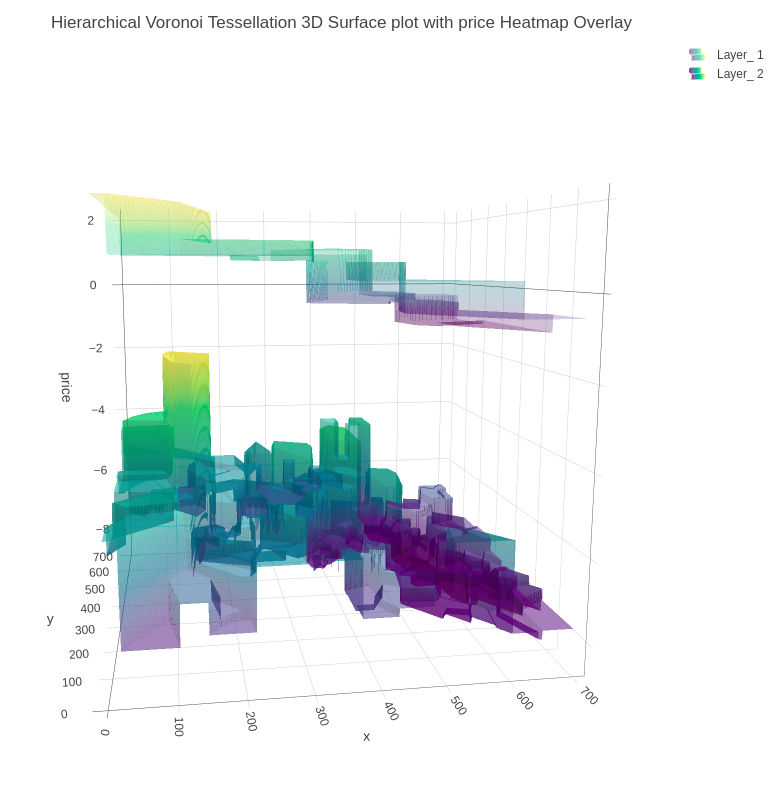

```{r setup, warning = FALSE, include = FALSE}
knitr::opts_chunk$set(
  collapse = TRUE,
  comment = "#>",
  out.width = "672px",
  out.height = "480px",
  fig.width = 7,
  fig.height = 5,
  fig.align = "center",
  fig.retina = 1,
  dpi = 150
)


# installing all required packages
list.of.packages <- c("dplyr", "kableExtra", "geozoo", "plotly", "purrr", "sp", "muHVT", "data.table")

new.packages <-
  list.of.packages[!(list.of.packages %in% installed.packages()[, "Package"])]
if (length(new.packages))
  install.packages(new.packages, dependencies = TRUE)

# Loading the required libraries
lapply(list.of.packages, library, character.only = T)

# Sourcing the modified files for muHVT
## Do this if muHVT is unavailable on CRAN

source("../R/Add_boundary_points.R")
source("../R/Corrected_Tessellations.R")
source("../R/DelaunayInfo.R")
source("../R/Delete_Outpoints.R")
source("../R/getCentroids.R")
source("../R/getOptimalCentroids.R")
source("../R/hvq.R")
source("../R/removeOutliers.R")
source("../R/HVT.R")
source("../R/hvtHmap.R")
source("../R/plotCells.R")
source("../R/plotHVT.R")
source("../R/predictHVT.R")
source("../R/mlayerHVT.R")
source("../R/ScaleMat.R")
source("../R/Transform_Coordinates.R")
source("../R/madPlot.R")
source("../R/diagPlot.R")
source("../R/get_cell_id.R")
source("../R/getCentroids_for_opti.R")
source("../R/multiNormalDist.R")
source("../R/plotDiag.R")
source("../R/qeHistPlot.R")
source("../R/diagSuggestion.R")
source("../R/exploded_hmap.R")


options(expressions = 10000)


global_var <- nzchar(Sys.getenv("RUN_VIGNETTE"))
global_var <- TRUE

scrolLimit <- function(noOfRows){
  if(noOfRows<10){
    
    swe = paste(as.character(noOfRows*50),"px")
  }
  else{
    swe = "400px"
  }
  return(swe)
}

Table <- function(data,scroll = F, limit = NULL){
  
  if(!is.null(limit)){
    data <- head(data,limit)
  }
  
  kable_table <- data %>% kable(escape = F,align = "c") %>% kable_styling(bootstrap_options = c("striped", "hover", "responsive"))
  
  scroll <- scroll
  
  if(scroll == T){
  kable_table <- kable_table %>% scroll_box(width = "100%", height = scrolLimit(nrow(data)))
  }
  

  
  return(kable_table)
  
}

summaryTable <- function(data,scroll = T,columnName='Quant.Error',value=0.2,limit=NULL){
  
  scroll <- scroll
  summaryTable <- data %>%  dplyr::mutate_if(is.numeric, funs(round(.,2))) %>% dplyr::mutate(!!columnName:=  cell_spec(eval(parse(text = columnName)),color = ifelse(is.na(eval(parse(text = columnName))),"#333",ifelse(eval(parse(text = columnName)) < value,"red","#333"))))  
  
  return(Table(summaryTable,scroll = scroll,limit = limit))
  
}

compressionSummaryTable <- function(data,scroll = T,columnName='percentOfCellsBelowQuantizationErrorThreshold',value=0.8){
  
  
  summaryTable <- data %>%  dplyr::mutate_if(is.numeric, funs(round(.,2))) %>% dplyr::mutate(!!columnName:=  cell_spec(eval(parse(text = columnName)),color = ifelse(is.na(eval(parse(text = columnName))),"#00bb27",ifelse(eval(parse(text = columnName)) > value,"#00bb27","#333")))) 
  
  return(Table(summaryTable,scroll = scroll))
  
}


set.seed(240)
```


# Abstract

The muHVT package is a collection of R functions to facilitate building [topology preserving maps](https://link.springer.com/chapter/10.1007/1-84628-118-0_7) for rich multivariate data. Tending towards a big data preponderance, a large number of rows. A collection of R functions for this typical workflow is organized below :

1.  **Data Compression**: Vector quantization (VQ), HVQ (hierarchical vector quantization) using means or medians. This step compresses the rows (long data frame) using a compression objective

2.  **Data Projection**: Dimension projection of the compressed cells to 1D,2D and 3D with the Sammons Non-linear Algorithm. This step creates topology preserving map coordinates into the desired output dimension

3.  **Tessellation**: Create cells required for object visualization using the Voronoi Tessellation method, package includes heatmap plots for hierarchical Voronoi tessellations (HVT). This step enables data insights, visualization, and interaction with the topology preserving map. Useful for semi-supervised tasks

4.  **Prediction**: Scoring new data sets and recording their assignment using the map objects from the above steps, in a sequence of maps if required

# muHVT 3.0.0 | What's New?

06th December, 2022

This package now additionally provides functionality to predict based on a set of maps to monitor entities over time.

The creation of a predictive set of maps involves four steps -

1. **Compress:** Compress the dataset using a percentage compression rate and a quantization threshold using the HVT() function (Map A)
2. **Remove outlier cells:** Manually identify and remove the outlier cells from the dataset using the removeOutliers() function (Map B)
3. **Compress the dataset without outliers:** Again, compress the dataset without outlier(s) using n_cells, depth and a quantization threshold using the HVT() function (Map C)
4. **Predict based on a predictive set of maps:** Using the mlayerHVT() function

Let us try to understand the steps with the help of the diagram below -

```{r mlayerHVT Flow,echo=FALSE,warning=FALSE,fig.show='hold',message=FALSE,out.width='90%',fig.height=8,fig.cap='Figure 1: Flow diagram for predicting based on a set of maps using mlayerHVT()'}
knitr::include_graphics('mlayerHVT.png')
```

Initially, the raw data is passed, and a highly compressed Map A is constructed using the __`HVT`__ function. The output of this function will be hierarchically arranged vector quantized data that is used to identify the outlier cells in the dataset using the number of data points within each cell and the z-scores for each cell.

The identified outlier cell(s) is then passed to the __`removeOutliers`__ function along with Map A. This function removes the identified outlier cell(s) from the dataset and stores them in Map B as shown in the diagram. The final output of this function is a list of two items - a newly constructed map (Map B), and a subset of the dataset without outlier cell(s).

The __`plotCells`__ function plots the Voronoi tessellations for the compressed map (Map A) and highlights the identified outlier cell(s) in red on the plot. The function requires the identified outlier cell(s) number and the compressed map (Map A) as input in order to plot the tessellations map and highlight those outlier cells on it.

The dataset without outlier(s) gotten as an output from the removeOutliers function is then passed as an argument to the __`HVT`__ function with other parameters such as n_cells, quant.error, depth, etc. to construct another map (Map C).

Finally, all the constructed maps are passed to the __`mlayerHVT`__ function along with the test dataset on which the function will predict/score for finding which map and what cell each test record gets assigned to.


__For detailed information on the above functions, refer the vignette [here](https://htmlpreview.github.io/?https://github.com/Mu-Sigma/muHVT/blob/dev/vignettes/muHVT_mlayerHVT_for_Monitoring_Entities_over_Time.html).__

## Installation of muHVT 3.0.0

``` r
library(devtools)
devtools::install_github(repo = "Mu-Sigma/muHVT", ref = "dev")
```


# Compress: Vector Quantization


This package can perform vector quantization using the following algorithms - 

*  Hierarchical Vector Quantization using $k-means$ 
*  Hierarchical Vector Quantization using $k-medoids$


## Hierarchical VQ

### Using k-means

1. The k-means algorithm randomly selects *k* data points as initial means
1. *k* clusters are formed by assigning each data point to its closest cluster mean using the Euclidean distance
1. Virtual means for each cluster are calculated by using all datapoints contained in a cluster

The second and third steps are iterated until a predefined number of iterations is reached or the clusters converge. The runtime for the algorithm is O(n).

### Using k-medoids

1.  The k-medoids algorithm randomly selects *k* data points as initial
    means out of the n data points as the medoids.
2.  *k* clusters are formed by assigning each data point to its closest
    medoid by using any common distance metric methods.
3.  Virtual means for each cluster are calculated by using all
    datapoints contained in a cluster

The second and third steps are iterated until a predefined number of
iterations is reached or the clusters converge. The runtime for the
algorithm is O(k \* (n-k)\^2) .

### Hierarchical Vector Quantization 

The algorithm divides the dataset recursively into cells using $k-means$
or $k-medoids$ algorithm. The maximum number of subsets are decided by
setting $n_cells$ to, say five, in order to divide the dataset into
maximum of five subsets. These five subsets are further divided into
five subsets(or less), resulting in a total of twenty five (5\*5)
subsets. The recursion terminates when the cells either contain less
than three data point or a stop criterion is reached. In this case, the
stop criterion is set to when the cell error exceeds the quantization
threshold.

The steps for this method are as follows :

1. Select k(number of cells), depth and quantization error threshold
1. Perform quantization (using $k-means$ or $k-medoids$) on the input dataset
1. Calculate quantization error for each of the k cells
1. Compare the quantization error for each cell to quantization error threshold
1. Repeat steps 2 to 4 for each of the k cells whose quantization error is above threshold until stop criterion is reached.

The stop criterion is when the quantization error of a cell  satisfies one of the below conditions 

* reaches below quantization error threshold
* there are less than three data points in the cell
* the user specified depth has been attained

The quantization error for a cell is defined as follows :

$$QE  = \max_i(||A-F_i||_{p})$$ 


where 

*  $A$ is the centroid of the cell
*  $F_i$ represents a data point in the cell 
*  $m$ is the number of points in the cell
*  $p$ is the $p$-norm metric. Here $p$ = 1 represents L1 Norm and $p$ = 2 represents L2 Norm.

### Quantization Error

Let us try to understand quantization error with an example.

```{r Quantization Error,echo=FALSE,warning=FALSE,fig.show='hold',message=FALSE,out.width='90%',fig.height=8,fig.cap='Figure 2: The Voronoi tessellation for level 1 shown for the 5 cells with the points overlayed'}
knitr::include_graphics('quant_explainer.png')
```

An example of a 2 dimensional VQ is shown above.

In the above image, we can see 5 cells with each cell containing a certain number of points. The centroid for each cell is shown in blue. These centroids are also known as codewords since they represent all the points in that cell. The set of all codewords is called a codebook.

Now we want to calculate quantization error for each cell. For the sake of simplicity, let's consider only one cell having centroid `A` and `m` data points $F_i$ for calculating quantization error.

For each point, we calculate the distance between the point and the centroid.

$$ d = ||A - F_i||_{p} $$

In the above equation, p = 1 means `L1_Norm` distance whereas p = 2 means `L2_Norm` distance. In the package, the `L1_Norm` distance is chosen by default. The user can pass either `L1_Norm`, `L2_Norm` or a custom function to calculate the distance between two points in n dimensions.

$$QE  = \max_i(||A-F_i||_{p})$$ 


Now, we take the maximum calculated distance of all m points. This gives us the furthest distance of a point in the cell from the centroid, which we refer to as `Quantization Error`. If the Quantization Error is higher than the given threshold, the centroid/ codevector is not a good representation for the points in the cell. Now we can perform further Vector Quantization on these points and repeat the above steps.

Please note that the user can select mean, max or any custom function to calculate the Quantization Error. The custom function takes a vector of m value (where each value is a distance between point in `n` dimensions and centroids) and returns a single value which is the Quantization Error for the cell.

If we select `mean` as the error metric, the above Quantization Error equation will look like this :  

$$QE  = \frac{1}{m}\sum_{i=1}^m||A-F_i||_{p}$$ 


# Voronoi Tessellations

A Voronoi diagram is a way of dividing space into a number of regions. A set of points (called seeds, sites, or generators) is specified beforehand and for each seed, there will be a corresponding region consisting of all points within proximity of that seed. These regions are called Voronoi cells. It is complementary to Delaunay triangulation.

## Project: Sammon’s projection

Sammon's projection is an algorithm that maps a high-dimensional space to a space of lower dimensionality while attempting to preserve the structure of inter-point distances in the projection. It is particularly suited for use in exploratory data analysis and is usually considered a non-linear approach since the mapping cannot be represented as a linear combination of the original variables. The centroids are plotted in 2D after performing Sammon’s projection at every level of the tessellation.


Denoting the distance between $i^{th}$ and $j^{th}$ objects in the original space by $d_{ij}^*$, and the distance between their projections by $d_{ij}$. Sammon’s mapping aims to minimize the below error function, which is often referred to as Sammon’s stress or Sammon’s error

$$E=\frac{1}{\sum_{i<j} d_{ij}^*}\sum_{i<j}\frac{(d_{ij}^*-d_{ij})^2}{d_{ij}^*}$$

The minimization  of this can be performed either by gradient descent, as proposed initially, or by other means, usually involving iterative methods. The number of iterations need to be experimentally determined and convergent solutions are not always guaranteed. Many implementations prefer to use the first Principal Components as a starting configuration.

## Tessellate: Constructing Voronoi Tesselations

In this package, we use `sammons` from the package `MASS` to project higher dimensional data to a 2D space. The function `hvq` called from the `HVT` function returns hierarchical quantized data which will be the input for construction of the tessellations. The data is then represented in 2D coordinates and the tessellations are plotted using these coordinates as centroids. We use the package `deldir` for this purpose. The `deldir` package computes the Delaunay triangulation (and hence the Dirichlet or Voronoi tessellation) of a planar point set according to the second (iterative) algorithm of Lee and Schacter. For subsequent levels, transformation is performed on the 2D coordinates to get all the points within its parent tile. Tessellations are plotted using these transformed points as centroids. The lines in the tessellations are chopped in places so that they do not protrude outside the parent polygon. This is done for all the subsequent levels.

### Example Usage 1

In this section, we will use the `Prices of Personal Computers` dataset. This dataset contains 6259 observations and 10 features. The dataset observes the price from 1993 to 1995 of 486 personal computers in the US. The variables are price, speed, ram, screen, cd, etc. The dataset can be downloaded from [here](https://github.com/SangeetM/dataset/blob/master/Computers.csv).

In this example, we will compress this dataset by using hierarchical VQ via k-means and visualize the Voronoi Tessellation plots using Sammons projection. Later on, we will overlay price and speed variables as a heatmap to generate further insights.

Here, we load the data and store into a variable `computers`.

```{r load data computer,warning=FALSE,message=FALSE,eval = T}
set.seed(240)
# Load data from csv files
computers <- read.csv("https://raw.githubusercontent.com/Mu-Sigma/muHVT/dev/vignettes/sample_dataset/Computers.csv")
```

Let's have a look at some of the data

```{r sample data computer,warning=FALSE,message=FALSE,eval = T}
# Quick peek
Table(head(computers))
```


Now let us check the structure of the data

```{r data structure computer,warning=FALSE,message=FALSE,eval = global_var}
str(computers)
```

Let's get a summary of the data

```{r data summary computer,warning=FALSE,message=FALSE,eval = global_var}
summary(computers)
```

Let us first split the data into train and test. We will use 80% of the data as train and remaining as test.

```{r train-test computer,warning=FALSE,message=FALSE,eval = global_var}
noOfPoints <- dim(computers)[1]
trainLength <- as.integer(noOfPoints * 0.8)

trainComputers <- computers[1:trainLength,]
testComputers <- computers[(trainLength+1):noOfPoints,]
```

K-means is not suitable for factor variables as the sample space for factor variables is discrete. A Euclidean distance function on such a space isn't really meaningful. Hence, we will delete the factor variables in our dataset. 

Here we keep the original `trainComputers` and `testComputers` as we will use the price variable from this dataset to overlay as heatmap and generate some insights.

```{r pre-processing data computer,warning=FALSE,message=FALSE,eval = global_var}
trainComputers <-
  trainComputers %>% dplyr::select(-c(X, cd, multi, premium, trend))
testComputers <-
  testComputers %>% dplyr::select(-c(X, cd, multi, premium, trend))
```

Let us try to understand the HVT function first. 

```{r HVT function, echo = TRUE, eval= FALSE}
HVT(
  dataset,
  n_cells,
  depth,
  quant.err,
  projection.scale,
  normalize = T,
  distance_metric = c("L1_Norm", "L2_Norm"),
  error_metric = c("mean", "max"),
  quant_method = c("kmeans", "kmedoids"),
  diagnose = TRUE,
  hvt_validation = FALSE,
  train_validation_split_ratio = 0.8
)
```

Each of the parameters have been explained below :

* __`dataset`__ - A dataframe with numeric columns 

* __`n_cells`__  - An integer indicating the number of cells per hierarchy (level)

* __`depth`__   - An integer indicating the number of levels. (1 = No hierarchy, 2 = 2 levels, etc ...)

* __`quant.error`__ - A number indicating the quantization error threshold. A cell will only breakdown
into further cells if the quantization error of the cell is above the defined quantization error threshold

* __`distance_metric`__	- The distance metric can be `L1_Norm` or `L2_Norm`. `L1_Norm` is selected by default. The distance metric is used to calculate the distance between an `n` dimensional point and centroid. The user can also pass a custom function to calculate this distance

* __`error_metric`__ - The error metric can be `mean` or `max`. `max` is selected by default. `max` will return the max of `m` values and `mean` will take mean of `m` values where each value is a distance between a point and centroid of the cell. Moreover, the user can also pass a custom function to calculate the error metric

* __`quant_method`__ - The quantization method can be `kmeans` or `kmedoids`. `kmeans` is selected by default
    
* __`normalize`__	- A logical value indicating whether the columns in your dataset need to be normalized. Default value is TRUE. The algorithm supports Z-score normalization

* __`diagnose`__ - A logical value indicating whether user wants to perform diagnostics on the model. Default value is TRUE.

* __`hvt_validation`__ - A logical value indicating whether user wants to holdout a validation set and find mean absolute deviation of the validation points from the centroid. Default value is FALSE.

* __`train_validation_split_ratio`__ - A numeric value indicating train validation split ratio. This argument is only used when hvt_validation has been set to TRUE. Default value for the argument is 0.8
    
First we will perform hierarchical Vector Quantization at level 1 by setting the parameter depth to 1 and the number of cells to 15. Here, level 1 signifies no hierarchy.

```{r level one computers,warning=FALSE,message=FALSE,results='asis',eval = global_var}
set.seed(240)
hvt.results <- list()
hvt.results <- muHVT::HVT(trainComputers,
                          n_cells = 15,
                          depth = 1,
                          quant.err = 0.2,
                          projection.scale = 10,
                          normalize = T,
                          distance_metric = "L1_Norm",
                          error_metric = "mean",
                          quant_method = "kmeans")

```

Now let's try to understand plotHVT function. The parameters have been explained in detail below

```{r plotHVT function,echo = TRUE, eval= FALSE}
plotHVT(hvt.results, line.width, color.vec, pch1 = 21, centroid.size = 3, title = NULL, maxDepth = 1)
```

* __`hvt.results`__ -  A list containing the output of the HVT function which has the details of the tessellations to be plotted

* __`line.width`__	- A vector indicating the line widths of the tessellation boundaries for each level

* __`color.vec`__	- A vector indicating the colors of the tessellations boundaries at each level

* __`pch1`__	- Symbol type of the centroids of the tessellations (parent levels). Refer points (default = 21)

* __`centroid.size`__	- Size of centroids of first level tessellations (default = 3)

* __`title`__	- Set a title for the plot (default = NULL)

Let's plot the Voronoi tessellation

```{r plot level one computers,warning=FALSE,fig.show='hold',results='hide',message=FALSE,fig.cap='Figure 3: The Voronoi Tessellation for level 1 shown for the 15 cells in the dataset ’computers’',eval = global_var}
# Voronoi tessellation plot for level one
muHVT::plotHVT(hvt.results,
        line.width = c(0.6), 
        color.vec = c("#141B41"),
        centroid.size = 1.5,
        maxDepth = 1)
```

As per the manual, __`hvt.results[[3]]`__ gives us detailed information about the hierarchical vector quantized data.

__`hvt.results[[3]][['summary']]`__ gives a nice tabular data containing no of points, Quantization Error and the codebook.

Now let us understand what each column in the above table means:

* __`Segment.Level`__ - Level of the cell. In this case, we have performed Vector Quantization for depth 1. Hence Segment Level is 1

* __`Segment.Parent`__ - Parent segment of the cell

* __`Segment.Child (Cell.Number)`__ - The children of a particular cell. In this case, it is the total number of cells at which we achieved the defined compression percentage 

* __`n`__ - No of points in each cell

* __`Cell.ID`__ - Cell_ID’s are generated for the multivariate data using 1-D Sammon’s Projection algorithm

* __`Quant.Error`__ - Quantization Error for each cell

All the columns after this will contain centroids for each cell. They can also be called a codebook, which represents a collection of all centroids or codewords.


```{r summary level one computers,warning=FALSE,eval = global_var}
summaryTable(hvt.results[[3]][['summary']])
```


Let's have a look at `Quant.Error` variable in the above table. It seems that none of the cells have hit the quantization threshold error.

Now let's check the compression summary. The table below shows no of cells, no of cells having quantization error below threshold and percentage of cells having quantization error below threshold for each level.

```{r compression summary level one computers,warning=FALSE,eval = global_var}
compressionSummaryTable(hvt.results[[3]]$compression_summary)
```

As it can be seen in the table above, percentage of cells in level 1 having Quantization Error below threshold is `0%`. Hence, we can go one level deeper and try to compress it further.

We will now overlay the `Quant.Error` variable as heatmap over the Voronoi Tessellation plot to visualize the quantization error better.

Let's have look at the function `hvtHmap` which we will use to overlay a variable as heatmap.

```{r hvtHmap function,echo = TRUE, eval= FALSE}
hvtHmap(hvt.results, dataset, child.level, hmap.cols, color.vec ,line.width, palette.color = 6)
```


* __`hvt.results`__ - A list of hvt.results obtained from the HVT function

* __`dataset`__	- A dataframe containing the variables to overlay as a heatmap. The user can pass an external dataset or the dataset that was used to perform hierarchical vector quantization. The dataset should have the same number of points as the dataset used to perform hierarchical Vector Quantization in the HVT function

* __`child.level`__	- A number indicating the level for which the heat map is to be plotted

* __`hmap.cols`__	- The column number of column name from the dataset indicating the variables for which the heat map is to be plotted. To plot the quantization error as heatmap, pass `'quant_error'`. Similarly to plot the no of points in each cell as heatmap, pass `'no_of_points'` as a parameter

* __`color.vec`__	- A color vector such that length(color.vec) = child.level (default = NULL)

* __`line.width`__ - A line width vector such that length(line.width) = child.level (default = NULL)

* __`palette.color`__ - A number indicating the heat map color palette. 1 - rainbow, 2 - heat.colors, 3 - terrain.colors, 4 - topo.colors, 5 - cm.colors, 6 - BlCyGrYlRd (Blue,Cyan,Green,Yellow,Red) color (default = 6)

* __`show.points`__ - A boolean indicating whether the centroids should be plotted on the tessellations (default = FALSE)


Now let's plot the quantization error for each cell at level one as a heatmap.

```{r hmp level one quantization computers,warning=FALSE,fig.show='hold',results='hide',message=FALSE,fig.cap='Figure 4: The Voronoi Tessellation with the heat map overlaid for variable ’quant_error’ in the ’computers’ dataset',eval = global_var}
muHVT::hvtHmap(
  hvt.results,
  trainComputers,
  child.level = 1,
  hmap.cols = "Quant.Error",
  line.width = c(0.2),
  color.vec = c("#141B41"),
  palette.color = 6,
  centroid.size = 1.5,
  show.points = T,
  quant.error.hmap = 0.2,
  n_cells.hmap = 15
)
```

Now let's go one level deeper and perform hierarchical vector quantization.

```{r level two computers,warning=FALSE,message=FALSE,results="hide",eval = global_var}
set.seed(240)
hvt.results2 <- list()
# depth=2 is used for level2 in the hierarchy
hvt.results2 <- muHVT::HVT(
  trainComputers,
  n_cells = 15,
  depth = 2,
  quant.err = 0.2,
  projection.scale = 10,
  normalize = T,
  distance_metric = "L1_Norm",
  error_metric = "mean",
  quant_method = "kmeans"
)

```

Let's plot the Voronoi tessellation for both the levels.

```{r plot level two computers,warning=FALSE,fig.show='hold',results='hide',message=FALSE,fig.cap='Figure 5: The Voronoi Tessellation for level 2 shown for the 225 cells in the dataset ’computers’',eval = global_var}
# Voronoi tessellation plot for level two
muHVT::plotHVT(
  hvt.results2,
  line.width = c(0.6, 0.4),
  color.vec = c("#141B41", "#0582CA"),
  centroid.size = 1.5,
  maxDepth = 2
)
```

In the table below, Segment Level signifies the depth.

Level 1 has 15 cells

Level 2 has 225 cells .i.e. each cell in level 1 is divided into 15 cells each

Let's analyze the summary table again for `Quant.Error` and see if any of the cells in the 2nd level have Quantization Error below the Quantization Error threshold. In the table below, the values for `Quant.Error` of the cells which have hit the Quantization Error threshold are shown in red. Here we are showing just top 50 rows for the sake of brevity.

```{r summary level two computers,warning=FALSE,eval = global_var}
summaryTable(hvt.results2[[3]][['summary']],limit = 50)
```

The users can look at the compression summary to get a quick summary on the compression as it becomes quite cumbersome to look at the summary table above as we go deeper.

```{r compression summary level two computers,warning=FALSE,eval = global_var}
compressionSummaryTable(hvt.results2[[3]]$compression_summary)
```

As it can be seen in the table above, only `85%` cells in the 2nd level have Quantization Error below threshold. Therefore, we can go another level deeper and try to compress the data further.

We will look at the heatmap for Quantization Error for level 2.

```{r hmp level two quantization computers,warning=FALSE,fig.show='hold',results='hide',message=FALSE,fig.cap='Figure 6: The Voronoi Tessellation with the heat map overlaid for variable ’quant_error’ in the ’computers’ dataset',eval = global_var}
muHVT::hvtHmap(
  hvt.results2,
  trainComputers,
  child.level = 2,
  hmap.cols = "Quant.Error",
  line.width = c(0.6, 0.4),
  color.vec = c("#141B41", "#0582CA"),
  palette.color = 6,
  centroid.size = 2,
  show.points = T,
  quant.error.hmap = 0.2,
  n_cells.hmap = 15
)
```

As the Quantization Error criteria is not met, let's perform hierarchical Vector Quantization at level 3.

```{r level three computers,warning=FALSE,message=FALSE,results="hide",eval = global_var}
set.seed(240)
hvt.results3 <- list()
# depth=3 is used for level3 in the hierarchy
hvt.results3 <- muHVT::HVT(
  trainComputers,
  n_cells = 15,
  depth = 3,
  quant.err = 0.2,
  projection.scale = 10,
  normalize = T,
  distance_metric = "L1_Norm",
  error_metric = "mean",
  quant_method = "kmeans"
)

```

Let's plot the Voronoi Tessellation for all 3 levels.

```{r plot level three computers,warning=FALSE,fig.show='hold',results='hide',message=FALSE,fig.cap='Figure 7: The Voronoi Tessellation for level 3 shown for the 1905 cells in the dataset ’computers’',eval = global_var}
# Voronoi tessellation plot for level three
muHVT::plotHVT(
  hvt.results3,
  line.width = c(0.6, 0.4, 0.2),
  color.vec = c("#141B41", "#0582CA", "#8BA0B4"),
  centroid.size = 1.5,
  maxDepth = 3
)
```

Each of the 225 cells whose quantization is above the defined threshold in level 2 will break down into 15 cells each in level 3. Hence, as it can be seen below, level 3 has 3375 rows. So it will have 3615 rows in total. We will only show first 500 rows here.

```{r summary level three computers,warning=FALSE,eval = global_var}
summaryTable(hvt.results3[[3]][['summary']],scroll = T,limit = 500)
```

Let's check the compression summary to check how many cells in each level are above the quantization error threshold.

```{r compression summary level three computers,warning=FALSE,eval = global_var}
compressionSummaryTable(hvt.results3[[3]]$compression_summary)
```


As it can be seen from the compression summary table above, the Quantization Error for most of the cells in level 3 fall below the defined quantization threshold. Hence, we were successfully able to compress `100%` of the data.

```{r hmp level three quantization computers,warning=FALSE,fig.show='hold',results='hide',message=FALSE,fig.cap='Figure 8: The Voronoi tessellation with the heat map overlaid for variable ’quant_error’ in the ’computers’ dataset',eval = global_var}
muHVT::hvtHmap(
  hvt.results3,
  trainComputers,
  child.level = 3,
  hmap.cols = "Quant.Error",
  line.width = c(0.6, 0.4, 0.2),
  color.vec = c("#141B41", "#6369D1", "#D8D2E1"),
  palette.color = 6,
  show.points = T,
  centroid.size = 1,
  quant.error.hmap = 0.2,
  n_cells.hmap = 15
)
```

## Overlay Heatmap

Now we will try to get more insights from the cells by overlaying heatmap for variable `price` at different levels.

Let's do it for level one.

In the plot below, a heatmap for the variable `price` is overlayed on a level one tessellation plot. We calculate the mean price for each cell and represent it as a heatmap. 

The heatmap for the `price` variable for different cells at level 1 can be seen in the plot below.

```{r hmp level one computers,warning=FALSE,fig.show='hold',results='hide',message=FALSE,fig.cap='Figure 9: The Voronoi Tessellation with the heat map overlaid for variable ’price’ at level 1 from ’computers’ dataset',eval = global_var}
muHVT::hvtHmap(
  hvt.results,
  trainComputers,
  child.level = 1,
  hmap.cols = "price",
  line.width = c(0.4),
  color.vec = c("#141B41"),
  palette.color = 6,
  show.points = T,
  centroid.size = 1.5,
  quant.error.hmap = 0.2,
  n_cells.hmap = 15
)
```


Now we will go one level deeper and overlay heatmap for `price` at level 2. This should give us better insight about the price distribution for different cells.

In the plot below, we have overlayed heatmap for the variable `price` at level 2. 

```{r hmp level two computers,warning=FALSE,fig.show='hold',results='hide',message=FALSE,fig.cap='Figure 10: The Voronoi tessellation with the heat map overlaid for the variable ’price’ at level 2 from the ’computer’ dataset',eval = global_var}
muHVT::hvtHmap(
  hvt.results2,
  trainComputers,
  child.level = 2,
  hmap.cols = "price",
  line.width = c(0.4, 0.2),
  color.vec = c("#141B41", "#0582CA"),
  palette.color = 6,
  show.points = T,
  centroid.size = 2,
  quant.error.hmap = 0.2,
  n_cells.hmap = 15
)
```

Let us go one level deeper and overlay heatmap for `price` at level 3. 

In the plot below, we have overlayed heatmap for variable `price` on level 3. 

```{r hmp level three computers,warning=FALSE,fig.show='hold',results='hide',message=FALSE,fig.cap='Figure 11: The Voronoi tessellation with the heat map overlaid for the variable ’price’ at level 3 from the ’computer’ dataset',eval = global_var}
muHVT::hvtHmap(
  hvt.results3,
  trainComputers,
  child.level = 3,
  hmap.cols = "price",
  line.width = c(0.6, 0.4, 0.2),
  color.vec = c("#141B41", "#6369D1", "#D8D2E1"),
  palette.color = 6,
  show.points = T,
  centroid.size = 1,
  quant.error.hmap = 0.2,
  n_cells.hmap = 15
)
```

<!-- Now, lets construct an interactive 3D heatmap for the `price` variable depicting Levels 1 and 2 of the HVT model -->

Using the `exploded_hmap()` function, we can also generate an interactive 3D heatmap for any variable of the data. We can choose how many HVT Levels are displayed in this plot.

The image below shows what the 3D heatmap for the `price` variable would look like for Levels 1 and 2.  

```{r eval=FALSE}
exploded_hmap(hvt.results3, child.level = 2, hmap.cols = "price", n_cells.hmap = 15, dim_size = 1000)
```

```{r echo=FALSE, out.width = "672px", out.height = "700px",}

```


Let's repeat the steps above for the `speed` variable

The heatmap for `speed` variable for different cells at level 1 can be seen in the plot below.

```{r hmp level one computers speed,warning=FALSE,fig.show='hold',results='hide',message=FALSE,fig.cap='Figure 12: The Voronoi Tessellation with the heat map overlaid for variable ’speed’ at level 1 from ’computers’ dataset',eval = global_var}
muHVT::hvtHmap(
  hvt.results,
  trainComputers,
  child.level = 1,
  hmap.cols = "speed",
  line.width = c(0.4),
  color.vec = c("#141B41"),
  palette.color = 6,
  show.points = T,
  centroid.size = 1.5,
  quant.error.hmap = 0.2,
  n_cells.hmap = 15
)
```

```{r echo=FALSE}
rm(hvt.results)
```


Now we will go one level deeper and overlay heatmap for `speed` at level 2

```{r hmp level two computers speed,warning=FALSE,fig.show='hold',results='hide',message=FALSE,fig.cap='Figure 13: The Voronoi Tessellation with the heat map overlaid for the variable ’speed’ at level 2 from the ’computer’ dataset',eval = global_var}
muHVT::hvtHmap(
  hvt.results2,
  trainComputers,
  child.level = 2,
  hmap.cols = "speed",
  line.width = c(0.6, 0.2),
  color.vec = c("#141B41", "#0582CA"),
  palette.color = 6,
  show.points = T,
  centroid.size = 1.5,
  quant.error.hmap = 0.2,
  n_cells.hmap = 15
)
```

```{r echo=FALSE}
rm(hvt.results2)
```

Let us go one level deeper and overlay heatmap for `speed` at level 3. 

In the plot below, we have overlayed heatmap for variable `speed` on level 3. 

```{r hmp level three computers speed,warning=FALSE,fig.show='hold',results='hide',message=FALSE,fig.cap='Figure 14: The Voronoi Tessellation with the heat map overlaid for the variable ’speed’ at level 3 from the ’computer’ dataset',eval = global_var}
muHVT::hvtHmap(
  hvt.results3,
  trainComputers,
  child.level = 3,
  hmap.cols = "speed",
  line.width = c(0.6, 0.4, 0.2),
  color.vec = c("#141B41", "#6369D1", "#D8D2E1"),
  palette.color = 6,
  show.points = T,
  centroid.size = 1,
  quant.error.hmap = 0.2,
  n_cells.hmap = 15
)
```


## Predict

Now once we have built the model, let us try to predict using our test dataset which cell and which level each point belongs to.


```{r predictHVT function,echo = TRUE, eval= FALSE}
predictHVT(data,
                  hvt.results,
                  hmap.cols = NULL,
                  child.level = 1,
                  ...)
```

The important parameters for the function `predictHVT` are as below

* __`data`__ - A dataframe containing the test dataset. The dataframe should have atleast one variable used for training. The variables from this dataset can also be used to overlay as heatmap

* __`hvt.results`__ - A list of hvt.results obtained from the HVT function while performing hierarchical vector quantization on training data

* __`hmap.cols`__ - The column number of column name from the dataset indicating the variables for which the heat map is to be plotted. A heatmap won't be plotted if NULL is passed (Default = NULL)

* __`child.level`__ - A number indicating the level for which the heat map is to be plotted (Only used if hmap.cols is not NULL)

* __`...`__ - color.vec and line.width can be passed from here

```{r predictHVT hmap computers,warning=FALSE,message=FALSE,eval = global_var}
set.seed(240)
predictions <- muHVT::predictHVT(
  testComputers,
  hvt.results3,
  hmap.cols = "Quant.Error",
  child.level = 3,
  line.width = c(1.2, 0.8, 0.4),
  color.vec = c("#141B41", "#6369D1", "#D8D2E1"),
  quant.error.hmap = 0.2,
  n_cells.hmap = 15
)
```


### Prediction Algorithm

The prediction algorithm recursively calculates the distance between each point in the test dataset and the cell centroids for each level. The following steps explain the prediction method for a single point in the test dataset : 

1. Calculate the distance between the point and the centroid of all the cells in the first level
2. Find the cell whose centroid has minimum distance to the point
3. Check if the cell drills down further to form more cells
4. If it doesn't, return the path. Or else repeat steps 1 to 4 till we reach a level at which the cell doesn't drill down further

Let's see which cell and level each point belongs to. For the sake of brevity, we will only show the first 10 rows

```{r predictHVT pred computers,warning=FALSE,eval = global_var}

predictions[["scoredPredictedData"]] %>% head(100) %>% 
  round(2) %>%
  as.data.frame() %>%
  Table(scroll = T, limit = 10)
```


We can see the predictions for some of the points in the table above. The variable `cell_path` shows us the level and the cell that each point is mapped to. The centroid of the cell that the point is mapped to is the codeword (predictor) for that cell. 

The prediction algorithm will not work if some of the variables used to perform quantization are missing. Let's try it out. In the test dataset, we should not remove any features.

```{r predictHVT2 computers,warning=FALSE,message=FALSE,eval=global_var}
set.seed(240)
# testComputers <- testComputers %>% dplyr::select(-c(screen,ads))
predictions <- muHVT::predictHVT(
  testComputers,
  hvt.results3,
  hmap.cols = "Quant.Error",
  child.level = 3,
  line.width = c(0.6, 0.4, 0.2),
  color.vec = c("#141B41", "#6369D1", "#D8D2E1"),
  centroid_size = 1,
  quant.error.hmap = 0.2,
  n_cells.hmap = 15
)
```


```{r predictHVT2 computers plot,warning=FALSE,message=FALSE,eval=global_var}
predictions[["predictPlot"]]
```


```{r predictHVT2 computers table,warning=FALSE,message=FALSE,eval=global_var}
predictions[["scoredPredictedData"]] %>% head(100) %>% 
  round(2) %>%
  as.data.frame() %>%
  Table(scroll = T, limit = 10)
```

```{r echo=FALSE}
rm(hvt.results3)
```


## Example Usage: Torus (Donut)

In this section, we will see how we can use the package to visualize multidimensional data by projecting them to two dimensions using Sammon's projection.

<!-- #### Torus (Donut) -->

First of all, let us see how to generate data for torus. We are using a library `geozoo` for this purpose. Geo Zoo (stands for Geometric Zoo) is a compilation of geometric objects ranging from three to 10 dimensions. Geo Zoo contains regular or well-known objects, eg cube and sphere, and some abstract objects, e.g. Boy's surface, Torus and Hyper-Torus. 

Here we will generate a 3D torus with 9000 points.

```{r torus generate,warning=FALSE,message=FALSE,results="hide",eval = global_var}
set.seed(240)
# Here p represents dimension of object
# n represents number of points
torus <- geozoo::torus(p = 3,n = 9000)
torus_df <- data.frame(torus$points)
colnames(torus_df) <- c("x","y","z")
```

Now let's do some EDA on the data. First of all, we will see what the data looks like

```{r torus head, warning=FALSE, eval = global_var}
Table(head(torus_df))
```

Now let's have a look at summary and structure of the data.

```{r torus structure, warning=FALSE, eval = global_var}
str(torus_df)
```

```{r torus summary, warning=FALSE,eval = global_var}
summary(torus_df)
```


Now let's try to visualize the object in a 3D Space.

```{r torus plot,warning=FALSE,message=FALSE,fig.show="hold",fig.cap='Figure 15: 3D Torus',eval = global_var}
#plot_torus <- plotly::plot_ly(torus_df, x= ~x, y= ~y, z = ~z, color = ~z) %>% add_markers()
#plot_torus
knitr::include_graphics('torus.png')
```


Now let's try to use the package and project the above 3D object in a 2D Space. We will start with number of cells as 100.

```{r torus hvt first,warning=FALSE,fig.show='hold',results='hide',message=FALSE,fig.cap='Figure 16: The Voronoi tessellation for level 1 shown for the 100 cells in the dataset ’torus’',eval = global_var}
set.seed(240)
hvt.torus <- muHVT::HVT(
  torus_df,
  n_cells = 100,
  depth = 1,
  quant.err = 0.06,
  projection.scale = 10,
  normalize = T,
  distance_metric = "L1_Norm",
  error_metric = "mean",
  quant_method = "kmeans"
)

muHVT::plotHVT(
  hvt.torus,
  line.width = c(0.4),
  color.vec = c("#141B41"),
  centroid.size = 0.8,
  maxDepth = 1
)
```

Let's checkout the compression summary for torus.

```{r compression summary torus first,warning=FALSE,eval = global_var}
compressionSummaryTable(hvt.torus[[3]]$compression_summary)
```

As it can be seen in the table above, none of the 100 cells hit the quantization threshold error.

Let's overlay the heatmap for quantization error for level 1.

```{r hmp level one quantization torus,warning=FALSE,fig.show='hold',results='hide',message=FALSE,fig.cap='Figure 17: The Voronoi Tessellation for level 1 with the heat map overlaid for variable ’quant_error’ in the ’torus’ dataset',eval = global_var}
muHVT::hvtHmap(
  hvt.torus,
  torus_df,
  child.level = 1,
  hmap.cols = "Quant.Error",
  line.width = c(0.4),
  color.vec = c("#141B41"),
  palette.color = 6,
  show.points = T,
  centroid.size = 1,
  quant.error.hmap = 0.06,
  n_cells.hmap = 15
)
```

Now let's overlay the heatmap for x, y and z variables

```{r hmp level one quantization torus x,warning=FALSE,fig.show='hold',results='hide',message=FALSE,fig.cap='Figure 18: The Voronoi Tessellation for level 1 with the heat map overlaid for variable ’x’ in the ’torus’ dataset',eval = global_var}

muHVT::hvtHmap(
  hvt.torus,
  torus_df,
  child.level = 1,
  hmap.cols = "x",
  line.width = c(0.4),
  color.vec = c("#141B41"),
  palette.color = 6,
  show.points = T,
  centroid.size = 1,
  quant.error.hmap = 0.06,
  n_cells.hmap = 15
)

```

```{r hmp level one quantization torus y,warning=FALSE,fig.show='hold',results='hide',message=FALSE,fig.cap='Figure 19: The Voronoi Tessellation for level 1 with the heat map overlaid for variable ’y’ in the ’torus’ dataset',eval = global_var}

muHVT::hvtHmap(
  hvt.torus,
  torus_df,
  child.level = 1,
  hmap.cols = "y",
  line.width = c(0.4),
  color.vec = c("#141B41"),
  palette.color = 6,
  show.points = T,
  centroid.size = 1,
  quant.error.hmap = 0.06,
  n_cells.hmap = 15
)

```

```{r hmp level one quantization torus z,warning=FALSE,fig.show='hold',results='hide',message=FALSE,fig.cap='Figure 20: The Voronoi Tessellation for level 1 with the heat map overlaid for variable ’z’ in the ’torus’ dataset',eval = global_var}

muHVT::hvtHmap(
  hvt.torus,
  torus_df,
  child.level = 1,
  hmap.cols = "z",
  line.width = c(0.4),
  color.vec = c("#141B41"),
  palette.color = 6,
  show.points = T,
  centroid.size = 1,
  quant.error.hmap = 0.06,
  n_cells.hmap = 15
)

```

```{r echo=FALSE}
rm(hvt.torus)
```


Now let's try again with the number of cells as 300.

```{r torus hvt second,warning=FALSE,fig.show='hold',results='hide',message=FALSE,fig.cap='Figure 21: The Voronoi tessellation for level 1 shown for the 200 cells in the dataset ’torus’',eval = global_var}
set.seed(240)
hvt.torus2 <- muHVT::HVT(
  torus_df,
  n_cells = 300,
  depth = 1,
  quant.err = 0.06,
  projection.scale = 10,
  normalize = T,
  distance_metric = "L1_Norm",
  error_metric = "mean",
  quant_method = "kmeans"
)

muHVT::plotHVT(
  hvt.torus2,
  line.width = c(0.4),
  color.vec = c("#141B41"),
  centroid.size = 0.8,
  maxDepth = 1
)
```

Let's checkout the compression summary for torus.

```{r compression summary torus second,warning=FALSE,eval = global_var}
compressionSummaryTable(hvt.torus2[[3]]$compression_summary)
```

It can be observed from the table above that only 62 cells out of 300 i.e. `21%` of the cells hit the Quantization Error threshold.

Let's understand this visually by overlaying the heatmap for Quantization Error at level 1.

```{r hmp level two quantization torus,warning=FALSE,fig.show='hold',results='hide',message=FALSE,fig.cap='Figure 22: The Voronoi tessellation for level 2 with the heat map overlaid for variable ’quant_error’ in the ’torus’ dataset',eval = global_var}
muHVT::hvtHmap(
  hvt.torus2,
  torus_df,
  child.level = 1,
  hmap.cols = "Quant.Error",
  line.width = c(0.4),
  color.vec = c("#141B41"),
  palette.color = 6,
  centroid.size = 1,
  show.points = T,
  quant.error.hmap = 0.06,
  n_cells.hmap = 15
)
```

Now lets overlay the heatmap for the x, y and z variables at level 1 

```{r hmp level two quantization torus x,warning=FALSE,fig.show='hold',results='hide',message=FALSE,fig.cap='Figure 23: The Voronoi tessellation for level 2 with the heat map overlaid for variable ’x’ in the ’torus’ dataset',eval = global_var}
muHVT::hvtHmap(
  hvt.torus2,
  torus_df,
  child.level = 1,
  hmap.cols = "x",
  line.width = c(0.4),
  color.vec = c("#141B41"),
  palette.color = 6,
  centroid.size = 1,
  show.points = T,
  quant.error.hmap = 0.06,
  n_cells.hmap = 15
)
```

```{r hmp level two quantization torus y,warning=FALSE,fig.show='hold',results='hide',message=FALSE,fig.cap='Figure 24: The Voronoi tessellation for level 2 with the heat map overlaid for variable ’y’ in the ’torus’ dataset',eval = global_var}
muHVT::hvtHmap(
  hvt.torus2,
  torus_df,
  child.level = 1,
  hmap.cols = "y",
  line.width = c(0.4),
  color.vec = c("#141B41"),
  palette.color = 6,
  centroid.size = 1,
  show.points = T,
  quant.error.hmap = 0.06,
  n_cells.hmap = 15
)
```


```{r hmp level two quantization torus z,warning=FALSE,fig.show='hold',results='hide',message=FALSE,fig.cap='Figure 25: The Voronoi tessellation for level 2 with the heat map overlaid for variable ’z’ in the ’torus’ dataset',eval = global_var}
muHVT::hvtHmap(
  hvt.torus2,
  torus_df,
  child.level = 1,
  hmap.cols = "z",
  line.width = c(0.4),
  color.vec = c("#141B41"),
  palette.color = 6,
  centroid.size = 1,
  show.points = T,
  quant.error.hmap = 0.06,
  n_cells.hmap = 15
)
```

```{r echo=FALSE}
rm(hvt.torus2)
```


Let's increase the number of cells to 900.

```{r torus hvt third,warning=FALSE,fig.show='hold',results='hide',message=FALSE,fig.cap='Figure 26: The Voronoi tessellation for level 1 shown for the 500 cells in the dataset ’torus’',eval = global_var}
set.seed(240)
hvt.torus3 <- muHVT::HVT(
  torus_df,
  n_cells = 900,
  depth = 1,
  quant.err = 0.06,
  projection.scale = 10,
  normalize = T,
  distance_metric = "L1_Norm",
  error_metric = "mean",
  quant_method = "kmeans"
)

muHVT::plotHVT(
  hvt.torus3,
  line.width = c(0.4),
  color.vec = c("#141B41"),
  centroid.size = 0.6,
  maxDepth = 1
)
```


Let's check the compression summary for torus.

```{r compression summary torus third,warning=FALSE,eval = global_var}
compressionSummaryTable(hvt.torus3[[3]]$compression_summary)
```

By increasing the number of cells to 900, we were successfully able to compress `95%` of the data.

Let's checkout the heatmap for quantization error.

```{r hmp level three quantization torus,warning=FALSE,fig.show='hold',results='hide',message=FALSE,fig.cap='Figure 27: The Voronoi tessellation with the heat map overlaid for variable ’quant_error’ in the ’torus’ dataset',eval = global_var}
muHVT::hvtHmap(
  hvt.torus3,
  torus_df,
  child.level = 1,
  hmap.cols = "Quant.Error",
  line.width = c(0.4),
  color.vec = c("#141B41"),
  palette.color = 6,
  show.points = T,
  centroid.size = 0.8,
  quant.error.hmap = 0.06,
  n_cells.hmap = 15
)
```
Now let's checkout the heatmap for the x, y and z variables

```{r hmp level three quantization torus x,warning=FALSE,fig.show='hold',results='hide',message=FALSE,fig.cap='Figure 28: The Voronoi tessellation with the heat map overlaid for variable ’x’ in the ’torus’ dataset',eval = global_var}
muHVT::hvtHmap(
  hvt.torus3,
  torus_df,
  child.level = 1,
  hmap.cols = "x",
  line.width = c(0.4),
  color.vec = c("#141B41"),
  palette.color = 6,
  show.points = T,
  centroid.size = 0.8,
  quant.error.hmap = 0.06,
  n_cells.hmap = 15
)
```

```{r hmp level three quantization torus y,warning=FALSE,fig.show='hold',results='hide',message=FALSE,fig.cap='Figure 29: The Voronoi tessellation with the heat map overlaid for variable ’y’ in the ’torus’ dataset',eval = global_var}
muHVT::hvtHmap(
  hvt.torus3,
  torus_df,
  child.level = 1,
  hmap.cols = "y",
  line.width = c(0.4),
  color.vec = c("#141B41"),
  palette.color = 6,
  show.points = T,
  centroid.size = 0.8,
  quant.error.hmap = 0.06,
  n_cells.hmap = 15
)
```

```{r hmp level three quantization torus z,warning=FALSE,fig.show='hold',results='hide',message=FALSE,fig.cap='Figure 30: The Voronoi tessellation with the heat map overlaid for variable ’z’ in the ’torus’ dataset',eval = global_var}
muHVT::hvtHmap(
  hvt.torus3,
  torus_df,
  child.level = 1,
  hmap.cols = "z",
  line.width = c(0.4),
  color.vec = c("#141B41"),
  palette.color = 6,
  show.points = T,
  centroid.size = 0.8,
  quant.error.hmap = 0.06,
  n_cells.hmap = 15
)
```

```{r echo=FALSE}
rm(hvt.torus3)
```


Let's use the hierarchical Vector Quantization technique and go one level deeper, keeping the number of cells as 500.

```{r torus hvt forth,warning=FALSE,fig.show='hold',results='hide',message=FALSE,fig.cap='Figure 31: The Voronoi tessellation for level 2 shown for the 400 cells in the dataset ’torus’',eval = global_var}
set.seed(240)
hvt.torus4 <- muHVT::HVT(
  torus_df,
  n_cells = 500,
  depth = 2,
  quant.err = 0.06,
  projection.scale = 10,
  normalize = T,
  distance_metric = "L1_Norm",
  error_metric = "mean",
  quant_method = "kmeans"
)

muHVT::plotHVT(
  hvt.torus4,
  line.width = c(0.5, 0.3),
  color.vec = c("#141B41", "#0582CA"),
  centroid.size = 1,
  maxDepth = 2
)
```

Let's check the compression summary for torus.

```{r compression summary torus forth,warning=FALSE,eval = global_var}
compressionSummaryTable(hvt.torus4[[3]]$compression_summary)
```

From the above table, we can observe that we were able to compress `100%` of the data using hierarchical Vector Quantization.

Let's also observe the Quantization Error heatmap.

```{r hmp level forth quantization torus,warning=FALSE,fig.show='hold',results='hide',message=FALSE,fig.cap='Figure 32: The Voronoi tessellation with the heat map overlaid for variable ’quant_error’ in the ’torus’ dataset',eval = global_var}
muHVT::hvtHmap(
  hvt.torus4,
  torus_df,
  child.level = 2,
  hmap.cols = "Quant.Error",
  line.width = c(0.6, 0.3),
  color.vec = c("#141B41", "#6369D1"),
  palette.color = 6,
  show.points = T,
  centroid.size = 1,
  quant.error.hmap = 0.06,
  n_cells.hmap = 15
)
```

Now lets observe the heatmaps for x, y and z variables at Level 2

```{r hmp level forth quantization torus x,warning=FALSE,fig.show='hold',results='hide',message=FALSE,fig.cap='Figure 33: The Voronoi tessellation with the heat map overlaid for variable ’x’ in the ’torus’ dataset',eval = global_var}
muHVT::hvtHmap(
  hvt.torus4,
  torus_df,
  child.level = 2,
  hmap.cols = "x",
  line.width = c(0.6, 0.3),
  color.vec = c("#141B41", "#6369D1"),
  palette.color = 6,
  show.points = T,
  centroid.size = 1,
  quant.error.hmap = 0.06,
  n_cells.hmap = 15
)
```

```{r hmp level forth quantization torus y,warning=FALSE,fig.show='hold',results='hide',message=FALSE,fig.cap='Figure 34: The Voronoi tessellation with the heat map overlaid for variable ’y’ in the ’torus’ dataset',eval = global_var}
muHVT::hvtHmap(
  hvt.torus4,
  torus_df,
  child.level = 2,
  hmap.cols = "y",
  line.width = c(0.6, 0.3),
  color.vec = c("#141B41", "#6369D1"),
  palette.color = 6,
  show.points = T,
  centroid.size = 1,
  quant.error.hmap = 0.06,
  n_cells.hmap = 15
)
```

```{r hmp level forth quantization torus z,warning=FALSE,fig.show='hold',results='hide',message=FALSE,fig.cap='Figure 35: The Voronoi tessellation with the heat map overlaid for variable ’z’ in the ’torus’ dataset',eval = global_var}
muHVT::hvtHmap(
  hvt.torus4,
  torus_df,
  child.level = 2,
  hmap.cols = "z",
  line.width = c(0.6, 0.3),
  color.vec = c("#141B41", "#6369D1"),
  palette.color = 6,
  show.points = T,
  centroid.size = 1,
  quant.error.hmap = 0.06,
  n_cells.hmap = 15
)
```

# Applications 

1. Pricing Segmentation - The package can be used to discover groups of similar customers based on the customer spend pattern and understand price sensitivity of customers

2. Market Segmentation - The package can be helpful in market segmentation where we have to identify micro and macro segments. The method used in this package can do both kinds of segmentation in one go

3. Anomaly Detection - This method can help us categorize system behavior over time and help us find anomaly when there are changes in the system. For e.g. Finding fraudulent claims in healthcare insurance

4. The package can help us understand the underlying structure of the data. Suppose we want to analyze a curved surface such as sphere or vase, we can approximate it by a lot of small low-order polygons in the form of tessellations using this package

5. In biology, Voronoi diagrams are used to model a number of different biological structures, including cells and bone microarchitecture

6. Using the base idea of Systems Dynamics, these diagrams can also be used to depict customer state changes over a period of time

# References

1. Topology Preserving Maps : https://link.springer.com/chapter/10.1007/1-84628-118-0_7

2. Vector Quantization : https://ocw.mit.edu/courses/electrical-engineering-and-computer-science/6-450-principles-of-digital-communications-i-fall-2006/lecture-notes/book_3.pdf

3. K-means : https://en.wikipedia.org/wiki/K-means_clustering

4. Sammon’s Projection : http://en.wikipedia.org/wiki/Sammon_mapping

5. Voronoi Tessellations : http://en.wikipedia.org/wiki/Centroidal_Voronoi_tessellation
