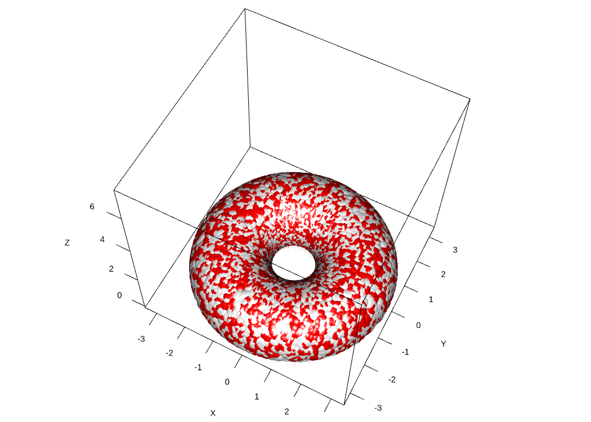

---
title: "muHVT: Collection of functions used for vector quantization and construction of hierarchical voronoi tessellations for data analysis"
author: "Zubin Dowlaty, Shubhra Prakash, Sangeet Moy Das, Praditi Shah, Shantanu Vaidya, Somya Shambhawi"
date: "`r Sys.Date()`"
fig.height: 4
fig.width: 15
output:
  minidown::mini_document:
    framework: spcss
    theme: default
    toc: true
    toc_float: true
    toc_highlight: true
    code_folding: "none"
    results_folding: "none"
    tabset: true
    code_download: true
    math: "katex_serverside"
vignette: >
  %\VignetteIndexEntry{Collection of functions used for vector quantization and construction of hierarchical voronoi tessellations for data analysis"}
  %\VignetteEngine{knitr::rmarkdown}
  %\VignetteEncoding{UTF-8}
params:
  eval_render: true
---


```{r setup, warning = FALSE, include = FALSE}
knitr::opts_chunk$set(
  collapse = TRUE,
  comment = "#>",
  out.width = "672px",
  out.height = "480px",
  fig.width = 7,
  fig.height = 5,
  fig.align = "center",
  fig.retina = 1,
  dpi = 150
)

# installing all required packages
list.of.packages <- c("dplyr", "kableExtra", "geozoo", "plotly", "purrr", "sp", "muHVT", "data.table", "gridExtra","plyr")

new.packages <-
  list.of.packages[!(list.of.packages %in% installed.packages()[, "Package"])]
if (length(new.packages))
  install.packages(new.packages, dependencies = TRUE)

# Loading the required libraries
lapply(list.of.packages, library, character.only = T)

# Sourcing the modified files for muHVT
## Do this if muHVT is unavailable on CRAN

source("../R/Add_boundary_points.R")
source("../R/Corrected_Tessellations.R")
source("../R/DelaunayInfo.R")
source("../R/Delete_Outpoints.R")
source("../R/getCentroids.R")
source("../R/getOptimalCentroids.R")
source("../R/hvq.R")
source("../R/HVT.R")
source("../R/hvtHmap.R")
source("../R/plotCells.R")
source("../R/plotHVT.R")
source("../R/predictHVT.R")
source("../R/ScaleMat.R")
source("../R/Transform_Coordinates.R")
source("../R/madPlot.R")
source("../R/diagPlot.R")
source("../R/get_cell_id.R")
source("../R/getCentroids_for_opti.R")
source("../R/multiNormalDist.R")
source("../R/plotDiag.R")
source("../R/qeHistPlot.R")
source("../R/diagSuggestion.R")
source("../R/exploded_hmap.R")
source("../R/predictLayerHVT.R")
source("../R/removeNovelty.R")


options(expressions = 10000)

global_var <- nzchar(Sys.getenv("RUN_VIGNETTE"))
global_var <- TRUE
scrolLimit <- function(noOfRows){
  if(noOfRows<10){
    
    swe = paste(as.character(noOfRows*50),"px")
  }
  else{
    swe = "400px"
  }
  return(swe)
}

Table <- function(data,scroll = F, limit = NULL){
  
  if(!is.null(limit)){
    data <- head(data,limit)
  }
  
  kable_table <- data %>% kable(escape = F,align = "c") %>% kable_styling(bootstrap_options = c("striped", "hover", "responsive"))
  
  scroll <- scroll
  
  if(scroll == T){
  kable_table <- kable_table %>% scroll_box(width = "100%", height = scrolLimit(nrow(data)))
  }
  
 return(kable_table)
  
}

summaryTable <- function(data,scroll = T,columnName='Quant.Error',value=0.2,limit=NULL){
  
  scroll <- scroll
  summaryTable <- data %>%  dplyr::mutate_if(is.numeric, funs(round(.,2))) %>% dplyr::mutate(!!columnName:=  cell_spec(eval(parse(text = columnName)),color = ifelse(is.na(eval(parse(text = columnName))),"#333",ifelse(eval(parse(text = columnName)) < value,"red","#333"))))  
  
  return(Table(summaryTable,scroll = scroll,limit = limit))
  
}

compressionSummaryTable <- function(data,scroll = T,columnName='percentOfCellsBelowQuantizationErrorThreshold',value=0.8){
  
  
summaryTable <- data %>%  dplyr::mutate_if(is.numeric, funs(round(.,2))) %>% dplyr::mutate(!!columnName:=  cell_spec(eval(parse(text = columnName)),color = ifelse(is.na(eval(parse(text = columnName))),"#00bb27",ifelse(eval(parse(text = columnName)) > value,"#00bb27","#333")))) 
  
return(Table(summaryTable,scroll = scroll))
  
}
set.seed(240)
```

## 1 Abstract

The muHVT package is a collection of R functions to facilitate building [topology preserving maps](https://link.springer.com/chapter/10.1007/1-84628-118-0_7) for rich multivariate data. Tending towards a big data preponderance, a large number of rows. A collection of R functions for this typical workflow is organized below :

1.  **Data Compression**: Vector quantization (VQ), HVQ (hierarchical vector quantization) using means or medians. This step compresses the rows (long data frame) using a compression objective

2.  **Data Projection**: Dimension projection of the compressed cells to 1D,2D and 3D with the Sammons Non-linear Algorithm. This step creates topology preserving map (also called as [embedding](https://en.wikipedia.org/wiki/Embedding)) coordinates into the desired output dimension . 

3.  **Tessellation**: Create cells required for object visualization using the Voronoi Tessellation method, package includes heatmap plots for hierarchical Voronoi tessellations (HVT). This step enables data insights, visualization, and interaction with the topology preserving map. Useful for semi-supervised tasks

4.  **Prediction**: Scoring new data sets and recording their assignment using the map objects from the above steps, in a sequence of maps if required


## 2 Compress: Vector Quantization


This package can perform vector quantization using the following algorithms - 

*  Hierarchical Vector Quantization using $k-means$ 
*  Hierarchical Vector Quantization using $k-medoids$


### 2.1 Hierarchical Vector Quantization

### 2.1.1 Using k-means

1. The k-means algorithm randomly selects *k* data points as initial means
1. *k* clusters are formed by assigning each data point to its closest cluster mean using the Euclidean distance
1. Virtual means for each cluster are calculated by using all datapoints contained in a cluster

The second and third steps are iterated until a predefined number of iterations is reached or the clusters converge. The runtime for the algorithm is O(n).

### 2.1.2 Using k-medoids

1.  The k-medoids algorithm randomly selects *k* data points as initial
    means out of the n data points as the medoids.
2.  *k* clusters are formed by assigning each data point to its closest
    medoid by using any common distance metric methods.
3.  Virtual means for each cluster are calculated by using all
    datapoints contained in a cluster

The second and third steps are iterated until a predefined number of
iterations is reached or the clusters converge. The runtime for the
algorithm is O(k \* (n-k)\^2) .


These algorithm divides the dataset recursively into cells using $k-means$
or $k-medoids$ algorithm. The maximum number of subsets are decided by
setting $n_cells$ to, say five, in order to divide the dataset into
maximum of five subsets. These five subsets are further divided into
five subsets(or less), resulting in a total of twenty five (5\*5)
subsets. The recursion terminates when the cells either contain less
than three data point or a stop criterion is reached. In this case, the
stop criterion is set to when the cell error exceeds the quantization
threshold.

The steps for this method are as follows :

1. Select k(number of cells), depth and quantization error threshold
1. Perform quantization (using $k-means$ or $k-medoids$) on the input dataset
1. Calculate quantization error for each of the k cells
1. Compare the quantization error for each cell to quantization error threshold
1. Repeat steps 2 to 4 for each of the k cells whose quantization error is above threshold until stop criterion is reached.

The stop criterion is when the quantization error of a cell  satisfies one of the below conditions 

* reaches below quantization error threshold
* there are less than three data points in the cell
* the user specified depth has been attained

The quantization error for a cell is defined as follows :

$$QE  = \max_i(||A-F_i||_{p})$$ 


where 

*  $A$ is the centroid of the cell
*  $F_i$ represents a data point in the cell 
*  $m$ is the number of points in the cell
*  $p$ is the $p$-norm metric. Here $p$ = 1 represents L1 Norm and $p$ = 2 represents L2 Norm.

### 2.1.3 Quantization Error

Let us try to understand quantization error with an example.

```{r Quantization Error,echo=FALSE,warning=FALSE,fig.show='hold',message=FALSE,out.width='90%',fig.height=8,fig.cap='Figure 1: The Voronoi tessellation for level 1 shown for the 5 cells with the points overlayed'}
knitr::include_graphics('quant_explainer.png')
```

An example of a 2 dimensional VQ is shown above.

In the above image, we can see 5 cells with each cell containing a certain number of points. The centroid for each cell is shown in blue. These centroids are also known as codewords since they represent all the points in that cell. The set of all codewords is called a codebook.

Now we want to calculate quantization error for each cell. For the sake of simplicity, let's consider only one cell having centroid `A` and `m` data points $F_i$ for calculating quantization error.

For each point, we calculate the distance between the point and the centroid.

$$ d = ||A - F_i||_{p} $$

In the above equation, p = 1 means `L1_Norm` distance whereas p = 2 means `L2_Norm` distance. In the package, the `L1_Norm` distance is chosen by default. The user can pass either `L1_Norm`, `L2_Norm` or a custom function to calculate the distance between two points in n dimensions.

$$QE  = \max_i(||A-F_i||_{p})$$ 


Now, we take the maximum calculated distance of all m points. This gives us the furthest distance of a point in the cell from the centroid, which we refer to as `Quantization Error`. If the Quantization Error is higher than the given threshold, the centroid/ codevector is not a good representation for the points in the cell. Now we can perform further Vector Quantization on these points and repeat the above steps.

Please note that the user can select mean, max or any custom function to calculate the Quantization Error. The custom function takes a vector of m value (where each value is a distance between point in `n` dimensions and centroids) and returns a single value which is the Quantization Error for the cell.

If we select `mean` as the error metric, the above Quantization Error equation will look like this :  

$$QE  = \frac{1}{m}\sum_{i=1}^m||A-F_i||_{p}$$ 

## 3 Projection

Sammon's projection is an algorithm that maps a high-dimensional space to a space of lower dimensionality while attempting to preserve the structure of inter-point distances in the projection. It is particularly suited for use in exploratory data analysis and is usually considered a non-linear approach since the mapping cannot be represented as a linear combination of the original variables. The centroids are plotted in 2D after performing Sammon’s projection at every level of the tessellation.


Denoting the distance between $i^{th}$ and $j^{th}$ objects in the original space by $d_{ij}^*$, and the distance between their projections by $d_{ij}$. Sammon’s mapping aims to minimize the below error function, which is often referred to as Sammon’s stress or Sammon’s error

$$E=\frac{1}{\sum_{i<j} d_{ij}^*}\sum_{i<j}\frac{(d_{ij}^*-d_{ij})^2}{d_{ij}^*}$$

The minimization  of this can be performed either by gradient descent, as proposed initially, or by other means, usually involving iterative methods. The number of iterations need to be experimentally determined and convergent solutions are not always guaranteed. Many implementations prefer to use the first Principal Components as a starting configuration.

## 4 Voronoi Tessellations

A Voronoi diagram is a way of dividing space into a number of regions. A set of points (called seeds, sites, or generators) is specified beforehand and for each seed, there will be a corresponding region consisting of all points within proximity of that seed. These regions are called Voronoi cells. It is complementary to Delaunay triangulation.

**Tessellate: Constructing Voronoi Tesselations**

In this package, we use `sammons` from the package `MASS` to project higher dimensional data to a 2D space. The function `hvq` called from the `HVT` function returns hierarchical quantized data which will be the input for construction of the tessellations. The data is then represented in 2D coordinates and the tessellations are plotted using these coordinates as centroids. We use the package `deldir` for this purpose. The `deldir` package computes the Delaunay triangulation (and hence the Dirichlet or Voronoi tessellation) of a planar point set according to the second (iterative) algorithm of Lee and Schacter. For subsequent levels, transformation is performed on the 2D coordinates to get all the points within its parent tile. Tessellations are plotted using these transformed points as centroids. The lines in the tessellations are chopped in places so that they do not protrude outside the parent polygon. This is done for all the subsequent levels.

## 5 Prediction

In this package, we use `predictLayerHVT` function to predict based on the the sets of maps ( map A, map B, map C) constructed using HVT function. For each test records, the function will assign that record to either of Layer1 or Layer2. 

**Prediction Algorithm**

The prediction algorithm recursively calculates the distance between each point in the test dataset and the cell centroids for each level. The following steps explain the prediction method for a single point in the test dataset :

1. Calculate the distance between the point and the centroid of all the cells in the first level
2. Find the cell whose centroid has minimum distance to the point
3. Check if the cell drills down further to form more cells
4. If it doesn’t, return the path. Or else repeat steps 1 to 4 till we reach a level at which the cell doesn’t drill down        further


## 6 Example Usage : Visualizing Multidimensional Data with Sammon's Projection using Torus (Donut)

**In this section, we will see how we can use the package to visualize multidimensional data by projecting them to two dimensions using Sammon's projection**

**Data Understanding**

First of all, let us see how to generate data for torus. We are using a library `geozoo` for this purpose. Geo Zoo (stands for Geometric Zoo) is a compilation of geometric objects ranging from three to 10 dimensions. Geo Zoo contains regular or well-known objects, eg cube and sphere, and some abstract objects, e.g. Boy's surface, Torus and Hyper-Torus. 

Here, we will generate a 3D torus (a torus is a surface of revolution generated by revolving a circle in three-dimensional space one full revolution about an axis that is coplanar with the circle) with 9000 points.

```{r torus generate,warning=FALSE,message=FALSE,results="hide",eval = global_var}
set.seed(240)
# Here p represents dimension of object
# n represents number of points
torus <- geozoo::torus(p = 3,n = 9000)
torus_df <- data.frame(torus$points)
torus_df1 <- torus_df %>% round(4)
colnames(torus_df) <- c("x","y","z")
```

Now let's do some EDA on the data. First of all, we will see how the data looks like

```{r torus head, warning=FALSE, eval = global_var}
# DT::datatable(head(torus_df1), rownames = FALSE,
#               class = 'cell-border stripe',
#               options = list(scrollX = TRUE))
Table(head(torus_df))

```

Now let's have a look at structure and summary of the data.

```{r torus structure, warning=FALSE, eval = global_var}
str(torus_df)
```

```{r torus summary, warning=FALSE,eval = global_var}
summary(torus_df)
```

Now let's try to visualize the torus (donut) in  3D Space.

```{r torus plot,warning=FALSE,message=FALSE,fig.show="hold",fig.cap='Figure 2: 3D Torus',eval =FALSE,echo=TRUE}
#
scaling_factor <- 15
library(rgl)

plotids <- plot3d(torus_df$x, torus_df$y, torus_df$z,
                  type = "s", col = c("white", "red"),
                  xlab = "X", ylab = "Y", zlab = "Z",
                  xlim = c(-5, 5), ylim = c(-5, 5), zlim = c(-5, 5))

rglwidget(elementId = "plot3drgl")

```

```{r, echo=FALSE}
knitr::include_graphics('torus_donut.png')
```


In order to project a 3D object onto a 2D space using the workflow described in the abstract section of this vignette, we can follow these steps:

### 6.1 SECTION-A

In this section all the workflow steps (Compression, Projection and Tessellation) are performed at level 1.

**Step 1: Data Compression**

`HVQ` is the main function for performing compression which is called within `HVT function`. we have a parameter called quantization error. This parameter acts as a threshold and determines the number of levels in the hierarchy. It means that, if there are 'n' number of levels in the hierarchy, then all the clusters formed till this level will have quantization error equal or greater than the threshold quantization error. The user can define the number of clusters in the first level of hierarchy and then each cluster in first level is sub-divided into the same number of clusters as there are in the first level. This process continues and each group is divided into smaller clusters as long as thethreshold quantization error is met. The output of this technique will be hierarchically arranged vector quantized data.

However, let's try to comprehend the **HVT function** first before moving on. 

 
```{r HVT function, echo = TRUE, eval= FALSE}
HVT(
  dataset,
  min_compression_perc,
  n_cells,
  depth,
  quant.err,
  projection.scale,
  normalize = T,
  distance_metric = c("L1_Norm", "L2_Norm"),
  error_metric = c("mean", "max"),
  quant_method = c("kmeans", "kmedoids"),
  diagnose = TRUE,
  hvt_validation = FALSE,
  train_validation_split_ratio = 0.8
)
```

Each of the parameters of HVT function have been explained below :

* __`dataset`__ - A dataframe with numeric columns 

* __`min_compression_perc`__ - An integer indicating the minimum percent compression rate to be achieved for the dataset

* __`n_cells`__  - An integer indicating the number of cells per hierarchy (layers)

* __`depth`__   - An integer indicating the number of layers. (1 = No hierarchy, 2 = 2 layers, etc ...)

* __`quant.error`__ - A number indicating the quantization error threshold. A cell will only breakdown
into further cells if the quantization error of the cell is above the defined quantization error threshold

* __`distance_metric`__	- The distance metric can be `L1_Norm` or `L2_Norm`. `L1_Norm` is selected by default. The distance metric is used to calculate the distance between an `n` dimensional point and centroid. The user can also pass a custom function to calculate this distance

* __`error_metric`__ - The error metric can be `mean` or `max`. `max` is selected by default. `max` will return the max of `m` values and `mean` will take mean of `m` values where each value is a distance between a point and centroid of the cell. Moreover, the user can also pass a custom function to calculate the error metric

* __`quant_method`__ - The quantization method can be `kmeans` or `kmedoids`. `kmeans` is selected by default
    
* __`normalize`__	- A logical value indicating whether the columns in your dataset need to be normalized. Default value is TRUE. The algorithm supports Z-score normalization

* __`diagnose`__ - A logical value indicating whether user wants to perform diagnostics on the model. Default value is TRUE.

* __`hvt_validation`__ - A logical value indicating whether user wants to holdout a validation set and find mean absolute deviation of the validation points from the centroid. Default value is FALSE.

* __`train_validation_split_ratio`__ - A numeric value indicating train validation split ratio. This argument is only used when hvt_validation has been set to TRUE. Default value for the argument is 0.8


First we will perform Hierarchical Vector Quantization using the below mentioned model parameters to achieve a compression of atleast 80%.

**Model Parameters**

* Number of Cells at each Level = 100
* Maximum Depth = 1
* Quantization Error Threshold = 0.1
* Error Metric = Max
* Distance Metric = Manhattan

```{r torus hvt first,warning=FALSE,fig.show='hold',results='hide',message=FALSE,fig.cap='Figure 6: The Voronoi tessellation for layer 1 shown for the 100 cells in the dataset ’torus’',eval = global_var}
set.seed(240)
hvt.torus <- muHVT::HVT(
  torus_df,
  n_cells = 100,
  depth = 1,
  quant.err = 0.1,
  projection.scale = 10,
  normalize = T,
  distance_metric = "L1_Norm",
  error_metric = "max",
  quant_method = "kmeans"
)

```

Let's checkout the compression summary . 

```{r compression summary torus first,warning=FALSE,eval = global_var}
compressionSummaryTable(hvt.torus[[3]]$compression_summary)
```

**As it can be seen from the table above, none of the 100 cells have hit the quantization threshold error. Therefore we can further subdivide the cells by increasing the n_cells parameters and then see if 80% compression is reached**


Since, we are yet to achive atleast 80% compression. Let's try to compress again using the below mentioned set of model parameters.

**Model Parameters**

* Number of Cells at each Level = 300
* Maximum Depth = 1
* Quantization Error Threshold = 0.1
* Error Metric = Max
* Distance Metric = Manhattan


```{r torus hvt second,warning=FALSE,fig.show='hold',results='hide',message=FALSE,fig.cap='Figure 8: The Voronoi tessellation for layer 1 shown for the 300 cells in the dataset ’torus’',eval = global_var}
set.seed(240)
hvt.torus2 <- muHVT::HVT(
  torus_df,
  n_cells = 300,
  depth = 1,
  quant.err = 0.1,
  projection.scale = 10,
  normalize = T,
  distance_metric = "L1_Norm",
  error_metric = "max",
  quant_method = "kmeans"
)

```


Let's checkout the compression summary for torus.

```{r compression summary torus second,warning=FALSE,eval = global_var}
compressionSummaryTable(hvt.torus2[[3]]$compression_summary)
```

**It can be observed from the table above that only 43 cells out of 300 i.e. `14%` of the cells hit the Quantization Error threshold. Therefore we can further subdivide the cells by increasing the n_cells parameters and then see if 80% compression is reached **


```{r echo=FALSE}
rm(hvt.torus2)
```

Now let's try again with the below mentioned set of model parameters.

**Model Parameters**

* Number of Cells at each Level = 900
* Maximum Depth = 1
* Quantization Error Threshold = 0.1
* Error Metric = Max
* Distance Metric = Manhattan

```{r torus hvt third ,warning=FALSE,fig.show='hold',results='hide',message=FALSE,fig.cap='Figure 10: The Voronoi tessellation for layer 1 shown for the 900 cells in the dataset ’torus’',eval = global_var}
set.seed(240)
hvt.torus3 <- muHVT::HVT(
  torus_df,
  n_cells = 900,
  depth = 1,
  quant.err = 0.1,
  projection.scale = 10,
  normalize = T,
  distance_metric = "L1_Norm",
  error_metric = "max",
  quant_method = "kmeans"
)

```


Let's check the compression summary for torus.

```{r compression summary torus third,warning=FALSE,eval = global_var}
compressionSummaryTable(hvt.torus3[[3]]$compression_summary)
```

**By increasing the number of cells to 900, we were successfully able to compress `93%` of the data, so we will not further subdivide the cells**

**Step 2: Data Projection**

`sammonsProjection()` calls `sammons` function from the MASS package. Sammon's projection is an algorithm that maps a high-dimensional space to a space of lower dimensionality while attempting to preserve the structure of inter-point distances in the projection.The centroids are plotted in 2D after performing Sammon’s projection at every level of the tessellation.

lets view the projected 2D centroids after performing sammon's projection

```{r, warning=FALSE,message=FALSE}

hvt_torus_coordinates <-hvt.torus3[[2]][[1]][["1"]]
centroids <<- list()
  coordinates_value <- lapply(1:length(hvt_torus_coordinates), function(x){
    centroids <-hvt_torus_coordinates[[x]]
    coordinates <- centroids$pt
  })
centroid_coordinates<<- do.call(rbind.data.frame, coordinates_value)  
colnames(centroid_coordinates) <- c("x","y")
centroid_coordinates <- centroid_coordinates %>% data.frame() %>% round(4)
Table(head(centroid_coordinates), scroll = T, limit = 20)

```

**Step 3: Tessellation**

The `deldir` package computes the Delaunay triangulation (and hence the Dirichlet or Voronoi tessellation) of a planar point set according to the second (iterative) algorithm of Lee and Schacter. For subsequent levels, transformation is performed on the 2D coordinates to get all the points within its parent tile. Tessellations are plotted using these transformed points as centroids.

`plotHVT` is the main function to construct hierarchical voronoi tessellations.


Now let's try to understand **plotHVT** function. The parameters have been explained in detail below

```{r plotHVT function,echo = TRUE, eval= FALSE}
plotHVT(hvt.results, line.width, color.vec, pch1 = 21, centroid.size = 3, title = NULL, maxDepth = 1)
```

* __`hvt.results`__ -  A list containing the output of the HVT function which has the details of the tessellations to be plotted

* __`line.width`__	- A vector indicating the line widths of the tessellation boundaries for each layer

* __`color.vec`__	- A vector indicating the colors of the tessellations boundaries at each layer

* __`pch1`__	- Symbol type of the centroids of the tessellations (parent levels). Refer points (default = 21)

* __`centroid.size`__	- Size of centroids of first level tessellations (default = 3)

* __`title`__	- Set a title for the plot (default = NULL)

For better visualisation, let's plot the Voronoi tessellation.

```{r, warning=FALSE,message=FALSE}
muHVT::plotHVT(
  hvt.torus3,
  line.width = c(0.4),
  color.vec = c("#141B41"),
  centroid.size = 0.6,
  maxDepth = 1
)
```

**From the presented plot, the inherent structure of the donut can be easily observed in the two-dimensional space**

We will now overlay all the features as heatmap over the Voronoi Tessellation plot for better visualization.

Let's have look at the function `hvtHmap` function which we will use to overlay a variable as heatmap.

```{r hvtHmap function demo,echo = TRUE, eval= FALSE}
hvtHmap(hvt.results, dataset, child.level, hmap.cols, color.vec ,line.width, palette.color = 6)
```

* __`hvt.results`__ - A list of results obtained from the HVT function

* __`dataset`__	- A dataframe containing the variables to overlay as a heatmap. The user can pass an external dataset or the dataset that was used to perform hierarchical vector quantization. The dataset should have the same number of points as the dataset used to perform hierarchical Vector Quantization in the HVT function

* __`child.level`__	- A number indicating the level for which the heat map is to be plotted

* __`hmap.cols`__	- The column number of column name from the dataset indicating the variables for which the heat map is to be plotted. To plot the quantization error as heatmap, pass `'quant_error'`. Similarly to plot the no of points in each cell as heatmap, pass `'no_of_points'` as a parameter

* __`color.vec`__	- A color vector such that length(color.vec) = child.level (default = NULL)

* __`line.width`__ - A line width vector such that length(line.width) = child.level (default = NULL)

* __`palette.color`__ - A number indicating the heat map color palette. 1 - rainbow, 2 - heat.colors, 3 - terrain.colors, 4 - topo.colors, 5 - cm.colors, 6 - BlCyGrYlRd (Blue,Cyan,Green,Yellow,Red) color (default = 6)

* __`show.points`__ - A boolean indicating whether the centroids should be plotted on the tessellations (default = FALSE)


Now let’s plot the Voronoi Tessellation with the heatmap overlaid for all the features in the torus data for better visualization.

```{r hmp level two quantization torus3 demo,warning=FALSE,fig.show='hold',results='hide',message=FALSE,fig.cap='Figure 11: The Voronoi tessellation for layer 1 and number of cells 900 with the heat map overlaid for all the variable in the ’torus’ dataset',eval = global_var}
metric_list <- colnames(hvt.torus3[[3]]$summary)
metric_list <- metric_list[7:9]
hmap <- list()
hmap <- lapply(1:length(metric_list), function(x){
muHVT::hvtHmap(
  hvt.torus3,
  torus_df,
  child.level = 1,
  hmap.cols = metric_list[[x]],
  line.width = c(0.4),
  color.vec = c("#141B41"),
  palette.color = 6,
  centroid.size = 1,
  show.points = T,
  quant.error.hmap = 0.1,
  n_cells.hmap = 900
)
})
```

```{r, warning=FALSE, message=FALSE,eval=TRUE,fig.height=4,fig.width=8}
grid.arrange(hmap[[1]], nrow = 1, ncol=1)
grid.arrange(hmap[[2]] ,nrow = 1, ncol=1)
grid.arrange(hmap[[3]], nrow = 1, ncol=1)
```

### 6.2 SECTION-B

In this section we will explore a little more and try to project the torus(3D) object to 2D Space with different set of model parameters at level 2

**Step 1: Data Compression**

First we will perform Hierarchical Vector Quantization using the torus data along with below mentioned model parameters to achieve a compression summary of atleast 80%. 

**Model Parameters**

* Number of Cells at each Level = 20
* Maximum Depth = 2
* Quantization Error Threshold = 0.1
* Error Metric = Max
* Distance Metric = Manhattan

```{r torus hvt fourth,warning=FALSE,fig.show='hold',results='hide',message=FALSE,fig.cap='Figure 8: The Voronoi tessellation for layer 1 shown for the 300 cells in the dataset ’torus’',eval = global_var}
set.seed(240)
hvt.torus4 <- muHVT::HVT(
  torus_df,
  n_cells = 20,
  depth = 1,
  quant.err = 0.1,
  projection.scale = 10,
  normalize = T,
  distance_metric = "L1_Norm",
  error_metric = "max",
  quant_method = "kmeans"
)

```

Let's checkout the compression summary for torus and see whether the model has achieved 80% compression or not.

```{r compression summary torus fourth,warning=FALSE,eval = global_var}
compressionSummaryTable(hvt.torus4[[3]]$compression_summary)
```

**It can be observed from the table above that none of the cells has  hit the Quantization Error threshold. Therefore we can further subdivide the cells by increasing the n_cells inorder to achieve a compression of 80%**

Now let's try again with the below mentioned set of model parameters.

**Model Parameters**

* Number of Cells at each Level = 26
* Maximum Depth = 2
* Quantization Error Threshold = 0.1
* Error Metric = Max
* Distance Metric = Manhattan


```{r torus hvt fifth,warning=FALSE,fig.show='hold',results='hide',message=FALSE,fig.cap='Figure 8: The Voronoi tessellation for layer 1 shown for the 300 cells in the dataset ’torus’',eval = global_var}
set.seed(240)
hvt.torus5 <- muHVT::HVT(
  torus_df,
  n_cells = 26,
  depth = 2,
  quant.err = 0.1,
  projection.scale = 10,
  normalize = T,
  distance_metric = "L1_Norm",
  error_metric = "max",
  quant_method = "kmeans"
)

```

Now,let's checkout the compression summary for torus by.

```{r compression summary torus fifth,warning=FALSE,eval = global_var}
compressionSummaryTable(hvt.torus5[[3]]$compression_summary)
```

**It can be observed from the table above that only 535 cells out of 666 i.e. `80%` of the cells hit the Quantization Error threshold. Since we have attained 80% compression we will not further subdivide the cells**

**Step 2: Data Projection**

lets view the projected 2D centroids after performing sammon's projection on the compressed data recieved after performing vector quantization.

```{r, warning=FALSE,message=FALSE}

hvt_torus_coordinates <-hvt.torus5[[2]][[1]][["1"]]
centroids <<- list()
  coordinates_value <- lapply(1:length(hvt_torus_coordinates), function(x){
    centroids <-hvt_torus_coordinates[[x]]
    coordinates <- centroids$pt
  })
centroid_coordinates<<- do.call(rbind.data.frame, coordinates_value)  
colnames(centroid_coordinates) <- c("x","y")
centroid_coordinates <- centroid_coordinates %>% data.frame() %>% round(4)
Table(head(centroid_coordinates), scroll = T, limit = 20
             )

```

**Step 3: Tessellation**

Now, we have obtained the centroid coordinates resulting from the application of Sammon's projection. 

For better visualisation, let's plot the Voronoi tessellation using the `plotHVT` function.

```{r, message=FALSE,warning=FALSE}
muHVT::plotHVT(
  hvt.torus5,
  line.width = c(0.6,0.4),
  color.vec = c("#141B41","#0582CA"),
  centroid.size = 0.8,
  maxDepth = 2
)
```

**From the presented plot, the inherent structure of the donut can no longer be observed in the two-dimensional space**

Now let’s plot the Voronoi Tessellation with the heatmap overlaid for all the features in the torus data at level 2 for better visualization.

```{r hmp level two quantization torus3,warning=FALSE,fig.show='hold',results='hide',message=FALSE,fig.cap='Figure 11: The Voronoi tessellation for layer 1 and number of cells 900 with the heat map overlaid for all the variable in the ’torus’ dataset',eval = global_var}
metric_list <- colnames(hvt.torus3[[3]]$summary)
metric_list <- metric_list[7:9]
hmap <- list()
hmap <- lapply(1:length(metric_list), function(x){
muHVT::hvtHmap(
  hvt.torus5,
  torus_df,
  child.level = 2,
  hmap.cols = metric_list[[x]],
  line.width = c(0.6,0.4),
  color.vec = c("#141B41","#0582CA"),
  palette.color = 6,
  centroid.size = 1,
  show.points = T,
  quant.error.hmap = 0.1,
  n_cells.hmap = 26
)
})
```

```{r, warning=FALSE, message=FALSE,eval=TRUE,fig.height=4,fig.width=8}
grid.arrange(hmap[[1]], nrow = 1, ncol=1)
grid.arrange(hmap[[2]] ,nrow = 1, ncol=1)
grid.arrange(hmap[[3]], nrow = 1, ncol=1)

```


## 7 Example Usage of Predictions using the predictLayerHVT on Personal Computers Dataset.

**Data Understanding**

In this section, we will use the `Prices of Personal Computers` dataset. This dataset contains 6259 observations and 10 features. The dataset observes the price from 1993 to 1995 of 486 personal computers in the US. The variables are price, speed, ram, screen, cd, etc. The dataset can be downloaded from [here](https://github.com/SangeetM/dataset/blob/master/Computers.csv).

In this example, we will compress this dataset by using hierarchical VQ via k-means and visualize the Voronoi Tessellation plots using Sammons projection. Later on, we will overlay all the variables as a heatmap to generate further insights.

Here, we load the data and store into a variable `computers`.

```{r load data computer,warning=FALSE,message=FALSE,eval = T}
set.seed(240)
# Load data from csv files
computers <- read.csv("https://raw.githubusercontent.com/Mu-Sigma/muHVT/master/vignettes/sample_dataset/Computers.csv")
```

Let's explore the Personal Computers Dataset.

```{r sample data computer,warning=FALSE,message=FALSE,eval = T}
# Quick peek

Table(head(computers), scroll = T, limit = 20)
```

Now, let us check the structure of the data and analyse its summary.

```{r data structure computer,warning=FALSE,message=FALSE,eval = global_var}
str(computers)
```


```{r data summary computer,warning=FALSE,message=FALSE,eval = global_var}
summary(computers)
```

Let us first split the data into train and test. We will use 80% of the data as train and remaining as test.

```{r train-test computer,warning=FALSE,message=FALSE,eval = global_var}
noOfPoints <- dim(computers)[1]
trainLength <- as.integer(noOfPoints * 0.8)
trainComputers <- computers[1:trainLength,]
testComputers <- computers[(trainLength+1):noOfPoints,]
```

K-means is not suitable for factor variables as the sample space for factor variables is discrete. A Euclidean distance function on such a space isn't really meaningful. Hence, we will delete the factor variables(X, cd, multi, premium, trend) in our dataset. 

Here we keep the original `trainComputers` and `testComputers` as we will use the variables from this dataset to overlay as heatmap and generate some insights.

```{r pre-processing data computer,warning=FALSE,message=FALSE,eval = global_var}
trainComputers <-
  trainComputers %>% dplyr::select(-c(X, cd, multi, premium, trend))
testComputers <-
  testComputers %>% dplyr::select(-c(X, cd, multi, premium, trend))
```

Now, lets have a look at the scaled training dataset containing (5007 data points)


```{r}
trainComputers <- scale(trainComputers) 

metric_list <- colnames(trainComputers)
scale_attr <- attributes(trainComputers)

trainComputers1 <- trainComputers %>% as.data.frame() %>% round(4)
Table(head(trainComputers1))
```

Now, lets have a look at the scaled testing dataset containing (1252 data points).

```{r}
testComputers <- scale(testComputers, center = scale_attr$`scaled:center`, scale = scale_attr$`scaled:scale`) 
testComputers1 <- testComputers %>% as.data.frame() %>% round(4)
Table(head(testComputers1))
```

### 7.1 Creating Map A

As we are familiar with the structure of the computers data, we will now follow the following steps to get the predictions using the Computers dataset.

**Step 1: Data Compression**

For more detailed information on Data Compression please refer to section 2 of this vignette.

Let us try to understand the HVT function first. 

```{r HVT function demo, echo = TRUE, eval= FALSE}
HVT(
  dataset,
  min_compression_perc,
  n_cells,
  depth,
  quant.err,
  projection.scale,
  normalize = T,
  distance_metric = c("L1_Norm", "L2_Norm"),
  error_metric = c("mean", "max"),
  quant_method = c("kmeans", "kmedoids"),
  diagnose = TRUE,
  hvt_validation = FALSE,
  train_validation_split_ratio = 0.8
)
```

Each of the parameters of HVT function have been explained below :

* __`dataset`__ - A dataframe with numeric columns 

* __`min_compression_perc`__ - An integer indicating the minimum percent compression rate to be achieved for the dataset

* __`n_cells`__  - An integer indicating the number of cells per hierarchy (layers)

* __`depth`__   - An integer indicating the number of layers. (1 = No hierarchy, 2 = 2 layers, etc ...)

* __`quant.error`__ - A number indicating the quantization error threshold. A cell will only breakdown
into further cells if the quantization error of the cell is above the defined quantization error threshold

* __`distance_metric`__	- The distance metric can be `L1_Norm` or `L2_Norm`. `L1_Norm` is selected by default. The distance metric is used to calculate the distance between an `n` dimensional point and centroid. The user can also pass a custom function to calculate this distance

* __`error_metric`__ - The error metric can be `mean` or `max`. `max` is selected by default. `max` will return the max of `m` values and `mean` will take mean of `m` values where each value is a distance between a point and centroid of the cell. Moreover, the user can also pass a custom function to calculate the error metric

* __`quant_method`__ - The quantization method can be `kmeans` or `kmedoids`. `kmeans` is selected by default
    
* __`normalize`__	- A logical value indicating whether the columns in your dataset need to be normalized. Default value is TRUE. The algorithm supports Z-score normalization

* __`diagnose`__ - A logical value indicating whether user wants to perform diagnostics on the model. Default value is TRUE.

* __`hvt_validation`__ - A logical value indicating whether user wants to holdout a validation set and find mean absolute deviation of the validation points from the centroid. Default value is FALSE.

* __`train_validation_split_ratio`__ - A numeric value indicating train validation split ratio. This argument is only used when hvt_validation has been set to TRUE. Default value for the argument is 0.8


First we will perform Hierarchical Vector Quantization using the computers dataset along with below mentioned model parameters to generate map A and try to achieve model compression of atleast 80%.

**Model Parameters**

* Number of Cells at each Level = 1001
* Maximum Depth = 1
* Quantization Error Threshold = 0.1
* Error Metric = Max
* Distance Metric = Manhattan


```{r level one computers,warning=FALSE,message=FALSE,results='asis',eval = global_var}
set.seed(240)
hvt.results <- list()
map_A <- muHVT::HVT(trainComputers,   
                          n_cells = 1001,
                          depth = 1,
                          quant.err = 0.1,
                          projection.scale = 10,
                          normalize = F,
                          distance_metric = "L1_Norm",
                          error_metric = "max",
                          quant_method = "kmeans",
                          diagnose = F)

```


Now let's check the compression summary. The table below shows no of cells, no of cells having quantization error below threshold and percentage of cells having quantization error below threshold for each level.

```{r compression summary level one computers,warning=FALSE,eval = global_var}
compressionSummaryTable(map_A[[3]]$compression_summary)
```

<!-- **As it can be seen from the table above, 83% of the cells have hit the quantization threshold error** -->

<!-- Now lets try again using the training computers data along with below mentioned model parameters and see if 80% compression is achieved. -->

<!-- **Model Parameters** -->

<!-- * Number of Cells at each Level = 15 -->
<!-- * Maximum Depth = 2 -->
<!-- * Quantization Error Threshold = 0.1 -->
<!-- * Error Metric = Max -->
<!-- * Distance Metric = Manhattan -->


<!-- ```{r level two computers,warning=FALSE,message=FALSE,results='asis',eval = global_var} -->
<!-- set.seed(240) -->
<!-- hvt.results <- list() -->
<!-- map_A <- muHVT::HVT(trainComputers,    -->
<!--                           n_cells = 15, -->
<!--                           depth = 2, -->
<!--                           quant.err = 0.1, -->
<!--                           projection.scale = 10, -->
<!--                           normalize = F, -->
<!--                           distance_metric = "L1_Norm", -->
<!--                           error_metric = "max", -->
<!--                           quant_method = "kmeans", -->
<!--                           diagnose = F) -->

<!-- ``` -->

<!-- Now let's check the compression summary. The table below shows no of cells, no of cells having quantization error below threshold and percentage of cells having quantization error below threshold for each level. -->

<!-- ```{r compression summary level two computers,warning=FALSE,eval = global_var} -->
<!-- compressionSummaryTable(map_A[[3]]$compression_summary) -->
<!-- ``` -->

<!-- **As it can be seen from the table above, __`11%`__ of the cells have hit the quantization threshold error, we will further try increasing n_cell value** -->

<!-- Now lets try again using the training computers data along with below mentioned model parameters. -->

<!-- **Model Parameters** -->

<!-- * Number of Cells at each Level = 32 -->
<!-- * Maximum Depth = 2 -->
<!-- * Quantization Error Threshold = 0.1 -->
<!-- * Error Metric = Max -->
<!-- * Distance Metric = Manhattan -->


<!-- ```{r level three computers,warning=FALSE,message=FALSE,results='asis',eval = global_var} -->
<!-- set.seed(240) -->
<!-- hvt.results <- list() -->
<!-- map_A <- muHVT::HVT(trainComputers,    -->
<!--                           n_cells = 32, -->
<!--                           depth = 2, -->
<!--                           quant.err = 0.1, -->
<!--                           projection.scale = 10, -->
<!--                           normalize = F, -->
<!--                           distance_metric = "L1_Norm", -->
<!--                           error_metric = "max", -->
<!--                           quant_method = "kmeans", -->
<!--                           diagnose = F) -->

<!-- ``` -->


<!-- Now let's check the compression summary. The table below shows no of cells, no of cells having quantization error below threshold and percentage of cells having quantization error below threshold for each level. -->

<!-- ```{r compression summary level three computers,warning=FALSE,eval = global_var} -->
<!-- compressionSummaryTable(map_A[[3]]$compression_summary) -->
<!-- ``` -->

**As it can be seen from the table above, __`83%`__ of the cells have hit the quantization threshold error. Since we are successfully able to compress `83%` of the data, so we will not further subdivide the cells **

__`map_A[[3]]`__ gives us detailed information about the hierarchical vector quantized data.

__`map_A[[3]][['summary']]`__ gives a nice tabular data containing no of points, Quantization Error and the codebook.

The datatable displayed below is the summary from map A


```{r summary level one computers,warning=FALSE,eval = global_var}
summaryTable(map_A[[3]]$summary)
```

Now let us understand what each column in the above summary table means:

* __`Segment.Level`__ - Layers of the cell. In this case, we have performed Vector Quantization for depth 1. Hence Segment Level is 1

* __`Segment.Parent`__ - Parent segment of the cell

* __`Segment.Child (Cell.Number)`__ - The children of a particular cell. In this case, it is the total number of cells at which we achieved the defined compression percentage

* __`n`__ - No of points in each cell

* __`Cell.ID`__ - Cell_ID’s are generated for the multivariate data using 1-D Sammon’s Projection algorithm

* __`Quant.Error`__ - Quantization Error for each cell

All the columns after this will contain centroids for each cell. They can also be called a codebook, which represents a collection of all centroids or codewords.

**Step 2: Data Projection**

lets view the projected 2D centroids after performing sammon's projection on the compressed data recieved after performing vector quantization.


```{r, warning=FALSE,message=FALSE}

hvt_torus_coordinates <-map_A[[2]][[1]][["1"]]
centroids <<- list()
  coordinates_value <- lapply(1:length(hvt_torus_coordinates), function(x){
    centroids <-hvt_torus_coordinates[[x]]
    coordinates <- centroids$pt
  })
centroid_coordinates<<- do.call(rbind.data.frame, coordinates_value)  
colnames(centroid_coordinates) <- c("x","y")
centroid_coordinates <- centroid_coordinates %>% data.frame() %>% round(4)
Table(head(centroid_coordinates))

```

**Step 3: Tessellation**

Now, we have obtained the centroid coordinates resulting from the application of Sammon's projection. 

For better visualisation, let's plot the Voronoi tessellation for Map A using the `plotHVT` function.

```{r plot level one computers,warning=FALSE,fig.show='hold',results='hide',message=FALSE,fig.cap='Figure 3: The Voronoi Tessellation for layer 1 (map A) shown for the 1001 cells in the dataset ’computers’',eval = global_var}
# Voronoi tessellation plot for level one

 muHVT::plotHVT(map_A,
        line.width = c(0.6), 
        color.vec = c("#141B41","#0582CA"),
        centroid.size = 0.01,  #1.5
        maxDepth = 1) 


```    


Now let's plot the Voronoi Tessellation with the heatmap overlaid for all the features in the computers dataset for better visualization.

```{r hmp level one quantization computers,warning=FALSE,fig.show='hold',results='hide',message=FALSE,fig.cap='Figure 3: The Voronoi Tessellation with the heat map overlaid for all the variables in the ’computers’ dataset',eval = global_var}
metric_list <- colnames(trainComputers)
hmap <- list()
hmap <- lapply(1:length(metric_list), function(x){
muHVT::hvtHmap(
  map_A,
  trainComputers,
  child.level = 1,
  hmap.cols = metric_list[[x]],
  line.width = c(0.2),
  color.vec = c("#141B41"),
  palette.color = 6,
  centroid.size = 0.01,
  show.points = T,
  quant.error.hmap = 0.1,
  n_cells.hmap = 1001
)
})
```

```{r, warning=FALSE, message=FALSE,eval=TRUE,fig.height=4,fig.width=8}
grid.arrange(hmap[[1]], nrow = 1, ncol=1)
grid.arrange(hmap[[2]], nrow = 1, ncol=1)
grid.arrange(hmap[[3]], nrow = 1, ncol=1)
grid.arrange(hmap[[4]], nrow = 1, ncol=1)
grid.arrange(hmap[[5]], nrow = 1, ncol=1)
grid.arrange(hmap[[6]], nrow = 1, ncol=1)
```


### 7.2 Creating Map B

In this section, we will manually figure out the novelty cells from the plotted map A and store it in **identified_Novelty_cells** variable.

The identified_Novelty_cells along with the map A is passed to **removeNovelty()** function.

The output of **removeNovelty()** function is a list of two items: a dataset with novelty records and the subset of the dataset without novelty records.


```{r, message=FALSE,warning=FALSE,results='hide'}
library(plyr)
identified_Novelty_cells <<- c(213,384)
output_list <- removeNovelty(identified_Novelty_cells, map_A)
dataset_with_novelty <- output_list[[1]]
dataset_without_novelty <- output_list[[2]]

```

The datatable displayed below are the data with novelties.

```{r,message=FALSE,warning=FALSE}
colnames(dataset_with_novelty) <- c("Cell.ID","Segment.Child","price","speed","hd","ram","screen","ads")
dataset_with_novelty%>% head(100) %>%   as.data.frame() %>%
Table(scroll = T, limit = 20)

```


The **plotCells** function is used to plot the Voronoi tessellation using the compressed HVT map (map A) and highlights the identified outlier cell(s) in red on the map.

Let's look at the Voronoi tessellation with the novelty cell(s) in the map highlighted in red.

```{r, message=FALSE,warning=FALSE,fig.cap='Figure 4: The Voronoi Tessellation with the novelty cells in the map highlighted in red'}
plotCells(identified_Novelty_cells, map_A)

```


We pass the dataframe with novelty records to HVT function along with below mentioned model parameters to generate **map B** (layer 2).

**Model Parameters**

* Number of Cells at each Level = 3
* Maximum Depth = 1
* Quantization Error Threshold = 0.1
* Error Metric = Max
* Distance Metric = Manhattan


```{r, message=FALSE,warning=FALSE}
dataset_with_novelty <- dataset_with_novelty[,-1:-2]
map_B <- list()
map_B <- muHVT::HVT(dataset_with_novelty,
                  n_cells = 3,
                  depth = 1,
                  quant.err = 0.1,
                  projection.scale = 10,
                  normalize = F,
                  distance_metric = "L1_Norm",
                  error_metric = "max",
                  quant_method = "kmeans",
                  diagnose = F)

```

The datatable displayed below is the summary from map B

```{r, message=FALSE,warning=FALSE}
summaryTable(map_B[[3]]$summary)
```

Now let's check the compression summary. The table below shows no of cells, no of cells having quantization error below threshold and percentage of cells having quantization error below threshold for each level.

```{r compression summary level two(A) computers,warning=FALSE,eval = global_var}
compressionSummaryTable(map_B[[3]]$compression_summary)
```

**It can be observed from the table above that  3 cells out of 3 i.e. __`100%`__ of the cells has hit the Quantization Error threshold**

### 7.3 Creating Map C

With the Novelties removed, we construct another hierarchical Voronoi tessellation  **map C** layer 2 on the dataset without Novelty and below mentioned model parameters.

**Model Parameters**

* Number of Cells at each Level = 1001
* Maximum Depth = 1
* Quantization Error Threshold = 0.1
* Error Metric = Max
* Distance Metric = Manhattan


```{r,warning=FALSE,message=FALSE}
map_C <- list()
map_C <- muHVT::HVT(dataset_without_novelty,
                  n_cells = 1001,
                  depth = 1,
                  quant.err = 0.1,
                  projection.scale = 10,
                  normalize = F,
                  distance_metric = "L1_Norm",
                  error_metric = "max",
                  quant_method = "kmeans",
                  diagnose = F)

```

The datatable displayed below is the summary from map C

```{r,message=FALSE,warning=FALSE}
summaryTable(map_C[[3]]$summary)
```

Now let's check the compression summary. The table below shows no of cells, no of cells having quantization error below threshold and percentage of cells having quantization error below threshold for each level.

```{r compression summary level two(B) computers,warning=FALSE,eval = global_var}
compressionSummaryTable(map_C[[3]]$compression_summary)
```

**It can be observed from the table above that 829 cells out of 1001 i.e. __`83%`__ of the cells has hit the Quantization Error threshold**


Now let's plot the Voronoi Tessellation with the heatmap overlaid for all the features in the computers dataset for better visualization.

```{r hmp level one(map C) quantization computers,warning=FALSE,fig.show='hold',results='hide',message=FALSE,fig.cap='Figure 3: The Voronoi Tessellation with the heat map overlaid for all the variables in the ’computers’ dataset',eval = global_var}
metric_list <- colnames(trainComputers)
hmap <- list()
hmap <- lapply(1:length(metric_list), function(x){
muHVT::hvtHmap(
  map_C,
  trainComputers,
  child.level = 1,
  hmap.cols = metric_list[[x]],
  line.width = c(0.2),
  color.vec = c("#141B41"),
  palette.color = 6,
  centroid.size = 0.01,
  show.points = T,
  quant.error.hmap = 0.1,
  n_cells.hmap = 1001
)
})
```

```{r, warning=FALSE, message=FALSE,eval=TRUE,fig.height=4,fig.width=8}
grid.arrange(hmap[[1]],  nrow = 1, ncol=1)
grid.arrange(hmap[[2]],  nrow = 1, ncol=1)
grid.arrange(hmap[[3]],  nrow = 1, ncol=1)
grid.arrange(hmap[[4]],  nrow = 1, ncol=1)
grid.arrange(hmap[[5]],  nrow = 1, ncol=1)
grid.arrange(hmap[[6]],  nrow = 1, ncol=1)
```

**We now have the set of maps (map A, map B & map C) which will be used to predict which map and cell each test record is assigned to, but before that lets view our test dataset**

Now, lets have a look at the scaled testing dataset containing (1252 data points).

```{r}
#testComputers <- scale(testComputers, center = scale_attr$`scaled:center`, scale = scale_attr$`scaled:scale`) 
testComputers1 <- testComputers %>% as.data.frame() %>% round(4)
Table(head(testComputers1))
```


**Predict**

Now once we have built the model, let us try to predict using our test dataset which cell and which layer each point belongs to.


```{r predictLayerHVT function,echo = TRUE, eval= FALSE}
predictLayerHVT(data,
                map_A,
                map_B,
                map_C,
                mad.threshold = 0.2,
                normalize = T,
                distance_metric="L1_Norm",
                error_metric="max",
                child.level = 1,
                line.width = c(0.6, 0.4, 0.2),
                color.vec = c("#141B41", "#6369D1", "#D8D2E1"),
                yVar= NULL,
                ...)
```

Each of the parameters of **predictLayerHVT** function has been explained below:

* __`data`__ - A dataframe containing the test dataset. The dataframe should have atleast one variable used for training. The variables from this dataset can also be used to overlay as heatmap

* __`map A`__ - A list of hvt.results.model obtained from HVT function while performing hierarchical vector quantization on train data


* __`map B`__ - A list of hvt.results.model obtained from HVT function while performing hierarchical vector quantization on train data with novelty

* __`map C`__ - A list of hvt.results.model obtained from HVT function while performing hierarchical vector quantization on train data without novelty

* __`child.level`__ - A number indicating the layer for which the heat map is to be plotted.(Only used if hmap.cols is not NULL)

* __`mad.threshold`__ - A numeric values indicating the permissible Mean Absolute Deviation

* __`normalize`__ -  A logical value indicating if the columns in your dataset should be normalized. Default value is TRUE.

* __`distance_metric`__ -  The distance metric can be 'Euclidean" or "Manhattan". Euclidean is selected by default.

* __`error_metric`__ -  The error metric can be "mean" or "max". mean is selected by default

* __`yVar`__ -  Name of the dependent variable(s)

* __`...`__ -  color.vec and line.width can be passed from here

 **Prediction Algorithm**

The prediction algorithm recursively calculates the distance between each point in the test dataset and the cell centroids for each level. The following steps explain the prediction method for a single point in the test dataset :

1. Calculate the distance between the point and the centroid of all the cells in the first level
2. Find the cell whose centroid has minimum distance to the point
3. Check if the cell drills down further to form more cells
4. If it doesn't, return the path. Or else repeat steps 1 to 4 till we reach a level at which the cell doesn't drill down further


Let’s see which cell and layer each point belongs to.

```{r, message=FALSE,warning=FALSE}
validation_data <- testComputers
new_predict <- predictLayerHVT(
    data=validation_data,
    map_A,
    map_B,
    map_C,
    normalize = F
  )
new_predict %>% head(100) %>% 
  as.data.frame() %>%
  Table(scroll = T, limit = 20)


```

 Now, lets understand the output of __`predictLayerHVT`__ function.
 
 * __`Layer1.Cell.ID`__ - Contains Cell.ids from map A depending on the number of cells provided as input
 
 * __`Layer2.Cell.ID`__ - Contains Cell.ids from map B (novelty) and map C.
 
 
## 8 Executive Summary

* **Example Usage1: Visualizing Multidimensional Data with Sammon's Projection using Torus (Donut)**

*  We have considered torus dataset for multidimensional data visualization using sammons projection.

* We constructed a compressed HVT map (hvt.torus) by applying the HVT() on the torus dataset. We set the parameters as          follows: `n_cells = 100`, `quant.error = 0.1`, and `depth = 1`. Upon analyzing the compression summary, we found that none    of the  100 cells exceeded the quantization threshold error.

* We created another compressed HVT map (hvt.torus2) using the HVT() algorithm on the torus dataset. This time, we adjusted     the parameters to `n_cells = 300`, `quant.error = 0.1`, and `depth = 1`. After examining the compression summary, we          discovered that 14% of the cells hit the quantization threshold error.

* Once again, we generated a compressed HVT map (hvt.torus3) using the HVT() algorithm on the torus dataset. The parameters     for this map were set to `n_cells = 900`, `quant.error = 0.1`, and `depth = 1`. Upon analyzing the compression summary, we    found that 93% of the 100 cells hit the quantization threshold error and we can clearly visualize the 3D torus(donut) in 2D   space.

* **Example Usage2: Hierarchical VQ with Sammons Projection and Tessellation on Personal Computers Dataset**

*  We have considered computers dataset for creating a predictive set of maps to monitor entities over time using                predictLayerHVT() in this  notebook

*  We construct a compressed HVT map (Map A) using the HVT() on the training dataset by setting __`n_cells`__ to 1001 and        __`quant.error`__ to 0.1

*  Based on the output of the above step, we manually identify the novelty cell(s) from the plotted map A. For this dataset,     we identify  the 213th and 384th cells as the novelty cell.

*  We pass the identified novelty cell(s) as a parameter to the removeNovelty() along with HVT map A. The function removes      that novelty  cell(s) from the dataset and stores them separately. It also returns the dataset without novelty(s).

*  The plotCells() constructs hierarchical voronoi tessellations and highlights the identified novelty cell(s) in red

*  The dataset with novelty is then passed to the HVT() to construct another HVT map (map B). But here, we set the parameters    __`n_cells`__ = 3, __`depth`__ = 1 etc. when constructing the map

*  The dataset without novelties is then passed to the HVT() to construct another HVT map (map C). But here, we set the          parameters __`n_cells`__ = 1001, __`depth`__ = 1 etc. when constructing the map.

*  Finally, the set of maps - map A, map B, and map C are passed to the predictLayerHVT() along with the test dataset to         predict which map    and what cell each test record is assigned to. 

*  The output of predictLayerHVT is a dataset with two columns Layer1.Cell.ID and Layer2.Cell.ID. Layer1.Cell.ID contains cell    ids from map A in the form A1,A2,A3.... and Layer2.Cell.ID contains cell ids from map B as B1,B2... depending on the          identified novelties and map C as C1,C2,C3.....

 
 
 
## 9 Applications 

1. Pricing Segmentation - The package can be used to discover groups of similar customers based on the customer spend pattern and understand price sensitivity of customers

2. Market Segmentation - The package can be helpful in market segmentation where we have to identify micro and macro segments. The method used in this package can do both kinds of segmentation in one go

3. Anomaly Detection - This method can help us categorize system behavior over time and help us find anomaly when there are changes in the system. For e.g. Finding fraudulent claims in healthcare insurance

4. The package can help us understand the underlying structure of the data. Suppose we want to analyze a curved surface such as sphere or vase, we can approximate it by a lot of small low-order polygons in the form of tessellations using this package

5. In biology, Voronoi diagrams are used to model a number of different biological structures, including cells and bone microarchitecture

6. Using the base idea of Systems Dynamics, these diagrams can also be used to depict customer state changes over a period of time


## 10 References

1. Topology Preserving Maps : https://link.springer.com/chapter/10.1007/1-84628-118-0_7

2. Vector Quantization : https://ocw.mit.edu/courses/electrical-engineering-and-computer-science/6-450-principles-of-digital-communications-i-fall-2006/lecture-notes/book_3.pdf

3. K-means : https://en.wikipedia.org/wiki/K-means_clustering

4. Sammon’s Projection : http://en.wikipedia.org/wiki/Sammon_mapping

5. Voronoi Tessellations : http://en.wikipedia.org/wiki/Centroidal_Voronoi_tessellation

6. Embedding : https://en.wikipedia.org/wiki/Embedding


